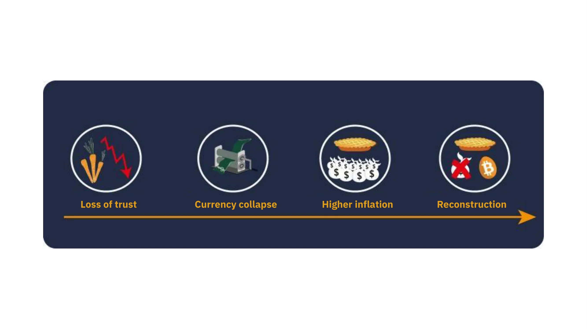

# การผจญภัย Bitcoin ครั้งแรกของคุณ

ในคอร์สนี้ เราจะอธิบายพื้นฐานของ Bitcoin ทั้งหมดใน 25 บท เพื่อให้คุณเข้าใจเทคโนโลยีนี้ได้อย่างเรียบง่ายและมีประสิทธิภาพ คอร์สนี้จะครอบคลุมพื้นฐานของอุตสาหกรรม Bitcoin โดยรวม รวมถึงหัวข้อต่างๆ เช่น การขุดเหรียญ, กระเป๋าสตางค์ดิจิทัล, แพลตฟอร์มการซื้อ/ขาย และอื่นๆ อีกมากมาย จะมีเนื้อหาเสริมให้คุณเรียนรู้เพิ่มเติมตลอดทาง และเราขอเชิญคุณไปดู “21 โปสเตอร์” ในส่วนทรัพยากรหลังจากเรียนจบคอร์สนี้

คุณไม่จำเป็นต้องมีความรู้เฉพาะทางใดๆ มาก่อน เนื้อหาต่อไปนี้เหมาะสำหรับผู้เรียนทุกระดับ และโดยประมาณจะใช้เวลาประมาณ 15 ชั่วโมงจึงจะเรียนจบทั้งหมด

+++

# บทนำ

<partId>3cd2ac82-026c-53e1-874a-baf5842adc6d</partId>

## ภาพรวมของคอร์ส

<chapterId>27e3fb60-4b50-556b-9e70-c4f5475c121d</chapterId>

ยินดีต้อนรับสู่คอร์ส BTC101!

Bitcoin คือการปฏิวัติทางเทคโนโลยีและการเงิน ที่ทำให้เราตั้งคำถามกับความสัมพันธ์ของเรากับเงินและสังคม จริงๆ แล้ว Bitcoin (หรือเรียกย่อว่า BTC) คือสกุลเงินที่เป็นกลางและกระจายศูนย์กลาง หมายความว่าไม่มีหน่วยงานใดหรือองค์กรใดควบคุมมันได้ มันเป็นนวัตกรรมที่ไปไกลกว่าสกุลเงินดิจิทัลทั่วไป: มันคือทั้งโปรโตคอลคอมพิวเตอร์ (Bitcoin) และหน่วยของสกุลเงิน (bitcoin)

โปรโตคอลของ Bitcoin ใช้เทคโนโลยีพื้นฐาน เช่น วิทยาการเข้ารหัส, การสื่อสารเครือข่าย และสิ่งที่เรียกว่า “บล็อกเชน” ในขณะที่หน่วย bitcoin เป็นสกุลเงินที่จำเป็นสำหรับการทำงานของระบบนี้ ในชีวิตประจำวัน ชาวเอลซัลวาดอร์และผู้ใช้ bitcoin ทั่วโลกใช้มันในการซื้อขายสินค้าและบริการ โดยอาศัยเทคโนโลยีนี้เพื่อปรับปรุงชีวิตของตน

**หลักสูตรที่ครอบคลุมแต่เข้าถึงง่าย:**

ในคอร์สนี้ เราจะพูดถึงด้านการเงินของ Bitcoin รวมถึงวิธีซื้อและขาย bitcoin, การเก็บรักษาอย่างปลอดภัยในกระเป๋าสตางค์ดิจิทัล และการใช้งานสำหรับการทำธุรกรรม เรายังจะพูดถึงบทบาทของนักขุดเหรียญ ซึ่งมีหน้าที่สำคัญในการสร้าง bitcoin ใหม่และรักษาความปลอดภัยของเครือข่าย Bitcoin สุดท้าย เราจะสำรวจอนาคตของ Bitcoin และดูว่าเทคโนโลยี Lightning Network สามารถพัฒนาการทำธุรกรรมให้ดียิ่งขึ้นได้อย่างไร

สิ่งสำคัญคือ ต้องเข้าใจว่า Bitcoin คือระบบการเงินแบบใหม่ที่เปลี่ยนแปลงความสัมพันธ์ของเรากับเงินอย่างสิ้นเชิง ดังนั้นการเรียนรู้วิธีใช้งานมันคือทักษะที่จำเป็นสำหรับผู้ที่ต้องการควบคุมทรัพย์สินของตัวเอง

**ภาคที่ 1 - บทนำ**  
- บทที่ 1 - ภาพรวมของคอร์ส  
- บทที่ 2 - ยุคก่อนประวัติศาสตร์ของ Bitcoin  

**ภาคที่ 2 - เงิน**  
- บทที่ 3 - ประวัติศาสตร์ของเงิน  
- บทที่ 4 - สกุลเงินแบบ Fiat  
- บทที่ 5 - ภาวะเงินเฟ้อรุนแรง  
- บทที่ 6 - Bitcoin 21 ล้านเหรียญ  

**ภาคที่ 3 - กระเป๋าเงิน Bitcoin**  
- บทที่ 7 - กระเป๋าเงิน Bitcoin คืออะไร?  
- บทที่ 8 - กระเป๋าเงิน Bitcoin และความปลอดภัย  
- บทที่ 9 - การติดตั้งกระเป๋าเงิน  
- บทที่ 10 - การทดสอบตามกาลเวลา  

**ภาคที่ 4 - ด้านเทคนิคของ Bitcoin**  
- บทที่ 11 - การเปิดตัวของ Bitcoin  
- บทที่ 12 - ธุรกรรมของ Bitcoin  
- บทที่ 13 - โหนดของ Bitcoin  
- บทที่ 14 - นักขุดเหรียญ  
- บทที่ 15 - Bitcoin และสิ่งแวดล้อม  

**ภาคที่ 5 - จะได้ Bitcoin มาอย่างไร?**  
- บทที่ 16 - Bitcoin ไม่มีวันหลับ!  
- บทที่ 17 - รับ Bitcoin จากการทำงาน  
- บทที่ 18 - ออมเงินด้วย Bitcoin  
- บทที่ 19 - การเข้าสู่ยุค Bitcoin อย่างเต็มรูปแบบ  

**ภาคที่ 6 - อนาคตของ Bitcoin: Lightning Network**  
- บทที่ 20 - บทนำสั้นๆ สู่ Lightning Network  
- บทที่ 21 - กรณีการใช้งาน Lightning Network  
- บทที่ 22 - จะเลือกยาแดงหรือยาน้ำเงิน?  

ก่อนที่เราจะเริ่มต้นนิยามของ "เงิน" และบทบาทของมันในสังคม (บทที่ 1) เราควรเริ่มจากจุดกำเนิดของ Bitcoin ก่อน Bitcoin เปิดตัวในปี 2009 ซึ่งเป็นเทคโนโลยีที่ใหม่และแตกต่างจากสิ่งอื่นใด มันจึงไม่แปลกที่คุณอาจไม่เข้าใจทุกอย่างในทันที เช่นเดียวกับการเรียนรู้การใช้อินเทอร์เน็ตหรือขับรถ คุณไม่จำเป็นต้องรู้รายละเอียดทางเทคนิคทั้งหมดในตอนแรก — คุณสามารถเริ่มจากการเรียนรู้วิธีรับเงิน, จ่ายเงิน, และรักษาเงินของคุณให้ปลอดภัย แล้วจึงค่อยๆ ศึกษาเชิงลึกต่อไป

ท้ายที่สุดแล้ว เรายังอยู่ในช่วงเริ่มต้นของการยอมรับ Bitcoin เพิ่งผ่านช่วง “ทะยานขึ้น” ไปไม่นาน — และคุณก็มาถึงทันเวลาที่จะเรียนรู้ทุกอย่างที่คุณต้องการเกี่ยวกับนวัตกรรมที่สำคัญนี้

สิ่งสำคัญคือการเข้าใจเทคโนโลยีใหม่นี้ในภาพรวม เราหวังว่าคุณจะสนุกกับคอร์สนี้และก้าวหน้าไปกับการเรียนรู้ในระบบการเงินโลกใหม่

พร้อมหรือยังที่จะดำดิ่งสู่โลกอันน่าหลงใหลของ Bitcoin และเข้าใจวิธีการทำงานของมันอย่างลึกซึ้ง? ไปกันเลย!

## ประวัติศาสตร์ก่อนการถือกำเนิดของ Bitcoin

<chapterId>9a94b627-5b69-5d81-9125-f1fa9b0aa6ad</chapterId>

ก่อนที่คำว่า "Bitcoin" จะกลายเป็นคำที่มีความหมายเกี่ยวกับสกุลเงินดิจิทัลและการเปลี่ยนแปลงทางการเงิน ได้มีการวางรากฐานที่จะป็นพื้นฐานที่สำหรับการสร้างตัวมันขึ้นมาไว้ก่อนหน้า วางไว้ด้วยด้วยแนวคิดต่างๆ นวัตกรรมต่างๆ และการเคลื่อนไหวทางสังคม  และการเคลื่อนไหวของกลุ่ม cypherpunk นั้น ถือเป็นสิ่งที่โดดเด่นเพราะถือเป็นกุญแจสำคัญในช่วงประวัติศาสตร์ก่อนการถือกำเนิดของ Bitcoin

### Cypherpunks: เหล่าผู้ที่มีวิศัยทัศน์แห่งโลกดิจิทัล

ณ ศูนย์กลางของการพัฒนาเทคโนโลยีในช่วงทศวรรษ 1980 และ 1990 กลุ่มคนหนึ่งเริ่มตั้งคำถามอย่างลึกซึ้งเกี่ยวกับบทบาทของความเป็นส่วนตัวและเสรีภาพในยุคดิจิทัล บุคคลเหล่านี้ ซึ่งต่อมาจะถูกเรียกว่า "cypherpunks" เชื่ออย่างมั่นคงว่าการเข้ารหัสลับสามารถใช้เป็นเครื่องมือในการปกป้องสิทธิ์ของบุคคลจากการแทรกแซงของรัฐบาลและบริษัทขนาดใหญ่

บุคคลสำคัญเช่น Julian Assange, Wei Dai, Tim May และ David Chaum มีส่วนช่วยในการกำหนดปรัชญาและวิสัยทัศน์ของกลุ่ม cypherpunks นักคิดเหล่านี้แบ่งปันความคิดของพวกเขาใน Mailing List ที่โด่งดัง ที่งซึ่ผู้เข้าร่วมจากทั่วโลกได้ถกเถียงกันเกี่ยวกับวิธีที่ดีที่สุดในการใช้เทคโนโลยีเพื่อรับประกันว่าจะมีเสรีภาพส่วนบุคคลที่มากขึ้น

### งานเขียนหลัก 3 อัน ของกลุ่ม Cypherpunks

การเคลื่อนไหวของกลุ่ม cypherpunk ซึ่งมีรากฐานอยู่ในการเคลื่อนไหวในทางดิจิทัลและการเข้ารหัสลับ พึ่งพาข้อความหลักหลายฉบับเพื่อแสดงหลักการและวิสัยทัศน์ของอนาคต  ซึ่งท่ามกลางข้อความเหล่านั้น มีข้อความอยู่ 3 อันที่โด่ดเด่นกว่าอันอื่นๆโดยมีดังนี้:

- "Cypherpunk Manifesto":
  เขียนโดย Eric Hughes ในปี 1993 "Cypherpunk Manifesto" ยืนยันว่าความเป็นส่วนตัวเป็นสิทธิพื้นฐาน Hughes ได้อภิปรายว่าความสามารถในการสื่อสารอย่างอิสระและเป็นความลับเป็นสิ่งจำเป็นสำหรับสังคมที่มีอิสระ โดยในแถลงการได้ระบุว่า "เราไม่สามารถคาดหวังให้สถาบัน บริษัท หรือองค์กรใดๆ จะยอมมอบความเป็นส่วนตัวให้กับเรา... เราต้องปกป้องมันด้วยตัวเราเอง"

- "Crypto-Anarchist Manifesto":
  เขียนโดย Timothy C. May ในปี 1992 ข้อความนี้อธิบายว่าการใช้การเข้ารหัสลับสามารถนำไปสู่ยุคของการปกครองแบบอนาธิปไตยผ่านการเข้ารหัสลับ ที่ซึ่งรัฐบาลจะไร้อำนาจในการแทรกแซงในเรื่องส่วนตัวของประชาชนได้ May ได้วางฝันถึงอนาคตที่ผู้คนสามารถแลกเปลี่ยน ข้อมูลต่างๆ และ เงิน ได้แบบไม่เปิดเผยตัวตน และบุคคลที่สามไม่สามารถแทรกแซงได้

- "Declaration of the Independence of Cyberspace":
แม้ว่าจะไม่ได้เป็นประกาศแถลงการเฉพาะกลุ่ม cypherpunk แต่ข้อความนี้สะท้อนถึงความรู้สึกของผู้มีส่วนร่วมหลายคนในการเคลื่อนไหวนี้ โดยถูกเขียนขึ้นในปี 1996 โดย John Perry Barlow โดยมีเหตุผลมาจากเหตุการควบคุมอินเทอร์เน็ตโดยรัฐบาลที่เพิ่มขึ้น โดยปฏิญญานี้ยืนยันว่าไซเบอร์สเปซเป็นดินแดนที่แยกจากจากโลกทางกายภาพและไม่ควรถูกควบคุมด้วยกฎหมายแบบเดียวกัน มันยังระบุว่า "เราไม่มีรัฐบาลที่ได้รับเลือกให้ปกครอง และเราจะไม่มีรัฐบาลที่จะถูกสร้างขึ้นมาเพื่อปกครอง"

### บรรพบุรุษของ Bitcoin

ก่อนที่ Bitcoin จะถือกำเนิดขึ้นนั้น ได้มีการพยายามสร้างสกุลเงินดิจิทัลหลายครั้ง ตัวอย่างเช่น David Chaum ได้นำเสนอแนวคิด "เงินอิเล็กทรอนิกส์ที่ไม่ระบุตัวตน" ด้วยโปรเจกต์ "DigiCash" ในทศวรรษ 1980 แต่น่าเสียดายที่เนื่องจากข้อจำกัดต่างๆ DigiCash ไม่เคยประสบความสำเร็จจริงๆ

อีกหนึ่งบรรพบุรุษที่สำคัญคือ "b-money" ของ Wei Dai แม้ว่ามันจะไม่เคยถูกนำมาใช้งานจริง แต่มันได้นำเสนอแนวคิดของสกุลเงินดิจิทัลที่ไม่ระบุตัวตน ที่ซึ่งการตรวจจับการฉ้อโกงจะถูกดำเนินการโดยชุมชนของผู้ประเมินแทนที่จะเป็นหน่วยงานกลาง

และในสภาพแวดล้อมอันอุดมสมบูรณ์นี้แหละที่ Satoshi Nakamoto ผู้ลึกลับได้เผยแพร่ whitepaper ของ Bitcoin ในปี 2008 เขาได้รวมแนวคิดหลายอย่างจากการเคลื่อนไหวของกลุ่ม cypherpunk เช่น proof of work และ cryptographic timestamps เพื่อสร้างสกุลเงินดิจิทัลที่กระจายศูนย์และต้านทานการเซ็นเซอร์ชิปได้

Bitcoin ไม่เพียงแต่เป็นสกุลเงินดิจิทัลเท่านั้น แต่ยังแสดงถึงความสำเร็จของอุดมการณ์กลุ่ม cypherpunk นอกเหนือจากเทคโนโลยีของมันแล้ว มันยังเป็นสัญลักษณ์ของการปฏิวัติต่อระบบการเงินแบบดั้งเดิมและเสนอ ทางเลือกที่มีพื้นฐานอยู่บนความโปร่งใส การกระจายอำนาจ และอธิปไตยของบุคคล

### สรุป

ช่วงเวลาก่อนประวัติศาสตร์ของ Bitcoin มีรากฐานที่เกี่ยวข้องกับการเคลื่อนไหวของ cypherpunk อย่างลึกซึ้ง และการแสวงหาอิสระที่มากขึ้นในยุคดิจิทัล โดยจากการรวมหลักการของการเข้ารหัสลับ การกระจายอำนาจ และความซื่อสัตย์ เข้าด้วยกันนั้น Bitcoin ได้กลายเป็นมากกว่าเพียงแค่ สกุลเงินนึง แต่เป็น ผลผลิตของการปฏิวัติทางด้านปรัชญาและด้านเทคโนโลยีที่ยังคงเปลี่ยนแปลงโลกของเราตลอดเวลา

ดังนั้น Bitcoin จึงเป็นโปรโตคอลที่จะอยู่ข้ามช่วงเวลาอันยาวนานและคอยกระตุ้นให้เราตั้งคำถามเกี่ยวกับความสัมพันธ์ของเรากับพลังงาน เวลา และเงิน 

แต่ Bitcoin เป็น สกุลเงิน "จริงๆ" หรือไม่? แล้วเงินคืออะไร? เพื่อจะเข้าใจสิ่งนี้ อย่างแรกที่้เราจำเป็นต้องเข้าใจคือแนวนิคของสิ่งที่เรียกว่า เงิน และรูปแบบที่หลากหลายของมัน เราจะสำรวจคำถามเหล่านี้ในบทถัดไป

ถ้าคุณอยากสำรวจประวัติศาสตร์ของ Bitcoin แบบลงรายละเอียดแล้ว เราขอแนะนำคอรส์ HIS 201 ซึ่งคุณจะค้นพบต้นกำเนิดและการแรากฎตัวขึ้นอย่างช้าๆ ของ Bitcoin และเช่นเดียวกับ ประวัติศาสตร์และชุมชนของมัน โดยคอรส์นี้ มีบันทึกข้อมูลไว้อย่างครบถ้วนพร้อมแหล่งที่มาของข้อมูล และ แน่นอน เกร็ดเล็กเกร็ดน้อย จำนวนมาก 

https://planb.network/courses/his201

# เงิน
<partId>e913df1a-4cbd-5380-ba67-ca2a0414f671</partId>

## ประวัติศาสตร์ของเงิน

<chapterId>c838e64d-d59f-5703-8c74-ea5e8c4fdd31</chapterId>

วิวัฒนาการของเงินนั้นเป็นส่วนที่น่าสนใจของประวัติศาสตร์มนุษย์ สะท้อนถึงความอัจฉริยะของอารยธรรมต่างๆ ทั่วโลกในการตอบสนองต่อความต้องการทางเศรษฐกิจที่เปลี่ยนแปลงไปตลอดเวลา

### จากเปลือกหอยสู่บัญชีธนาคาร

เดิมทีนั้น เงินเป็นสิ่งที่จับต้องได้ และมักจะเชื่อมโยงกับสินค้าจำเป็น เช่น ธัญพืช สัตว์เลี้ยง และสินค้าโภคภัณฑ์อื่นๆ อย่างไรก็ตาม สินค้าเหล่านี้มีข้อเสียสำคัญ เช่น ความเสื่อมสภาพได้ง่าย ทำให้ยากที่จะใช้เป็นสื่อกลางในการออมระยะยาว ตัวอย่างเช่น การเก็บเกี่ยวผลผลิตที่ล้มเหลวหรือโรคระบาดอาจทำให้ความมั่งคั่งของบุคคลหายไปในชั่วข้ามคืน
ดังนั้น เมื่ออารยธรรมพัฒนาขึ้นและการค้าขยายไปยังภูมิภาคใหม่ๆ จึงมีความต้องการสื่อกลางในการแลกเปลี่ยนที่เป็นสากล วัตถุเช่น เปลือกหอยและอัญมณีได้ถูกทดลองนำมาใช้ แต่มันก็ไม่ได้ทรทานหรือหาได้ยากอย่างที่คิดเอาไว้ ท้ายที่สุดแล้ว ทองคำได้กลายเป็นมาตรฐานเนื่องจากความหายาก ความทนทาน และความสามารถในการแบ่งส่วนได้ ทำให้มันยังคงเป็นสัญลักษณ์ของความมั่งคั่งและอำนาจได้จนถึงทุกวันนี้

### หน้าที่ของเงินคืออะไร?

เงินถือเป็นเครื่องมือในการสื่อสารที่ซับซ้อนอย่างยิ่ง โดย

- ช่วยให้การสื่อสารระหว่างปัจจุบันและอนาคตเป็นไปได้ เพราะมันปลี่ยนเวลาและพลังงานของเราไปเป็นสินทรัพย์ที่สามารถนำมาใช้ใหม่ในอนาคตได้โดยไม่เจอความเสี่ยงของการเสื่่อมค่า
  
- ช่วยให้เราทำการสื่อสารในภาษาที่สากลที่เข้าใจกันได้โดยไม่จำเป็นต้องรู้จักซึ่งกันและกัน ไม่จำเป็นต้องพูดภาษาเดียวกัน คนสองคนที่ไม่รู้จักกันสามารถแลกเปลี่ยน ค้าขาย และตกลงกันเรื่องมูลค่าของสิ่งต่างๆได้

คุณสมบติของมันต่อโลกของเรานั้นเป็นสิ่งทียาก่ที่จะลอกเลียนแบบขึ้นมาได้ ซึ่งที่จริงแล้วคือ ไม่มีมนุษย์หรือกลุ่มมนุษย์ใดสามารถตั้งใจสร้างเงินขึ้นมาได้ มันเป็นปรากฏการณ์ทางสังคมธรรมชาติที่ต้องถือกำเกิดขึ้นจากตลาดและความยินยอมโดยสมัครใจอย่างเป็นเอกฉันฑ์ โดยเมื่อมองในแง่นี้ ราคาถือเป็นสัญญาณ ข้อมูล ที่ช่วยให้นำทางให้สังคมในการจัดสรรทรัพยากร

การเลือกทองคำให้อยู่นฐานะเงินนั้น เป็นผลจากการแข่งขันและวิวัฒนาการในช่วงตลอด 4,000 ปี ที่ผ่านมา โดยแข่งขันบน คุณสมบัติหลัก 3 อย่าง นั้นคือ:

- การเป็นแหล่งเก็บรักษามูลค่า
- การเป็นสื่อกลางในการแลกเปลี่ยน
- การใช้มันเป็นหน่วยในการตั้งราคา

### คุณลักษณะของเงิน

ทองคำ ตอบโจทย์ในเรื่องของของ เงินที่มีประสิทธิภาพได้อย่างเหมาะสม: ความหายากตามธรรมชาติของมันทำให้มันมีค่า ในขณะที่คุณสมบัติทางเคมีช่วยให้มันไม่สึกกร่อนตามกาลเวลา ซึ่งคุณสมบัติเหล่านี้ทำให้ทองสามารถทำหน้าที่เป็น **แหล่งเก็บรักษามูลค่า** ได้อย่างดีเยี่ยม แต่ไม่ใช่ในฐานะสกุลเงินที่ใช้กันเท่าไป เพราะเงินในรูปแบบนี้ไม่สามารถแบ่งส่วนหรือขนส่งในระยะทางไกลได้ง่าย ซึ่งในโลกที่โลกาภิวัตน์และเป็นโลกดิจิทัล ทองคำไม่สามารถตามทันความต้องการเหล่านี้ได้และจำเป็นต้องพึ่ง หน่วยงานกลางเพื่อทำให้มันสามารถแบ่งส่วนและแลกเปลี่ยนได้ง่ายขึ้น (ซึ่งก็คือ ผ่านเหรียญที่ถูกผลิตขึ้นมา)

ในอีกด้านหนึ่ง สกุลเงินที่ต้องขึ้นกับการไว้วางใจภาครัฐ (สกุลเงิน เฟียต) นั้นใช้งานได้ง่าย แต่มูลค่าถูกลดลงอย่างต่อเนื่องโดยหน่วยงานที่คอบควบคุมพวกเขา (กษัตริย์, ธนาคารกลาง, จักรพรรดิ, เหล่าเผด็จการ)

เพื่อที่จะให้อธิบายแนวคิดนี้ได้ดีขึ้น เราจะลองมาสำรวจคุณลักษณะฑ์สำหรับสกุลเงินที่มีประสิทธิภาพกัน ซึ่งคือ:

- **Fungibility** หมายถึงแต่ละหน่วยสามารถใช้แทนกันได้โดยไม่สูญเสียมูลค่า
- **Divisibility** หมายถึงการแบ่งเป็นส่วนเล็กๆได้ตามต้องการ เพื่อให้สามารถทำธุรกรรมที่มีปริมาณในขนาดต่างๆได้
- **Liquidity** หมายถึงมันสามารถแปลงเป็นสินค้าหรือบริการอื่นได้ง่าย

เพื่อตอบสนองเกณฑ์เหล่านี้ สกุลเงินได้พัฒนาผ่านขึ้นทีละขั้น:

- หินดิบ -> เหรียญ
- ธนบัตร -> บัตรธนาคาร
- บล็อกเชน -> Lightning Network

ณ ทุกวันนี้ สกุลเงินก็ยังคงพัฒนา ปรับรูปแบบเพื่อตอบสนองการใช้งานที่แตกต่างกัน  ซึ่งอยากที่เราได้พูดไว้ ในขณะที่ทองคำอาจจะเป็นที่เก็บรักษามูลค่าที่ยอดเยี่ยม แต่มันก็ไม่เหมาะสมสำหรับเศรษฐกิจแบบโลกาภิวัตน์ในปัจจุบันแล้ว ในทำนองเดียวกัน สกุลเงินที่ขึ้นอยู่กับการไว้วางใจในภาครัฐ เช่น ดอลลาร์และยูโร มีสภาพคล่องที่สูงและเคลื่อนย้ายได้ง่ายเพราะส่วนใหญ่อยู่ในรูปแบบดิจิทัล อย่างไรก็ตาม มูลค่าของพวกมันก็เสื่อมลงนอย่างต่อเนื่องโดยเป็นผลจาก เงินเฟ้อ

Bitcoin ในทางกลับกัน นำเสนอความเป็นไปได้รูปแบบใหม่ ด้วยคุณสมบัติของมัน อย่างเช่น การปริมาณที่จำกัดอย่างเข้มงวด มันจึงสามารถเป็นแหล่งเก็บรักษามูลค่าที่ยอดเยี่ยม ยิ่งกว่านั้น มันเป็นสกุลเงินบนโลกอินเทอร์เน็ตที่เป็นกลาง จึงสามารถเป็น **สื่อกลางในการแลกเปลี่ยน** ที่ดีทีก้าวข้ามได้ทุกพรมแดน อย่างไรก็ตาม ณ ปัจจุบัน มันยังไม่ได้มีการนำไปใช้อย่างแพร่หลายในด้านการค้าขาย แม้จะมีการ[นำไปใช้เพิ่มขึ้นอย่างต่อเนื่องก็ตาม](https://btcmap.org/map)

## สกุลเงินที่ขึ้นอยู่กับความไว้ใจ (Fiduciary currencies)

<chapterId>25151d46-7db1-5b48-8bba-cbde1944555a</chapterId>

"ผู้ที่ไม่เรียนรู้จากประวัติศาสตร์จะถูกลงโทษให้ทำผิดพลาดเดิมซ้ำอีก" จอร์จ ซานตายาน่า กล่าว 

ซึ่งมันความจริงที่สะท้อนถึงระบบการเงินปัจจุบันได้อย่างแม่นยำ

### Fiduciary = ความไว้ใจ

ในปัจจุบัน สกุลเงินหลัก เช่น ยูโรและดอลลาร์ ถือว่าเป็นสกุลเงินที่ขึ้นอยู่กับความไว้ใจ นั่นหมายความว่าเงินเหล่านี้ไม่มีมูลค่าโดยตัวเอง มูลค่าของมันขึ้นอยู่กับความไว้วางใจและความเชื่อที่เรามีต่อสถาบันที่กำกับดูแลสกุลเงินเหล่านี้

สกุลเงินที่ขึ้นอยู่กับความไว้ใจ คือรูปแบบของสกุลเงินที่ถูกสถาปณาให้ขึ้นมาเป็น สกุลเงิน โดยสถาบัน หรือองค์กรหนึง เช่น รัฐชาติเป็นต้น ตัวอย่างเช่น จีนกับเงินหยวน หรือสหภาพทางด้านการเมืองและเศรษฐกิจ เช่น สหภาพยุโรปกับเงินยูโร หน่วยงานที่รับผิดชอบในการออกสกุลเงินแบบนี้ก็คือ ธนาคารกลาง (ตัวอย่างเช่นธนาคารกลางของจีน ธนาคารกลางของสหรัฐอเมริกา หรือธนาคารกลางของสาธารณรัฐกินี) หน่วยงานเหล่านี้คือผู้ที่รับผิดชอบในการตัดสินใจนโยบายการเงินและดังนั้นจึงเป็นผู้ตัดสินใจว่าควรจะใส่เงินเข้าสู่ระบบหรือพิมพ์เงินเพิ่มเท่าใด

### การลดค่าเงิน: กลยุทธ์ที่เก่าแก่พอๆกับจักรวรรดิโรมัน

นับตั้งแต่สมัยโบราณ ทองคำได้เป็นสินค้าอ้างอิงทางการเงิน อย่างไรก็ตาม จากความที่มันไม่มีความยืดหยุ่น ก็มักนำไปสู่การที่ผู้นำต่างๆ ไม่ว่าจะเป็นจักรพรรดิโรมันหรือรัฐบาลสมัยใหม่ก็ตาม หันไปเลือกใช้สกุลเงินทางเลือกอื่น ซึ่งบ่อยครั้งมักจะเป็น สกุลเงินที่ต้องขึ้นอยู่กับความไว้ใจ

กลไกการลดค่าเงินนั้นเรียบง่ายและได้รับแรงบันดาลใจจากวิธีปฏิบัติที่มีมานับตั้งแต่ต้นกำเนิดของอารยธรรม เหล่าผู้นำที่กระหายอำนาจที่อยากควบคุมความมั่งคั่งเริ่มต้นด้วยการรวมศุนย์การเก็บทองคำ ซึ่งโดยปกติจะใช้ประโยน์จาก อำนาจที่ตัวเองมีและการให้คำมั่นสัญญาว่าจะปกป้องและคุ้มครองความปลอดภัย และเมื่อมีทรัพยากรมีค่าในมือนี้แล้ว พวกเขาจึงนำเสนอสกุลเงินใหม่ ที่มีค่าเทียบเท่าทองคำ แต่หลอมสร้างมาใหม่ในรูปเหรียญที่เป็นรูปจำลองของผู้นำ สกุลเงินใหม่นี้จึงเริ่มหมุนเวียน และประชาชนก็เริ่มชินกับความสะดวกสบายของมันที่มันมอบให้

แต่หลังจากนั้นผู้นำเหล่านี้ก็จะทำการลดค่าเงินใหม่อย่างลับๆ แบบค่อยๆเป็นค่อยๆไป โดยมันถูกลดมูลค่าลงที่ละไม่กี่เปอร์เซ็นต์แต่ทำทุกๆปีเมื่อเทียบกับมูลค่าทองคำตอนเริ่มต้น การลดค่าเงินแบบเงียบๆ นี้มักถูกอ้างว่าเป็นไปเพื่อผลประโยชน์ของประชาชน ดังนั้น ผู้ที่ออมเงินในสกุลเงินที่ขึ้นอยู่กับความไว้ใจจะเห็นเงินออมของตนเองมีค่าลดลง ในขณะที่รัฐใช้เงินสำหรับโครงการต่างๆผ่านการสร้างเงินเฟ้อ นอกจากนี้ การลดค่าเงินทำให้ง่ายต่อการชำระหนี้สินคืน

และเมื่อถึงช่วงเวลาสำคัญ ก็จะมีการประกาศออกมาว่า ในตอนนี้ สกุลเงินนี้ ไม่ได้ถูกหนุนโดยทองคำอีกต่อไป และประชาชนที่ซึ่งตอนนี้ชินกับสกุลเงินที่ขึ้นอยู่กับความไว้ใจและมักจะได้รับข้อมูลแบบผิดๆเกี่ยวกับเรื่องการเงิน ก็จะยอมรับความจริงใหม่นี้ รัฐจึงมีอิสระในการควบคุมปริมาณเงิน และพิมพ์เงินจำนวนมหาศาลแบบไม่มีต้นทุน

การพิมพ์เงินเพิ่มนั้นจะนำไปสู่เงินเฟ้อ และค่อยๆทำให้ผู้คนยากจนลง และนอกเหนือจากนั้นตัวระบบการเงินถูกควบคุมกำกับและสร้างข้อจำกัดต่างๆเพื่อป้องกันไม่ให้มันล่มมสลายของระบบ เนื่องจากสิ่งรบกวนใดๆ ก็อาจก่อให้เกิดวิกฤตเศรษฐกิจขนาดใหญ่ได้ และตรงข้างกับที่คนส่วนใหญ่เข้าใจ เหล่าสถาบันการเงิน และผู้คนที่ร่ำรวยหลายคนได้ประโยชน์จากระบบนี้ ซึ่งสร้างช่องว่าในความเลื่อมล้ำและระบบเผด็จการ ซึ่งเมื่อมองในบริบทนี้ พวกเขาเหล่านั้น าจึงไม่มีแรงจูงใจที่จะทำการเปลี่ยนแปลงระบบอย่างพลิกฝ่ามือ ทำให้ระบบยังสามารถดำเนินต่อไปจนถึงจุดที่ทุกอย่างจะสามารถระเบิดลงได้ทุกเมื่อ

ถ้าหากทำดีๆ กลยุทธ์นี้ สามารถยืดเยื้อไปได้หลายทศวรรษ อย่างไรก็ตาม การลดค่าเงินอย่างรวดเร็วหรือการสูญเสียความเชื่อมั่นสามารถนำไปสู่เงินเฟ้อรุนแรง (ดูได้บทถัดไป) ประวัติศาสตร์แสดงให้เห็นว่าเงินดอลลาร์นั้นสูญเสียมูลค่าไปถึง 98% ใน ช่วง 100 ปี, ยูโร เสียไป 30% ใน 20 ปี, และปอนด์สเตอร์ลิงเสียไป 99% นับตั้งแต่ที่สกุลนี้ถูกสร้างขึ้นมา

ในที่สุด สกุลเงินก็ไม่มีความจำเป็นที่จะต้องยึดโยงกับทองคำอีกต่อไป ซึ่งทำให้นึกถึงเหรียญโรมันในช่วงท้ายของจักรวรรดิ หรือแม้กระทั่งถูกทำให้กลายเป็นเพียงแค่ตัวเลขที่ไม่เชื่อมโยงกับความเป็นจริงที่จับต้องได้อีกต่อไป

ณ วันนี้ เรากำลังเห็นจุดเปลี่ยนในทางประวัติศาสตร์ เงินดอลลาร์ซึ่งทีมีความเหนือกว่าสกุลอื่นอย่างยาวนาน ดูเหมือนจะอยู่ในช่วงขาลง และทองคำก็ได้สูญเสียพื้นที่สำคัญของมันไป เรากำลังอยู่ที่จุดเปลี่ยนของวัฏจักรการเงินใหม่ ซึ่งคอยย้ำตือนเราว่า เรามักจะลืมเรียนรู้จากประวัติศาสตร์ของเรา

### บิตคอยน์เป็นทางออกหรือไม่?

สำหรับในบริบทที่เป็นอยู่นี้ การปฏิวัติของบิตคอยน์กำลังเริ่มได้รับความนิยม ซึ่งสกุลเงินนี้แตกต่างจาก สกุลเงินก่อนหน้าที่เป็นมา  ซึ่งก็คือ**การที่ไม่ต้องเชื่อใจในบุคคลที่สาม** และมันมุ่งหวังที่จะแยกอำนาจรัฐออกจากอำนาจเงิน

ซึ่งที่จริงแล้ว บิตคอยน์นำเสนอตัวเองว่าเป็นมาตรการตอบโต้ต่อความท้าทายในเชิงระบบที่เกิดขึ้น โดยการนำเสนอทางแก้ปัญหาแบบกระจายศูนย์และระบบการเงินแบบใหม่ที่เดินคู่ขนานกันไป
ซึ่งเมื่อมองจากประวัติศาสตร์แล้วจะเห็นว่า ถ้าหากผู้คนนำทองมาใช้เป็นสกุลเงินโดยมีเหตุผลมาจากความสามารถในการต่อต้านการปลอมแปลงได้แล้ว Bitcoin ก็สามารถเป็นได้เหมือนกันเพราะมันไม่สามารถปลอมแปลงได้ ยิ่งไปกว่านั้น มันมีจำนวนจำกัดแค่ 21 ล้านหน่วย ซึ่งต้องขอบคุณคุณสมบัติในการกระจายศูนย์และคุณสมบัติในด้านการเข้ารหัสของมัน  bitcoin นั้นเป็นสกุลเงินที่ความมีค่าอยู่บนความโปร่งใสและความเป็นกลาง ซึ่งเป็นคุณสมบัติที่น่าดึงดูดมากกว่าระบบการเงินแบบรวมศูนย์ในปัจจุบัน

เพื่อเป็นการตอบสนองต่อความท้าทายเชิงระบบเหล่านี้ Bitcoin จึงนำเสนอตัวเองในฐานะทางแก้ปัญหาแบบกระจายศูนย์โดย ระบบการเงินใหม่ที่เป็นอิสระจากกัน ในประวัติศาสตร์ ทองคำได้รับความนิยมในการใช้เป็นเงิน เนื่องจากมันมีความต้านทานต่อการปลอมแปลง ในทำนองเดียวกัน Bitcoin ก็ไม่สามารถถูกปลอมแปลงได้และมีจำนวนจำกัดที่ 21 ล้านหน่วย โดยผ่านคุณลักษณะของมันที่เป็นกระจายศูนย์และการใช้เข้ารหัส โดย Bitcoin ที่เป็นสกุลเงินที่พึ่งพิงกับความโปร่งใสและความเป็นกลาง ได้กลายทางเลือกที่น่าสนใจ เมื่อเทียบกับระบบการเงินแบบมีศุนย์กลางที่มีอยู่ในปัจจุบัน

ในเวลาเดียวกัน การปรากฏตัวของสกุลเงินดิจิทัลของธนาคารกลาง หรือ CBDCs ดูเหมือนจะเป็นเรื่องที่หลีกเลี่ยงไม่ได้ รูปแบบใหม่ของสกุลเงินนี้จะสร้างระบบเศรษฐกิจที่มีการวางแผนกลางมากขึ้น ซึ่งอาจขัดขวางเสรีภาพทางการเงินของบุคคลและเอื้อต่อการใช้อำนาจในทางที่ผิดแบบเผด็จการ
เราสามารถสรุปบทนี้ด้วยคำพูดจาก ผู้ได้รับรางวัลโนเบล อย่างคุณ F.A Hayek เมื่อปี 1984 ได้ดังนี้ 

>"ฉันไม่เชื่อว่าเราจะมีสกุลเงินที่ดีได้จนกว่าเราจะแยกกมันออกจากมือของรัฐบาล อย่างไรก็ตาม เราไม่สามารถแยกเงินออกจากพวกเขาโดยใช้ความรุนแรงได้ ทั้งหมดที่เราทำได้คือการนำเสนอบางสิ่งที่พวกเขาไม่สามารถหยุดยั้งได้ ด้วยเทคนิคที่ชาญฉลาด"

หากคุณต้องการเรียนรู้เพิ่มเกี่ยวกับ ตรรกะวิบัติในด้านเศรษฐศาสตร์  และความรู้ในด้านอิสรภาพ แล้ว เราขอเชิญชวนคุณให้ลองเรียนใน คอร์ส ECO 102 ซึ่งเราจะมาศึกษาเกี่ยวกับชีวิตและแนวคิดของ Frédéric Bastiat นักคิดชาวฝรั่งเศส ผู้ซึ่งแน่นอนว่าคงจะปลาบปลื้มกับการถือกำเนิดขึ้นของ bitcoin 

https://planb.network/courses/eco102

## เงินเฟ้อรุนแรง (Hyperinflation)
<chapterId>b04c024c-54f3-50cb-997f-58721cfc74be</chapterId>

เงินเฟ้อรุนแรงเป็นปรากฏการณ์ทางการเงินที่เฉพาะเจาะจงกับสกุลเงินเฟียต เป็นสามารถอธิบายได้ว่าเป็นการสูญเสียความเชื่อมั่นในสกุลเงินอย่างสิ้นเชิงและการเพิ่มขึ้นอย่างรุนแรงของอัตราเงินเฟ้อผ่านการพิมพ์เงินเพิ่มโดยทางการ ซึ่งผลที่ตามมาคือเงินออมที่บุคคลสะสมไว้สามารถละลายหายไปได้ในระยะเวลาอันสั้น ผลักดันประเทศให้เข้าใกล้การล่มสลายทางเศรษฐกิจ สังคม และการเมือง

### เงินเฟ้อรุนแรงที่ไร้การควบคุม!

เราจะลองพยายามเข้าใจผลกระทบของเงินเฟ้อที่มีต่อการออมโดยพิจารณาอัตราเงินเฟ้อที่แตกต่างกันดังนี้

- ด้วยอัตราเงินเฟ้อ 2% คุณจะสูญเสียอำนาจในการซื้อ 2% ต่อปี ซึ่งเท่ากับ 10% ใน 5 ปี
- ด้วยอัตราเงินเฟ้อ 7% คุณจะสูญเสียอำนาจในการซื้อไปครึ่งหนึ่งภายใน 10 ปี
- ด้วยอัตราเงินเฟ้อ 20% คุณจะสูญเสียอำนาจในการซื้อไปครึ่งหนึ่งภายใน 3 ปี

และในช่วงเงินเฟ้อรุนแรง เราไม่ได้พูดกัน 20% ต่อปี แต่เป็น 20% ต่อเดือน หรือในช่วงสูงสุดก็คือ 20% ต่อวัน ซึ่งอัตราเงินเฟ้อ 100% ต่อวัน ในช่วงแค่ 3 วัน ถือเป็นสถานการณ์ที่เกิดขึ้นได้จริงและยังคงเกิดขึ้นในโลกของเรา

มันสำคัญที่จะต้องเข้าใจว่าเงินเฟ้อรุนแรง ไม่ได้เกิดโดยบังเอิญ โดยทุนนิยม หรือโดยฝ่ายค้านทางการเมืองใดๆ เงินเฟ้อรุนแรงเป็นผลโดยตรงจากการตัดสินใจทางการเงินที่ผิดพลาดโดยเหล่านายธนาคารกลางและเหล่านักการเมือง ผลกระทบของมันส่งผลกระทบต่อประชาชนทุกคนและจะส่งผลกระทบต่อรุ่นถัดๆไป ผมขอเชิญชวนให้คุณลองใช้เวลาแค่ 5 นาทีศึกษาตารางนี้เพื่อเข้าใจอย่างเต็มที่ถึงผลกระทบจริงของปรากฏการณ์นี้ (โดยเราจะลงลึกเรื่องนี้ในหลักสูตร ECON204)" และคุณจะเห็นว่า ไม่มีสกุลเงินหรือประเทศใดที่ปลอกภัยจากสิ่งนี้

### แต่ละเฟสของเงินเฟ้อรุนแรงมีอะไรบ้าง?

ในการที่จะเกิดเงินเฟ้อรุนแรง จำเป็นต้องมีเหตุการณ์เฉพาะอย่างเกิดขึ้นก่อนวึ่งก็คือ

Phase 1 - การสูญเสียความเชื่อมั่น

- ด้วยการรวมศูนย์ของอำนาจทางการเงิน ทำให้มันเป็นการง่ายที่จะสร้างเงินและใช้มันไปในทางที่ผิด  การสูญเสียความเชื่อมั่นนี้โดยทั่วไปเกิดจากปัจจัยภายนอก เช่น สงคราม มาตรการทางสังคม หรือการเพิ่มขึ้นของราคาทรัพยากรหลัก เช่น ข้าวหรือน้ำมัน ซึ่งทำให้การสูญเสียความเชื่อมั่นในสกุลเงินเกิดมากขึ้น และปัจเจกบุคคลต่างๆเริ่มจะตั้งคำถามถึงแหล่งที่มาของเงินและประโยชน์ของนโยบายทางการเงินที่ถูกกำหนดขึ้นมา

Phase 2 - การล่มสลายของสกุลเงิน & การเพิ่มขึ้นของราคา
เมื่อรัฐบาลเริ่มสูญเสียการควบคุมในความเชื่อมั่น ประชาชนจึงเริ่มแลกเปลี่ยนสกุลเงินของตนเป็นสกุลเงินอื่นที่มีความมั่นคงมากขึ้น อย่างเช่น ในเวเนซุเอลา พวกเขาจะแลกไปเป็นเงินดอลลาร์สหรัฐ ซึ่งสิ่งนี้นำไปสู่การเพิ่มขึ้นของราคา สร้างวงจรอุบาทว์ที่สินค้าและบริการกลายเป็นสิ่งที่แพงขึ้นเรื่อยๆ และเพื่อตอบสนองต่อสิ่งเหล่านี้ รัฐจึงพิมพ์เงินเพิ่มอีกเพื่อแก้ไขปัญหาจากนโยบายการเงินเดิม, ส่งผลให้เกิดเงินเฟ้อแบบทวีคูณ

ขั้นตอนที่ 3 - วงจรอุบาทว์ของการพิมพ์เงิน

- เมื่อของแพงขึ้น ผู้คนก็ต้องใช้ธนบัตรมากขึ้นเรื่อยๆ เพื่อซื้อสินค้า สร้างความขาดแคลนในตัวเงินกระดาษ สิ่งนี้นำไปสู่การพิมพ์ธนบัตรเพิ่มเติม และส่งผลให้ สร้างเงินเฟ้อมากขึ้นอีก

ขั้นตอนที่ 4 - เงินตราใหม่ปรากฏตัวขึ้น

- จากนั้นเงินตราใหม่จะถูกนำมาใช้แทนเงินตราเก่า เพื่อที่จะหยุดวงจรของเงินเฟ้อด้วยการเพิ่มมาตรการควบคุมที่มากขึ้นที่ซึ่งในสกุลเงินชำระหนี้ได้ตามกฎหมายก่อนหน้านี้ไม่มี 

การแก้ไขวิกฤตเงินเฟ้อรุนแรงมักต้องการการเปลี่ยนแปลงอย่างสุดขั้ว เช่น การปฏิวัติ การเปลี่ยนแปลงรัฐบาล การเปลี่ยนแปลงเหล่่านายธนาคารกลาง เป็นต้น การสูญเสียความเชื่อมั่น การล่มสลายของสกุลเงิน และการสร้างตัวสกุลเงินขึ่นใหม่เป็นขั้นตอนที่จำเป็นสำหรับการฟื้นฟูเศรษฐกิจขึ้นมาใหม่ในระบบเงินเฟียต

### 3 ตัวอย่างที่น่าศึกษา

- เยอรมนี ปี 1922-1923

  หนึ่งในตัวอย่างที่น่าศึกษาที่สุดของเงินเฟ้อรุนแรงเกิดขึ้นในสาธารณรัฐไวมาร์ของเยอรมนีหลังจากสงครามโลกครั้งที่หนึ่ง

  เยอรมนีได้ยืมเงินจำนวนมหาศาลเพื่อสนับสนุนความพยายามในการทำสงคราม และไม่เพียงแต่เยอรมนีไม่ชนะสงคราม แต่ยังมีภาระต้องจ่ายเงินค่าปฏิกรรมสงครามมูลค่าหลายพันล้านดอลลาร์ด้วย ในเดือนที่มีเงินเฟ้อสูงสุดคือเดือนตุลาคม 1923 ที่เงินเฟ้อสูงถึง 29,500% หรืออัตราเงินเฟ้ออยู่ที่ 20.9% ต่อวัน นั่นคือราคาสินค้าเพิ่มขึ้นเป็นสองเท่าทุก 3.7 วัน!
  สกุลเงินของเยอรมันกลายเป็นสิ่งไร้ค่าจนบางคนยินดีจะนำเงินกระดาษมาเผา มากกว่าเผาไม้เพราะราคามันถูกกว่าไม้จริงๆ มีการกล่าวว่าในร้านอาหาร, พนักงานเสิร์ฟต้องประกาศราคาเมนูใหม่ทุก 30 นาทีเพื่อตอบสนองต่อเงินเฟ้อ

ท้ายที่สุดแล้ว ทางภาครัฐก็ได้สร้างเงินสกุลใหม่ขึ้นมา ซึ่งมีหนี้ของประเทศเยอรมันนีฝรั่งเศสและอังกฤษหนุนหลัง และมีการรับประกันโดยดินแดนของเยอรมัน

 

- ฮังการี ปี 1945-1946

  ประเทศที่ประสบกับช่วงเวลาของเงินเฟ้อรุนแรงที่สุดในประวัติศาสตร์จนถึงปัจจุบันคือ ฮังการี ช่วงหลังจากสงครามโลกครั้งที่สอง

  ฮังการีพบว่าตัวเองอยู่ในฝ่ายที่แพ้สงคราม และสงครามได้ทำลายความสามารถในการผลิตอุตสาหกรรมส่วนใหญ่ของมัน ในเดือนที่มีเงินเฟ้อสูงสุดคือเดือนกรกฎาคม 1946 ด้วยอัตราเงินเฟ้อของราคา 41,900,000,000,000,000% เทียบเท่ากับ 207% ต่อวัน วึ่งก็คือ ราคาสินค้าเพิ่มขึ้นเป็นสองเท่าทุก 15 ชั่วโมง!

  ธนบัตรชุดสุดท้ายที่ถูกนำเข้าสู่การหมุนเวียนคือธนบัตร 100 พันล้านๆ เพนโก (100,000,000,000,000,000) ในปี 1946

- ซิมบับเว ปี 2007-2008
  
  ในช่วงก่อนหน้าปี 2000 ซิมบับเวเป็นประเทศที่สามารถพึ่งพาตัวเองได้เกือบทุกอย่างยกเว้น เรื่องน้ำมัน

  ในปี 1997 ดอลลาร์ซิมบับเวถล่มลงกว่า 72% หลังจากรัฐบาลตกลงที่จะจ่ายเงินชดเชยให้กับเหล่าทหารผ่านศึกเป็นจำนวนเทีย่บเท่า 450 ล้านดอลลาร์สหรัฐ ซึ่งเนื่องจากรัฐบาลไม่มีเงินจำนวนมากขนาดนั้นอยู่ในคลัง พวกเขาจึงต้องใช้วิธีการพิมพ์เงิน โดยในปี 2005 ระดับเงินเฟ้อสูงถึง 586% และมันแตะระดับสูงสุดในช่วงกลางเดือนพฤศจิกายนปี 2008  ซึ่งมีการประมาณไว้ว่าอยู่ที่ระดับประมาณ 79,600,000,000% ต่อเดือน
  
  ในเดือนมิถุนายน 2007 รัฐบาลได้ตอบสนองด้วยการออกมาตรการควบคุมราคา แต่มาตรการนี้ไม่ได้ส่งผลอะไรต่อเศรษฐกิจเลย เหล่าร้านค้าถูก "ปล้น" อย่างแท้จริง เหล่าผู้ค้า ณ ตอนนี้ เลยไม่มีวิธีการที่จะหาสินค้ามาเติมในร้านของตนอีกต่อไป
  
ในเดือนเมษายน 2009, รัฐมนตรีว่าการกระทรวงการคลังประกาศการระงับการใช้ดอลลาร์ซิมบับเวและอนุญาตให้ใช้สกุลเงินต่างประเทศหลายสกุลในการค้าขาย โดยบัญชีธนาคารทั้งหมด เงินบำนาญ และสถาบันการเงินต่างๆ ในประเทศ พบว่ายอดเงินของพวกเขาหายไปในชั่วข้ามคืน

โดยสรุป ภาวะเงินเฟ้อรุนแรงมีผลทำให้มูลค่าของสกุลเงินลดลงอย่างรวดเร็ว นำไปสู่การสูญเสียเงินออมและการสูญเสียความเชื่อมั่นในระบบการเงิน ดังที่โวลแทร์เคยชี้แนะไว้ว่า เงินสกุลเฟียตจะสูญเสียมูลค่าในตัวเองจนไร้ค่าเสมอ ดังนี้่
สกุลเงินที่ต้องพึ่งพิงกับความไว้ใจในบุคคลที่สามอย่างเช่น สถาบันการเงินนั้น ในทางปฏิบัติและในระยะยาวแล้ว จะถือเป็นสกุลเงินที่มีข้อบกพร่องเนื่องจาก มันไม่สามารถรับประกันได้ว่า อำนาจในการจับจ่ายใช้สอยหรือมูลค่าของเงินออมจะถูกรักษาไว้ได้

หากคุณสนใจที่จะเรียนรู้ลงลึกเกี่ยวกับหัวข้อเงินเฟ้อรุนแรงแล้วเราแนะนำคอร์ส ECO 204 ของ David St-Onge ที่ซึ่งคุณจะเรียนรู้ว่าวงจรเงินเฟ้อรุนแรงคืออะไรและผลกระทบที่แท้จริงของมันต่อชีวิตของพวกเราคืออะไร และคุณจะค้นพบความคล้ายคลึงของสิ่งที่เกิดขึ้นในแต่ละวงจร และสิ่งที่สำคัญที่สุดคือคุณจะเรียนรู้ว่าจะป้องกันตัวเองจากวงจรเหล่านี้ได้อย่างไร

https://planb.network/courses/eco204

# การผจญภัย Bitcoin ครั้งแรกของคุณ

... (เนื้อหาก่อนหน้า) ...

## 21 ล้านบิตคอยน์

จำนวนบิตคอยน์ทั้งหมดที่สามารถมีได้ถูกจำกัดไว้ที่ 21 ล้านเหรียญ ซึ่งถือเป็นหัวใจของการออกแบบที่ทำให้มันแตกต่างจากเงินเฟียตที่สามารถพิมพ์เพิ่มได้ไม่จำกัด ทุก ๆ 210,000 บล็อก หรือประมาณ 4 ปี รางวัลสำหรับนักขุดจะถูกลดลงครึ่งหนึ่ง (Halving) ทำให้การปล่อยเหรียญเข้าสู่ระบบช้าลงเรื่อยๆ จนกว่าจะครบ 21 ล้านเหรียญในราวปี 2140

...

## กระเป๋าเงิน Bitcoin และความปลอดภัย

การเก็บบิตคอยน์อย่างปลอดภัยถือเป็นหัวใจสำคัญ คุณสามารถเลือกใช้กระเป๋ารูปแบบต่างๆ เช่น:
- กระเป๋าร้อน (Hot Wallet): ใช้งานง่ายแต่เชื่อมต่ออินเทอร์เน็ตตลอดเวลา
- กระเป๋าเย็น (Cold Wallet): ปลอดภัยกว่าเพราะไม่เชื่อมต่อกับอินเทอร์เน็ต
เพื่อความปลอดภัย ควรใช้การยืนยันสองขั้นตอน และจด seed phrase ไว้ในที่ปลอดภัย

...

## การตั้งค่ากระเป๋าเงิน

เริ่มจากการเลือกแอปพลิเคชันกระเป๋าเงินที่น่าเชื่อถือ เมื่อสร้างกระเป๋าแล้ว คุณจะได้รับ “seed phrase” หรือวลีความปลอดภัยที่ใช้กู้คืนกระเป๋า ควรเขียนเก็บไว้บนกระดาษหรือแผ่นเหล็กเพื่อป้องกันการสูญหาย

...

## การทดสอบตามกาลเวลา

สำหรับผู้ใช้ระยะยาว การสำรองข้อมูลด้วยวิธีที่ปลอดภัย เช่น การจารึก seed phrase ลงบนเหล็กกันไฟ เป็นการเตรียมพร้อมสำหรับกรณีภัยพิบัติหรือการถ่ายทอดมรดก

...

## ธุรกรรม Bitcoin

ธุรกรรมใน Bitcoin ประกอบด้วย:
1. การสร้างธุรกรรม: คุณกำหนดจำนวนเงินและที่อยู่ปลายทาง
2. การลงลายเซ็นดิจิทัล: ใช้กุญแจส่วนตัวลงนามธุรกรรม
3. การกระจายบนเครือข่าย: โหนดจะรับรู้และเผยแพร่
4. การยืนยัน: นักขุดรวมธุรกรรมไว้ในบล็อก

...

## Bitcoin และสิ่งแวดล้อม

แม้ Bitcoin จะใช้พลังงานมาก แต่นักขุดมีแรงจูงใจในการใช้พลังงานหมุนเวียนเพื่อเพิ่มกำไร การศึกษาหลายชิ้นพบว่าพลังงานที่ใช้มักมาจากแหล่งพลังงานส่วนเกินหรือหมุนเวียน

...

## จะได้ Bitcoin มาอย่างไร?

คุณสามารถรับ Bitcoin ได้จาก:
- การทำงานแลกเปลี่ยนค่าตอบแทน
- การขายสินค้า/บริการและรับชำระด้วย BTC
- การออมสะสมในกระเป๋าส่วนตัว
โดยเฉพาะในเศรษฐกิจที่ใช้ Bitcoin หมุนเวียน

...

## เครือข่าย Lightning

Lightning Network เป็นเลเยอร์ที่สองของ Bitcoin ช่วยให้ธุรกรรมรวดเร็วและมีค่าธรรมเนียมต่ำ เหมาะกับการใช้งานรายวัน เช่น การซื้อกาแฟ หรือจ่ายค่าบริการเล็กๆ ด้วย BTC อย่างรวดเร็ว

...