# Hành trình đến với bitcoin đầu tiên của bạn

Hệ sinh thái Bitcoin đang trải qua sự tăng trưởng ngoạn mục và chưa từng có. Những chuyển đổi về công nghệ, kinh tế và xã hội do phát minh của Satoshi Nakamoto thúc đẩy đang ngày càng mạnh mẽ hơn và đang dần mở ra cánh cửa đến một thế giới mới mà giờ đây bạn có thể tận dụng tối đa.

Lặn vào Hố thỏ Bitcoin là một cuộc phiêu lưu trí tuệ thú vị sẽ kích thích tư duy phản biện của bạn và thách thức nhiều niềm tin của bạn. Cuộc khám phá này không chỉ giúp bạn hiểu sâu sắc về cách thức hoạt động của Bitcoin mà còn là cơ hội thực sự để giành lại quyền tự do cá nhân, bảo vệ quyền riêng tư và đạt được chủ quyền tài chính thực sự.

Để hướng dẫn bạn hiệu quả trong suốt hành trình này, tôi đã tạo ra khóa học hoàn toàn miễn phí này. Ở đây, trọng tâm chỉ tập trung vào Bitcoin. Không có thảo luận không liên quan, không đề cập đến các loại tiền điện tử khác, chỉ có nội dung rõ ràng, chính xác và dễ hiểu.

Khóa học này được thiết kế để giúp bạn kiểm soát hoàn toàn cách học, cho phép bạn khám phá Bitcoin theo tốc độ của riêng mình, theo con đường phù hợp nhất với sở thích và mục tiêu của bạn.

+++
# Giới thiệu

<partId>008c49b7-5e17-5973-87f2-ba28429b2697</partId>

## Tổng quan về khóa học

<chapterId>bfc96999-0ee1-5c41-8297-1b629f50cffc</chapterId>

Chào mừng đến với BTC102! Nếu bạn đã hoàn thành BTC101, bạn đã khám phá các khái niệm lý thuyết chính đằng sau lý do tại sao Bitcoin lại là một công nghệ mang tính cách mạng như vậy. Bây giờ, với BTC102, đã đến lúc đưa kiến thức đó vào hành động. Khóa học này được thiết kế để giúp bạn xây dựng kế hoạch Bitcoin cá nhân của mình, từng bước một.

Trong các chương tiếp theo, chúng tôi sẽ hướng dẫn bạn các bước thực tế để **nhận được bitcoin đầu tiên**, **bảo mật** chúng đúng cách và tự tin bước những bước đầu tiên vào hệ sinh thái đang phát triển nhanh chóng này.

https://planb.network/courses/2b7dc507-81e3-4b70-88e6-41ed44239966

Mặc dù Bitcoin đã tồn tại hơn 16 năm, ngành công nghiệp này vẫn còn trẻ, năng động và có gốc rễ sâu xa từ sự tự do. Giao thức cơ bản của nó hoàn toàn phi tập trung và chống lại sự kiểm soát của bất kỳ cơ quan trung ương nào, cho phép hệ sinh thái phát triển theo cách tự nhiên và hữu cơ.

Trong khi sự tự do này thúc đẩy một làn sóng đổi mới và cơ hội đáng kinh ngạc, nó cũng đi kèm với một số rủi ro nhất định, bao gồm lừa đảo, sai lầm phổ biến và cạm bẫy thường bắt nguồn từ việc thiếu kiến thức. Mục tiêu chính của khóa học này là giúp bạn điều hướng hệ sinh thái mới này một cách tự tin và an toàn.

Để đạt được điều này, khóa học BTC102 được chia thành nhiều phần, mỗi phần tập trung vào một khía cạnh quan trọng trong hành trình của bạn với Bitcoin:

Phần đầu tiên, "Điều kiện tiên quyết để hiểu Bitcoin", giúp bạn chuẩn bị hiệu quả cho con đường phía trước. Bạn sẽ học cách xác định những cạm bẫy chính liên quan đến lừa đảo và gian lận tài chính có thể tồn tại trong hệ sinh thái Bitcoin. Sau đó, chúng tôi sẽ đề cập đến những điều cơ bản thiết yếu về bảo mật trực tuyến.

Cuối cùng, tôi sẽ cung cấp cho bạn một số mẹo thực tế được thiết kế dành riêng cho người mới bắt đầu để giúp bạn tránh những lỗi thường gặp khi làm việc với Bitcoin lần đầu tiên.

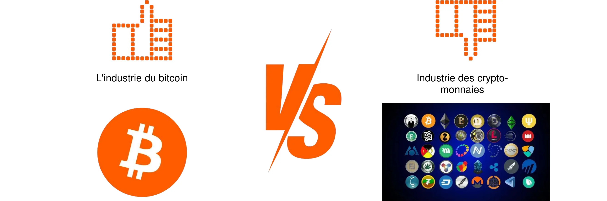

Phần thứ hai, "Hiểu những gì bạn đang làm", sẽ giúp bạn hiểu sâu hơn về Bitcoin. Chúng tôi sẽ bắt đầu bằng phần ôn tập để đảm bảo bạn hiểu đầy đủ các khái niệm cần thiết.

Sau đó, chúng tôi sẽ giải thích lý do tại sao Bitcoin về cơ bản là quan trọng theo quan điểm công nghệ, kinh tế và xã hội, củng cố niềm tin của bạn vào giá trị của nó. Bạn cũng sẽ khám phá toàn bộ ngành công nghiệp Bitcoin: những người chơi chính, tổ chức của nó và sự phát triển của nó qua nhiều năm. Cuối cùng, chúng tôi sẽ đề cập đến kiến trúc phân lớp của hệ sinh thái Bitcoin, một khái niệm quan trọng để hiểu cách hệ thống này tiếp tục đổi mới mà không làm ảnh hưởng đến tính toàn vẹn của giao thức cốt lõi của nó.

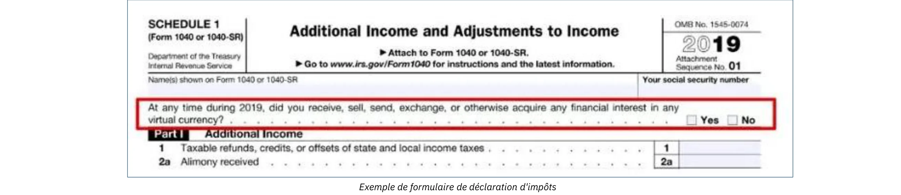

Phần thứ ba, "Thiết lập kế hoạch của bạn", tập trung vào cách tiếp cận cá nhân của bạn đối với Bitcoin. Chúng tôi sẽ bắt đầu bằng cách giúp bạn xác định hồ sơ người dùng của mình từ bốn danh mục chính:

- người nắm giữ*, tập trung vào việc nắm giữ Bitcoin trong thời gian dài;
- người xếp chồng*, người mua hàng thường xuyên và có phương pháp;
- người dùng*, người ưu tiên sử dụng Bitcoin hàng ngày;
- và cuối cùng là *người hoang tưởng*, người muốn có sự an ninh tối đa để bảo vệ hiệu quả tài sản và quyền riêng tư của mình.

Chúng tôi sẽ hướng dẫn bạn thực hiện chiến lược phù hợp với hồ sơ của bạn và giúp bạn đạt được mục tiêu cá nhân.

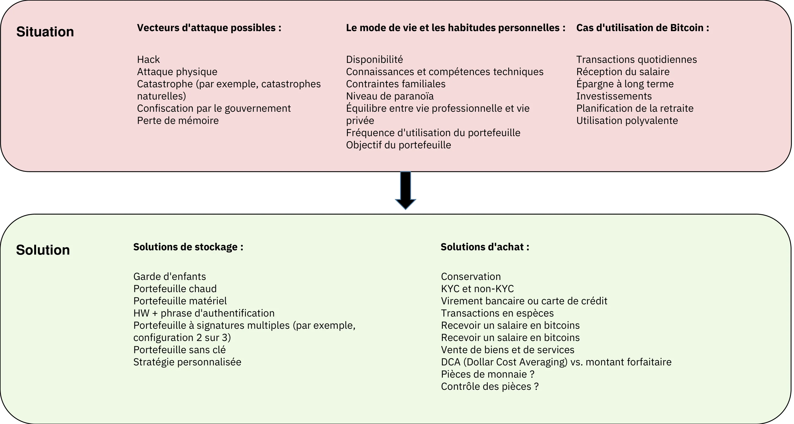

Cuối cùng, phần thứ tư, "Bảo vệ người thừa kế và tài sản của bạn", đề cập đến một chủ đề quan trọng thường bị bỏ qua: cách đảm bảo Bitcoin của bạn được chuyển cho những người thân yêu của bạn trong trường hợp xảy ra sự kiện bất ngờ. Bạn sẽ học cách tạo và thiết lập kế hoạch thừa kế Bitcoin, đảm bảo bảo toàn tài sản của bạn sau khi bạn qua đời.

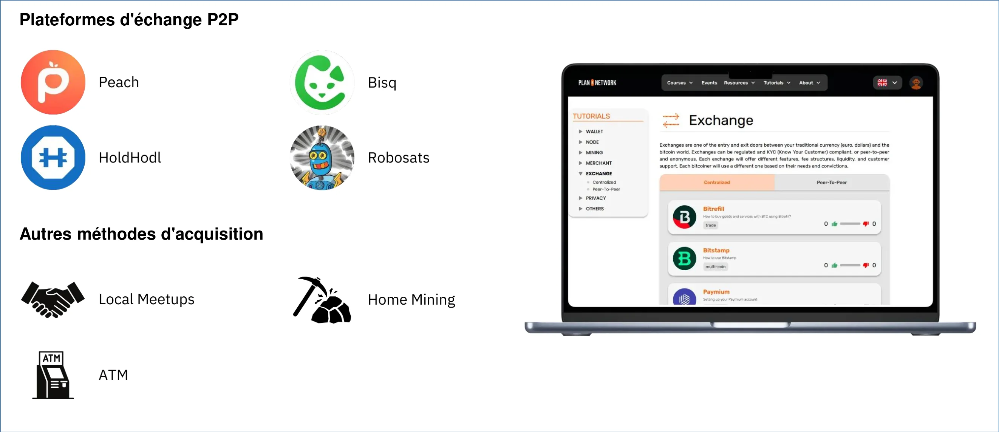

Đến cuối khóa học này, bạn sẽ có tất cả các công cụ thực tế cần thiết để tự tin điều hướng hệ sinh thái Bitcoin và trở thành một trong những người dùng tiên tiến nhất của hệ sinh thái này!

Bạn đã sẵn sàng bắt đầu hành trình khám phá thế giới Bitcoin chưa? Bắt đầu thôi!

# Điều kiện tiên quyết để hiểu Bitcoin

<partId>4481fc4b-0f83-489e-ad07-81517c5d6bad</partId>

## Lừa đảo và gian lận tài chính

<chapterId>8af2948b-2ab5-54c4-862c-3414b8a285a2</chapterId>

:::video id=9f3a7b2e-2c4d-4c1e-8b1f-3a2c1d4e5f6a:::

Hệ sinh thái Bitcoin và môi trường xung quanh vẫn còn tương đối mới và được quản lý lỏng lẻo, tùy thuộc vào quốc gia. Mặc dù sự tự do này mở ra nhiều cơ hội, nhưng nó cũng tạo ra mảnh đất màu mỡ cho các vụ gian lận tài chính, lừa đảo và nhiều hình thức thao túng khác nhau. Đó là lý do tại sao chương đầu tiên lại quan trọng đến vậy: hiểu được những cạm bẫy phổ biến sẽ giúp bạn tránh được chúng. An ninh tài chính của bạn là ưu tiên hàng đầu vì một trải nghiệm tồi tệ không chỉ ảnh hưởng đến bạn mà còn ảnh hưởng đến toàn bộ cộng đồng Bitcoin.

### Bitcoin so với tiền điện tử: hiểu rõ sự khác biệt

Trước khi đi sâu hơn, điều quan trọng là phải phân biệt rõ ràng hai thế giới về cơ bản là khác nhau:

- Hệ sinh thái Bitcoin** tập trung vào ý tưởng về tiền tệ lành mạnh, được xây dựng trên sự phi tập trung mạnh mẽ, khả năng phục hồi lâu dài, quyền riêng tư và chủ quyền cá nhân. Kể từ khi ra mắt vào năm 2009, Bitcoin đã hoạt động đáng tin cậy và an toàn, được hỗ trợ bởi cộng đồng các nhà phát triển toàn cầu, tận tâm. Đây không phải là một xu hướng nhất thời, mà là một giao thức ổn định và được thiết lập tốt, được thiết kế để bảo toàn giá trị theo thời gian.

- Ngược lại, ngành công nghiệp tiền điện tử** lớn hơn nhiều và bao gồm hàng chục nghìn dự án khác nhau, mỗi dự án có token riêng. Không gian này thường được thúc đẩy bởi sự đổi mới nhanh chóng, sự cường điệu và đầu cơ tài chính ngắn hạn. Nhiều dự án trong số này là tập trung, kém an toàn và không mang lại nhiều giá trị thực sự—mặc dù có những lời hứa táo bạo và tiếp thị hào nhoáng.

Nếu bạn muốn hiểu rõ hơn về nguồn gốc của Bitcoin và điều gì thực sự khiến nó khác biệt so với các dự án khác, tôi khuyên bạn nên xem khóa học tiếp theo miễn phí này về lịch sử của Bitcoin sau:

https://planb.network/courses/a51c7ceb-e079-4ac3-bf69-6700b985a082

Như bạn đã biết, nền tảng Plan ₿ Network chỉ dành riêng cho Bitcoin. Tuy nhiên, hiểu được sự khác biệt với các loại tiền điện tử khác sẽ giúp bạn tránh được những cạm bẫy liên quan đến các dự án vô ích và đôi khi thậm chí là gian lận.

### Những trò lừa đảo chính cần tránh

Sau đây là những trò lừa đảo phổ biến nhất mà bạn có thể gặp phải trong chuyến đi của mình:

#### Các chương trình kim tự tháp và các chương trình Ponzi

Đây là một số trò lừa đảo phổ biến nhất trong thế giới tiền điện tử. Trong một kế hoạch Ponzi, những người tham gia đầu tiên nhận được khoản thanh toán bằng tiền của những người mới hơn; không phải từ bất kỳ khoản đầu tư hoặc sản phẩm thực tế nào. Không có giá trị thực tế nào được tạo ra. Hệ thống chỉ hoạt động miễn là những người mới tiếp tục tham gia. Khi dòng người tham gia mới chậm lại, toàn bộ kế hoạch sẽ sụp đổ.

Những trò lừa đảo này thường có đặc điểm là:

- Những lời hứa không thực tế về lợi nhuận được đảm bảo (ví dụ: lợi nhuận được đảm bảo 20%);
- Sự chậm trễ hoặc khó khăn khi cố gắng rút tiền đã đầu tư của bạn;
- Có động lực mạnh mẽ để tuyển dụng thành viên mới nhằm duy trì hoạt động của hệ thống;
- Hoàn toàn thiếu minh bạch về nguồn gốc thực sự của lợi nhuận đã hứa.

Cuối cùng, tất cả các mô hình kim tự tháp và Ponzi đều phải thất bại. Điểm yếu cơ bản của chúng nằm ở nhu cầu liên tục phải đưa các nhà đầu tư mới vào để trả lợi nhuận cho những người tham gia trước đó. Nhu cầu này trở nên không thể duy trì về mặt toán học theo thời gian vì số lượng người mới được tuyển dụng tăng theo cấp số nhân khi hệ thống phát triển. Khi đạt đến điểm tới hạn, những người tham gia bắt đầu nghi ngờ, lòng tin biến mất và toàn bộ kim tự tháp sụp đổ. Ở giai đoạn này, những người cuối cùng tham gia, thường là những người ít thông tin nhất, mất toàn bộ khoản đầu tư của họ mà không có cách nào để thu hồi lại, trong khi những người tổ chức hoặc nhà đầu tư ban đầu thường đã rút tiền và rời khỏi hệ thống.

Trong thế giới tiền điện tử, các chương trình Ponzi có thể có nhiều hình thức, thường được thiết kế để che giấu bản chất gian lận của chúng đằng sau một lớp mặt nạ công nghệ hoặc tài chính. Những trò lừa đảo này có thể xuất hiện dưới dạng các đợt chào bán token mới hoặc các đợt chào bán tiền xu ban đầu (ICO), là các hoạt động gây quỹ trong đó một loại tiền điện tử mới được bán cho công chúng. Đằng sau các thuật ngữ kỹ thuật như "Blockchain", "hợp đồng thông minh" hoặc "đặt cược", một số dự án thực sự đang che giấu các chương trình kim tự tháp phức tạp. Những dự án khác tuyên bố cung cấp lợi nhuận cao bằng cách kết hợp các tài sản tiền điện tử đáng ngờ với các hệ thống bồi thường hoàn toàn dựa vào dòng tiền đầu tư mới liên tục.

Gần đây hơn, các chương trình Ponzi cũng đã lan rộng sang thế giới Tài chính phi tập trung (DeFi). Trong khi DeFi có mục đích cung cấp các dịch vụ tài chính mà không cần trung gian, một số dự án sử dụng nó để tạo ra cảm giác hợp pháp sai lầm cho các vụ lừa đảo của họ. Một số nền tảng DeFi hứa hẹn lợi nhuận cao, được đảm bảo bằng Exchange cho các khoản tiền gửi tiền điện tử vào các giao thức tự động. Những lời hứa hấp dẫn này thường được hỗ trợ bởi các cơ chế mờ đục và không thể xác minh, với các mã thông báo được tạo ra dành riêng cho trò lừa đảo. Trên thực tế, các hệ thống này không có mô hình kinh doanh bền vững - lợi nhuận chỉ đơn giản được trả từ tiền của người dùng mới, giống như một chương trình Ponzi truyền thống. Khi lòng tin bắt đầu bị xói mòn hoặc dòng người tham gia mới chậm lại, các hệ thống này chắc chắn sẽ sụp đổ, dẫn đến tổn thất đáng kể cho các nhà đầu tư không nghi ngờ.

Xin lưu ý rằng nội dung của khóa học này chỉ dành cho mục đích giáo dục và không được hiểu là lời khuyên về tài chính. Sự an toàn tài chính của bạn phụ thuộc vào khả năng thận trọng, hoài nghi và có hiểu biết sâu sắc với mọi quyết định tài chính mà bạn đưa ra.

Cách bảo vệ tốt nhất là luôn đặt câu hỏi đơn giản này: Sự hoàn trả được hứa hẹn thực sự đến từ đâu? Nếu câu trả lời không rõ ràng, hãy chạy ngay lập tức.

#### Bơm và xả

Loại lừa đảo này liên quan đến việc thổi phồng giá một cách giả tạo của một tài sản—thường là một loại tiền điện tử có tính thanh khoản thấp token—thông qua một chiến dịch tiếp thị được phối hợp, thường do một nhóm các nhà đầu tư dẫn đầu. Kế hoạch Pump & Dump điển hình tuân theo mô hình này:

- Một nhóm người trong cuộc hoặc những người có ảnh hưởng âm thầm tích lũy một lượng lớn tài sản mục tiêu.
- Sau đó, họ tung ra một chiến dịch quảng cáo rầm rộ để thổi phồng generate và đẩy giá lên cao.
- Công chúng nói chung, bị thúc đẩy bởi tâm lý FOMO (Sợ bỏ lỡ cơ hội), bắt đầu mua tài sản với số lượng lớn, đẩy giá lên cao hơn nữa.
- Khi cơn sốt lên đến đỉnh điểm, những người trong cuộc sẽ bán hết toàn bộ cổ phiếu của mình cùng một lúc.
- Giá giảm mạnh khiến những người tham gia sau phải chịu tổn thất nặng nề.

Điều quan trọng cần lưu ý là các chiến lược Pump & Dump là bất hợp pháp ở nhiều quốc gia và được coi là một hình thức thao túng thị trường. Mặc dù vậy, các chương trình như vậy vẫn tiếp tục phát triển mạnh, đặc biệt là trong lĩnh vực tiền điện tử, nơi mà các quy định vẫn đang được hoàn thiện.

Đặc biệt thận trọng với các nhóm "tín hiệu" riêng tư trên các nền tảng như Telegram, Discord hoặc các kênh truyền thông xã hội khác. Những nhóm này thường do những người có sức ảnh hưởng hoặc những chuyên gia tự xưng điều hành, một số thậm chí còn tính phí tham gia. Mặc dù các nhóm này tuyên bố cung cấp các cơ hội đầu tư độc quyền, nhưng thực tế lại thiên vị hơn nhiều: chỉ có những người tổ chức mới có lợi nhuận, trong khi hầu hết những người tham gia đều mất tiền.

Đúng là một số người tham gia có thể tạm thời hưởng lợi từ những kiểu thao túng thị trường này, nhưng thành công của họ thường không dựa trên gì ngoài may mắn và thời điểm hoàn hảo. Về lâu dài, những kế hoạch này không bền vững. Chúng đòi hỏi sự tham gia liên tục có rủi ro cao và sự tham gia lặp đi lặp lại vào các thiết lập gian lận chắc chắn sẽ sụp đổ.

Tệ hơn nữa, chúng nuôi dưỡng một ảo tưởng nguy hiểm: niềm tin rằng có thể kiếm tiền nhanh chóng và dễ dàng mà không cần hiểu cách thức hoạt động thực sự của hệ thống tài chính. Tư duy này không chỉ khiến cá nhân gặp rủi ro mà còn làm suy yếu uy tín của toàn bộ hệ sinh thái tiền điện tử

Vì tất cả những lý do này, chiến lược tốt nhất là áp dụng phương pháp đầu tư nghiêm túc và chu đáo, dựa trên nền tảng giáo dục tài chính, hiểu biết vững chắc về các nguyên tắc cơ bản và có tầm nhìn dài hạn.

Bằng cách kiên nhẫn xây dựng kiến thức, bạn sẽ ít bị tổn thương hơn trước sự thao túng cảm xúc và những lời hứa không thực tế; và được trang bị tốt hơn để tránh những cạm bẫy tài chính có thể dẫn đến thua lỗ thực sự.

#### Lừa đảo quyên góp, xổ số và tặng quà giả

Loại lừa đảo này hứa hẹn Bitcoin miễn phí hoặc các phần thưởng khác trong Exchange khi bạn gửi một số tiền nhỏ trước. Điều quan trọng cần nhớ là: không có cá nhân hoặc tổ chức hợp pháp nào yêu cầu bạn gửi tiền điện tử trước với lời hứa sẽ gửi cho bạn nhiều hơn để đổi lại.

Những kẻ lừa đảo thường mạo danh những nhân vật công chúng nổi tiếng (như Elon Musk hoặc những người nổi tiếng khác) để dụ nạn nhân thông qua mạng xã hội. Luôn kiểm tra kỹ tính hợp pháp của các tài khoản và trang web trước khi tham gia và không bao giờ tin vào những lời đề nghị có vẻ quá hào phóng hoặc quá tốt để có thể là sự thật.

Đôi khi, những trò lừa đảo này xuất hiện dưới dạng gian lận "phí ứng trước". Bạn được hứa hẹn một giải thưởng hoặc phần thưởng (tiền, sản phẩm hoặc dịch vụ) nhưng trước tiên được yêu cầu trả một khoản phí, được cho là để trang trải những thứ như phí vận chuyển, thuế hoặc chi phí giao dịch. Sau khi thanh toán xong, kẻ lừa đảo biến mất và phần thưởng đã hứa sẽ không bao giờ đến.

#### Shitcoin và tiền điện tử được cung cấp

Các dự án tiền điện tử tập trung đôi khi cung cấp token miễn phí ("*airdrops*") để thu hút người dùng. Các token này thường có ít hoặc không có giá trị thực và chủ yếu được sử dụng để tạo ra ảo giác về sự phổ biến hoặc thúc đẩy đầu cơ. Hãy cực kỳ thận trọng với những loại ưu đãi khuyến mại này; chúng thường là bẫy tiếp thị hơn là cơ hội thực sự.

#### Trộm cắp danh tính và lừa đảo

Kẻ tấn công thường sử dụng các trang web giả mạo, tài khoản mạng xã hội hoặc email lừa đảo để cố gắng đánh cắp tiền của bạn. Những vụ lừa đảo này có thể đến qua bất kỳ kênh liên lạc nào: email, mạng xã hội, cuộc gọi điện thoại hoặc thậm chí là thư truyền thống...

Trước khi nhấp vào liên kết hoặc thực hiện bất kỳ hành động nào, hãy luôn kiểm tra lại danh tính của người gửi. Khi nghi ngờ, hãy truy cập trang web theo cách thủ công thay vì sử dụng liên kết được cung cấp. Quan trọng nhất là không bao giờ chia sẻ khóa riêng tư hoặc mật khẩu của bạn với bất kỳ ai.

#### Bitcoin Hardfork

Trong nhiều năm qua, Bitcoin đã trải qua một số lần *phân nhánh Hard*, dẫn đến việc tạo ra các phiên bản thay thế của tiền điện tử gốc. Nói một cách đơn giản, *Hard Fork* là một sự phân chia trong mạng dẫn đến hai blockchain riêng biệt, cả hai đều chia sẻ cùng một lịch sử cho đến thời điểm phân chia. Các phân chia này thường xảy ra khi một phần của cộng đồng nhà phát triển hoặc hệ sinh thái Bitcoin rộng lớn hơn muốn đưa ra những thay đổi lớn vào giao thức gốc nhưng không thể đạt được sự đồng thuận rộng rãi. Thay vì từ bỏ ý tưởng của mình, họ quyết định tung ra phiên bản Bitcoin mới (với các quy tắc đã thay đổi) với hy vọng rằng người dùng và thợ đào sẽ chọn làm theo Fork của họ.

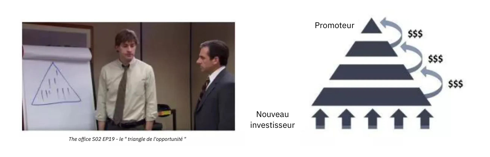

Không phải tất cả *Hard fork* đều là gian lận, vì một số phát sinh từ những bất đồng về mặt kỹ thuật hoặc ý thức hệ trong cộng đồng. Tuy nhiên, một số khác lại được thúc đẩy bởi lợi ích thương mại hoặc thậm chí là động cơ không trung thực. Những ví dụ nổi tiếng nhất về các hardfork này là **Bitcoin Cash (BCH)** và **Bitcoin Satoshi Vision (BSV)**. Ra mắt lần lượt vào năm 2017 và 2018, các loại tiền tệ thay thế này thường tuyên bố là "phiên bản tốt hơn" của Bitcoin ban đầu. Chúng quảng bá những lợi thế được cho là như phí giao dịch thấp hơn hoặc giao dịch nhanh hơn do kích thước khối tăng lên. Tuy nhiên, những thay đổi về mặt kỹ thuật này đi kèm với những đánh đổi đáng kể về mặt bảo mật, phi tập trung và độ mạnh mẽ; Elements có thể xung đột với các nguyên tắc cơ bản của Bitcoin.

Ngoài những khác biệt về mặt kỹ thuật, các loại tiền tệ thay thế này thường lợi dụng sự nhầm lẫn để thu hút các nhà đầu tư thiếu hiểu biết. Họ có thể sử dụng các chiến thuật tiếp thị được thiết kế để cố tình đánh lừa những người mới tin rằng họ đang mua Bitcoin (BTC) chính hãng.

Để tránh rơi vào cái bẫy này, hãy luôn xác minh loại tiền bạn đang mua. Bitcoin ban đầu sử dụng ký hiệu **BTC**, trong khi Bitcoin Cash và các sản phẩm phái sinh của nó sử dụng các từ viết tắt riêng biệt, chẳng hạn như BCH hoặc BSV.

#### Những người có ảnh hưởng không trung thực và những bậc thầy giả mạo

Khi tiền điện tử thu hút sự chú ý của công chúng, phương tiện truyền thông xã hội đã chứng kiến sự gia tăng của những người có sức ảnh hưởng, những chuyên gia tự xưng và những người được gọi là "*chuyên gia tiền điện tử*". Trong khi một số ít có thể đưa ra những hiểu biết giáo dục thực sự, nhiều người khác lại lợi dụng khả năng hiển thị của họ để quảng bá các dự án đáng ngờ hoặc các chiến lược giao dịch nguy hiểm (và đôi khi là gian lận trắng trợn). Những cá nhân này thường có động cơ là lợi ích tài chính cá nhân, thường nhận được khoản bồi thường trực tiếp hoặc gián tiếp để quảng bá một số mã thông báo hoặc nền tảng nhất định.

Những người có sức ảnh hưởng này thường dựa vào các chiến thuật đã được chứng minh để thu hút người mới bắt đầu: họ giới thiệu những kết quả tài chính ấn tượng (thường là giả mạo hoặc không thể xác minh), phô trương lối sống xa hoa như bằng chứng cho thấy thành công của họ và quảng bá các chiến lược đầu tư "thần kỳ". Mục tiêu là kích hoạt FOMO — nỗi sợ bỏ lỡ — và thúc đẩy khán giả của họ đưa ra những quyết định bốc đồng và đầu tư liều lĩnh.

Điều quan trọng là phải hiểu rằng hầu hết lời khuyên "miễn phí" từ những nhân vật này không bao giờ thực sự miễn phí. Đằng sau vẻ hào phóng thường ẩn chứa một chiến lược được tính toán để hướng mọi người đến việc mua những tài sản đáng ngờ. Và ngay cả khi một số người có ảnh hưởng trung thực, việc sao chép kết quả của họ sẽ gần như không thể; thành công của họ thường phụ thuộc vào thời điểm cụ thể, kiến thức nội bộ hoặc hoàn cảnh độc đáo mà bạn không thể tiếp cận.

Một số người có sức ảnh hưởng có thể mời bạn tham gia các nhóm riêng tư, trả phí, nơi họ tuyên bố chia sẻ các tín hiệu giao dịch độc quyền hoặc mẹo nội gián hứa hẹn lợi nhuận nhanh chóng và dễ dàng. Trên thực tế, các nhóm này chủ yếu có lợi cho chính những người tổ chức. Họ thường sử dụng những người theo dõi mình như một nguồn thanh khoản, về cơ bản là bán tháo tài sản để kiếm lợi cá nhân. Những người đăng ký thường mất tiền vì họ không thể phản ứng nhanh như những người trong cuộc điều phối các giao dịch (xem phần về các chương trình Pump & Dump).

Trước thực tế này, sau đây là một số thói quen tốt cần áp dụng để tránh rơi vào bẫy của những người có sức ảnh hưởng không trung thực:

- Hãy hết sức thận trọng với bất kỳ khuyến nghị đầu tư tiền điện tử nào.**

Một người đáng tin cậy và hiểu biết sẽ không bao giờ gây áp lực buộc bạn mua tiền điện tử mà không khuyến khích bạn tự nghiên cứu trước.

- Các khóa học giao dịch hoặc đầu tư trả phí không phải lúc nào cũng là dấu hiệu của chất lượng.**

Nhiều khóa học này đưa ra các chiến lược rủi ro hoặc quá đơn giản; thường là những thông tin bạn có thể tìm thấy miễn phí trực tuyến.

- Không có cách nào đảm bảo bạn có thể sao chép giao dịch của người khác và có được kết quả giống hệt.**

Mỗi chiến lược đầu tư đều phụ thuộc vào bối cảnh cá nhân, thời điểm, kiến thức và các yếu tố khác không thể sao chép chính xác được.

- Hãy đặc biệt cảnh giác với những lời khuyên nghe có vẻ tốt đến mức khó tin.**

Những lời hứa không thực tế hoặc lợi nhuận được đảm bảo hầu như luôn là dấu hiệu của sự thao túng. Hãy nhớ rằng: chỉ vì ai đó nói điều gì đó một cách tự tin không có nghĩa là điều đó đúng.

Luôn nhớ rằng, mọi người bạn gặp trong hệ sinh thái tiền điện tử Bitcoin hoặc rộng hơn đều có mục đích cá nhân; dù được nêu rõ hay ẩn sau các dòng. Không có thông tin nào là hoàn toàn trung lập. Ngay cả khóa học này, BTC102, cũng có mục tiêu rõ ràng, *là thúc đẩy sự hiểu biết tốt hơn về Bitcoin.*

Đó là lý do tại sao điều quan trọng là phải luôn nhận thức được động cơ thực sự đằng sau mỗi nội dung bạn tiêu thụ. Và đừng bao giờ quên quy tắc vàng này của Internet:

*Nếu một sản phẩm hoặc dịch vụ có vẻ miễn phí thì rất có thể bạn chính là sản phẩm đó.*

Cuối cùng, cách phòng thủ tốt nhất của bạn là giáo dục bản thân, thái độ hoài nghi lành mạnh và quan trọng nhất là thói quen tự mình xác minh sự thật.

### Làm thế nào để tránh lừa đảo

**Để đảm bảo an toàn khi trực tuyến, đặc biệt là trong thế giới tiền điện tử, hãy ghi nhớ những nguyên tắc chính sau:**

- Đừng bao giờ tin tưởng một cách mù quáng: "*Đừng tin tưởng, hãy kiểm chứng*" ;
- Hãy nghi ngờ những khoản lợi nhuận được đảm bảo hoặc cao bất thường;
- Không bao giờ chia sẻ khóa riêng tư của bạn với bất kỳ ai;
- Không gửi Bitcoin (hoặc bất kỳ loại tiền điện tử nào) đến các địa chỉ không xác định;
- Nếu còn nghi ngờ, hãy dừng lại. Hãy lùi lại và suy nghĩ trước khi hành động. FOMO là kẻ thù tồi tệ nhất của bạn;
- Tránh các nhóm hoặc cộng đồng giao dịch trả phí đưa ra những lời hứa không thực tế;
- Hầu hết các chương trình tặng thưởng hoặc xổ số "miễn phí" trực tuyến đều là lừa đảo hoặc gian lận nghiêm trọng;
- Về lâu dài, bạn sẽ luôn đạt được nhiều lợi ích hơn bằng cách học hỏi thay vì đánh bạc.

Bảo vệ bản thân khỏi lừa đảo là bước đầu tiên quan trọng để bảo vệ tài sản của bạn; nhưng như vậy là chưa đủ. Duy trì vệ sinh kỹ thuật số mạnh mẽ cũng quan trọng không kém. Đó là lý do tại sao, trong chương tiếp theo, chúng ta sẽ khám phá cách tăng cường bảo mật trực tuyến của bạn và các biện pháp tốt nhất mà bạn nên áp dụng để bảo vệ bản thân trong thế giới kỹ thuật số.

## Bảo mật trực tuyến

<chapterId>f0873bf2-6a6f-5485-bb7a-d84be14f404d</chapterId>

:::id video=2a1b3c4d-5e6f-7a8b-9c0d-1e2f3a4b5c6d:::

Ngay khi bạn bắt đầu tìm hiểu về Bitcoin, bạn sẽ nhanh chóng nhận ra rằng an ninh mạng cơ bản không phải là tùy chọn mà là điều cần thiết. Lừa đảo và gian lận chỉ là phần nổi của tảng băng chìm. Việc vô tình mất dữ liệu, phần mềm độc hại và mật khẩu bị xâm phạm có thể gây hậu quả nghiêm trọng, đặc biệt là khi bạn tự quản lý khóa của mình.

Chương này hướng dẫn bạn một số bước đơn giản, thiết thực để nâng cao mức độ vệ sinh kỹ thuật số và bảo vệ bản thân trong không gian mạng.

Nếu bạn muốn tìm hiểu sâu hơn, khóa học SEC101 của Plan ₿ Network cung cấp phân tích toàn diện về các chiến lược an ninh mạng được thiết kế riêng cho người dùng Bitcoin.

https://planb.network/courses/99c46148-7080-4915-a7e0-9df0e145cd47

### Tại sao an ninh mạng lại quan trọng

Bitcoin trao cho bạn quyền giữ tiền trực tiếp (không cần ngân hàng), không cần trung gian. Nhưng loại chủ quyền tài chính đó đi kèm với trách nhiệm nghiêm trọng: nếu BTC của bạn bị đánh cắp do lỗi bảo mật, sẽ không có cách nào để đảo ngược giao dịch. Không giống như ngân hàng truyền thống, không có bộ phận trợ giúp, không có khiếu nại gian lận và không có bảo hiểm để cứu bạn.

Trên hết, giá trị tài chính của Bitcoin khiến nó trở thành mục tiêu có giá trị cao. Một hacker xâm phạm Wallet của bạn có thể ngay lập tức chuyển tiền của bạn đến Address mà họ kiểm soát (không cần hỏi, không có cách nào lấy lại được).

### Một máy tính sạch sẽ, cập nhật

Một trong những khía cạnh bị bỏ qua nhiều nhất của bảo mật cá nhân là giữ cho hệ điều hành và phần mềm của bạn được cập nhật. Nhiều bản cập nhật vá các lỗ hổng đã biết có thể bị kẻ tấn công khai thác. Trong khi một số người tránh cập nhật vì sợ vấn đề về hiệu suất, thì rủi ro thực sự nằm ở việc chạy phần mềm lỗi thời mà tin tặc đã biết cách phá vỡ.

Bạn cũng nên sử dụng phần mềm diệt vi-rút đáng tin cậy. Trên Windows, Windows Defender tích hợp thường đủ cho hầu hết người dùng. Nếu bạn thích các tính năng bổ sung hoặc sự an tâm, các tùy chọn thương mại như Kaspersky cũng khả dụng. Trên macOS, các mối đe dọa phần mềm độc hại ít phổ biến hơn **nhưng không phải là không tồn tại** nên bạn vẫn nên thận trọng.

Ngoài các bản cập nhật hệ thống và bảo vệ chống vi-rút, hãy cực kỳ cảnh giác khi tải xuống phần mềm từ các trang web đáng ngờ hoặc các cổng tải xuống được gọi là "phổ quát". Khi bạn cần một công cụ hoặc ứng dụng, hãy luôn truy cập trực tiếp vào nguồn chính thức; Điều này làm giảm đáng kể nguy cơ cài đặt phần mềm độc hại được ngụy trang thành phần mềm hợp pháp.

Một thói quen thông minh khác là xác minh tính xác thực và tính toàn vẹn của bất kỳ phần mềm nào trước khi cài đặt nó trên máy của bạn. Nếu bạn không chắc chắn cách thực hiện, đừng lo lắng, chúng tôi có hướng dẫn chuyên dụng để hướng dẫn bạn thực hiện quy trình:

https://planb.network/tutorials/computer-security/data/integrity-authenticity-21d0420a-be02-4663-94a3-8d487f23becc

Cuối cùng, hãy sao lưu thường xuyên dữ liệu quan trọng của bạn. Ổ đĩa Hard hoặc SSD ngoài là lựa chọn đáng tin cậy để lưu bản sao các tệp của bạn trong trường hợp hỏng hóc đột ngột, bị hack hoặc vô tình xóa. Bạn sẽ cảm ơn chính mình sau.

Nếu bạn thích giải pháp đám mây, hãy cân nhắc sử dụng dịch vụ an toàn như Proton Drive. Chỉ cần đảm bảo bất kỳ tùy chọn nào bạn chọn đều tôn trọng quyền riêng tư của bạn và cung cấp mã hóa mạnh mẽ.

https://planb.network/tutorials/computer-security/data/proton-drive-03cbe49f-6ddc-491f-8786-bc20d98ebb16

Một chiến lược sao lưu được khuyến nghị rộng rãi là "quy tắc 3-2-1". Quy tắc này được thiết kế để bảo vệ dữ liệu của bạn khỏi mất mát ngẫu nhiên, tấn công mạng hoặc thậm chí là thiên tai.

Ý tưởng này rất đơn giản:

- Giữ **ít nhất 3 bản sao** dữ liệu quan trọng của bạn,
- Lưu trữ chúng trên **ít nhất 2 loại phương tiện khác nhau** (ví dụ: ổ đĩa Hard ngoài và bộ nhớ đám mây),
- Và đảm bảo **1 trong những bản sao đó được lưu trữ ngoài địa điểm**(cách xa vị trí chính của bạn).

Cách tiếp cận này mang lại khả năng phục hồi mạnh mẽ và giúp đảm bảo dữ liệu của bạn vẫn tồn tại ngay cả khi có sự cố nghiêm trọng xảy ra.

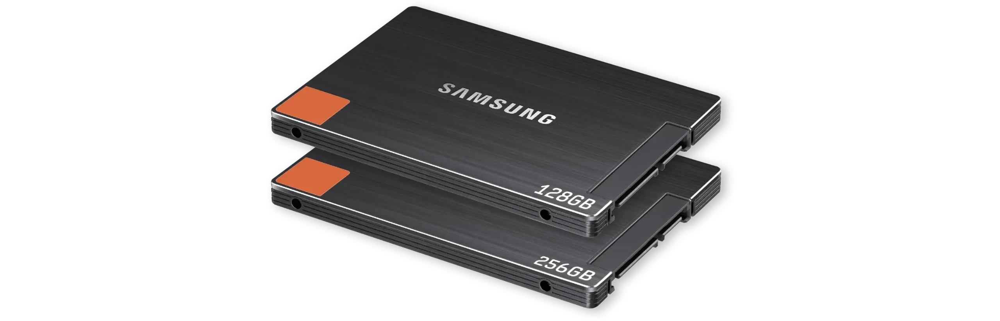

### Giải pháp cho cơn ác mộng ID

Một trong những lý do lớn nhất khiến mọi người bị hack là sử dụng mật khẩu yếu. Một số lượng lớn người dùng vẫn sử dụng lại cùng một mật khẩu trên nhiều tài khoản hoặc chọn các biến thể dễ đoán. Trình quản lý mật khẩu là giải pháp hoàn hảo cho vấn đề này.

Trình quản lý mật khẩu cho phép bạn:

- Lưu trữ tất cả mật khẩu của bạn một cách an toàn** trong một kho lưu trữ được mã hóa
- generate mật khẩu dài, phức tạp và duy nhất** tự động cho mỗi tài khoản
- Chỉ sử dụng một mật khẩu chính** để truy cập mọi thứ một cách an toàn

Với trình quản lý mật khẩu, bạn sẽ không bao giờ phải nhấp vào "Quên mật khẩu" nữa hoặc dựa vào thông tin đăng nhập yếu, được sử dụng lại. Thêm vào đó, hầu hết các trình quản lý mật khẩu đều đồng bộ hóa liền mạch trên các thiết bị của bạn (máy tính để bàn, điện thoại, máy tính bảng) và thậm chí tự động điền biểu mẫu đăng nhập, giúp truy cập an toàn vừa dễ dàng vừa hiệu quả.

Có nhiều trình quản lý mật khẩu, nhưng tôi có thể giới thiệu hai lựa chọn chắc chắn tùy thuộc vào nhu cầu của bạn. Nếu bạn đang tìm kiếm thứ gì đó dễ sử dụng và đồng bộ hóa liền mạch trên nhiều thiết bị, Bitwarden là lựa chọn tuyệt vời:

https://planb.network/tutorials/computer-security/authentication/bitwarden-0532f569-fb00-4fad-acba-2fcb1bf05de9

Nếu bạn muốn lưu trữ mọi thứ cục bộ trên thiết bị của mình thì KeePass là một lựa chọn tuyệt vời:

https://planb.network/tutorials/computer-security/authentication/keepass-f8073bb7-5b4a-4664-9246-228e307be246

### 2FA: bảo vệ kép

Trong Bitcoin, bạn là ngân hàng của chính mình. Điều đó có nghĩa là bạn cũng là nhóm bảo mật của chính mình. Ngay cả với mật khẩu mạnh, cũng không có điều gì gọi là không có rủi ro - đó là lý do tại sao việc bật xác thực hai yếu tố (2FA) là điều cần thiết.

2FA bổ sung thêm Layer bảo vệ thứ hai bằng cách yêu cầu mã một lần theo thời gian (thường là 6 chữ số) được tạo bởi ứng dụng như Google Authenticator hoặc Authy. Vì vậy, ngay cả khi ai đó lấy được mật khẩu của bạn, họ vẫn không thể truy cập vào tài khoản của bạn nếu không có quyền truy cập vật lý vào điện thoại của bạn.

https://planb.network/tutorials/computer-security/authentication/authy-a76ab26b-71b0-473c-aa7c-c49153705eb7

Khi bạn bật 2FA, hãy đảm bảo lưu khóa khôi phục cho ứng dụng của bạn ở nơi an toàn. Điều này sẽ cho phép bạn khôi phục mã của mình nếu bạn làm mất hoặc thay đổi điện thoại. Mặc dù 2FA dựa trên SMS hoặc email tốt hơn không có gì, nhưng nó kém an toàn hơn nhiều. Một cuộc tấn công hoán đổi SIM, khi ai đó kiểm soát số điện thoại của bạn, có thể dễ dàng vượt qua loại bảo vệ này.

Đối với những người muốn nâng cao mức độ bảo mật hơn nữa, các loại khóa vật lý như YubiKey cung cấp mức độ bảo vệ thậm chí còn cao hơn.

https://planb.network/tutorials/computer-security/authentication/security-key-61438267-74db-4f1a-87e4-97c8e673533e

### Bảo vệ quyền riêng tư của bạn

Quyền riêng tư và an ninh mạng có mối liên hệ chặt chẽ: bạn càng để nhiều thông tin được truy cập miễn phí thì khả năng bạn trở thành mục tiêu càng cao.

**VPN** (*Mạng riêng ảo*) là một bước đơn giản nhưng hiệu quả để che giấu IP Address của bạn và mã hóa lưu lượng truy cập internet của bạn. Mặc dù nó sẽ không khiến bạn hoàn toàn vô hình (vì nhà cung cấp VPN vẫn có thể thấy hoạt động của bạn), nhưng nó khiến bất kỳ ai cố gắng theo dõi bạn hoặc theo dõi thói quen duyệt web của bạn khó khăn hơn đáng kể.

Điều quan trọng là chọn một nhà cung cấp VPN đáng tin cậy:

- Không yêu cầu thông tin cá nhân của bạn
- Cho phép thanh toán qua BTC
- Có chính sách nghiêm ngặt không ghi nhật ký

Chúng tôi có một số hướng dẫn về Plan ₿ Network có thể hướng dẫn bạn thiết lập VPN dễ dàng. Tôi đặc biệt khuyên dùng IVPN hoặc Mullvad:

https://planb.network/tutorials/computer-security/communication/ivpn-5a0cd5df-29f1-4382-a817-975a96646e68

https://planb.network/tutorials/computer-security/communication/mullvad-968ec5f5-b3f0-4d23-a9e0-c07a3e85aaa8

Các bước thiết yếu để bảo vệ quyền riêng tư trực tuyến của bạn cũng bao gồm:

- Sử dụng **nền tảng nhắn tin được mã hóa** như Signal, SimpleX hoặc Session;
- Sử dụng các trình duyệt chú trọng vào quyền riêng tư như Firefox, Brave hoặc Tor (để tăng cường tính ẩn danh);

https://planb.network/tutorials/computer-security/communication/tor-browser-a847e83c-31ef-4439-9eac-742b255129bb

- Sử dụng **hộp thư an toàn** như ProtonMail;

https://planb.network/tutorials/computer-security/communication/proton-mail-c3b010ce-254d-4546-b382-19ab9261c6a2

- Mã hóa** các tập tin của bạn bằng các công cụ như Bitlocker (dành cho Windows) hoặc VeraCrypt (có trên nhiều nền tảng).

https://planb.network/tutorials/computer-security/data/veracrypt-d5ed4c83-7c1c-4181-95ea-963fdf2d83c5

### Tiến trình từng bước

An ninh mạng có vẻ như là một công việc khổng lồ, và người mới bắt đầu dễ bị choáng ngợp và bỏ cuộc vì nó có vẻ quá phức tạp. Bí quyết là tiếp cận từng bước một. Bắt đầu bằng một điều gì đó đơn giản, như cài đặt trình quản lý mật khẩu. Hãy cho mình một vài tuần để làm quen với nó, sau đó chuyển sang bước tiếp theo: như bật 2FA trên một trong các tài khoản của bạn.

Khi bạn tự tin hơn với các công cụ này, bạn sẽ sẵn sàng áp dụng thêm các biện pháp nâng cao hơn, như sử dụng email phụ, chuyển sang ProtonMail, thiết lập VPN hoặc duyệt web bằng Tor khi cần.

Khi bạn đi sâu hơn vào thế giới của Bitcoin, bạn sẽ nhận thấy rằng rủi ro tăng lên khi giá trị của Wallet của bạn tăng lên. Xây dựng thói quen bảo mật vững chắc, bảo vệ quyền riêng tư của bạn và thiết lập các công cụ phù hợp sẽ không chỉ mang lại cho bạn sự an tâm mà còn củng cố chủ quyền mà Bitcoin hướng đến.

Tóm lại: đừng đánh giá thấp an ninh mạng, hãy dành thời gian để thiết lập những điều cơ bản và nhớ rằng tính nhất quán là chìa khóa. Nếu không có vệ sinh kỹ thuật số tốt, ngay cả những công cụ tốt nhất cũng không giúp ích được nhiều cho bạn.

Ngoài ra, hãy nhớ xem [hướng dẫn bảo mật máy tính của chúng tôi](https://planb.network/tutorials/computer-security) trên Plan ₿ Network.

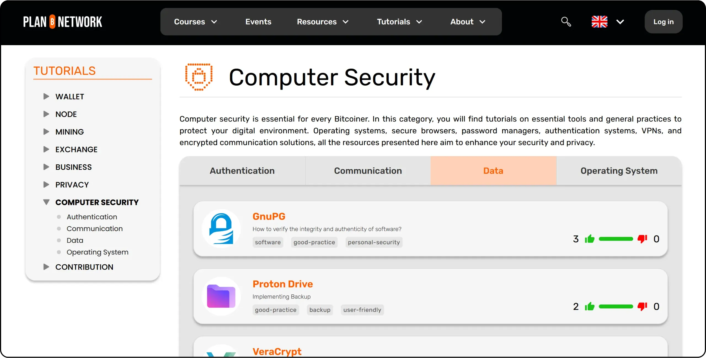

Trong chương tiếp theo, tôi sẽ chia sẻ thêm một số mẹo để giúp bạn bắt đầu hành trình Bitcoin một cách tự tin; và tránh xa nhiều cạm bẫy có thể khiến người mới bắt đầu mất cảnh giác.

## Mẹo cho người mới

<chapterId>33134b3f-92c1-5185-afb6-88599e47e801</chapterId>

:::ID video=7e9f3b2c-4d1a-4c5e-8b0d-3a2c1d4e5f6b:::

Tham gia Bitcoin có thể rất thú vị; nhưng cũng đi kèm với nhiều rủi ro. Thế giới tiền điện tử không giống bất kỳ thế giới nào khác; giá cả biến động mạnh, công nghệ không quen thuộc và khả năng mất tiền hoàn toàn do những sai lầm đơn giản hoặc lựa chọn đầu tư kém là những cạm bẫy mà người dùng mới nên biết.

Trong chương này, tôi sẽ chia sẻ một số lời khuyên thực tế và hướng dẫn chung cho bất kỳ ai đang thực hiện những bước đầu tiên, đặc biệt là những người thực hiện giao dịch mua hàng đầu tiên hoặc khám phá thế giới đầu tư tài chính rộng lớn hơn.

Sau đây là những điểm chính mà chúng ta sẽ cùng nhau xem xét:

- Hãy cẩn thận với **Shitcoin** và các loại tiền điện tử vô dụng khác;
- Chỉ đầu tư **số tiền mà bạn có thể để mất**;
- Biết được sự khác biệt giữa **giao dịch** và **đầu tư**;
- Hãy lưu ý đến **những tác động về thuế** của khoản đầu tư của bạn;
- Hãy bảo vệ **cụm từ khôi phục** của bạn một cách cẩn thận;
- Hãy khiêm tốn và giữ thái độ **kín đáo** (sự thận trọng là một phần của an ninh);
- Hãy suy nghĩ dài hạn**, nhìn xa hơn và kiên nhẫn (hãy nghĩ về nó như một cuộc chạy marathon chứ không phải chạy nước rút).

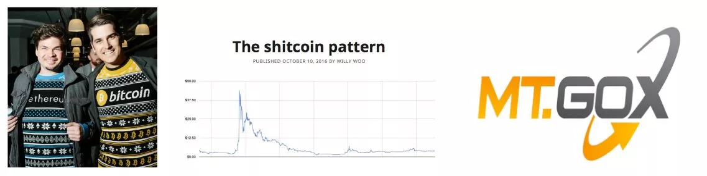

### Những sai lầm thường gặp cần tránh

Bitcoin mở cửa cho tất cả mọi người, nhưng điều đó không có nghĩa là bạn nên lao vào mà không chuẩn bị. Sau đây là một số lỗi kinh điển mà người mới mắc phải:

**Lỗi công nghệ:**

- Mất cụm từ seed:** Cụm từ khôi phục (thường là 12 hoặc 24 từ) là cách duy nhất để truy cập Bitcoin của bạn nếu có chuyện gì xảy ra với Wallet. Nếu bạn mất cụm từ này, tiền của bạn sẽ mất vĩnh viễn;
- Lưu trữ bitcoin của bạn trên nền tảng của bên thứ ba:** Nếu tiền của bạn nằm trên nền tảng tập trung, bạn không thực sự sở hữu chúng. Bạn phải đối mặt với các rủi ro như bị hack, nền tảng bị lỗi hoặc thậm chí là bị tịch thu tiền;
- Bỏ qua quyền riêng tư:** Bảo vệ quyền riêng tư của bạn là một phần cốt lõi trong việc bảo vệ tài sản của bạn. Việc tiết lộ công khai số lượng Bitcoin bạn nắm giữ có thể khiến bạn trở thành mục tiêu;
- Bảo mật trực tuyến không đủ:** Không bảo vệ thiết bị của bạn bằng các biện pháp bảo vệ cơ bản (như cập nhật, mật khẩu mạnh hoặc 2FA) khiến bạn dễ dàng trở thành mục tiêu cho kẻ tấn công; và có thể khiến bạn mất tất cả.

**Sai lầm về tài chính:**

- Đầu tư nhiều hơn mức bạn có thể mất**: Không bao giờ đi vay nợ hoặc đưa tiền thuê nhà vào Bitcoin. Sự ổn định tài chính cơ bản của bạn luôn phải được đặt lên hàng đầu.

- Không biết sự khác biệt giữa giao dịch và đầu tư**: Giao dịch đòi hỏi thời gian, kỹ năng và kỷ luật cảm xúc nghiêm túc. Đầu tư dài hạn thân thiện hơn nhiều với người mới bắt đầu.

- Quên đi thuế**: Mỗi quốc gia đều có luật thuế riêng cho tiền điện tử. Việc bỏ qua chúng có thể dẫn đến những bất ngờ đau đớn sau này.

- Bị mắc hội chứng FOMO**: Mua hàng bốc đồng vì sợ bỏ lỡ thường dẫn đến sai thời điểm và quyết định sai lầm. Kiên nhẫn là đồng minh tốt nhất của bạn.

### Xác định chiến lược đầu tư

Trước khi mua Satoshi đầu tiên, điều quan trọng là phải hiểu lý do tại sao bạn đầu tư vào Bitcoin và đầu tư như thế nào. Điều này có nghĩa là phải có một kế hoạch tài chính rõ ràng phù hợp với tình hình cá nhân và mục tiêu dài hạn của bạn.

Bắt đầu bằng cách xác định **ngân sách** của bạn một cách chính xác. Đừng chỉ chọn một con số ngẫu nhiên. Hãy dành thời gian để tính toán thu nhập hàng tháng của bạn, trừ đi các chi phí cố định (như tiền thuê nhà, tiền vay, thuế, tiện ích), cũng như chi phí sinh hoạt hàng ngày của bạn (thực phẩm, phương tiện đi lại, giải trí, v.v.). Bất cứ thứ gì còn lại là biên độ tiết kiệm của bạn và chỉ từ phần này bạn mới nên cân nhắc đầu tư.

Tiếp cận theo cách này đảm bảo rằng bạn không đặt sự an toàn tài chính của mình vào tình trạng nguy hiểm, đặc biệt là trong trường hợp thị trường suy thoái. Một chiến lược chu đáo là nền tảng của khả năng phục hồi lâu dài.

Sau khi xác định được ngân sách, hãy nghĩ về cách bạn muốn đầu tư. Một trong những phương pháp thân thiện với người mới bắt đầu và được khuyến nghị rộng rãi nhất là Trung bình chi phí đô la (DCA), mua một lượng Bitcoin cố định theo các khoảng thời gian đều đặn (hàng tuần, hàng tháng, v.v.). Chiến lược này giúp làm phẳng giá nhập trung bình của bạn theo thời gian và giảm tác động cảm xúc của biến động giá. Đây là cách tiếp cận thông minh đối với hầu hết mọi người, đặc biệt là người mới.

Sau đó, hãy tự hỏi: Khung thời gian của tôi là bao lâu?

Bạn đang muốn thực hiện những động thái nhanh chóng vào và ra khỏi thị trường (giao dịch)? Hay bạn phù hợp hơn với tư duy dài hạn là nắm giữ Bitcoin trong nhiều năm (người nắm giữ)? Nếu bạn là người nắm giữ, có lẽ bạn ít quan tâm đến những biến động giá hàng ngày và tập trung hơn vào sự an toàn và tự lưu ký dài hạn. Nếu bạn đang giao dịch, bạn sẽ tiếp xúc nhiều hơn với tiếng ồn thị trường ngắn hạn, rủi ro cao hơn và căng thẳng thường đi kèm với việc ra quyết định nhanh chóng. Không có câu trả lời nào phù hợp với tất cả mọi người, nhưng biết cách tiếp cận của riêng bạn sẽ giúp định hướng các quyết định của bạn.

Quan trọng nhất là đừng đưa ra quyết định đầu tư dựa trên cảm xúc hoặc nỗi sợ hãi. Hãy lập chiến lược trước, viết ra và tuân thủ theo.

Nếu bạn vẫn chưa chắc chắn, **hãy bắt đầu bằng việc học.**

Hãy dành vài giờ để khám phá Bitcoin, xem qua các nguồn tài nguyên miễn phí về Plan ₿ Network, đọc một vài cuốn sách, bỏ ra năm euro chỉ để dùng thử và xem một số nội dung chất lượng trực tuyến. Hãy luôn tò mò. Bạn càng thoải mái, bạn càng dễ dàng xem lại chiến lược của mình, điều chỉnh cách tiếp cận và tiến về phía trước một cách tự tin.

### Hiểu về sự biến động của BTC

Bitcoin được biết đến với những biến động giá mạnh. Biến động 10%, 20% hoặc thậm chí 50% chỉ trong vài ngày không phải là điều bất thường. Đối với những người mới, sự biến động này có thể gây mất phương hướng. Thật dễ dàng để bị cuốn vào sự cường điệu trong các đợt tăng giá hoặc hoảng loạn trong thời kỳ suy thoái; cả hai đều thường dẫn đến những quyết định tồi, như bán lỗ.

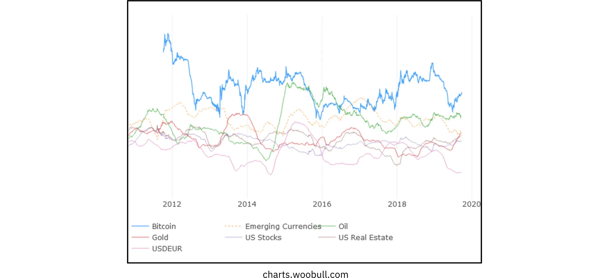

Đó là lý do tại sao điều quan trọng là **hiểu và chấp nhận tính biến động của Bitcoin** trước khi bạn đầu tư. Những biến động giá này không phải là lỗi, chúng là đặc điểm của một tài sản vẫn đang trong quá trình trưởng thành. Nếu những thăng trầm đột ngột khiến bạn mất ngủ hoặc đẩy bạn vào những quyết định mang tính cảm tính, thì khả năng là bạn đã đầu tư nhiều hơn mức bạn có thể chấp nhận rủi ro. Trong trường hợp đó, hãy lùi lại một bước và đánh giá lại chiến lược và khả năng chịu rủi ro của bạn. Đừng ngần ngại thu hẹp vị thế của bạn cho đến khi bạn cảm thấy thoải mái hơn.

Trên hết, đừng bao giờ đầu tư nhiều hơn số tiền bạn có thể mất. Tránh vay tiền để mua Bitcoin (đặc biệt là nếu bạn vẫn đang học những điều cơ bản). Một nền tảng vững chắc bắt đầu bằng những bước đi được tính toán, chứ không phải những vụ cá cược liều lĩnh.

### Quản lý và bảo mật Bitcoin Wallet của bạn

Một trong những tính năng mạnh mẽ nhất (và thường bị đánh giá thấp) của Bitcoin là **tự lưu giữ**. Với Wallet tự lưu trữ, bạn là người duy nhất chịu trách nhiệm về tiền của mình. Những ví này thường được tạo từ một **cụm từ khôi phục** (còn được gọi là cụm từ seed), một chuỗi gồm 12 hoặc 24 từ cấp quyền truy cập đầy đủ vào BTC của bạn. Nếu bạn mất cụm từ này (hoặc nếu người khác nắm giữ nó), bitcoin của bạn sẽ biến mất vĩnh viễn. **Không có hỗ trợ khách hàng. Không có nút đặt lại.**

Đó là lý do tại sao quy tắc vàng trong Bitcoin là:

"***Không phải chìa khóa của bạn, không phải tiền của bạn***". Nếu bạn không tự mình kiểm soát khóa riêng của mình, bạn không thực sự sở hữu Bitcoin của mình. Mặc dù các sàn giao dịch có thể thuận tiện (đặc biệt là khi mới bắt đầu) nhưng họ giữ chìa khóa của bạn cho bạn. Điều đó có nghĩa là tiền của bạn sẽ gặp rủi ro nếu nền tảng bị hack, đóng băng tài khoản của bạn hoặc phá sản.

Để tránh rủi ro này, chúng tôi khuyến cáo bạn nên thiết lập **Wallet** của riêng bạn, nơi chỉ bạn mới có quyền truy cập vào cụm từ khôi phục. Cụm từ này phải luôn được viết tay và lưu trữ **ngoại tuyến** ở một vị trí an toàn. Một số người dùng thậm chí **duy trì nhiều bản sao lưu**, được lưu trữ ở các vị trí địa lý riêng biệt để tăng thêm tính bảo mật.

**Không bao giờ lưu trữ cụm từ khôi phục của bạn trên thiết bị được kết nối internet hoặc trên đám mây**.

**Chỉ một lần hack hoặc vi phạm dữ liệu cũng có thể dẫn đến mất mát không thể khắc phục được.**

Nếu bạn đã sẵn sàng thực hiện Ownership trong Bitcoin và muốn tìm hiểu sâu hơn về các biện pháp thực hành tốt nhất để bảo mật cụm từ khôi phục của mình, tôi thực sự khuyên bạn nên xem bài viết này:

https://planb.network/tutorials/wallet/backup/backup-mnemonic-22c0ddfa-fb9f-4e3a-96f9-46e2a7954270

### Tính bảo mật và sự kín đáo

Trong thế giới kỹ thuật số ngày nay, **sự thận trọng thường bị bỏ qua**; nhưng đó là một phần quan trọng để giữ an toàn, đặc biệt là khi nói đến Bitcoin. Bạn càng nói cởi mở về tài sản của mình, bạn càng có nhiều khả năng trở thành mục tiêu của những kẻ lừa đảo, tội phạm mạng hoặc thậm chí là các mối đe dọa truyền thống hơn như tống tiền hoặc tống tiền.

Đã có rất nhiều trường hợp trên khắp thế giới mà những cá nhân nắm giữ số lượng lớn BTC đã bị bắt cóc hoặc tấn công.

**Tránh khoe khoang về Bitcoin Stash của bạn**; dù là trên mạng xã hội hay thậm chí trong các cuộc trò chuyện thông thường. Việc tiết lộ thông tin tài chính nhạy cảm không có lợi ích gì và rủi ro là có thật.

Cũng khôn ngoan khi **phân chia hoạt động trực tuyến của bạn**. Ví dụ:

- Sử dụng email Address riêng cho mọi thông tin liên quan đến Bitcoin, tách biệt với tài khoản cá nhân hoặc công việc của bạn.
- Hãy thận trọng với các nỗ lực lừa đảo, liên kết đáng ngờ và các trang web giả mạo bắt chước các nền tảng đáng tin cậy.
- Hãy cảnh giác! Sự thận trọng và cảnh giác thường là biện pháp phòng thủ tốt nhất của bạn.

Nếu bạn đã sẵn sàng tìm hiểu sâu hơn về chủ đề quyền riêng tư Bitcoin, chúng tôi khuyên bạn nên tiếp tục với Khóa học quyền riêng tư năm 2 của chúng tôi, nơi bạn sẽ tìm hiểu các kỹ thuật nâng cao hơn để giữ an toàn cho danh tính và hoạt động của mình:

https://planb.network/courses/65c138b0-4161-4958-bbe3-c12916bc959c

### Ý nghĩa về thuế

Mặc dù là một loại tiền tệ phi tập trung, **Bitcoin không được miễn trừ khỏi luật và quy định về thuế** của quốc gia bạn. Mỗi khu vực pháp lý có cách tiếp cận riêng về cách đánh thuế thu nhập từ tiền điện tử.

Ở một số nơi, lợi nhuận được đánh thuế như thu nhập từ vốn khi bán. Những nơi khác có thể yêu cầu bạn khai báo mọi giao dịch và một số nơi áp dụng các quy tắc ít phổ biến hơn, chẳng hạn như thuế tài sản hoặc đóng góp xã hội.

Trước khi thực hiện bất kỳ giao dịch quan trọng nào, bạn nên tham khảo ý kiến của chuyên gia thuế hoặc xem lại hướng dẫn chính thức của chính phủ. Dành thời gian để hiểu trước nghĩa vụ thuế của bạn có thể giúp bạn tránh khỏi các vấn đề bất ngờ sau này (như tiền phạt, kiểm toán hoặc hình phạt), đặc biệt là nếu bạn đang lập kế hoạch bán hàng lớn hoặc phân bổ lại danh mục đầu tư.

### Sự khác biệt giữa giao dịch, đầu tư và nắm giữ

Bitcoin thường bị bao quanh bởi những quan niệm sai lầm phổ biến; một trong những quan niệm phổ biến nhất là ý tưởng rằng đây là con đường nhanh chóng để làm giàu thông qua giao dịch. Nhưng điều quan trọng là phải hiểu được sự khác biệt rõ ràng giữa giao dịch, đầu tư và nắm giữ, vì mỗi cách tiếp cận đều có tư duy, kỹ năng và mức độ rủi ro riêng.

- Giao dịch :**

Nói một cách trung thực thì: **có lẽ bạn không nên giao dịch.**

Giao dịch liên quan đến đầu cơ ngắn hạn (đôi khi có đòn bẩy) nhằm mục đích kiếm lợi nhuận từ biến động giá của Bitcoin. Mặc dù nghe có vẻ hấp dẫn, giao dịch thành công đòi hỏi kiến thức kỹ thuật nâng cao (như phân tích biểu đồ và quản lý rủi ro), kỷ luật cảm xúc và sự chú ý liên tục đến thị trường. Nó gây căng thẳng về mặt tinh thần và tốn thời gian, và sự thật của Hard là **hầu hết người mới bắt đầu đều mất tiền** vì họ đánh giá thấp mức độ đòi hỏi thực sự của nó.

Như Warren Buffett đã từng nói:

"**Nếu bạn không muốn nắm giữ một cổ phiếu trong mười năm, thì đừng nghĩ đến việc nắm giữ nó trong mười phút**."

Bitcoin không phải là chương trình làm giàu nhanh chóng.

- Sự đầu tư:**

Các nhà đầu tư có quan điểm trung hạn đến dài hạn, mua Bitcoin với niềm tin rằng giá trị của nó sẽ tăng theo thời gian (tháng, năm hoặc thậm chí là thập kỷ). Tất nhiên vẫn có rủi ro, vì giá của Bitcoin có thể dao động đáng kể. Nhưng cách tiếp cận này thường bình tĩnh hơn và thực tế hơn nhiều đối với hầu hết mọi người, đặc biệt là những người không muốn dành hàng giờ dán mắt vào biểu đồ mỗi ngày.

- Giữ (HODL) :**

"HODL" ban đầu là lỗi đánh máy của "hold" và nhanh chóng trở thành một phần của văn hóa Bitcoin. Ngày nay, nó là một huy hiệu danh dự.

Những người nắm giữ tham gia vào trò chơi này trong thời gian rất dài; đôi khi là mười năm hoặc hơn. Họ lưu trữ Bitcoin của mình một cách an toàn và chỉ đơn giản là chờ đợi, được thúc đẩy bởi niềm tin mạnh mẽ vào tiềm năng dài hạn của Bitcoin. Họ không nao núng trước những biến động giá hàng ngày hoặc thị trường giá xuống. Tư duy của họ rất đơn giản: tích lũy, bảo mật và ngồi im.

|          | Trading | Investment | Holding |
| ---------------------- | ----------- | -------------- | --------------- |
| Leverage | Yes  | No | No |
| Timeframe | Short-term | Medium-term | Very long-term |
| Asset Type | Contracts | Actual BTC | Actual BTC |
| Risk Level | Very high | High | High |
| Difficulty | Very Hard | Hard | Hard |
| learning curve | Long learning curve | Long learning curve | Long learning curve |
| Potential Loss | UnLimited | Limited | Limited |
| Best For | A few experienced users | Most People | Long-term Believers |

### Tiếp tục học tập

Không bao giờ là quá sớm (hay quá muộn) để bắt đầu tìm hiểu về tiền bạc, đầu tư và cách thức hoạt động thực sự của hệ thống tài chính. Bạn không cần phải trở thành chuyên gia hay đào sâu vào mọi chi tiết kỹ thuật; có hiểu biết vững chắc, toàn diện là đủ để đưa ra quyết định sáng suốt và tránh bị đánh lừa bởi các sản phẩm tài chính không phục vụ cho lợi ích của bạn (thường được các ngân hàng hoặc cố vấn quảng bá).

Một điểm khởi đầu tuyệt vời là cuốn sách *Cha giàu, cha nghèo* của Robert T. Kiyosaki. Cuốn sách này được biết đến rộng rãi vì phong cách dễ hiểu và những bài học nền tảng; như hiểu được sự khác biệt giữa tài sản và nợ phải trả, và tại sao giáo dục tài chính lại là chìa khóa cho sự độc lập lâu dài.

Nếu bạn đã sẵn sàng để đi sâu hơn, các podcast như *The Investors Podcast* cung cấp các cuộc thảo luận sâu sắc về đầu tư, thị trường và các nguyên tắc kinh tế. Thỉnh thoảng họ cũng đề cập đến Bitcoin, khiến đây trở thành bước tiếp theo vững chắc cho những ai tò mò muốn hiểu Bitcoin phù hợp với bối cảnh tài chính rộng lớn hơn như thế nào.

### Những quy tắc vàng cần ghi nhớ

Để kết thúc, đây là một số nguyên tắc vượt thời gian mà mọi người chơi Bitcoin (đặc biệt là người mới bắt đầu) nên ghi nhớ:

- Quy tắc số 1**: Không bao giờ đầu tư nhiều hơn số tiền bạn có thể mất. Bitcoin là một tài sản biến động. Đừng mạo hiểm sự ổn định tài chính của bạn để theo đuổi lợi nhuận. Nhu cầu thiết yếu và sự an tâm của bạn luôn phải được đặt lên hàng đầu.
- Quy tắc số 2**: Đừng mù quáng nghe theo những lời quảng cáo thổi phồng hay tin vào lời khuyên kỳ diệu. Bỏ qua các xu hướng và lời hứa hào nhoáng. Thay vào đó, hãy tập trung vào việc đưa ra những quyết định sáng suốt, hợp lý. Khi còn nghi ngờ, hãy ngủ một giấc; hãy nói chuyện với những người bạn tin tưởng. Tốt hơn là hành động chậm rãi và chu đáo hơn là vội vã mắc phải những sai lầm tốn kém.
- Nguyên tắc số 3**: Xây dựng kế hoạch và bám sát tầm nhìn dài hạn.

Sự nhất quán, kiên nhẫn và kỷ luật sẽ đưa bạn đi xa hơn sự phấn khích ngắn hạn. Đừng nhắm đến những cú bắn lên mặt trăng; hãy nhắm đến sự tăng trưởng bền vững. Tránh những sai lầm chết người và để những chiến thắng nhỏ tích lũy theo thời gian.

Bằng cách tuân theo các nguyên tắc này, bạn sẽ có thể tiếp cận đầu tư Bitcoin với sự rõ ràng và bình yên hơn. Đúng vậy, Bitcoin rất dễ biến động và có thể gây sợ hãi lúc đầu; nhưng khi tiếp cận một cách thận trọng, kiên nhẫn và có tư duy thực tế, nó có tiềm năng không thể phủ nhận. Hãy dành thời gian để xây dựng kiến thức, xem xét lại chiến lược của bạn khi cần và trên hết, hãy nhớ rằng: tiến trình chậm và ổn định sẽ luôn có lợi cho bạn hơn là vội vã vì sợ hãi hoặc thiếu kiên nhẫn.

# Hiểu được những gì bạn đang nhận được vào

<partId>a42355a3-9dd8-57ed-b590-32a333fe09ea</partId>

## Bitcoin trong 5 phút

<chapterId>ae122ad9-9b4d-5229-9038-e1b99d5cfc83</chapterId>

:::ID video=3c2d1e4f-5a6b-7c8d-9e0f-1a2b3c4d5e6f:::

Trong khóa học này, mục tiêu chính là hướng dẫn bạn cách mua và bảo mật những bitcoin đầu tiên của mình. Nhưng trước khi đi sâu vào các bước thực tế (cách mua BTC, ví nào nên sử dụng, v.v.), điều quan trọng là phải lùi lại một bước và hiểu Bitcoin thực sự là gì. Việc nắm bắt bản chất sâu sắc hơn của Bitcoin sẽ giúp bạn hiểu lý do tại sao hàng triệu người đang chuyển sang công nghệ này và tại sao việc hiểu các nguyên tắc cơ bản lại rất quan trọng trước khi đầu tư tiền tiết kiệm của bạn vào một tài sản mới và dễ biến động như vậy.

Trong nhiều năm qua, Bitcoin đã được công nhận là một mạng lưới tiền tệ toàn cầu. Nó được gọi là "vàng kỹ thuật số", "giao thức tin cậy" và thậm chí là "hệ thống tài chính song song". Nhưng những thuật ngữ đó thực sự có nghĩa là gì? Để trả lời câu hỏi đó, chúng ta sẽ xem xét kỹ hơn cốt lõi của Bitcoin: câu chuyện về nguồn gốc, nền tảng kỹ thuật, đặc tính tiền tệ và tác động tiềm tàng của nó; không chỉ đối với cá nhân mà còn đối với toàn bộ hệ thống tài chính toàn cầu.

### Nguồn gốc: Một dự án ra đời từ một cuộc tìm kiếm lâu dài

#### Cypherpunks và việc phát minh ra một hệ thống vượt ra ngoài tầm kiểm soát của ngân hàng

Bitcoin không phải sinh ra trong một đêm. Nó là kết quả của nhiều thập kỷ nghiên cứu và thử nghiệm về mật mã, khoa học máy tính và lý thuyết tiền tệ. Trước khi ra mắt vào năm 2009, một số dự án (như eCash, b-money, Bit Gold và RPOW) đã cố gắng tạo ra các loại tiền kỹ thuật số. Tất cả đều phải đối mặt với cùng một vấn đề cốt lõi: làm thế nào để ngăn chặn chi tiêu gấp đôi trong một hệ thống phi tập trung mà không cần dựa vào một cơ quan trung ương.

Thách thức đó vẫn chưa được giải quyết cho đến cuối năm 2008, khi một người sử dụng tên Satoshi Nakamoto công bố sách trắng Bitcoin. Vài tháng sau, phiên bản đầu tiên của phần mềm nguồn mở Bitcoin đã ra mắt, khởi chạy một hệ thống có thể hoạt động độc lập với các ngân hàng hoặc chính phủ.

Dự án chịu ảnh hưởng lớn từ tinh thần Cypherpunk; một cộng đồng các nhà phát triển và nhà tư tưởng tin tưởng vào việc sử dụng mật mã để bảo vệ quyền tự do cá nhân trực tuyến. Đối với họ, quyền riêng tư và phi tập trung không phải là sở thích kỹ thuật mà là nhu cầu về mặt ý thức hệ. Bitcoin nổi lên như hiện thân thành công nhất của những lý tưởng đó: một mạng lưới tiền tệ ngang hàng mà bất kỳ ai cũng có thể sử dụng, không ai có thể kiểm soát và mọi người đều có thể xác minh.

Cypherpunks là một cộng đồng quốc tế phi chính thức gồm những cá nhân ủng hộ việc sử dụng mật mã để bảo vệ quyền tự do cá nhân trực tuyến. Họ tin tưởng mạnh mẽ vào quyền riêng tư của cá nhân; đặc biệt là trong một thế giới ngày càng bị định hình bởi sự giám sát của chính phủ và khai thác dữ liệu của công ty.

Nguồn gốc của phong trào Cypherpunk bắt nguồn từ đầu những năm 1990, khi các nhóm mật mã học, lập trình viên và những người theo chủ nghĩa tự do bắt đầu khám phá những hàm ý chính trị của mật mã học trong các cuộc gặp gỡ ở Thung lũng Silicon. Một trong những tiếng nói nổi bật nhất trong cộng đồng là Tim May, người đã biên soạn Bản tuyên ngôn Crypto Anarchist năm 1988; một văn bản nền tảng phác thảo tầm nhìn về một thế giới mà mã hóa sẽ trao quyền cho các cá nhân hoạt động ngoài tầm với của chính phủ và sự kiểm soát tập trung.

Một cột mốc quan trọng trong phong trào này là vào năm 1992 với việc tạo ra danh sách gửi thư Cypherpunks, một diễn đàn nơi các ý tưởng, dự án và thảo luận chính trị về quyền riêng tư và mật mã có thể phát triển mạnh mẽ. Sau đó, vào năm 1993, Eric Hughes đã công bố Tuyên ngôn của Cypherpunk, một tuyên bố ngắn gọn nhưng mạnh mẽ thể hiện rõ ràng sứ mệnh và niềm tin của cộng đồng.

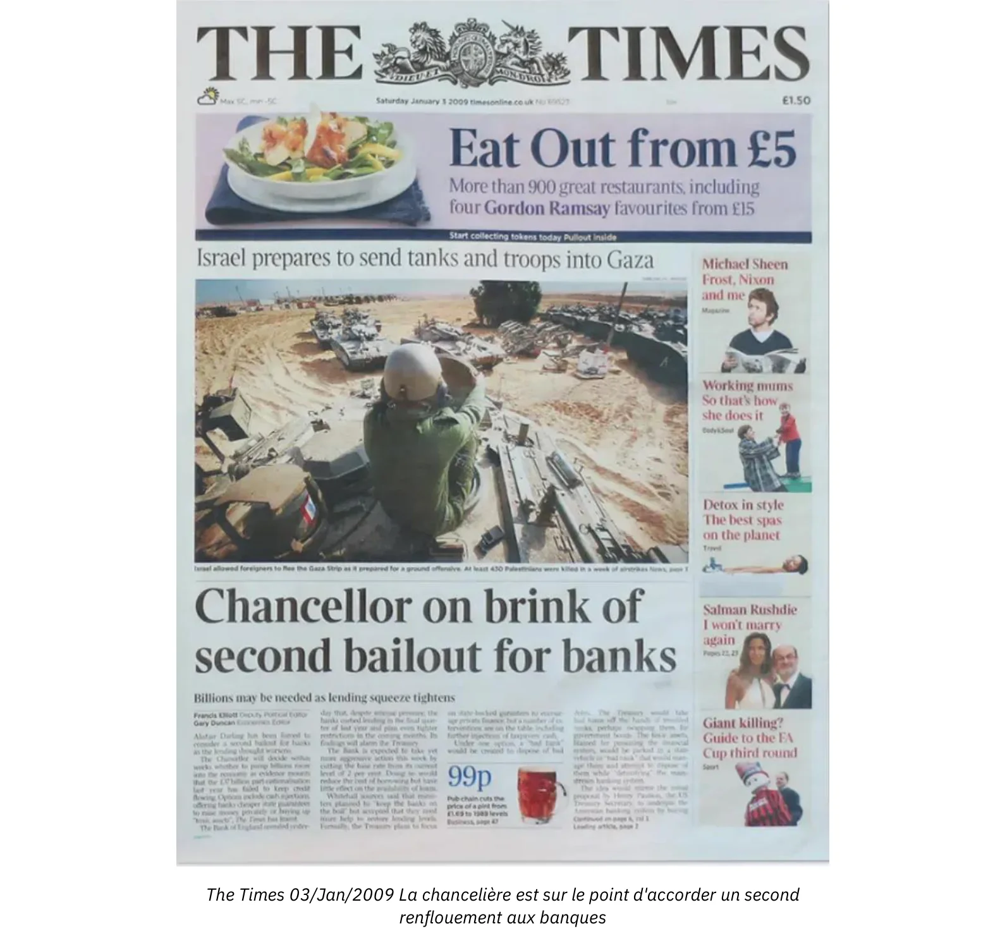

Ý tưởng về một loại tiền kỹ thuật số hoạt động độc lập với bất kỳ cơ quan trung ương nào (như Bitcoin) bắt nguồn sâu xa từ triết lý của Cypherpunk.

#### Khoảnh khắc hậu khủng hoảng tài chính

Bitcoin không phải tự nhiên xuất hiện. Nó được tạo ra vào một thời điểm rất cụ thể—ngay sau cuộc khủng hoảng tài chính toàn cầu năm 2008. Sự sụp đổ của thị trường nhà ở Hoa Kỳ và cuộc khủng hoảng cho vay dưới chuẩn đã khiến các ngân hàng lớn phá sản và làm lung lay lòng tin của mọi người vào toàn bộ hệ thống tài chính.

Trong môi trường sợ hãi và bất định này, Bitcoin đã ra đời. Người sáng tạo, được biết đến với cái tên Satoshi Nakamoto, đã đưa vào một thông điệp mang tính biểu tượng rất cao trong khối đầu tiên của Bitcoin Blockchain, được gọi là khối Genesis. Thông điệp đó là:

> **"The Times 03/01/2009 Bộ trưởng Tài chính sắp đưa ra gói cứu trợ thứ hai cho các ngân hàng"**

Đây không chỉ là một ngày tháng hay một lưu ý kỹ thuật; đó là một cuộc phản đối lặng lẽ nhưng mạnh mẽ. Nó cho thấy Bitcoin được thiết kế để trở thành một thứ gì đó hoàn toàn khác biệt: một hệ thống tài chính không phụ thuộc vào các ngân hàng, cứu trợ hoặc quyết định của chính phủ.

Nhiều người cho rằng đây là mục tiêu của Bitcoin: cung cấp một phương thức chuyển giao giá trị mà không cần đến trung gian, được kiểm soát bằng các quy tắc rõ ràng thay vì các quyết định thường không rõ ràng của các ngân hàng trung ương hoặc chính phủ.

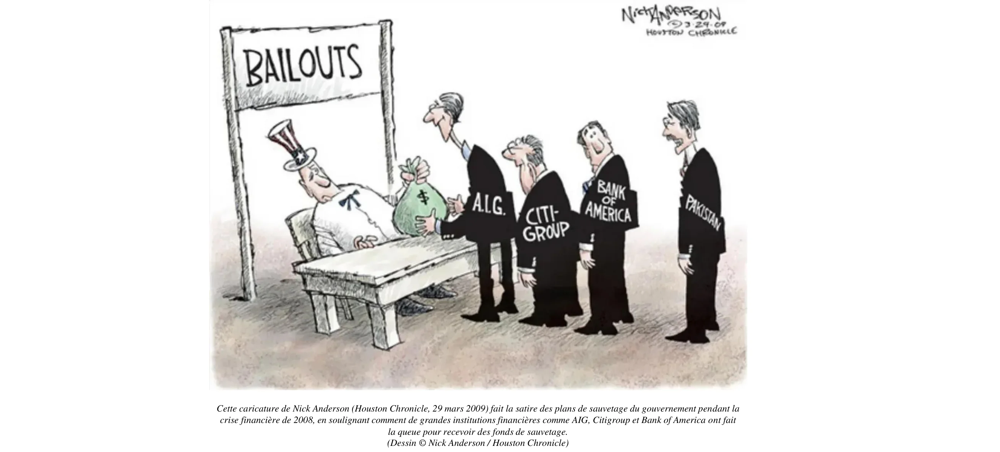

Để hiểu sâu hơn về nguồn gốc của Bitcoin, chúng tôi cung cấp khóa đào tạo miễn phí, toàn diện và có tài liệu đầy đủ về chủ đề này:

https://planb.network/courses/a51c7ceb-e079-4ac3-bf69-6700b985a082

### Một mạng lưới phi tập trung để chuyển giao giá trị

#### Ngang hàng và không có cơ quan trung ương

Bitcoin được định nghĩa là "hệ thống tiền điện tử ngang hàng". Điều này có nghĩa là bất kỳ ai cũng có thể kết nối với mạng bằng phần mềm phù hợp (một nút Bitcoin) và tương tác trực tiếp với những người dùng khác mà không cần dựa vào máy chủ trung tâm. Mục tiêu của sự phân cấp này là ngăn chặn bất kỳ thực thể đơn lẻ nào (như ngân hàng, chính phủ hoặc tập đoàn lớn) kiểm soát, kiểm duyệt hoặc dừng hệ thống. Bitcoin hoạt động 24/7, trên toàn cầu và mọi người đều có thể truy cập mà không cần bất kỳ điều kiện nào.

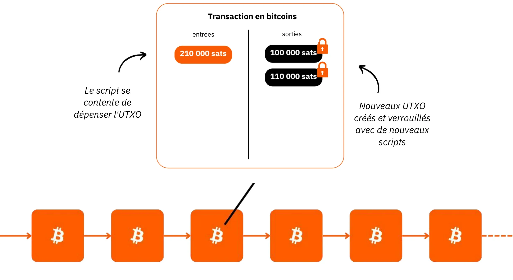

Nói một cách đơn giản, mọi người tham gia vào mạng Bitcoin (gọi là "nút") đều có một bản sao đầy đủ của giao dịch Ledger, được gọi là Blockchain. Khi một giao dịch mới xảy ra, nó sẽ được phát đến mạng. Sau đó, thợ đào xác nhận các giao dịch này bằng cách nhóm chúng thành các khối rồi thêm vào cuối chuỗi (do đó có tên là "Blockchain").

#### Blockchain: một kế toán Ledger

Hãy nghĩ về Blockchain như một Ledger kế toán khổng lồ, trong đó mỗi dòng đại diện cho một giao dịch. Trong hệ thống ngân hàng truyền thống, cơ sở dữ liệu được lưu trữ trên máy chủ của ngân hàng, có thể thực hiện thay đổi bất cứ khi nào họ muốn. Mặt khác, trong Bitcoin, **tất cả các thay đổi đều được xác thực trên toàn bộ mạng**: khi một khối giao dịch mới được thêm vào Blockchain, gần như không thể thay đổi nó sau này. Xác thực phi tập trung này làm cho Ledger của Bitcoin an toàn và minh bạch.

### Vai trò của thợ mỏ và Proof-of-Work

#### Cách tạo khối: Mining

Mining là quá trình mà máy tính (hoặc các trang trại Mining lớn) đóng góp **sức mạnh tính toán** để bảo mật lịch sử giao dịch của Bitcoin và tạo ra các khối mới. Các thợ đào cạnh tranh để giải một câu đố toán học—cụ thể là tìm ra một va chạm Hash một phần. Quá trình này đòi hỏi nhiều năng lượng và tài nguyên. Khi một Miner tìm ra một giải pháp hợp lệ, chúng sẽ phát khối đó đến mạng, mạng sẽ xác minh và chấp nhận khối đó là hợp lệ.

Như một phần thưởng, Miner nhận được bitcoin mới được tạo (gọi là trợ cấp khối) cùng với phí giao dịch từ tất cả các giao dịch có trong khối đó.

#### Halving: Giảm trợ cấp khối

Để đảm bảo tính khan hiếm của Bitcoin, trợ cấp khối được lập trình để giảm một nửa sau mỗi 210.000 khối; khoảng bốn năm một lần. Sự kiện này được gọi là "Halving". Khi Bitcoin ra mắt, thợ đào kiếm được 50 BTC cho mỗi khối. Vào năm 2025, phần thưởng đó đã giảm xuống còn 3,125 BTC và sẽ tiếp tục giảm theo thời gian.

Cuối cùng, vào khoảng năm 2140, trợ cấp sẽ đạt mức 0, vì tổng số Bitcoin Supply sẽ đạt mức tối đa là 21 triệu đồng. Đường cong phát hành có thể dự đoán này mô phỏng sự khan hiếm của các hàng hóa vật chất như vàng; một lý do khiến Bitcoin thường được gọi là **vàng kỹ thuật số**.

### Bitcoin Thuộc tính tiền tệ

#### Sự khan hiếm và chính sách tiền tệ cố định

Một trong những tính năng mạnh mẽ nhất của Bitcoin là *chính sách tiền tệ có thể dự đoán và không thể thay đổi*. Không giống như các loại tiền tệ fiat truyền thống (như đô la, euro hoặc yên), có thể được các ngân hàng trung ương in theo ý muốn (thường dẫn đến lạm phát hoặc biến dạng kinh tế), Bitcoin hoạt động theo một bộ quy tắc minh bạch được nhúng trong mã của nó.

Sẽ chỉ có 21 triệu bitcoin và tốc độ phát hành tiền mới sẽ được mọi người trong mạng lưới biết trước.

Không có chính phủ, tổ chức hoặc cá nhân nào có thể đơn phương thay đổi giới hạn Supply này hoặc các quy tắc phân phối. Cách duy nhất để thay đổi các thông số này là thay đổi giao thức Bitcoin; và ngay cả điều đó cũng cần có sự đồng thuận từ phần lớn những người tham gia kinh tế của mạng lưới.

Sự khan hiếm cố hữu này là một sức hút lớn đối với những người muốn từ bỏ các chính sách tiền tệ khó lường hoặc tránh sự xói mòn dần dần sức mua của họ thông qua lạm phát. Theo thời gian, điều này có thể đại diện cho sự thay đổi trong tư duy tài chính, khi việc tiết kiệm bằng một tài sản giảm phát như Bitcoin trở nên hấp dẫn hơn là dựa vào các loại tiền tệ truyền thống dễ bị lạm phát.

#### Khả năng chia và khả năng tiếp cận

Một trong những điểm mạnh bị đánh giá thấp nhất của Bitcoin là khả năng chia nhỏ. Mỗi Bitcoin có thể được chia nhỏ thành 100 triệu đơn vị, được gọi là satoshi (hay gọi tắt là Sats). Điều này có nghĩa là bạn không cần phải chi hàng chục nghìn euro hoặc đô la để bắt đầu; bạn có thể mua Bitcoin chỉ với vài euro, chia thành từng phần nhỏ.

### Sự cởi mở và minh bạch

#### Một giao thức công khai, có thể xác minh được bởi tất cả

Bitcoin chạy trên giao thức **mã nguồn mở** công khai (đáng chú ý nhất là thông qua [Bitcoin Core](https://github.com/Bitcoin/Bitcoin)). Điều này có nghĩa là mã của nó được cung cấp miễn phí cho bất kỳ ai để kiểm tra, kiểm toán và cải thiện. Không có cơ chế ẩn hoặc hệ thống đóng; mọi thứ về cách thức hoạt động của Bitcoin đều được công khai.

Mức độ minh bạch này khiến việc đưa backdoor hoặc thực hiện thay đổi bí mật trở nên cực kỳ khó khăn. Bất kỳ ai có kỹ năng kỹ thuật đều có thể chạy một nút, đóng góp vào quá trình phát triển hoặc xây dựng các công cụ tương thích. Trong Bitcoin, sự tin tưởng được tạo ra thông qua mã và sự đồng thuận, không phải thông qua kiểm soát tập trung.

Tính minh bạch này là một trong những lý do chính khiến mọi người tin tưởng giao thức Bitcoin; nó ngăn chặn một nhóm nhỏ các nhà phát triển thao túng mạng để trục lợi. Bitcoin hoạt động theo một nguyên tắc đơn giản nhưng mạnh mẽ: nếu bạn không đồng ý với những thay đổi được đề xuất, bạn có quyền không cập nhật phần mềm của mình. Trong một số trường hợp, điều này sẽ không gây ra bất kỳ sự gián đoạn nào; bạn vẫn sẽ đồng bộ với phần còn lại của mạng. Nhưng trong những trường hợp khác, điều này có thể dẫn đến cái được gọi là Hard Fork, khi mạng chia thành hai và một phiên bản mới của Bitcoin được tạo ra. Đó chính xác là những gì đã xảy ra vào năm 2017 với sự chia tách giữa Bitcoin (BTC) và Bitcoin Cash (BCH).

Mặc dù loại quản trị này có thể chậm và đôi khi lộn xộn, nhưng nó cũng là một thế mạnh; nó đảm bảo rằng không một thực thể đơn lẻ nào có thể đơn phương nắm quyền kiểm soát, giúp Bitcoin duy trì sự ổn định, trung lập và chống lại sự tập trung hóa.

#### Xác thực cá nhân: các nút

Bitcoin cho phép bất kỳ ai kiểm tra độ chính xác của Blockchain bằng cách chạy "node" trên máy tính hoặc máy chủ của họ. Điều này có nghĩa là tải xuống phần mềm Bitcoin Core (hoặc phiên bản khác của giao thức Bitcoin) và xác minh tất cả các giao dịch và khối kể từ năm 2009. Sau khi node của bạn được thiết lập và đồng bộ hóa, nó sẽ trở thành bản sao đầy đủ của Blockchain và giúp hỗ trợ mạng.

Mặc dù cách tiếp cận này mang tính kỹ thuật hơn, nhưng nó cung cấp cho những người dùng khó tính nhất khả năng từ chối tin tưởng bên thứ ba. Việc chạy một nút đảm bảo rằng người dùng có thể tham gia vào quá trình đồng thuận và không bị kiểm duyệt, góp phần trực tiếp vào tính bảo mật và phi tập trung của mạng.

### Các trường hợp sử dụng

#### Một phương thức thanh toán xuyên biên giới linh hoạt

Do tính chất phi tập trung, Bitcoin hoạt động 24/7, không bị ảnh hưởng bởi biên giới hoặc múi giờ. Ở những khu vực thiếu cơ sở hạ tầng ngân hàng truyền thống, Bitcoin thường được sử dụng như một giải pháp nhanh chóng, chi phí thấp để gửi hoặc nhận tiền mà không cần dựa vào các trung gian đắt tiền. Mặc dù phí giao dịch có thể thay đổi tùy theo tình trạng tắc nghẽn mạng, nhưng nhìn chung, chúng thấp hơn nhiều so với phí mà các ngân hàng tính cho các giao dịch chuyển tiền quốc tế. Ngoài ra, các giải pháp Layer-2 như Lightning Network cho phép các giao dịch Bitcoin thậm chí còn nhanh hơn và rẻ hơn.

#### Một kho lưu trữ giá trị

Do tính khan hiếm (giới hạn ở mức 21 triệu BTC) và khả năng phục hồi vốn có, Bitcoin thường được coi là biện pháp bảo vệ tiết kiệm dài hạn. Mặc dù giá của nó có thể biến động trong ngắn hạn, nhưng Bitcoin nhìn chung đã theo xu hướng tăng trong nhiều năm kể từ khi thành lập. Một số nhà đầu tư mua BTC với niềm tin rằng nó có thể đóng vai trò là kho lưu trữ giá trị, đặc biệt là khi đối mặt với lạm phát hoặc khủng hoảng tài chính.

#### Một công cụ cho sự tự do và khả năng phục hồi tài chính

Ngoài đầu tư, Bitcoin còn cung cấp một cách để bảo vệ chủ quyền tài chính. Ở các quốc gia theo chế độ độc tài hoặc phải đối mặt với các hạn chế tiền tệ nghiêm ngặt, việc sở hữu Bitcoin Wallet (có khóa riêng) sẽ mang lại một hình thức tự do. Không ai có thể chặn hoặc tịch thu những BTC này, miễn là người nắm giữ bảo đảm cụm từ khôi phục của họ.

Đặc điểm này đặc biệt hấp dẫn đối với những người sợ kiểm duyệt hoặc đóng băng tài khoản ngân hàng. Nó cũng gây được tiếng vang với những người dân đang phải chịu đựng tình trạng siêu lạm phát, như đã thấy ở Venezuela hoặc Zimbabwe, nơi nắm giữ BTC tỏ ra ổn định hơn so với việc giữ tiền tệ địa phương, vốn đang mất giá nhanh chóng.

### Một chặng đường dài để đi

Bitcoin có thể được coi là "Zero to One": một sự phá vỡ triệt để các mô hình tài chính đã được thiết lập. Lần đầu tiên trong lịch sử, một mạng lưới tiền tệ toàn cầu, có thể tiếp cận được với tất cả mọi người, hoạt động mà không cần một cơ quan trung ương, cho phép các giao dịch riêng tư và chống kiểm duyệt.

Tuy nhiên, sau hơn một thập kỷ tồn tại, Bitcoin vẫn tiếp tục gây ra nhiều cuộc tranh luận và đam mê. Việc áp dụng nó đang ngày càng tăng, các giải pháp Layer thứ hai (như Lightning Network) đang nổi lên để cải thiện tốc độ giao dịch và giảm phí, và các doanh nghiệp trên toàn thế giới đang thử nghiệm các trường hợp sử dụng mới. Có khả năng Bitcoin sẽ tiếp tục ảnh hưởng đến các hệ thống thanh toán và thậm chí cả cách chúng ta nhận thức về tiền trong nhiều thập kỷ tới.

Nếu bạn muốn mở rộng kiến thức hơn nữa, bạn có thể tham gia khóa học BTC101 về Plan ₿ Network, khóa học này cung cấp kiến thức chuyên sâu hơn về các nguyên tắc cơ bản về kỹ thuật và kinh tế của Bitcoin.

https://planb.network/courses/2b7dc507-81e3-4b70-88e6-41ed44239966

Sau phần giới thiệu về Bitcoin này (có thể mất nhiều hơn 5 phút một chút!), giờ đây bạn đã được trang bị tốt hơn để cân nhắc mua và bảo mật bitcoin. Trong các chương tiếp theo của khóa học, chúng ta sẽ đi sâu hơn vào tầm quan trọng của Bitcoin, hoạt động của ngành công nghiệp này và sự phát triển của các lớp khác nhau của nó. Tiếp theo, trong phần sắp tới, chúng ta sẽ thảo luận về cách thiết lập kế hoạch cá nhân của riêng bạn.

## Tại sao Bitcoin lại quan trọng?

<chapterId>d4327ac4-9ff8-5192-b542-cb78c0bd0aa7</chapterId>

:::video id=5f6e7d8c-9b0a-1c2d-3e4f-5a6b7c8d9e0f:::

Tại sao Bitcoin lại quan trọng như vậy? Đó là câu hỏi chính của khóa học này. Cho dù liên quan đến việc học hay chiến lược đầu tư của bạn, nếu không hiểu rõ tầm quan trọng của Bitcoin, bạn sẽ có nguy cơ đi chệch khỏi kế hoạch của mình. Mục tiêu là luôn ghi nhớ các nguyên tắc cơ bản của Bitcoin để đảm bảo rằng chiến lược của bạn vẫn phù hợp với niềm tin của mình.

### Một loại tiền tệ phổ quát

Barack Obama đã từng gọi Bitcoin là "ngân hàng Thụy Sĩ trong túi của bạn" và có lý do chính đáng. Bitcoin cung cấp các cơ hội như nhau cho tất cả mọi người, bất kể họ là ai. Cho dù bạn là một thiếu niên, một tổng thống, một người biểu tình ở Hồng Kông hay một "Áo vàng" ở Pháp, mọi người đều có quyền truy cập bình đẳng vào cùng một giao thức và công cụ:

- Tạo ví miễn phí và không giới hạn (với Bitcoin, chúng ta không thực sự nói về "tài khoản" mà là "ví").
- Gửi tiền tới bất kỳ đâu, cho bất kỳ ai.
- Không cần phải xác minh danh tính hay bất kỳ thủ tục hành chính nào.
- Có thể truy cập cho tất cả mọi người, bất kể tuổi tác, giới tính, tôn giáo, quốc gia hoặc mức thu nhập.
- Quyền riêng tư và minh bạch được đảm bảo theo quyết định của bạn.
- Không có trung gian hoặc phí ẩn.
- Bitcoin là phần mềm gốc trên Internet, nghĩa là bất kỳ ai có quyền truy cập web đều có thể sử dụng.

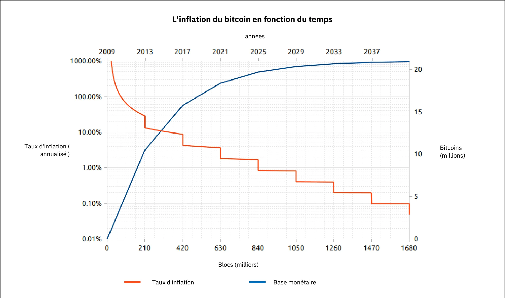

Bitcoin có thể được coi là "tiền tệ của nhân dân" thực sự, một hệ thống tiền tệ thay thế không phụ thuộc vào bất kỳ cơ quan trung ương nào và dựa trên các quy tắc bất biến thay vì các quyết định tùy ý. Bản chất cởi mở và dễ tiếp cận của nó khiến nó trở thành một công cụ có khả năng mang tính cách mạng đối với hàng tỷ người trên toàn thế giới, cho dù họ bị loại khỏi hệ thống ngân hàng truyền thống hay chỉ đơn giản là tìm kiếm một giải pháp thay thế có chủ quyền hơn.

Điều này dẫn chúng ta đến một câu hỏi cơ bản, gần như mang tính triết học, chia những người đam mê Bitcoin thành hai thế giới quan chính. Một mặt, một số người coi Bitcoin là giải pháp thúc đẩy hòa nhập tài chính, cho phép hàng tỷ cá nhân không có tài khoản ngân hàng cuối cùng cũng có thể tiếp cận cơ sở hạ tầng tiền tệ toàn cầu. Mặt khác, một số người coi Bitcoin là công cụ giải phóng tài chính nhằm mục đích cung cấp một lối thoát cho hàng tỷ người đã hòa nhập vào hệ thống ngân hàng, nhưng muốn giải thoát bản thân khỏi sự phụ thuộc vào hệ thống này và giành lại toàn quyền kiểm soát tiền bạc của mình. Suy ngẫm này đáng để chúng ta chú ý và chúng ta sẽ quay lại chi tiết hơn sau.

### Bảo vệ chống lại khủng hoảng tiền tệ

Trong nhiều thế kỷ, thế giới đã trải qua các cuộc khủng hoảng tiền tệ gây ra những tác động tàn phá đối với dân số. Hàng tỷ người vẫn đang phải chịu đựng hậu quả của các chính sách tiền tệ được quản lý kém, trong đó việc thao túng tiền tệ Supply và lãi suất tạo ra sự mất cân bằng hệ thống. Những cuộc khủng hoảng này không chỉ là những sự kiện ngẫu nhiên—chúng là kết quả của một hệ thống được xây dựng dựa trên sự can thiệp và thao túng giá trị tiền tệ và thời gian.

Những cuộc khủng hoảng này có thể diễn ra dưới nhiều hình thức khác nhau. Ví dụ, siêu lạm phát sẽ xóa sổ một loại tiền tệ bằng cách dần dần phá hủy sức mua của người dân; như đã thấy ở các quốc gia như Zimbabwe và Venezuela. Mặt khác, các biện pháp kiểm soát tiền tệ nghiêm ngặt có thể hạn chế khả năng tiếp cận các quỹ và tước đi quyền tự do kinh tế của cá nhân, như đã xảy ra với các hạn chế về ngân hàng ở Hy Lạp và Lebanon.

Và cuối cùng, khi chính phủ phá giá tiền tệ quốc gia, nó sẽ dần dần làm xói mòn tiền tiết kiệm của người dân; một sự hao hụt vô hình nhưng liên tục đối với tài sản của họ. Theo nhiều cách, nó hoạt động như một loại thuế ẩn. Miễn là chính sách tiền tệ vẫn nằm trong tay các cơ quan tập trung, những chu kỳ này sẽ lặp lại.

Bitcoin đưa ra một giải pháp thay thế táo bạo cho chu kỳ bất ổn tiền tệ mãn tính này. Không giống như các loại tiền tệ do nhà nước phát hành, nó được xây dựng trên các quy tắc bất biến, dựa trên toán học được thực thi bởi sự đồng thuận; không phải bởi chính phủ hoặc ngân hàng trung ương. Việc phát hành của nó có thể dự đoán được và giới hạn ở khoảng 21 triệu đồng xu, khiến nó trở thành một hình thức tiền tệ lành mạnh được thiết kế để giữ giá trị theo thời gian. Vì nó chống lại sự kiểm duyệt, bất kỳ ai cũng có thể lưu trữ và chuyển giá trị mà không cần dựa vào một tổ chức nào. Và nhờ khả năng chia nhỏ và tính di động của nó, nó vừa dễ tiếp cận vừa thiết thực; cơ sở hạ tầng tài chính cho bất kỳ ai, ở bất kỳ đâu.

**Bạn có biết không?** Trong suốt lịch sử, đã có ít nhất 56 trường hợp siêu lạm phát được ghi nhận trên toàn thế giới. Trong nhiều trường hợp đó, toàn bộ nền kinh tế sụp đổ, tiền tiết kiệm cả đời bị xóa sổ và hàng triệu người bị đẩy vào cảnh nghèo đói cùng cực. Tệ hơn nữa, những thất bại về tiền tệ này thường đóng vai trò là bàn đạp cho sự biến động chính trị; đôi khi dẫn đến chế độ độc tài, như đã xảy ra ở Đức vào những năm 1920 và Chile vào những năm 1970.

Hanke, S. H., & Krus, N. (2013). *Siêu lạm phát thế giới*. Trong R. Parker & R. Whaples (Biên tập), Sổ tay các sự kiện lớn trong lịch sử kinh tế. Routledge Publishing. Truy xuất từ https://ssrn.com/abstract=2130109

Sự sụp đổ của các loại tiền tệ fiat không phải là một sự may rủi trong lịch sử; mà là một mô hình lặp lại. Ngày nay, Bitcoin cung cấp một lối thoát: một cơ hội duy nhất để bảo vệ tài sản của bạn bên ngoài các hệ thống tiền tệ do chính phủ kiểm soát. Tại thời điểm này, câu hỏi không phải là liệu một cuộc khủng hoảng khác có xảy ra hay không, mà là khi nào. Với Bitcoin, giờ đây bạn có tùy chọn thoát khỏi những chu kỳ phá hoại này và chọn một hệ thống tiền tệ được xây dựng dựa trên tính minh bạch, khả năng dự đoán và chủ quyền cá nhân.

### Một phản ứng đối với sự kiểm soát của nhà nước và sự bất công

Bất bình đẳng kinh tế ngày càng gia tăng trên toàn thế giới luôn là mảnh đất màu mỡ cho bất ổn xã hội và sự trỗi dậy của chủ nghĩa cực đoan chính trị. Lịch sử cho thấy khi khoảng cách giữa người giàu và người nghèo trở nên quá lớn, nó thường dẫn đến căng thẳng, khủng hoảng và thậm chí là sự trỗi dậy của các chế độ độc tài. Trước những rủi ro này, việc bảo vệ quyền tự do tài chính của bạn không chỉ là một thứ xa xỉ; đó là điều cần thiết đối với bất kỳ ai muốn giữ gìn quyền tự chủ và bảo vệ tương lai của gia đình mình.

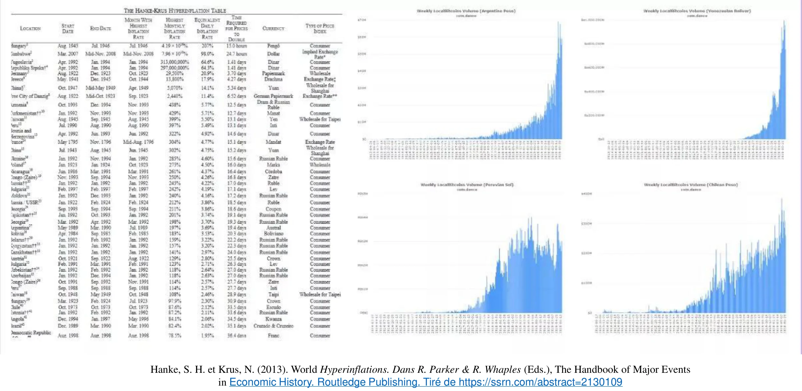

Nhưng trong một thế giới mà nhà nước có thể kiểm soát hoàn toàn tài sản và giao dịch, thì có những lựa chọn thực sự nào để bảo vệ khoản tiết kiệm của bạn?

- Tài khoản ngân hàng** có thể bị đóng băng ngay lập tức, bị tịch thu theo lệnh đơn giản của chính phủ hoặc bị rút sạch thông qua các hạn chế tiền tệ quá mức.

- Vàng**, mặc dù đã đóng vai trò là phương tiện lưu trữ giá trị trong hàng thiên niên kỷ, nhưng lại khó phân chia, bất tiện khi vận chuyển và không thực tế để sử dụng trong các tình huống khủng hoảng khẩn cấp.

- Tiền mặt**, mặc dù vô danh, nhưng cồng kềnh, dễ bị tịch thu và liên tục mất giá do lạm phát.

Nhưng Bitcoin không chỉ là một công cụ thực tế. Nó còn là **một hình thức phản đối hòa bình**; một tuyên bố độc lập khỏi hệ thống tài chính dựa trên quyền lực tùy tiện, tập trung hóa và bất bình đẳng có hệ thống. Lựa chọn Bitcoin có nghĩa là từ chối thao túng, phá giá và giám sát. Nó liên quan đến việc đòi lại **chủ quyền** của bạn, đảm bảo tương lai của bạn và bảo vệ quyền kiểm soát tài sản của chính bạn.

Theo góc nhìn này, Bitcoin không chỉ là công nghệ. Đó là công cụ của luật tự nhiên, một cách để cá nhân khẳng định các quyền cơ bản của mình, ngay cả khi những quyền đó bị luật pháp của đất nước phủ nhận. Nó trao lại quyền lực cho người dân, không phải thông qua cách mạng, mà thông qua luật lệ.

**Bạn có biết** không? Bitcoin là bí danh, không phải ẩn danh. Người dùng có thể tạo địa chỉ Wallet mà không tiết lộ danh tính thực của họ, cho phép họ gửi và nhận tiền bên ngoài hệ thống ngân hàng truyền thống.

Tuy nhiên, trái với niềm tin phổ biến, Bitcoin không cung cấp tính ẩn danh hoàn toàn. Mọi giao dịch đều được ghi lại trên Ledger công khai (Blockchain) mà bất kỳ ai cũng có thể truy cập và xác minh. Trong khi địa chỉ Wallet không được gắn với tên, hoạt động tài chính của người dùng vẫn có thể bị theo dõi và phân tích nếu không tuân thủ các biện pháp bảo mật phù hợp.

### Một giải pháp cho tham nhũng tiền tệ và ngân hàng

Các ngân hàng trung ương, thông qua các chính sách tiền tệ mở rộng của họ, liên tục làm xói mòn sức mua của bạn. Thông qua lạm phát và in tiền quá mức (thường được ngụy trang dưới dạng Nới lỏng định lượng), họ liên tục làm loãng giá trị của đồng tiền đang lưu hành. Điều này hoạt động như một loại thuế vô hình, năm này qua năm khác, làm giảm sự giàu có của những người tiết kiệm bằng tiền do chính phủ phát hành.

Trái ngược với niềm tin phổ biến rằng lạm phát là một hiện tượng kinh tế tự nhiên, trên thực tế, lạm phát là một công cụ kiểm soát tiền tệ; một công cụ dần dần làm cho dân chúng trở nên nghèo đói trong khi lại mang lại lợi ích cho những người nắm giữ tài sản tài chính.

Nếu tài sản của bạn không được bảo đảm bằng tài sản phi tiền tệ (như bất động sản, trái phiếu hoặc cổ phiếu); tiền tiết kiệm của bạn chắc chắn sẽ mất giá theo thời gian. Trong khi đó, những người có quyền tiếp cận các công cụ tài chính tiếp tục gia tăng tài sản của họ, nới rộng khoảng cách giữa giới tinh hoa kinh tế và phần còn lại của xã hội.

Đây không phải là một sai sót trong hệ thống; mà là một cơ chế cố ý. Các ngân hàng trung ương và chính phủ sử dụng nó để kích thích tăng trưởng kinh tế một cách giả tạo và thúc đẩy mọi người tiêu dùng liên tục và tăng nợ.

Hệ thống tài chính hiện đại của chúng ta được xây dựng trên một chu kỳ nợ; một chu kỳ mà việc vay mượn không chỉ được khuyến khích mà còn thực tế là không thể tránh khỏi. Cá nhân vay tiền để duy trì lối sống của họ, chỉ để thấy mình bị mắc kẹt trong một hệ thống mà họ phải trả lãi cho các ngân hàng tạo ra tiền từ hư không. Đây không phải là ngẫu nhiên; đó là một thiết kế có cấu trúc nhằm mang lại lợi ích cho các tổ chức tài chính bằng cái giá phải trả của người dân thường.

Hệ thống bị phá hoại bởi ảnh hưởng của ngân hàng trung ương và quyền lực không thể kiểm soát của họ trong việc thao túng tiền tệ Supply. **Bitcoin là giải pháp thay thế.**

Không giống như tiền tệ fiat, Bitcoin được quản lý bởi các quy tắc được thực thi bởi sự đồng thuận. Supply của nó bị giới hạn; sẽ không bao giờ có hơn 21 triệu bitcoin tồn tại (thực tế, ít hơn một chút do cách phát hành được cấu trúc). Không có chính phủ, ngân hàng trung ương hoặc tác nhân kinh tế đơn lẻ nào có thể thay đổi giới hạn này.

Điều này có nghĩa là Bitcoin hoạt động theo một khuôn khổ tiền tệ có thể dự đoán được; khuôn khổ mà lạm phát không chỉ minh bạch mà còn được thiết kế để giảm dần hoàn toàn sau khi khai thác được Bitcoin cuối cùng.

Trong quá khứ, vàng đóng vai trò là một biện pháp kiểm tra chống lại sự mở rộng tiền tệ không được kiểm soát. Nhưng kể từ khi bản vị vàng sụp đổ vào năm 1971, không có đồng tiền quốc gia nào (dù là đô la, euro hay yên) được hỗ trợ bởi một tài sản hữu hình. Sự tách biệt này đã trao cho các ngân hàng trung ương quyền tự do in tiền mà không bị hạn chế, mở đường cho nhiều thập kỷ mở rộng tiền tệ mạnh mẽ, bong bóng tài sản liên tục và các cuộc khủng hoảng tài chính tái diễn.

Khi bạn gửi tiền vào ngân hàng, số tiền đó không còn thực sự thuộc về bạn nữa.

Hầu hết mọi người không nhận ra điều này: số tiền bạn giữ trong tài khoản ngân hàng về mặt kỹ thuật không phải là tài sản của bạn. Về mặt pháp lý và thực tế, đó là khoản vay bạn đang cho ngân hàng của mình; khoản vay mà ngân hàng được tự do sử dụng cho các hoạt động và đầu tư của riêng mình.

Hệ thống này được xây dựng dựa trên lòng tin mù quáng của công chúng vào các tổ chức tài chính, nhưng nó mang lại những rủi ro nghiêm trọng:

- Nếu ngân hàng của bạn sụp đổ, tiền của bạn có thể biến mất.** Ngay cả với các chương trình bảo hiểm tiền gửi, lịch sử đã chỉ ra rằng các biện pháp bảo đảm này có thể thất bại trong các cuộc khủng hoảng hệ thống.
- Nếu ngân hàng của bạn hạn chế quyền truy cập vào tiền của bạn, bạn có thể không thể rút hoặc sử dụng tiền của mình**. Điều này đã xảy ra nhiều lần; trong thời kỳ suy thoái kinh tế ở Hy Lạp, Lebanon và Argentina, hoặc trong bối cảnh đàn áp chính trị như các cuộc biểu tình của tài xế xe tải ở Canada.

Bitcoin cung cấp một chế độ hoàn toàn khác; cởi mở, trung lập và không thể bị phá hoại. Các quy tắc của nó được mã hóa cứng bằng sự đồng thuận và áp dụng như nhau cho tất cả những người tham gia mạng.

Đây chính là nơi mà nguyên tắc cốt lõi được đưa ra:

**"Không phải chìa khóa, không phải Bitcoin của bạn."**

Nếu bạn không kiểm soát được khóa riêng tư của bitcoin, thì bạn không thực sự sở hữu chúng. Chúng nằm trong tay của bên thứ ba; giống như tiền pháp định trong ngân hàng. Nhưng nếu bạn giữ khóa riêng tư của mình, bạn và chỉ mình bạn có toàn quyền kiểm soát tiền của mình. Không có tổ chức, chính phủ hay cơ quan nào có thể đóng băng, tịch thu hoặc hạn chế quyền truy cập của bạn.

Đây chính là điều khiến Bitcoin trở thành giải pháp thay thế mạnh mẽ cho những điểm yếu và sự lạm quyền của hệ thống tài chính truyền thống: chủ quyền tiền tệ.

### Bitcoin: Một phong trào chính trị?

Bitcoin định hình lại cán cân quyền lực giữa cá nhân và các tổ chức tài chính. Nó trao quyền cho bất kỳ ai để kiểm soát hoàn toàn tiền của họ, bảo vệ tiền tiết kiệm của họ khỏi lạm phát và thoát khỏi các hạn chế tiền tệ do các quốc gia áp đặt. Là một hệ thống mở và không biên giới, Bitcoin cung cấp một giải pháp thay thế công bằng hơn; có thể tiếp cận được với tất cả mọi người, bất kể địa vị xã hội, quốc tịch hoặc nguồn gốc.

Chấp nhận Bitcoin là lựa chọn đồng tiền lành mạnh. Đó là sự từ chối chỉ là một bánh răng khác trong cỗ máy lạm phát, nợ nần của hệ thống tài chính hiện tại. Đó là hành động của chủ quyền cá nhân và sự phản kháng hòa bình chống lại nạn tham nhũng tiền tệ và sự xói mòn của cải.

Những người dùng Bitcoin đến từ mọi tầng lớp xã hội, nhưng họ có chung một tầm nhìn: một thế giới mà chủ quyền tiền tệ nằm trong tay cá nhân, không phải các tổ chức. Trong số đó có:

- Cypherpunks**, những người ủng hộ quyền riêng tư và phản đối việc giám sát;
- Công dân bị áp bức**, tìm kiếm nơi ẩn náu khỏi chế độ độc tài và kiểm soát vốn;
- Những người theo chủ nghĩa vô chính phủ**, coi Bitcoin là công cụ giải phóng khỏi sự kiểm soát của nhà nước;
- Các nhà kinh tế học người Áo**, ủng hộ đồng tiền lành mạnh và thoát khỏi sự thao túng của chính phủ;
- Các kỹ sư, nhà tài chính và những người ủng hộ quyền tự do ngôn luận**, những người nhận ra những tác động sâu sắc đến xã hội của mô hình tiền tệ mới này.

Bitcoin, theo thiết kế, vượt qua ranh giới chính trị và ý thức hệ. Nó không phải là cánh tả hay cánh hữu, tự do hay tập thể. Nó là một giao thức trung lập, được quản lý bởi các quy tắc (không phải người cai trị) được áp dụng bình đẳng cho tất cả mọi người. Tuy nhiên, sự tồn tại của nó thách thức tình trạng tài chính toàn cầu. Bitcoin đã trở thành biểu tượng của sự phản kháng vì mọi người đã áp dụng nó như một giải pháp thay thế cho tiền tệ fiat và cơ sở hạ tầng tài chính tập trung; các hệ thống ngày càng được coi là bất công, dễ bị thao túng và loại trừ.

Đối với Cypherpunk, Bitcoin không chỉ là một tài sản kỹ thuật số. Nó chống lại sự xói mòn liên tục của quyền riêng tư trong một thế giới mà sự biến mất của tiền mặt thường được biện minh dưới vỏ bọc "bảo mật".

Bitcoin cho phép giao dịch kỹ thuật số ngang hàng, chống kiểm duyệt; không có trung gian hoặc người gác cổng. Như Satoshi Nakamoto hình dung, nó cung cấp tương đương kỹ thuật số của tiền mặt: một cách để Exchange định giá một cách tự do, không cần sự cho phép.

Bitcoin không phải là một tổ chức hay một đảng phái chính trị, nhưng không thể phủ nhận rằng nó mang một thông điệp triết học mạnh mẽ. Nó định nghĩa lại mối quan hệ giữa cá nhân và nhà nước, thách thức sự độc quyền của các ngân hàng trung ương trong việc tạo ra tiền và kiểm soát kinh tế.

Cho dù được những người đấu tranh vì tự do hay những người chỉ muốn duy trì sức mua của mình thông qua, Bitcoin đều đánh dấu sự khởi đầu của một kỷ nguyên mới; kỷ nguyên mà chủ quyền tài chính trở thành quyền cơ bản của con người, dành cho tất cả mọi người.

Bây giờ chúng ta đã khám phá ý nghĩa sâu sắc của phát minh Satoshi Nakamoto, chương tiếp theo sẽ đưa chúng ta đến với ngành công nghiệp phi thường đã phát triển xung quanh giao thức này; toàn bộ hệ sinh thái đang định hình lại tài chính, công nghệ và xã hội.

## Hiểu về ngành công nghiệp Bitcoin

<chapterId>e106c6f1-d75b-5a62-b245-0ea2e4d02ef8</chapterId>

:::ID video=8a9b0c1d-2e3f-4a5b-6c7d-8e9f0a1b2c3d:::

Kể từ khi ra mắt vào năm 2009 bởi người sáng tạo ẩn danh Satoshi Nakamoto, Bitcoin đã châm ngòi cho sự trỗi dậy của một ngành công nghiệp hoàn toàn mới; hiện được định giá hàng trăm tỷ đô la. Mặc dù có lịch sử tương đối ngắn, hệ sinh thái này đã trải qua sự tăng trưởng bùng nổ, phát triển với tốc độ theo cấp số nhân trong thập kỷ qua. Mỗi ngày, những người chơi mới (từ các nhà đầu tư tổ chức và các công ty khởi nghiệp nhanh nhẹn đến các gã khổng lồ công nghệ) đổ vốn và nguồn lực đáng kể vào việc khẳng định vị thế của họ trong lĩnh vực đang phát triển nhanh chóng này.

Ngày nay, Bitcoin đã đạt đến ngưỡng quan trọng; điểm không thể quay lại. Các chính phủ, ngân hàng trung ương, các tập đoàn công nghệ tài chính và các tổ chức tài chính truyền thống không còn có thể bỏ qua nó nữa. Cho dù thông qua quy định, áp dụng thận trọng hay đối đầu công khai, giờ đây họ đều nhận ra tác động tất yếu của Bitcoin đối với nền kinh tế toàn cầu.

### Sự ra đời của một ngành công nghiệp toàn cầu

Bitcoin là một cải tiến mang tính đột phá, một bước nhảy vọt từ con số không lên con số một. Nó đại diện cho một sự thay đổi hoàn toàn so với mô hình tiền tệ truyền thống. Đối với một số người, sự gián đoạn này là một mối đe dọa; một thách thức hiện sinh đối với quyền lực và đặc quyền đã được thiết lập của họ. Đối với họ, Bitcoin là một chiếc hộp Pandora không bao giờ được mở ra, và họ sẽ sử dụng mọi phương tiện có thể để chống lại nó.

Tuy nhiên, những người khác lại coi Bitcoin là cơ hội ngàn năm có một: một công cụ cho tự do cá nhân, một chất xúc tác để chuyển đổi hệ thống tài chính toàn cầu và một con đường hướng tới một giải pháp thay thế minh bạch và công bằng hơn. Đây là những người xây dựng, người áp dụng và người đóng góp (những người định hình tương lai).

**Bitcoin** bản thân nó vẫn trung lập. Nó không xin phép. Nó không yêu cầu chấp thuận.

**Nó đơn giản là tồn tại.**

Trong chương này, chúng ta sẽ khám phá những người chơi chính thúc đẩy ngành công nghiệp Bitcoin phát triển. Hiểu được vai trò, động lực và tương tác của họ là điều cần thiết để nắm bắt được động lực của hệ sinh thái đang phát triển này và điều hướng tốt hơn các cơ hội và thách thức mà nó mang lại.

### Sự phát triển của altcoin

Về mặt kỹ thuật, việc tạo ra một loại tiền điện tử mới cực kỳ dễ dàng; chỉ mất vài phút và hầu như không cần đổi mới thực sự. Thách thức thực sự không nằm ở việc tạo ra, mà ở giá trị. Và giá trị, trong thế giới tài sản kỹ thuật số, hoàn toàn được xác định bởi thị trường; bởi sự tự tin và nhu cầu của người dùng.

Quay trở lại tháng 12 năm 2019, CoinMarketCap đã niêm yết hơn 5.000 token. Đến năm 2025, con số đó đã tăng vọt lên hàng triệu, nhờ sự gia tăng của NFT, tài chính phi tập trung (DeFi) và vô số ứng dụng khác (một số hợp pháp, nhiều ứng dụng còn đáng ngờ). Các token này có đủ mọi hình dạng và dạng thức: một số tự nhận là tiền tệ, một số khác hoạt động như chứng khoán, tiện ích nền tảng, chuỗi phụ hoặc biểu diễn token hóa của nghệ thuật kỹ thuật số.

Nhưng chúng ta cần hiểu rõ: **hầu hết các loại tiền điện tử này thực chất chỉ là lừa đảo.**.

Đằng sau lớp vỏ công nghệ hào nhoáng và thương hiệu bóng bẩy, nhiều dự án trong số này được thúc đẩy bởi các chiến lược tiếp thị tích cực được thiết kế để thực hiện một điều, **trích xuất Bitcoin của bạn**. Họ lợi dụng lòng tham và sự thiếu hiểu biết của nhà đầu tư, đưa ra những câu chuyện hấp dẫn về công nghệ mang tính cách mạng hoặc lợi nhuận được đảm bảo; những tuyên bố hiếm khi được chứng minh khi xem xét kỹ lưỡng.

Tất nhiên, trong biển tiếng ồn này, một số ít dự án thực sự cố gắng vượt qua ranh giới. Một số tập trung vào việc giải quyết các thách thức kỹ thuật thực sự (khả năng mở rộng, quyền riêng tư, khả năng lập trình) và có thể đóng góp những ý tưởng có giá trị cho không gian rộng lớn hơn. Có khả năng là theo thời gian, một số trong những thử nghiệm này sẽ dẫn đến những đổi mới hữu ích

Nhưng câu hỏi cơ bản vẫn còn đó:

**Những cải tiến này có thể phát triển bên ngoài Bitcoin không?**

Cho đến nay, một sự thật nổi bật: Bitcoin vẫn là đồng tiền kỹ thuật số phi tập trung duy nhất thực sự, chống kiểm duyệt, được hỗ trợ bởi mạng lưới toàn cầu và sự chấp nhận ngày càng tăng. Không giống như các altcoin, Bitcoin không được hỗ trợ bởi các công ty tập trung hoặc được quản lý bởi một số ít nhà phát triển và nhà đầu tư ban đầu. Đây là dự án duy nhất đã kiếm được sức nặng của hàng nghìn giờ nghiên cứu, phát triển và tinh chỉnh không ngừng.

| Feature               | Bitcoin                  | Altcoins (99.9% of them)       |
| ---------------------|--------------------------|--------------------------------|
| **Liquidity**         | High                     | Low                            |
| **Adoption (Real-World)** | Global and growing       | Very limited                   |
| **Team**              | Decentralized and robust | Centralized and opaque         |
| **Reputation**        | Strong and globally recognized        | Varies, often questionable     |
| **Infrastructure**    | Stable and secure        | Unstable and vulnerable        |
| **Decentralization**  | Yes                      | Rarely                         |
| **Scam Risk**             | No                       | Very likely                    |
| **Real utility?**     | Yes                      | Debatable                      |

**Hãy cẩn thận với những tuyên bố gây hiểu lầm như:**

- "Blockchain, không phải Bitcoin"
- "XRP là Bitcoin tiếp theo"
- "Libra sẽ thay thế Bitcoin
- "Dự án của tôi là phiên bản tốt hơn của Bitcoin"
- "Tiền kỹ thuật số của ngân hàng trung ương sẽ khiến Bitcoin trở nên lỗi thời"

Trước khi đầu tư thời gian hoặc nguồn lực vào bất kỳ sản phẩm Altcoin nào, hãy tự nghiên cứu vì đó không phải là mục đích chúng tôi muốn đề cập đến.

**Chúng tôi chỉ đề cập đến Bitcoin và Bitcoin.**

### Sự chấp nhận của các tổ chức lớn

Sau cơn sốt ICO năm 2017, các tổ chức bắt đầu thể hiện sự quan tâm nghiêm túc đến Blockchain; nhưng thường không nắm bắt được điều gì thực sự khiến nó mang tính cách mạng. Các ngân hàng trung ương và chính phủ hiện đang khám phá Tiền tệ kỹ thuật số của Ngân hàng trung ương (CBDC), hy vọng hiện đại hóa cơ sở hạ tầng tài chính trong khi vẫn duy trì quyền kiểm soát hoàn toàn đối với các giao dịch của người dùng. Các dự án đã và đang được tiến hành ở các quốc gia như Thụy Điển, EU, Nga và Trung Quốc.

Các gã khổng lồ công nghệ cũng đã tham gia cuộc đua. Facebook (hiện tại là Meta) đã ra mắt sáng kiến stablecoin của mình, Libra, với mục tiêu tạo ra một loại tiền kỹ thuật số được hỗ trợ bởi một rổ tiền tệ fiat. Nhưng dự án đã nhanh chóng gặp phải sự phản đối của cơ quan quản lý và cuối cùng đã bị hủy bỏ.

| Feature                    | Bitcoin | Altcoins | Facebook-Coin | FedCoin |
|---------------------------|---------|----------|---------------|---------|
| **Public**                | Yes     | Varies   | No            | No      |
| **Open**                  | Yes     | Varies   | No            | No      |
| **Borderless**            | Yes     | Varies   | No            | No      |
| **Neutral**               | Yes     | Varies   | No            | No      |
| **Censorship-resistant**  | Yes     | Varies   | No            | No      |

Mặc dù tiếp thị táo bạo, những sáng kiến này không cạnh tranh với Bitcoin; chúng bắt chước ngôn ngữ của nó trong khi bác bỏ các nguyên tắc cốt lõi của nó. Chúng được xây dựng để tuân thủ, không phải để tự do. Chúng được thiết kế để mở rộng giám sát, không phải để bảo vệ quyền riêng tư. Chúng củng cố quyền kiểm soát thay vì phân phối nó.

Libra của Facebook không bao giờ có ý định thách thức hiện trạng; nó được xây dựng để hoạt động với hệ thống. Ngược lại, Bitcoin tồn tại hoàn toàn bên ngoài hệ thống đó. Nó không yêu cầu sự cho phép. Nó không dựa vào lòng tin. Và nó đã hoạt động hoàn hảo (không có người lãnh đạo, thời gian chết hoặc kiểm soát trung tâm) trong hơn một thập kỷ.

### Quy định và cách tiếp cận của chính phủ

Bitcoin, theo bản chất của nó, hoạt động bên ngoài các khuôn khổ truyền thống. Nó không phụ thuộc vào một cơ quan trung ương và không thể bị kiểm soát hoặc thay đổi bởi bất kỳ thực thể đơn lẻ nào. Nhưng trong khi bản thân giao thức không bị điều chỉnh, những người tham gia tương tác với nó (sàn giao dịch, doanh nghiệp và người dùng) vẫn phải tuân theo luật pháp quốc gia.

Vì Bitcoin là mạng lưới toàn cầu nên các quốc gia đã phản ứng theo nhiều cách khác nhau:

- Một số nước áp dụng các hạn chế nghiêm ngặt**, như Trung Quốc, cố gắng hạn chế việc sử dụng nhưng không thực sự ngăn chặn được.

- Một số quốc gia khác cung cấp môi trường chào đón hơn**, chẳng hạn như Thụy Sĩ hoặc Canada, coi Bitcoin là cơ hội chứ không phải là mối đe dọa.

- Hầu hết vẫn chưa quyết định**, đang thử nghiệm các quy định trong khi cố gắng cân bằng giữa đổi mới và giám sát.

Chính phủ và các tổ chức thường gặp khó khăn trong việc phân loại Bitcoin một cách chính xác (đó là tiền, tài sản hay một thứ gì đó hoàn toàn mới?). Do đó, các quy định có xu hướng phản ứng, không nhất quán và liên tục thay đổi. Nếu bạn tham gia vào Bitcoin, điều cần thiết là phải luôn cập nhật thông tin về bối cảnh địa phương của mình; đặc biệt là khi nói đến thuế, quyền truy cập ngân hàng và các quy tắc tuân thủ.

### Quan điểm của Banks về Bitcoin

Là nền tảng của hệ thống tài chính truyền thống, các ngân hàng coi Bitcoin là mối đe dọa trực tiếp đến mô hình kinh tế của họ, tập trung vào hoạt động trung gian và kiểm soát dòng tiền tài chính. Điều này giải thích tại sao nhiều ngân hàng trên thế giới đã áp đặt các hạn chế đối với các doanh nghiệp và cá nhân sử dụng Bitcoin. Một số ngân hàng thậm chí còn đóng tài khoản hoặc hạn chế quyền truy cập vào các dịch vụ cho các công ty hoạt động trong lĩnh vực tiền điện tử, thường viện dẫn các mối quan ngại về chống rửa tiền (AML) và chống tài trợ khủng bố (CTF).

Tuy nhiên, trong khi Bitcoin được coi là đối thủ cạnh tranh, nhiều ngân hàng trong số này đang tích cực đầu tư vào nghiên cứu và phát triển Blockchain, cố gắng tận dụng các cải tiến của Bitcoin mà không từ bỏ quyền kiểm soát của họ. Họ hiểu rằng Blockchain có tiềm năng đáng kể, nhưng họ muốn kiểm soát cách tích hợp vào cơ sở hạ tầng hiện có của họ, thay vì áp dụng mô hình mở, phi tập trung của Bitcoin.

### Sàn giao dịch tiền điện tử và Bitcoin Custody

Các sàn giao dịch đóng vai trò quan trọng trong hệ sinh thái Bitcoin, đóng vai trò là cầu nối giữa tiền tệ fiat và Bitcoin. Chúng cho phép người dùng mua, bán và đôi khi giao dịch Bitcoin để lấy các tài sản kỹ thuật số khác. Tuy nhiên, không phải tất cả các sàn giao dịch đều được tạo ra như nhau và điều cần thiết là phải chọn sàn giao dịch phù hợp với nhu cầu của bạn đồng thời giảm thiểu rủi ro. Sau đây là các yếu tố chính cần cân nhắc trước khi sử dụng Exchange:

- uy tín vững chắc về tính an toàn;
- tính thanh khoản đủ để đảm bảo giao dịch nhanh chóng mà không có biến động giá quá lớn;
- dịch vụ chăm sóc khách hàng hiệu quả và nhanh chóng;
- Interface thân thiện với người dùng giúp việc giao dịch dễ dàng hơn;
- tùy chọn mua hàng định kỳ tự động (ARP);
- Rút bitcoin dễ dàng, miễn phí vào ví cá nhân Wallet.

Các sàn giao dịch tuân thủ các quy định của địa phương thường phải tuân thủ nghiêm ngặt các giao thức **"Biết khách hàng của bạn"** (KYC), yêu cầu người dùng cung cấp tài liệu nhận dạng trước khi truy cập dịch vụ. Mặc dù các quy trình này được thiết kế để ngăn chặn hoạt động bất hợp pháp, nhưng chúng có thể làm mất quyền riêng tư mà Bitcoin vốn có.

Nền tảng KYC thu thập thông tin cá nhân của bạn dưới vỏ bọc bảo mật. Dữ liệu này có thể được chính phủ khai thác để theo dõi các giao dịch tài chính của bạn và hạn chế quyền truy cập của bạn vào một số hoạt động nhất định.

Tuy nhiên, vẫn có những lựa chọn thay thế để mua bitcoin mà không cần phải thực hiện KYC:

- Các nền tảng mua P2P như Bisq, Robosat, LNP2PBot, Peach, HODL HODL, v.v.;
- Mua tiền mặt trực tiếp, ví dụ như tại các buổi gặp mặt Bitcoin tại địa phương;
- Nền tảng mua hàng được quản lý không cần KYC, khá hiếm nhưng vẫn khả dụng ở một số quốc gia.;
- Máy ATM Bitcoin;
- Làm việc tại Exchange để kiếm bitcoin;
- Mining bitcoin.

Có một số loại nền tảng, mỗi loại phù hợp với mục đích sử dụng cụ thể:

- Nền tảng ngang hàng Exchange (P2P)**

Các nền tảng này cho phép người dùng mua và bán bitcoin trực tiếp với nhau, không cần trung gian tập trung. Chúng cung cấp quyền riêng tư cao hơn, đặc biệt là vì chúng hoạt động mà không cần KYC. Bạn có thể tìm thấy những người bán tại địa phương mà bạn có thể thực hiện giao dịch trực tiếp hoặc sử dụng nhiều phương thức thanh toán trực tuyến khác nhau (SEPA, Revolut, Wise, v.v.).

**Thận trọng:** Đối với bất kỳ giao dịch thực tế nào, hãy chọn địa điểm công khai và an toàn để tránh các vụ lừa đảo tiềm ẩn.

https://planb.network/tutorials/exchange/peer-to-peer/bisq-v2-c1c6a702-6c16-4101-8b90-62c424017b80

https://planb.network/tutorials/exchange/peer-to-peer/hodlhodl-d7344cd5-6b18-40f5-8e78-2574a93a3879

https://planb.network/tutorials/exchange/peer-to-peer/lnp2pbot-v2-e6bcb210-610b-487d-970c-7cce85273e3c

https://planb.network/tutorials/exchange/peer-to-peer/peach-c6143241-d900-4047-9b73-1caba5e1f874

https://planb.network/tutorials/exchange/peer-to-peer/robosats-b60e4f7c-533a-4295-9f6d-5368152e8c06

- Nền tảng Exchange chỉ dành cho Bitcoin**

Các nền tảng này có cách tiếp cận thân thiện với người dùng, cung cấp dịch vụ đơn giản, minh bạch. Chúng chỉ dành cho Bitcoin. Chúng thường triển khai các giải pháp để mua bitcoin thông qua Dollar-Cost Averaging (DCA) và cung cấp dịch vụ rút tiền tự động cho Wallet cá nhân. Chúng đặc biệt phù hợp với những người mới bắt đầu muốn tích lũy bitcoin theo cách an toàn và tiến bộ. Ví dụ: Relai, Bull Bitcoin, StackinSat, Bitstack...

https://planb.network/tutorials/exchange/centralized/bitstack-29fd71be-9570-42c6-8f6f-cd355d62e746

https://planb.network/tutorials/exchange/centralized/bull-bitcoin-europe-0ccf713e-efcd-44ec-8205-211f49ac7d53

https://planb.network/tutorials/exchange/centralized/relai-v2-30a9671d-e407-459d-9203-4c3eae15b30e

https://planb.network/tutorials/exchange/centralized/stackinsat-5af6a380-f3c6-4246-9f81-9957a16ab066

- Nền tảng Exchange hướng đến mục đích chung hoặc giao dịch**

Các nền tảng này cung cấp các tính năng nâng cao ngoài việc chỉ mua Bitcoin, bao gồm đòn bẩy và các sản phẩm phái sinh. Tuy nhiên, chúng tôi khuyên bạn không nên giao dịch. Thay vào đó, chúng tôi khuyên bạn nên mua Bitcoin và chuyển nó sang Wallet của riêng bạn. Giao dịch là một hoạt động có rủi ro cao và thường không phù hợp với những người tập trung vào việc tích lũy dài hạn. Tránh xa trò chơi giao dịch thường là con đường thông minh hơn.

https://planb.network/tutorials/exchange/centralized/bitfinex-dc306d39-bd96-4ab9-a278-a322316716db

https://planb.network/tutorials/exchange/centralized/bitstamp-5a36c896-bff5-46d7-b505-ff069c3ac47c

https://planb.network/tutorials/exchange/centralized/kraken-1ef03e25-9b42-49bd-a47d-249e1a13cfc6

https://planb.network/tutorials/exchange/centralized/paymium-92603f76-b985-49ce-81e5-f4fa0df776e5

**Nền tảng Exchange không phải là ví an toàn**. Việc để bitcoin của bạn trên Exchange sẽ khiến bạn phải đối mặt với rủi ro đáng kể. Một số tình huống có thể dẫn đến mất tiền của bạn:

- Tấn công**: Nhiều bitcoin đã bị đánh cắp từ các nền tảng bị xâm phạm (ví dụ: MtGox);
- Chính phủ tịch thu**: Chính phủ có thể đóng cửa một nền tảng và đóng băng tiền của người dùng;
- Phá sản hoặc gian lận**: Nhiều nền tảng đã biến mất cùng với tiền của khách hàng (ví dụ: FTX).

Nguyên tắc vàng rất đơn giản: **Nếu bạn không sở hữu khóa riêng của mình, bạn không thực sự sở hữu bitcoin của mình**. Luôn rút tiền của bạn vào Wallet cá nhân càng sớm càng tốt để đảm bảo chủ quyền hoàn toàn đối với số tiền của bạn.

### Ví, Mining và phát triển: trụ cột của hệ sinh thái

#### Ví Bitcoin

Trọng tâm của Bitcoin Ownership là Wallet—một công cụ chuyên dụng lưu trữ an toàn các khóa riêng cần thiết để truy cập và quản lý bitcoin của bạn. Wallet có thể có nhiều dạng: thiết bị phần cứng chuyên dụng, ứng dụng di động hoặc máy tính để bàn hoặc thậm chí là một tờ giấy có ghi khóa. Những chiếc ví này kết nối tài sản kỹ thuật số của bạn với thế giới thực, giúp Bitcoin có thể sử dụng trong cuộc sống hàng ngày.

Mỗi loại Wallet cung cấp sự cân bằng khác nhau:

- Sự riêng tư
- Bảo vệ
- Dễ sử dụng
- Trị giá

Ngành công nghiệp Bitcoin Wallet được chia thành nhiều loại, mỗi loại đáp ứng các nhu cầu và trình độ chuyên môn kỹ thuật khác nhau:

- Các nhà sản xuất Hardware Wallet**: Các công ty này phát triển các thiết bị vật lý được thiết kế để lưu trữ khóa an toàn. Một số là mã nguồn mở, trong khi những công ty khác cung cấp các giải pháp độc quyền với các tính năng và mức độ bảo mật khác nhau. Những cái tên đáng chú ý bao gồm Ledger, Trezor, Coinkite, Foundation và Shiftcrypto.
- Software Wallet Developers**: Bao gồm các công ty đến các nhà phát triển độc lập tạo ra các ứng dụng di động và máy tính để bàn. Các dịch vụ của họ khác nhau về trải nghiệm người dùng, bảo mật và tính năng. Ví dụ bao gồm Sparrow, Wizard Sardine, Galoy, Synonym và Blockstream.
- Ví DIY (*Tự làm*): Các giải pháp mã nguồn mở này được thiết kế cho người dùng nâng cao muốn kiểm soát hoàn toàn và ít phụ thuộc vào bên thứ ba. Việc tự xây dựng Wallet của bạn sẽ giảm sự phụ thuộc vào độ tin cậy và có thể tăng cường khả năng bảo mật của bạn. Các tùy chọn DIY đáng chú ý bao gồm Seedsigner và Spectre DIY.

Ví đóng vai trò cơ bản trong Bitcoin và sẽ được tìm hiểu sâu hơn ở phần sau của khóa học này.

#### Bitcoin Mining

Mining là chức năng cốt lõi của mạng Bitcoin. Nó đảm bảo tính bảo mật của hệ thống và duy trì hoạt động của Blockchain. Thợ đào xác thực giao dịch và bảo mật mạng bằng cách thực hiện các phép tính tốn nhiều năng lượng được gọi là Proof of Work. Mỗi khối mới khai thác sẽ thêm một loạt giao dịch vào Blockchain và giải phóng bitcoin mới theo lịch phát hành của giao thức.

Trong những ngày đầu của Bitcoin, Mining có thể được thực hiện từ máy tính cá nhân. Ngày nay, đây là một ngành công nghiệp toàn cầu, cạnh tranh do các công ty có nguồn lực tài chính và kỹ thuật đáng kể thống trị. Việc tìm kiếm các nguồn năng lượng giá rẻ đã trở thành trọng tâm chính, vì các thợ mỏ muốn tối ưu hóa chi phí hoạt động và lợi nhuận. Hoạt động của Mining hiện nay trải dài từ các cơ sở công nghiệp lớn đến các cơ sở quy mô nhỏ hoạt động trong nhà hoặc gara.

Hệ sinh thái Mining bao gồm một số thành phần chính:

- Nhà sản xuất phần cứng**: Các công ty như Bitmain thiết kế và sản xuất ASIC (Mạch tích hợp dành riêng cho ứng dụng), chip siêu chuyên dụng được tạo riêng cho Mining Bitcoin.
- Nhóm Mining**: Đây là tập hợp những người khai thác kết hợp sức mạnh tính toán của họ để cải thiện cơ hội kiếm được phần thưởng. Với độ khó ngày càng tăng của Mining, các nhóm cung cấp các khoản thanh toán có thể dự đoán được hơn bằng cách phân phối phần thưởng khối (bitcoin mới khai thác và phí giao dịch) giữa những người tham gia dựa trên đóng góp của họ. Ví dụ bao gồm Foundry USA, AntPool, F2Pool, MARA Pool và Braiins Pool.
- Thợ đào**: Đây là những cá nhân hoặc tổ chức chạy phần cứng và phần mềm Mining. Một bên là những thợ đào quy mô nhỏ sử dụng các máy như Antminer S9, và bên kia là các hoạt động công nghiệp như Galaxy Digital, quản lý các cơ sở khổng lồ dành riêng cho Mining.

Mining là một thế giới riêng, với nhiều lớp để khám phá; những thách thức về kỹ thuật, các ưu đãi kinh tế và cân nhắc về năng lượng đều được đưa vào áp dụng. Đối với những ai muốn khám phá sâu hơn về lĩnh vực này và thực sự hiểu cách thức hoạt động của nó, khóa học MIN201 của chúng tôi sẽ hướng dẫn bạn mọi thứ bạn cần biết.

https://planb.network/courses/ce272232-0d97-4482-884a-0f77a2ebc036

#### Phát triển trong hệ sinh thái Bitcoin

Trọng tâm của quá trình phát triển kỹ thuật của Bitcoin nằm ở Bitcoin Core, phần mềm máy khách được sử dụng rộng rãi nhất để chạy một nút Bitcoin. Đây là một dự án mã nguồn mở, hoàn toàn minh bạch và có sẵn công khai trên GitHub: [https://github.com/Bitcoin/Bitcoin](https://github.com/Bitcoin/Bitcoin). nơi bất kỳ ai cũng có thể xem lại mã, theo dõi các cuộc thảo luận và xem giao thức phát triển như thế nào. Trong khi các bản cập nhật được đề xuất và tranh luận, không ai bị buộc phải áp dụng chúng và người dùng vẫn kiểm soát được phiên bản họ chạy.

Sự phát triển của Bitcoin có thể được hiểu thông qua một số nhóm cộng tác viên riêng biệt:

- Bitcoin Các nhà phát triển cốt lõi**, Đây là những cá nhân duy trì và cải thiện phần mềm máy khách chính. Trong số này có những người duy trì, những người nắm giữ chìa khóa để quản lý kho lưu trữ. Vào năm 2025, có năm người trong số họ: Hennadii Stepanov, Michael Ford, Ava Chow, Gloria Zhao và Ryan Ofsky. Sau đó là những người đóng góp gửi các thay đổi mã, sửa lỗi hoặc cải tiến. Những đề xuất này trải qua quá trình đánh giá ngang hàng và thảo luận của cộng đồng trước khi được chấp nhận.
- Các nhà phát triển giao thức phân lớp**, Nhóm này nghiên cứu các công nghệ được xây dựng dựa trên Bitcoin, như Lightning Network hoặc RGB, nhằm mục đích mở rộng khả năng của Bitcoin mà không thay đổi lõi của nó.
- Các nhà phát triển độc lập**, Những nhà phát triển này tập trung vào việc tạo ra các công cụ và ứng dụng để cải thiện trải nghiệm của người dùng, chẳng hạn như Mempool.space (Interface trực quan để theo dõi hoạt động giao dịch) hoặc Alby (các công cụ để sử dụng thanh toán Lightning trong trình duyệt và ứng dụng).

Bất kỳ ai cũng có thể đề xuất thay đổi đối với Bitcoin Core, nhưng quy trình này được thực hiện nghiêm ngặt. Những ý tưởng mới thường mất nhiều năm để tinh chỉnh và đòi hỏi sự hiểu biết sâu sắc về mặt kỹ thuật, sự tham gia rộng rãi của cộng đồng và nhiều lớp đánh giá. Các đề xuất thường được gửi dưới dạng **Đề xuất cải tiến Bitcoin (BIP)**; một số trong số đó không bao giờ được đưa vào giao thức.

Sự đổi mới luôn được hoan nghênh, nhưng chỉ khi nó được hỗ trợ bởi lý lẽ vững chắc, sự đồng thuận của cộng đồng và quá trình thử nghiệm cẩn thận.

Mặc dù một số người có thể tin, không ai có quyền kiểm soát đơn phương đối với Bitcoin; thậm chí cả những người bảo trì Bitcoin Core. Vai trò của họ là quản lý kho phần mềm, không phải giao thức.

Ngay cả khi người bảo trì chấp thuận một thay đổi gây tranh cãi, nó cũng không ảnh hưởng đến mạng trừ khi **các nút (do người dùng chạy)** thực sự áp dụng và chạy phiên bản đó. Cuối cùng, mã của Bitcoin chỉ quan trọng nếu mọi người chọn chạy nó.

Cũng đáng lưu ý rằng **Bitcoin Core không phải là máy khách duy nhất**. Các giải pháp thay thế như Bitcoin Knots cũng triển khai giao thức Bitcoin, mang đến cho người dùng nhiều lựa chọn hơn và củng cố tính phi tập trung của hệ thống:

https://planb.network/tutorials/node/bitcoin/bitcoin-knots-e04b2196-4df2-4246-86ef-c02269c29098

## Kiến trúc phân lớp của Bitcoin

<chapterId>03017765-53cf-5f14-9682-e99ca02d2241</chapterId>

:::ID video=6b7c8d9e-0f1a-2b3c-4d5e-6f7a8b9c0d1e:::

Bitcoin là một hệ thống mở được thiết kế theo hướng tối giản, mạnh mẽ và an toàn ngay từ đầu. Để bổ sung chức năng mà không làm thay đổi nền tảng của nó, quá trình phát triển thường được thực hiện bằng cách thêm **các lớp giao thức** và các ứng dụng bổ sung làm phong phú hệ sinh thái mà không ảnh hưởng đến tính phi tập trung và khả năng phục hồi của hệ thống chính. Tính linh hoạt này đã cho phép nhiều công ty và nhà phát triển độc lập xây dựng cơ sở hạ tầng xung quanh Bitcoin, bổ sung các cải tiến phù hợp với các trường hợp sử dụng khác nhau.

### Phần mở rộng Bitcoin với các lớp bổ sung

Phương pháp tiếp cận theo lớp cho phép cải thiện Bitcoin mà không cần thay đổi giao thức cốt lõi, đảm bảo tính ổn định và bảo mật của hệ thống chính. Phương pháp này tương tự như cách thức hoạt động của Internet, trong đó nhiều giao thức được xây dựng dựa trên nhau để cung cấp các chức năng riêng biệt trong khi vẫn duy trì khả năng tương tác mượt mà.

Trong số các hệ thống lớp phủ chính làm phong phú hệ sinh thái Bitcoin là:

- Lightning Network**:

Lightning Network, được Thaddeus Dryja và Joseph Poon tạo ra vào năm 2016, là giải pháp Layer thứ hai được thiết kế để cho phép thanh toán tức thời và chi phí thấp. Hai người dùng có thể mở một kênh riêng, nơi họ có thể giao dịch với số dư chỉ được cập nhật trên Blockchain khi kênh được mở hoặc đóng. Các giao dịch trong kênh diễn ra off-chain, nghĩa là chúng không cần phải được ghi lại riêng lẻ trên Bitcoin Blockchain. Cấu trúc này cho phép giao dịch tức thời và phí tối thiểu, lý tưởng cho các giao dịch giá trị thấp yêu cầu xác nhận nhanh chóng.

Giả sử bạn đang mua một tách cà phê bằng Bitcoin sử dụng Layer cơ bản. Để xác nhận thanh toán (và để quán cà phê chắc chắn rằng bạn đã thực sự thanh toán), giao dịch cần được đưa vào một khối. Việc này có thể mất vài phút, tùy thuộc vào mức phí bạn đã chọn. Về mặt kỹ thuật, người bán hàng phải đợi sáu lần xác nhận (khoảng một giờ) để hoàn toàn tự tin rằng khoản thanh toán đã hoàn tất. Rõ ràng là kiểu chờ đợi đó không hiệu quả khi bạn đang đứng ở quầy. Với Lightning Network, thanh toán chỉ diễn ra trong vài giây; do đó, cà phê của bạn được thanh toán và phục vụ trước khi nó kịp nguội.

Nếu bạn muốn tìm hiểu thêm về cách thức hoạt động của Lightning, chúng tôi cung cấp khóa học năm thứ hai tuyệt vời dành riêng cho chủ đề này:

https://planb.network/courses/34bd43ef-6683-4a5c-b239-7cb1e40a4aeb

- Chuỗi bên**:

Sidechain là các blockchain chạy song song với Blockchain chính của Bitcoin. Chúng được kết nối thông qua chốt hai chiều, đảm bảo rằng tài sản di chuyển giữa các chuỗi vẫn giữ nguyên giá trị; nghĩa là một Bitcoin trên Sidechain vẫn có giá trị bằng một Bitcoin trên chuỗi chính. Mỗi Sidechain có cơ chế đồng thuận riêng, có thể hoàn toàn tách biệt hoặc phụ thuộc một phần vào Bitcoin.

Ưu điểm chính của sidechain là chúng có thể cung cấp các tính năng không có trên Bitcoin cơ sở Layer; hoặc cung cấp chúng theo những cách cải tiến. Điều này bao gồm tính linh hoạt hơn cho các nhà phát triển, giao dịch nhanh hơn và/hoặc riêng tư hơn và thông lượng giao dịch lớn hơn. Tuy nhiên, để cung cấp những lợi ích này, sidechain thường đưa ra những đánh đổi khác so với chuỗi chính của Bitcoin.

Khái niệm về sidechain được giới thiệu vào năm 2014 bởi Adam Back, Matt Corallo, Luke Dashjr, Mark Friedenbach, Gregory Maxwell, Andrew Miller, Andrew Poelstra, Jorge Timon và Pieter Wuille. Tính đến năm 2025, sidechain nổi tiếng nhất trong hệ sinh thái Bitcoin là Liquid và RSK (Rootstock).

Nếu bạn muốn tìm hiểu chi tiết hơn về Liquid, chúng tôi cung cấp khóa học nâng cao năm thứ ba về chủ đề này:

https://planb.network/courses/6d26bcff-51a3-405f-bcdd-9af8297ce727

- RGB**:

RGB là hệ thống Smart contract phi tập trung và tập trung vào quyền riêng tư được thiết kế để hoạt động trên Bitcoin và Lightning Network. Không giống như các nền tảng Smart contract truyền thống, RGB sử dụng mô hình Client-side Validation (có nghĩa là toàn bộ Contract State được lưu trữ off-chain và chỉ các cam kết mật mã được công bố cho Bitcoin Blockchain). Thiết kế này cải thiện cả khả năng mở rộng và quyền riêng tư. Với RGB, người dùng có thể tạo các hợp đồng thông minh nâng cao để phát hành mã thông báo, NFT, danh tính phi tập trung hoặc thậm chí là các ứng dụng DeFi, trực tiếp trên Bitcoin hoặc Lightning.

Một tính năng chính của RGB là khả năng bảo vệ chống lại Double-spending, đạt được bằng cách sử dụng kỹ thuật mật mã gọi là Dấu niêm phong sử dụng một lần. Cơ chế này dựa trên thực tế là UTXO (Đầu ra giao dịch chưa chi) của Bitcoin chỉ có thể được chi một lần. Tính xác thực của mã thông báo được đảm bảo bằng cách xác thực toàn bộ lịch sử của Contract (từ khi tạo ra đến trạng thái hiện tại) từ phía người dùng.

Để nâng cao kiến thức của bạn về RGB, chúng tôi cung cấp khóa đào tạo năm thứ tư (vui lòng lưu ý rằng khóa học này có tính kỹ thuật cao):

https://planb.network/courses/3ce1d37c-05ba-4f54-aa15-7586d37b2bb7

RGB chỉ là một trong nhiều giao thức được xây dựng dựa trên Bitcoin. Trong khi một số được áp dụng rộng rãi hơn những giao thức khác, thì những giao thức mới vẫn tiếp tục xuất hiện. Điểm chung là ý tưởng tối ưu hóa từng Layer cho một tác vụ cụ thể, đồng thời vẫn bảo toàn tính toàn vẹn và tính bất biến của giao thức cơ sở của Bitcoin.

Thiết kế nhiều lớp này trái ngược với phần lớn ngành công nghiệp tiền điện tử rộng lớn hơn, thường tìm cách gom nhiều tính năng vào một giao thức duy nhất. Bằng cách giữ cho Bitcoin đơn giản và tập trung hẹp, chúng tôi giảm bề mặt tấn công của nó; nghĩa là bảo mật cao hơn. Một giao thức tinh gọn dễ bảo mật, duy trì và mở rộng hơn. Bitcoin được thiết kế để thực hiện một việc cực kỳ tốt: cung cấp tiền phi tập trung, lành mạnh. Mọi thứ khác (hợp đồng thông minh, mã thông báo, thanh toán, v.v.) có thể được xếp lớp lên trên, cho phép đổi mới mà không ảnh hưởng đến cốt lõi.

**Bạn có biết** không?Internet không được xây dựng cùng một lúc; nó phát triển như một chồng giao thức có thể tương tác. Ví dụ, TCP/IP xử lý giao tiếp mạng, HTTP cung cấp năng lượng cho web và nhiều lớp khác phục vụ các chức năng cụ thể. Mỗi Layer được tối ưu hóa cho công việc của mình, tạo ra một hệ thống mạnh mẽ và có tính mô-đun. Bitcoin cũng tuân theo triết lý này. Layer cơ sở của nó mạnh mẽ và tối giản, và các chức năng bổ sung được thêm vào thông qua các giao thức nhiều lớp như Lightning, Liquid hoặc RGB; mỗi giao thức tập trung vào việc giải quyết các nhu cầu khác nhau của người dùng trong khi vẫn giữ nguyên nền tảng.

### Công cụ thương mại để chấp nhận Bitcoin

Ngày nay, có rất nhiều công cụ dành cho các thương gia muốn chấp nhận Bitcoin làm hình thức thanh toán. Đối với các doanh nghiệp nhỏ đang tìm kiếm một thiết lập đơn giản, sử dụng Hot Wallet (hoặc thậm chí là Lightning Wallet) thường là đủ để bắt đầu chấp nhận thanh toán trực tiếp. Các doanh nghiệp lớn hơn yêu cầu kế toán và báo cáo phù hợp thường sẽ thích các hệ thống xử lý thanh toán tiên tiến hơn. May mắn thay, có một số tùy chọn có sẵn tùy thuộc vào nhu cầu của bạn.

Nếu bạn thích giải pháp không cần động tay vào và muốn nhận tiền pháp định trực tiếp vào tài khoản ngân hàng của mình, các dịch vụ lưu ký như OpenNode cung cấp trải nghiệm hợp lý:

https://planb.network/tutorials/business/point-of-sale/open-node-e69a0c1c-47f7-4932-8494-e6f26c3c9784

Đối với các thương gia có thiên hướng kỹ thuật hơn và muốn kiểm soát toàn bộ quy trình, BTCPay Server là một lựa chọn mã nguồn mở tuyệt vời. Nhược điểm chính là cần thời gian để thiết lập và bảo trì, cùng với một số kiến thức kỹ thuật:

https://planb.network/tutorials/business/point-of-sale/btcpay-server-928eb01e-824b-4b57-a3e8-8727633beddc

Ở đâu đó giữa chừng, bạn sẽ tìm thấy Swiss Bitcoin Pay, một giải pháp thân thiện với người dùng nhưng mạnh mẽ, cân bằng tốt giữa tính dễ sử dụng, chức năng và bảo mật. Giải pháp này phù hợp với cả các nhà bán lẻ nhỏ và các doanh nghiệp lớn:

https://planb.network/tutorials/business/point-of-sale/swiss-bitcoin-pay-2-a78b057e-ed11-47ac-860c-71019fcb451a

Việc chấp nhận Bitcoin có thể mang lại một số lợi ích thực tế và tài chính cho doanh nghiệp. Giống như tiền mặt, Bitcoin cho phép thanh toán trực tiếp giữa khách hàng và người bán (không cần ngân hàng truyền thống). Các khoản thanh toán được thực hiện thông qua Lightning Network là ngay lập tức và cuối cùng, giúp giảm nguy cơ bị hoàn tiền. Và khi người bán giữ Bitcoin của riêng họ (tự lưu ký), họ sẽ có được quyền tự chủ về tài chính lớn hơn.

Nó cũng có thể giúp cắt giảm chi phí bằng cách loại bỏ phí ngân hàng và nhu cầu về thiết bị đầu cuối thanh toán truyền thống; điện thoại thông minh hoặc máy tính xách tay thường là tất cả những gì bạn cần. Ngay cả khi có bộ xử lý thanh toán tham gia, phí thường thấp hơn phí do ngân hàng tính.

Không giống như các loại tiền tệ truyền thống mất giá theo thời gian do lạm phát, Bitcoin có Supply cố định là 21 triệu đồng. Điều này khiến nó trở thành tài sản có giá trị để bảo toàn và đa dạng hóa kho bạc kinh doanh trong dài hạn.

Trong hoạt động hàng ngày, Bitcoin đơn giản hóa thanh toán bằng cách loại bỏ nhu cầu sử dụng tiền mặt, giảm rủi ro trộm cắp và loại bỏ khả năng tiền giả. Đây là loại tiền tệ toàn cầu, lý tưởng cho khách hàng quốc tế vì không cần chuyển đổi tiền tệ. Đối với các cửa hàng trực tuyến, Bitcoin đặc biệt an toàn và hiệu quả.

Trên hết, chấp nhận Bitcoin có thể là một động thái tiếp thị thông minh. Nó cho thấy doanh nghiệp của bạn có tư duy tiến bộ và có thể thu hút khách hàng mới (đặc biệt là trong số những thế hệ trẻ như Gen Z). Đây là một cơ hội chiến lược, rủi ro thấp với chi phí tối thiểu, chủ yếu giới hạn ở thiết lập ban đầu; giờ đây dễ dàng hơn bao giờ hết với các công cụ phù hợp.

Nếu bạn muốn tìm hiểu cách tích hợp Bitcoin vào doanh nghiệp của mình (dù là phương thức thanh toán, tài sản kho bạc hay cả hai), chúng tôi cung cấp khóa học dành cho người mới bắt đầu phù hợp với nhu cầu đó:

https://planb.network/courses/a804c4b6-9ff5-4a29-a530-7d2f5d04bb7a

Bitcoin đang dần trở thành phương tiện thay thế Exchange, với sự gia tăng áp dụng trong nhiều ngành công nghiệp. Lightning Network đã giúp thanh toán nhanh hơn và rẻ hơn, qua đó làm tăng thêm sức hấp dẫn của Bitcoin đối với các thương gia.

Chúng tôi đã đạt đến điểm mà bất kỳ ai cũng có thể tham gia vào hệ sinh thái Bitcoin; dù là sử dụng trong cuộc sống hàng ngày, áp dụng trong kinh doanh, đóng góp vào giáo dục, giúp cải thiện mã hoặc xây dựng các ứng dụng mới.

Bitcoin hiện không thể ngăn cản được nữa.

### Quan điểm cá nhân của tôi

Tôi luôn thấy phép ẩn dụ "đường cao tốc Bitcoin" là một trong những cách chính xác và hấp dẫn nhất để hiểu hệ sinh thái đang tiến hóa như thế nào; và nó đang hướng đến đâu. Bitcoin không chỉ là tiền kỹ thuật số; nó là **một hệ thống tài chính thay thế đang phát triển**, với những điểm mạnh và điểm yếu riêng. Mặc dù vẫn còn non trẻ và đang phải đối mặt với những thách thức, nhưng khả năng phục hồi của nó là không thể phủ nhận. Nó sẽ không biến mất. Ngược lại, giống như một hố đen, nó sẽ dần dần hấp thụ mọi thứ xung quanh cho đến khi nó trở thành một tiêu chuẩn tiền tệ không thể phủ nhận.

Hãy tưởng tượng Bitcoin như một con đường bạn đang lái xe. Ngay bây giờ, để lo những nhu cầu thiết yếu hàng ngày (mua đồ tạp hóa, thanh toán dịch vụ hoặc sửa xe), đôi khi bạn phải rời khỏi con đường này; nghĩa là bạn tạm thời quay lại hệ thống tài chính cũ. Đó là vì cơ sở hạ tầng của Bitcoin vẫn đang được xây dựng và một số bộ phận của cuộc sống hàng ngày vẫn phụ thuộc vào tiền tệ fiat và ngân hàng.

Nhưng theo thời gian, con đường này sẽ trở thành đường cao tốc được xây dựng hoàn chỉnh. Nhưng theo thời gian, con đường này sẽ trở thành đường cao tốc được xây dựng hoàn chỉnh.

Đó là cách tôi thấy tương lai của Bitcoin. Nó có thể không thay thế hoàn toàn tài chính truyền thống, nhưng nó sẽ vượt trội hơn trong các lĩnh vực chính (hiệu quả, bảo mật và khả năng tiếp nhận của người dùng) cho đến khi nó trở thành tiêu chuẩn cho hầu hết thế giới.

Nếu tôi nhớ không nhầm thì phép ẩn dụ về đường cao tốc Bitcoin này lần đầu tiên được Andreas Antonopoulos giới thiệu. Tầm nhìn của ông vẫn còn giá trị cho đến ngày nay, và với mỗi bước tiến, chúng ta đang tiến gần hơn đến việc sống theo nó.[@aantonop](https://x.com/aantonop)

Tiếp theo trong khóa học: chúng ta sẽ đi vào thực tế và giúp bạn xác định hồ sơ bitcoiner của mình dựa trên tình hình cá nhân và mục tiêu của bạn.

# Thiết lập kế hoạch của bạn

<partId>3801faf6-7915-56fa-baf5-ee63ad03b7cf</partId>

## Chọn hồ sơ của bạn

<chapterId>c5d87903-a5f2-5eec-887a-f662734ce49b</chapterId>

:::id video=1a2b3c4d-5e6f-7a8b-9c0d-1e2f3a4b5c6d:::

Bây giờ bạn đã học được nền tảng lý thuyết của Bitcoin, đã đến lúc chuyển sang phần thực hành. Phần này sẽ giúp bạn hiểu cách kiếm bitcoin đầu tiên, cách lưu trữ chúng một cách an toàn và cách điều chỉnh cách tiếp cận của bạn dựa trên tình hình cá nhân của bạn. Mục tiêu là giúp bạn xác định loại người dùng của mình để bạn có thể áp dụng chiến lược phù hợp với nhu cầu và hạn chế của mình.

Bitcoin không giống như các tài sản truyền thống. Nó đòi hỏi một cách tiếp cận chu đáo và hiểu biết vững chắc về cả những tác động về mặt kỹ thuật và kinh tế khi sử dụng nó. Không giống như các loại tiền tệ fiat, Bitcoin hoạt động theo mô hình chủ quyền cá nhân; nghĩa là bạn hoàn toàn chịu trách nhiệm về việc quản lý và bảo mật tiền của mình. Như chúng ta đã thảo luận trong các phần trước, quyền tự chủ về tài chính này là một lợi thế lớn, nhưng nó cũng đi kèm với các biện pháp thực hành tốt nhất cụ thể mà chúng ta sẽ khám phá trong một vài chương tiếp theo.

Khóa học này giả định rằng bạn chỉ mới bắt đầu với Bitcoin. Vì vậy, chúng tôi sẽ tập trung vào các giải pháp đơn giản, thân thiện với người mới bắt đầu và dễ thiết lập. Chúng tôi sẽ không đề cập đến các phương pháp tiếp xúc gián tiếp như Mining, mua cổ phiếu của các công ty liên quan đến Bitcoin hoặc các chiến lược tài chính phức tạp. Mục tiêu ở đây là giúp bạn chọn Wallet phù hợp với tình hình của mình và mua bitcoin đầu tiên một cách an toàn.

### Tại sao phải xác định hồ sơ người dùng?

Không có cách tiếp cận nào phù hợp với tất cả mọi người để mua và quản lý BTC. Mỗi người dùng có một bối cảnh riêng, được hình thành bởi tình hình tài chính, kiến thức kỹ thuật và kỳ vọng của họ xung quanh Bitcoin. Đó là lý do tại sao điều quan trọng là phải chọn một chiến lược phù hợp với hồ sơ cá nhân của bạn. Biết cách tiếp cận của riêng bạn giúp bạn đưa ra quyết định tốt hơn và tránh những sai lầm phổ biến xuất phát từ việc đánh giá sai nhu cầu của mình.

Sau đây là một số yếu tố cần cân nhắc khi tìm ra cách tốt nhất để mua và lưu trữ bitcoin:

- Số tiền bạn muốn đầu tư**: Bạn có mua một số tiền nhỏ chỉ để thử nghiệm và học hỏi mà không phải chịu nhiều rủi ro không? Hay bạn đang lên kế hoạch đầu tư lớn hơn để nắm giữ lâu dài?
- Tần suất đầu tư của bạn**: Bạn muốn mua một lần và đảm bảo tiền của mình ngay lập tức, hay bạn muốn chia nhỏ các khoản mua của mình theo thời gian bằng cách sử dụng chiến lược như Trung bình chi phí đô la (DCA) để làm phẳng biến động giá?
- Bạn muốn làm gì với bitcoin của mình**: Bạn có giữ nó hoàn toàn như một khoản tiết kiệm dài hạn không? Sử dụng nó để thanh toán hàng ngày? Hoặc có thể là cả hai?
- Quan điểm của bạn về quyền riêng tư**: Bạn có thoải mái khi cung cấp thông tin cá nhân và sử dụng các nền tảng tập trung để mua Bitcoin không? Hay bạn thích các phương pháp ưu tiên quyền riêng tư như trao đổi ngang hàng, không cần KYC?
- Bối cảnh cá nhân, pháp lý và địa lý của bạn**: Tùy thuộc vào nơi bạn sống, quyền truy cập vào một số sàn giao dịch nhất định có thể bị hạn chế. Luật pháp địa phương và quy định về thuế cũng có thể ảnh hưởng đến cách bạn lưu trữ và sử dụng Bitcoin của mình.

Mỗi yếu tố này đều đóng vai trò trong việc định hình chiến lược phù hợp cho bạn. Một số người dùng sẽ coi trọng sự đơn giản và dễ sử dụng thông qua các dịch vụ được quản lý, trong khi những người khác sẽ thích cách tiếp cận tự chủ hơn và tập trung vào quyền riêng tư.

Đó chính là nội dung chúng ta sẽ khám phá tiếp theo: những cách khác nhau để sở hữu và bảo mật bitcoin, để bạn có thể đưa ra quyết định sáng suốt dựa trên hồ sơ và mục tiêu của mình.

### Tiêu chí chính để xác định hồ sơ của bạn

Việc lựa chọn chiến lược phù hợp để mua và bảo vệ bitcoin của bạn bắt đầu bằng việc đánh giá trung thực tình hình cá nhân của bạn. Một số yếu tố ảnh hưởng đến những quyết định này, bao gồm rủi ro bạn có thể gặp phải, lối sống của bạn và cách bạn định sử dụng bitcoin của mình.

#### Rủi ro và mối đe dọa tiềm ẩn

Việc lựa chọn chiến lược phù hợp để mua và bảo vệ bitcoin của bạn bắt đầu bằng việc đánh giá trung thực tình hình cá nhân của bạn. Một số yếu tố ảnh hưởng đến những quyết định này, bao gồm rủi ro bạn có thể phải đối mặt, lối sống của bạn và cách bạn định sử dụng bitcoin của mình:

- Tấn công mạng**: Nếu bạn không am hiểu về an ninh mạng hoặc đang sử dụng các thiết bị dễ bị tấn công, bạn có thể trở thành mục tiêu của các cuộc tấn công trực tuyến. Trong trường hợp đó, lưu trữ bitcoin ngoại tuyến (lưu trữ Cold) có thể là lựa chọn an toàn hơn.
- Các mối đe dọa về thể chất**: Thật không may, các cuộc tấn công về thể chất vẫn xảy ra; đột nhập, cướp bóc, thậm chí bắt cóc đã nhắm vào những người sở hữu Bitcoin. Mặc dù những sự cố này vẫn hiếm và chủ yếu ảnh hưởng đến những cá nhân có địa vị cao, nhưng bạn nên cân nhắc chúng ngay từ đầu khi thiết kế thiết lập bảo mật của mình.

- Thảm họa thiên nhiên**: Nếu bạn sống ở khu vực dễ xảy ra cháy rừng, lũ lụt hoặc các hiện tượng thời tiết khắc nghiệt khác, điều quan trọng là phải có hệ thống sao lưu mạnh mẽ để bảo vệ khóa riêng của bạn.

- Tịch thu của chính phủ**: Nếu quốc gia của bạn có các quy định tài chính hạn chế hoặc không ổn định, bạn có thể phải đối mặt với các giới hạn về việc mua hoặc sử dụng Bitcoin. Trong những trường hợp như vậy, bạn sẽ muốn ưu tiên các giải pháp riêng tư, không lưu ký.

- Mất trí nhớ hoặc mất dữ liệu**: Quản lý khóa riêng yêu cầu bạn phải lưu trữ và truy xuất thông tin nhạy cảm. Nếu bạn lo lắng về chứng hay quên hoặc các vấn đề sức khỏe tiềm ẩn, hãy triển khai các hệ thống sao lưu mạnh; hoặc thậm chí là nhờ một người đáng tin cậy tham gia vào kế hoạch bảo mật của bạn.

Để hiểu rõ hơn về các lỗ hổng của mình, hãy đánh giá từng rủi ro này theo thang điểm từ 0 (thấp) đến 10 (cao). Việc tự đánh giá này sẽ giúp bạn ưu tiên các biện pháp bảo vệ phù hợp để tiến về phía trước.

#### Phong cách sống và thói quen cá nhân

Cuộc sống hàng ngày của bạn cũng đóng vai trò lớn trong cách bạn quản lý bitcoin của mình. Việc lựa chọn thiết lập phù hợp với lối sống của bạn sẽ giúp mọi việc dễ dàng hơn và giúp bạn tránh được những rắc rối không cần thiết.

**Thời gian hoặc lãi suất có hạn?** Hãy lựa chọn các giải pháp tự động, đơn giản; như các giao dịch mua theo lịch trình được tự động chuyển sang kho lưu trữ an toàn.

** Am hiểu công nghệ hay thực hành?** Bạn có thể thích các giải pháp tiên tiến hơn như ví Multisig cung cấp khả năng kiểm soát và bảo mật tốt hơn.

**Đầu tư cho người thân hoặc thế hệ tương lai?** Hãy suy nghĩ sớm về việc thừa kế. Có nhiều cách để đảm bảo bitcoin của bạn có thể được truyền lại một cách an toàn nếu có chuyện gì xảy ra với bạn.

**Bạn có quan tâm đến quyền riêng tư không?** Một số phương pháp mua hàng yêu cầu thông tin cá nhân (nền tảng KYC), trong khi những phương pháp khác (như ngang hàng hoặc Mining) mang lại sự kín đáo hơn.

#### Sử dụng bitcoin của bạn

Chiến lược lưu trữ và quản lý của bạn phải phản ánh cách bạn định sử dụng Bitcoin. Việc làm rõ điều này ngay từ đầu sẽ định hướng cho các quyết định của bạn.

- Tiết kiệm dài hạn**: Bạn đang mua Bitcoin như một khoản đầu tư và không có kế hoạch sử dụng nó trong thời gian tới. Trong trường hợp này, bảo mật tối đa và rủi ro truy cập được giảm thiểu là chìa khóa.
- Tích lũy dần dần**: Bạn mua số lượng nhỏ thường xuyên. Một chiến lược như Trung bình chi phí đô la (DCA), kết hợp với Wallet an toàn, sẽ hiệu quả.
- Chi phí hàng ngày**: bạn sử dụng Bitcoin như tiền. Sử dụng Wallet di động cho các khoản thanh toán nhỏ hàng ngày (có thể bằng Lightning) và giữ hầu hết Bitcoin của bạn ở nơi an toàn hơn.
- Chuẩn bị nghỉ hưu hoặc chuyển giao tài sản của bạn**: Bạn muốn chuyển giao Bitcoin của mình cho người khác sau này. Sử dụng các công cụ giúp chuyển tiền dễ dàng và an toàn khi đến thời điểm thích hợp. Các chiến lược như Multisig với khóa thời gian hoặc các kế hoạch thừa kế cụ thể có thể được đưa ra để đảm bảo rằng tiền của bạn không bị mất hoặc không bị truy cập quá sớm.

Sau khi đã cân nhắc kỹ lưỡng những rủi ro, lối sống và mục tiêu của mình, bạn sẽ sẵn sàng đưa ra những lựa chọn thông minh cho hành trình Bitcoin của mình.

Sau đây là bốn điều quan trọng cần quyết định:

- Sử dụng Wallet nào
- Cách bảo vệ Bitcoin của bạn
- Bạn sẽ mua Bitcoin như thế nào
- Bạn sẽ giao dịch bao nhiêu

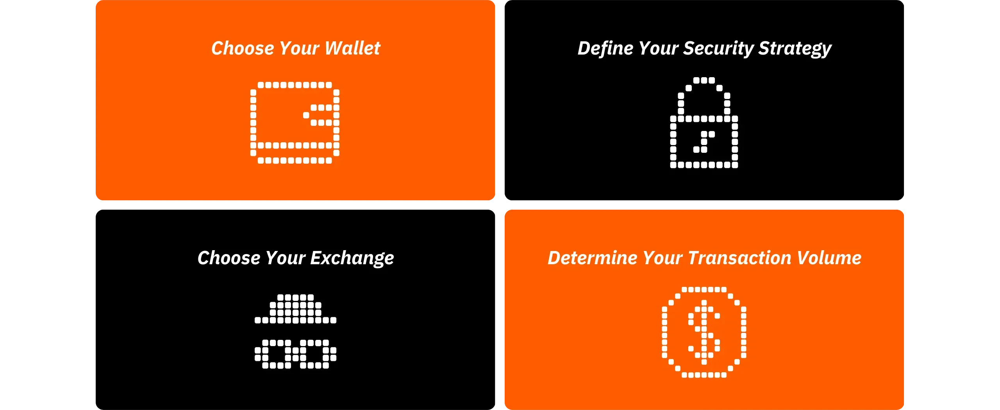

### Ví và Chiến lược bảo mật

Bảo mật khóa riêng tư của bạn (khóa cho phép truy cập vào bitcoin của bạn) là phần quan trọng nhất khi sở hữu và sử dụng Bitcoin. Không giống như tài khoản ngân hàng truyền thống, nơi bên thứ ba quản lý tiền của bạn, Bitcoin trao cho bạn toàn quyền kiểm soát. Nhưng với sự tự do đó đi kèm trách nhiệm: nếu bạn làm mất khóa, Bitcoin của bạn sẽ biến mất mãi mãi. Có một số loại ví bạn có thể sử dụng. Mỗi loại có ưu và nhược điểm riêng tùy thuộc vào nhu cầu và trình độ kinh nghiệm của bạn.

#### Hot Wallet

Ví Hot là ứng dụng hoặc phần mềm được kết nối với internet. Chúng lưu trữ khóa riêng của bạn trên cùng một thiết bị nơi chúng được cài đặt. Những ví này rất phù hợp để sử dụng hàng ngày hoặc lưu trữ một lượng nhỏ Bitcoin.

Ví dụ: Xanh lam Wallet, Green Wallet, Sparrow wallet

Với sự hỗ trợ của Lightning: Phoenix, Wallet của Satoshi, BitKit

**Thuận lợi** :

- Dễ sử dụng và truy cập nhanh vào tiền của bạn.
- Thích hợp cho các khoản thanh toán nhỏ và sử dụng hàng ngày.
- Một số hỗ trợ Lightning Network để giao dịch nhanh chóng và rẻ.

**Nhược điểm**:

- Ít an toàn hơn: chìa khóa của bạn nằm trên thiết bị được kết nối internet, làm tăng nguy cơ bị hack.
- Không thích hợp để lưu trữ số lượng lớn trong thời gian dài.

Phù hợp nhất cho: Người mới bắt đầu, số dư nhỏ và giao dịch thường xuyên.

#### Ví phần cứng

Ví phần cứng là thiết bị vật lý lưu trữ khóa riêng của bạn hoàn toàn ngoại tuyến. Chúng an toàn hơn nhiều so với ví Hot vì chúng giảm nguy cơ bị tấn công trực tuyến.

Ví dụ: Ledger, Trezor, Coldcard, Jade, BitBox

**Thuận lợi** :

- Khóa ngoại tuyến = tin tặc khó truy cập hơn nhiều.
- Được thiết kế chuyên biệt cho mục đích bảo mật.

**Nhược điểm**:

- Chậm hơn khi sử dụng; bạn cần kết nối thiết bị và xác nhận giao dịch bằng tay.
- Bạn sẽ phải mua thiết bị này và nó có thể tốn của bạn một khoản tiền kha khá.

Phù hợp nhất với: Người nắm giữ lâu dài và bất kỳ ai muốn đảm bảo số tiền lớn hơn.

#### Ví đa chữ ký

Ví Multisig (Nhiều chữ ký) yêu cầu nhiều hơn một khóa để chấp thuận giao dịch. Hãy nghĩ về nó giống như một két sắt cần hai hoặc ba tổ hợp để mở. Các thiết lập này lý tưởng cho người dùng nâng cao, doanh nghiệp hoặc bất kỳ ai đang tìm kiếm bảo mật hàng đầu.

Ví dụ: Liana, Casa, Spectre, Sparrow

**Thuận lợi** :

- Khả năng bảo vệ rất mạnh mẽ; nếu một khóa bị xâm phạm, tiền của bạn vẫn an toàn.
- Có thể giảm thiểu rủi ro do trộm cắp, mất mát hoặc cưỡng ép.
- Bạn có thể phân phối chìa khóa cho nhiều người hoặc nhiều địa điểm.

**Nhược điểm**:

- Thiết lập và quản lý phức tạp hơn.
- Có thể cần sự phối hợp giữa nhiều người/thiết bị.
- Rủi ro mất tiền nếu Multisig bị quản lý kém;
- Chi phí mua ban đầu cao hơn, có khả năng phải mua nhiều ví phần cứng.

Phù hợp nhất cho: Người dùng chuyên nghiệp, gia đình, công ty và nhu cầu lưu trữ dài hạn với tính bảo mật cao.

#### Dịch vụ lưu ký và ETF

Một số người chọn lưu trữ Bitcoin với các dịch vụ của bên thứ ba như sàn giao dịch, bên lưu ký hoặc ETF. Điều này cho phép bạn tiếp cận Bitcoin mà không cần tự quản lý khóa riêng. Nhưng nó đi kèm với những đánh đổi lớn.

Ví dụ: Các sàn giao dịch như Coinbase hoặc Binance, các sản phẩm tài chính như Bitcoin ETF của BlackRock.

**Thuận lợi** :

- Dễ sử dụng; không cần phải tự mình cầm chìa khóa hoặc ví.
- Hữu ích cho những người chỉ muốn đầu tư, không muốn sử dụng trực tiếp Bitcoin.

**Nhược điểm**:

- Bạn không thực sự sở hữu Bitcoin của mình; người giám hộ mới là người sở hữu. Nếu chúng giảm, tiền của bạn cũng có thể giảm (hãy hỏi người dùng Mt. Gox hoặc FTX).
- Có khả năng phí cao hơn và ít quyền riêng tư hơn.
- Sự phụ thuộc vào bên thứ ba đáng tin cậy, có nghĩa là từ bỏ chủ quyền, một trong những lợi ích chính của Bitcoin;
- Bạn không nhận được tất cả các lợi ích của Bitcoin về quyền riêng tư và chủ quyền tài chính.

**Nguyên tắc chung: Không phải chìa khóa, không phải tiền xu.**

Chúng tôi không khuyến nghị dịch vụ lưu ký ngay cả với người mới bắt đầu. Tốt hơn nhiều nếu dành thời gian tìm hiểu cách bảo mật Bitcoin của bạn đúng cách thay vì mạo hiểm mất tất cả vì người khác đã làm sai. Nhưng nếu bạn đang ở đây, đọc về ví và quản lý khóa, có lẽ bạn đã hiểu tại sao nguyên tắc đó lại quan trọng.

Việc lựa chọn Wallet và phương pháp bảo mật phụ thuộc vào lượng dữ liệu bạn lưu trữ, trình độ chuyên môn của bạn và các rủi ro tiềm ẩn mà bạn nhận thấy. Tuy nhiên, phương pháp kết hợp có thể là một lựa chọn thông minh:

- Sử dụng điện thoại Walleton Hot hoặc Lightning Wallet cho các giao dịch hàng ngày;
- Sử dụng Hardware Wallet để bảo vệ phần lớn số bitcoin của bạn, vốn được dùng để tiết kiệm dài hạn.

Nếu Hot Wallet của bạn tích lũy quá nhiều bitcoin, bạn có thể chuyển một số vào kho lưu trữ Cold của mình. Mặt khác, nếu bạn cần nhiều bitcoin hơn để chi tiêu hàng ngày, bạn có thể rút từ Cold Wallet của mình.

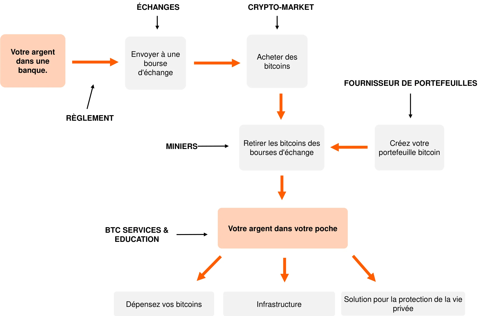

Cuối cùng, bảo mật phần lớn phụ thuộc vào cách bạn sử dụng các công cụ. Hardware Wallet sẽ không có ích gì nếu bạn làm mất, tiết lộ hoặc xâm phạm cụm từ Mnemonic. Thận trọng và kỷ luật là biện pháp bảo vệ tốt nhất của bạn để không bị mất bitcoin. Để biết thêm thông tin về vấn đề này, tôi thực sự khuyên bạn nên đọc bài viết này:

https://planb.network/tutorials/wallet/backup/backup-mnemonic-22c0ddfa-fb9f-4e3a-96f9-46e2a7954270

### Phương pháp mua lại và khối lượng giao dịch

Có nhiều cách khác nhau để có được bitcoin, tùy thuộc vào mức độ riêng tư bạn cần, các quy định ở quốc gia của bạn và số lượng bạn muốn có. Có hai cách tiếp cận chính:

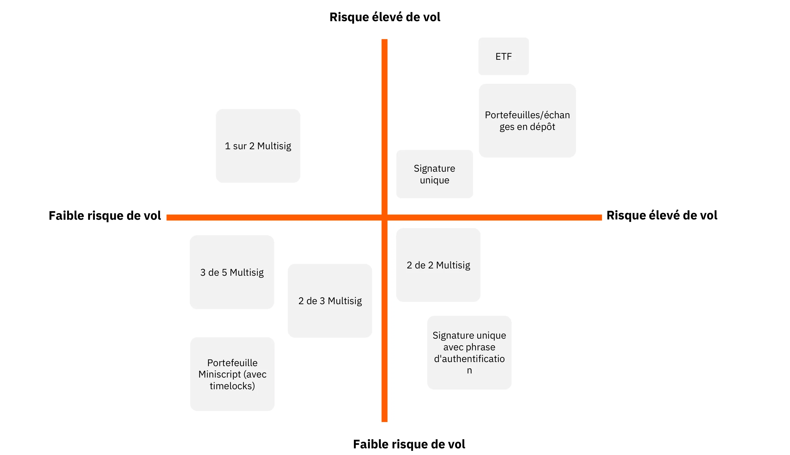

#### Thu thập với Xác minh danh tính (KYC)

Các nền tảng được quản lý thường yêu cầu bạn xác minh danh tính trước khi mua Bitcoin. Điều này có nghĩa là bạn sẽ cần cung cấp các tài liệu chính thức (hộ chiếu, CMND, bằng chứng về Address, v.v.) để tạo tài khoản và truy cập các dịch vụ mua bán.

**Thuận lợi** :

- Quy trình mua hàng đơn giản, thường phù hợp với người mới bắt đầu;
- Khả năng mua số lượng lớn cùng một lúc;
- Truy cập vào các dịch vụ bổ sung (DCA, chuyển đổi tự động, rút tiền fiat dễ dàng);
- Tính thanh khoản cao với mức chênh lệch nhỏ giữa giá mua và giá bán.

**Nhược điểm**:

- Phí chuyển đổi và rút tiền cao;
- Một số nền tảng phức tạp và có thể khiến bạn choáng ngợp với các tính năng giao dịch nâng cao hoặc các loại tiền điện tử thay thế;
- Các vấn đề lớn về quyền riêng tư.

Nhược điểm lớn nhất của các sàn giao dịch KYC là rủi ro về quyền riêng tư, điều này cũng có thể ảnh hưởng đến an ninh cá nhân của bạn. KYC cho phép các sàn giao dịch liên kết danh tính thực của bạn với địa chỉ rút tiền Bitcoin của bạn. Thông tin này trở thành điểm khởi đầu lý tưởng cho phân tích Blockchain. Khi xác định được Address, có thể theo dõi tất cả các giao dịch liên quan, điều này làm ảnh hưởng đến quyền riêng tư On-Chain của bạn. Nếu không có các biện pháp bảo vệ bổ sung, tất cả hoạt động Bitcoin của bạn có thể bị truy ngược về bạn.

Một rủi ro lớn khác là chính phủ, với quyền truy cập vào cơ sở dữ liệu của các nền tảng được quản lý, có thể dễ dàng xác định những cá nhân đã mua BTC. Mặc dù điều này có vẻ vô hại ngày nay, nhưng nó có thể trở thành vấn đề nếu áp dụng các hạn chế về kinh tế hoặc chính trị. Hơn nữa, các nền tảng được quản lý phải báo cáo bất kỳ giao dịch đáng ngờ nào, làm tăng khả năng bị các cơ quan công quyền giám sát có mục tiêu.

Ngoài ra, các nền tảng KYC lưu trữ rất nhiều dữ liệu nhạy cảm, bao gồm ID và bằng chứng về Address. Dữ liệu này thường được thuê ngoài cho các nhà cung cấp bên thứ ba xử lý xác minh danh tính. Nếu một nền tảng bị hack hoặc lỗi, thông tin này có thể bị lộ và được sử dụng để lừa đảo, tống tiền hoặc thậm chí là trộm cắp vật lý. Không giống như các vi phạm dữ liệu khác, rò rỉ liên quan đến Bitcoin đặc biệt nguy hiểm vì chúng có thể tiết lộ rằng bạn sở hữu các tài sản có giá trị.

Vì vậy, điều quan trọng là phải hiểu rằng việc thực hiện KYC không chỉ là một bước nhỏ; **nó ảnh hưởng đến an ninh cá nhân của bạn**. Các chính phủ yêu cầu kiểm tra danh tính này không chỉ vi phạm các quyền tự nhiên của bạn mà còn khiến bạn gặp rủi ro. Mặc dù việc sử dụng các nền tảng này có thể giúp bạn bắt đầu với Bitcoin, nhưng bạn nên biết về các rủi ro liên quan và cân nhắc khám phá các phương pháp không phải KYC để có được Bitcoin sau này.

#### Mua lại mà không cần xác minh danh tính (No-KYC)

Mua Bitcoin mà không tiết lộ danh tính của bạn là một lựa chọn cho những người coi trọng quyền riêng tư. Phương pháp này có thể bao gồm một số cách tiếp cận:

- Giao dịch ngang hàng (P2P) giữa các cá nhân riêng tư**: Mua trực tiếp bằng tiền mặt từ một người mà bạn tin tưởng (bạn bè, gia đình, mạng lưới địa phương, buổi gặp mặt...) sẽ tránh được mọi hồ sơ giao dịch chính thức và giúp bạn tránh xa hệ thống ngân hàng. Mặc dù đây có thể là cách tốt nhất để mua hoặc bán Bitcoin, nhưng nó đi kèm với rủi ro bị tấn công vật lý vì đây là Exchange trực tiếp.
- Nền tảng P2P**: Các nền tảng như Bisq, RoboSats và Peach tạo điều kiện thuận lợi cho việc trao đổi giữa các cá nhân mà không cần xác minh danh tính, sử dụng hệ thống ký quỹ để bảo mật giao dịch. Các nền tảng này vẫn có nguy cơ bị trộm cắp nếu bên kia không hợp tác, nhưng rủi ro được giảm thiểu bằng các dịch vụ ký quỹ.
- Máy rút tiền tự động (ATM) Bitcoin**: Một số máy ATM (ki-ốt) cho phép bạn mua Bitcoin bằng tiền mặt, mặc dù phí thường cao và một số máy yêu cầu xác minh ID đối với các giao dịch lớn hơn.
- Nền tảng Exchange không cần KYC**: Một số nền tảng, đặc biệt là ở Thụy Sĩ, cho phép bạn mua Bitcoin với số lượng nhỏ mà không cần xác minh ID.
- Mining**: Cá nhân có thể khai thác Bitcoin. Có thể truy cập vào các máy cũ hơn hoặc nhỏ hơn, cung cấp một cách không truyền thống để có được Bitcoin mà không cần KYC. Bằng cách tham gia Mining pool, bạn có thể kiếm được các khoản thanh toán thường xuyên, ngay cả với thiết bị cơ bản. Để biết thêm thông tin, [hãy xem hướng dẫn Mining của chúng tôi](https://planb.network/tutorials/Mining).
- Thanh toán / Lương bằng bitcoin**: Nếu bạn điều hành một doanh nghiệp, bạn có thể chấp nhận Bitcoin làm phương thức thanh toán. Nếu bạn được tuyển dụng, tùy thuộc vào khu vực pháp lý của bạn, bạn có thể yêu cầu được trả lương bằng Bitcoin. Các phương pháp này cho phép bạn có được Bitcoin mà không cần KYC.

**Thuận lợi** :

- Tùy thuộc vào phương pháp, nó sẽ giúp bảo vệ quyền riêng tư của bạn bằng cách hạn chế mối liên hệ giữa danh tính của bạn và hoạt động Bitcoin của bạn;
- Giảm nguy cơ kiểm duyệt, đóng băng quỹ hoặc can thiệp của nhà nước.
- Cho phép truy cập vào Bitcoin ngay cả trong môi trường được quản lý chặt chẽ.

**Nhược điểm**:

- Thường phức tạp hơn các nền tảng KYC;
- Tính thanh khoản thấp hơn và ít giao dịch hơn;
- Việc mua P2P thường đi kèm với mức giá cao;
- Rủi ro đối tác lớn hơn trong các giao dịch giữa các cá nhân (lừa đảo, gian lận, tấn công, v.v.).

### 4 Loại Người Dùng Bitcoin

Dựa trên các tiêu chí chúng tôi đã thảo luận, chúng tôi có thể xác định một số hồ sơ người dùng Bitcoin điển hình. Các hồ sơ này linh hoạt và có thể phát triển, nhưng chúng giúp làm rõ các chiến lược phù hợp với từng loại và hướng dẫn bạn chọn đúng công cụ.

#### 1. Người nắm giữ

Người nắm giữ là nhà đầu tư mua Bitcoin với tầm nhìn dài hạn và không có kế hoạch chạm vào nó trong nhiều năm. Không giống như Stacker, người mua thường xuyên theo thời gian, Hodler thường mua lớn hơn, thỉnh thoảng và sau đó chỉ cần giữ Bitcoin của họ.

Chiến lược ưu tiên:

- Mua hàng thông qua nền tảng KYC hoặc không phải KYC tùy thuộc vào nhu cầu riêng tư của họ;
- Lưu trữ trên Hardware Wallet hoặc sử dụng giải pháp đa chữ ký để tăng cường bảo mật;
- giao dịch hiếm, giảm thiểu tương tác với hệ sinh thái Bitcoin.

Hodler coi Bitcoin là một kho lưu trữ giá trị, tương tự như một nhà đầu tư vào vàng vật chất. Thách thức chính của họ là lưu trữ Bitcoin một cách an toàn và đảm bảo họ có thể truyền lại cho người thừa kế.

#### 2. Máy xếp chồng

Stacker là người có cách tiếp cận dần dần và nhất quán hơn. Họ mua Bitcoin thường xuyên, thường thông qua chiến lược Trung bình chi phí đô la (DCA). Mục tiêu của họ là phân bổ giá mua theo thời gian và giảm tác động của sự biến động của Bitcoin.

Chiến lược ưu tiên:

- Sử dụng tính năng mua hàng tự động thông qua nền tảng KYC cung cấp DCA;
- Chuyển tiền thường xuyên vào Hardware Wallet để lưu trữ an toàn;
- Khá nhạy cảm với quyền riêng tư nhưng ưu tiên tính bảo mật và dễ tích lũy.

Stacker không tập trung vào đầu cơ ngắn hạn hoặc sử dụng Bitcoin thường xuyên. Họ xem Bitcoin như một kế hoạch tiết kiệm dài hạn, kéo dài nhiều năm hoặc thậm chí nhiều thập kỷ. Điểm khác biệt giữa Stacker và Hodler là phương pháp mua lại và khối lượng giao dịch của họ.

#### 3. Người dùng đang hoạt động

Người dùng tích cực xem Bitcoin chủ yếu là phương tiện của Exchange chứ không chỉ là kho lưu trữ giá trị. Họ thường xuyên sử dụng nó cho các giao dịch, thanh toán hoặc như một phần của nền kinh tế tuần hoàn.

Chiến lược ưu tiên:

- Sử dụng Hot Wallet trên thiết bị di động hoặc máy tính để bàn cho các giao dịch hàng ngày;
- Sử dụng Lightning Network để thanh toán nhanh chóng và rẻ;
- Duy trì phương pháp kết hợp, sử dụng Wallet di động để chi tiêu và Hardware Wallet để tiết kiệm;
- Mức độ nhạy cảm về quyền riêng tư thay đổi tùy theo nhu cầu cụ thể.

Người dùng hoạt động có thể là một doanh nhân, người làm nghề tự do hoặc một người sống trong môi trường thân thiện với Bitcoin, nơi sử dụng Bitcoin cho các khoản thanh toán hàng ngày là phổ biến. Ưu tiên chính của họ là sự tiện lợi, hướng đến sự cân bằng giữa bảo mật và khả năng truy cập.

#### 4. Người hoang tưởng

Người dùng hoang tưởng là cá nhân tiên tiến ưu tiên quyền riêng tư và bảo mật. Họ coi Bitcoin là công cụ cho quyền tự do cá nhân và muốn giảm thiểu việc tiếp xúc với sự tin tưởng và quy định của bên thứ ba.

Chiến lược ưu tiên:

- Chỉ có thể lấy Bitcoin thông qua các kênh không phải KYC;
- Sử dụng ví được tăng cường bằng cụm mật khẩu BIP39 và thiết lập đa chữ ký;
- Lưu trữ Bitcoin trên nhiều thiết bị vật lý ở nhiều vị trí khác nhau;
- Tránh các dịch vụ tập trung có thể gây ảnh hưởng đến quyền riêng tư.

Hồ sơ này đặc biệt phù hợp với những người sống trong môi trường thù địch với Bitcoin, nơi sở hữu hoặc sử dụng BTC có thể dẫn đến lệnh trừng phạt. Đây là một cách tiếp cận phức tạp hơn, đòi hỏi trình độ chuyên môn kỹ thuật và kỷ luật nghiêm ngặt để tránh mất quyền truy cập vào tiền.

### Hồ sơ nào phù hợp với bạn?

Hãy nhớ rằng các hồ sơ này không loại trừ lẫn nhau. Bạn có thể đồng nhất với nhiều hơn một hồ sơ và cách tiếp cận của bạn có thể phát triển theo thời gian. Ví dụ, bạn có thể bắt đầu là một người xếp chồng và dần dần chuyển sang người dùng tích cực hơn hoặc thậm chí áp dụng tư duy bảo mật hoang tưởng. Bạn có thể là người nắm giữ lâu dài trong khi vẫn sử dụng Bitcoin trong cuộc sống hàng ngày của mình.

**Điều quan trọng nhất là phải điều chỉnh chiến lược của bạn phù hợp với tình hình hiện tại và tầm nhìn dài hạn.**

Trong các chương tiếp theo, chúng tôi sẽ khám phá chi tiết từng hồ sơ này để bạn có thể tìm ra hồ sơ nào phù hợp nhất với mình; và áp dụng phương pháp tiếp cận có ý nghĩa nhất cho mục tiêu của bạn. Chúng tôi cũng sẽ đề cập đến các công cụ phù hợp với từng hồ sơ, cung cấp cho bạn nền tảng để xây dựng kế hoạch mua lại và bảo mật của riêng mình.

## Người nắm giữ: Đầu tư dài hạn

<chapterId>baf1adc2-3828-5265-8ee5-130be547585c</chapterId>

:::id video=3f4e5d6c-7b8a-9c0d-1e2f-3a4b5c6d7e8f:::

Trong cộng đồng Bitcoin, thuật ngữ "hodler" ám chỉ người có cách tiếp cận đầu tư dài hạn. Từ này bắt nguồn từ lỗi đánh máy nổi tiếng "hold" trên diễn đàn Bitcoin Talk nhiều năm trước và từ đó trở thành biểu tượng của Commitment: hãy giữ chặt Bitcoin của bạn bất kể thế nào, mà không cần phải căng thẳng vì những biến động ngắn hạn của thị trường.

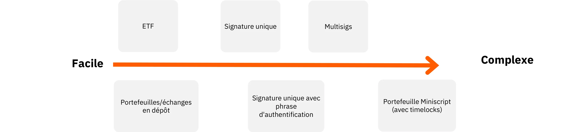

Những người nắm giữ tin vào giá trị đề xuất của Bitcoin. Với Supply cố định là 21 triệu coin, họ coi Bitcoin là kho lưu trữ giá trị dài hạn (vàng kỹ thuật số).

### Tại sao nên chọn chiến lược nắm giữ?

Theo truyền thống, hodling là cách tiếp cận có lợi nhuận nhất đối với hầu hết các nhà đầu tư không chuyên nghiệp. Nó loại bỏ nhu cầu phải căn thời điểm thị trường, vốn nổi tiếng là khó khăn và gây kiệt quệ về mặt cảm xúc. Chỉ cần mua và nắm giữ, những người hodler tránh được căng thẳng khi giao dịch và những quyết định kém thường đi kèm với phản ứng cảm xúc.

Bitcoin có xu hướng di chuyển theo chu kỳ; các đợt tăng giá lớn tiếp theo là các đợt điều chỉnh mạnh, sau đó là các giai đoạn im ắng kéo dài. Từ năm 2013 đến năm 2025, Bitcoin đã trải qua nhiều chu kỳ như vậy, đôi khi mất tới 80% giá trị trong các thị trường giá xuống. Các giai đoạn này có thể thử thách sự kiên nhẫn của người nắm giữ, nhưng những người kiên trì theo đuổi mục tiêu thường được đền đáp theo thời gian.

Hiểu được những chu kỳ này giúp quản lý cảm xúc. Những người nắm giữ dày dạn kinh nghiệm biết rằng việc cố gắng bán ở đỉnh hoặc mua ở đáy là một trò chơi thua lỗ. Thay vào đó, việc nắm giữ dài hạn có kỷ luật đã được chứng minh là một chiến lược chiến thắng.

### Kế hoạch đầu tư cho người nắm giữ

Những người nắm giữ có cách tiếp cận đơn giản và dài hạn: mua Bitcoin, bảo vệ đúng cách và để nguyên. Họ không giao dịch hoặc chi tiêu tiền của mình. Mục tiêu của họ là tích lũy và bảo vệ số tiền nắm giữ của mình với mức quản lý tối thiểu.

Sau đây là một kế hoạch vững chắc dành cho người nắm giữ:

#### 1. Chọn và thiết lập Hardware Wallet

Trước tiên là bảo mật. Hardware Wallet là điều bắt buộc. Nó lưu trữ khóa riêng của bạn ngoại tuyến, bảo vệ tiền của bạn khỏi các cuộc tấn công trực tuyến.

Sau đây là một số hướng dẫn về ví phù hợp với người nắm giữ:

https://planb.network/tutorials/wallet/hardware/coldcard-q-73e86d1a-6fe6-4d8b-bb15-8690298020e3

https://planb.network/tutorials/wallet/hardware/jade-plus-green-873099a4-35ec-4be8-b31a-6e7cd6a41ec0

https://planb.network/tutorials/wallet/hardware/ledger-nano-s-plus-75043cb3-2e8e-43e8-862d-ca243b8215a4

https://planb.network/tutorials/wallet/hardware/ledger-flex-3728773e-74d4-4177-b39f-bd923700c76a

https://planb.network/tutorials/wallet/hardware/passport-74e53858-3fa2-43f9-b866-573297546236

https://planb.network/tutorials/wallet/hardware/bitbox02-6af8940f-e19b-4008-8c83-81017032608c

Sau khi Wallet của bạn được thiết lập, hãy đảm bảo sao lưu cụm từ khôi phục 12 hoặc 24 từ của bạn trên một phương tiện vật lý bền. Để tìm hiểu thêm về phương tiện nào để chọn cho cụm từ của bạn, hãy làm theo hướng dẫn này:

https://planb.network/tutorials/wallet/backup/backup-mnemonic-22c0ddfa-fb9f-4e3a-96f9-46e2a7954270

Để an tâm hơn, bạn có thể thêm các lớp bảo vệ như:

- Wallet đa chữ ký với khóa thời gian:

https://planb.network/tutorials/wallet/desktop/liana-306ef457-700c-4fdd-b07a-8fb7a8a29f04

- Một BIP39 passphrase:

https://planb.network/tutorials/wallet/backup/passphrase-a26a0220-806c-44b4-af14-bafdeb1adce7

#### 2. Mua Bitcoin và Rút nó

Người nắm giữ không bao giờ để tiền của họ trên sàn giao dịch. Nền tảng có thể bị hack, phá sản hoặc bị tịch thu. Sau khi mua, hãy chuyển Bitcoin của bạn thẳng đến Hardware Wallet của bạn.

Vì những người nắm giữ có xu hướng đầu tư số tiền lớn hơn, họ cần những sàn giao dịch có tính thanh khoản mạnh. Sau đây là một số sàn giao dịch phù hợp:

https://planb.network/tutorials/exchange/centralized/bitfinex-dc306d39-bd96-4ab9-a278-a322316716db

https://planb.network/tutorials/exchange/centralized/kraken-1ef03e25-9b42-49bd-a47d-249e1a13cfc6

https://planb.network/tutorials/exchange/centralized/bitstamp-5a36c896-bff5-46d7-b505-ff069c3ac47c

https://planb.network/tutorials/exchange/centralized/bull-bitcoin-europe-0ccf713e-efcd-44ec-8205-211f49ac7d53

Một số người nắm giữ cũng áp dụng phương pháp kết hợp bằng cách sử dụng DCA (Trung bình chi phí đô la) - mua số lượng nhỏ thường xuyên để làm phẳng sự biến động của thị trường.

#### 3. Thiết lập kế hoạch kế nhiệm

Điều này thường bị bỏ qua. Nhưng Bitcoin không khoan nhượng; nếu khóa riêng của bạn bị mất, tiền của bạn sẽ mất mãi mãi. Việc lập kế hoạch cho tình trạng mất khả năng lao động hoặc tử vong là rất quan trọng.

Các bước chính:

- Viết hướng dẫn chi tiết giải thích cách truy cập Bitcoin của bạn nếu bạn không thể;
- Sử dụng thiết lập đa chữ ký để cung cấp quyền truy cập đồng thời giảm thiểu rủi ro mất mát;
- Chia sẻ thông tin quan trọng với người mà bạn tin tưởng.

Chúng ta sẽ đi sâu hơn vào kế hoạch thừa kế ở phần cuối của khóa học này.

#### 4. Hãy kiên nhẫn trong suốt chu kỳ

Giữ cổ phiếu có nghĩa là chơi trò chơi dài hạn. Bạn cần phải giữ bình tĩnh trong suốt thời kỳ giá cả lao dốc và thị trường tăng giá hưng phấn.

Một số cách thực hành tốt nhất:

- Kiểm tra Wallet của bạn định kỳ; nhưng không quá thường xuyên. Việc theo dõi liên tục dẫn đến các quyết định mang tính cảm tính;
- Đừng hoảng loạn bán tháo khi thị trường giảm. Điều chỉnh là một phần của trò chơi;
- Hãy luôn cập nhật thông tin về diễn biến của Bitcoin, nhưng tránh xa sự cường điệu của giới truyền thông, đặc biệt là trong thời kỳ suy thoái;
- Kiểm tra định kỳ tính toàn vẹn của cụm từ khôi phục của bạn. Kiểm tra xem phong bì có bị can thiệp không và phương tiện vẫn có thể đọc được. Nếu có bất kỳ điều gì trông không ổn, hãy sao lưu generate mới từ Wallet của bạn;

Để theo dõi tài sản của bạn mà không làm ảnh hưởng đến khóa riêng, hãy cân nhắc sử dụng Watch-only wallet. Nó cho phép bạn theo dõi số dư và giao dịch chỉ bằng khóa công khai của bạn.

https://planb.network/tutorials/wallet/mobile/blockstream-green-watch-only-66c3bc5a-5fa1-40ef-9998-6d6f7f2810fb

Chiến lược của hodler đơn giản nhưng mạnh mẽ: mua, bảo mật và quên đi. Thách thức thực sự không phải là kỹ thuật; mà là tâm lý. Phần khó nhất là chống lại sự thôi thúc bán quá sớm hoặc hoảng loạn khi giá giảm. Nhưng nếu bạn giữ kỷ luật và suy nghĩ dài hạn, hodling đã được chứng minh là một cách đáng tin cậy để bảo toàn giá trị và tích lũy của cải theo thời gian.

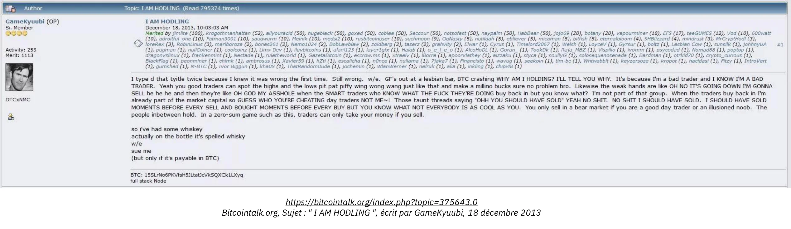

### Đánh giá hồ sơ Hodler của bạn

Nếu bạn nhận thấy mình có những đặc điểm tính cách sau đây, có lẽ bạn là người thích nắm giữ cổ phiếu:

- Kiên nhẫn**: Người nắm giữ thể hiện sự kiên nhẫn đặc biệt. Họ sẵn sàng giữ Bitcoin trong nhiều năm (đôi khi là nhiều thập kỷ) mà không bị dao động bởi giá hàng ngày. Họ hiểu rằng Bitcoin di chuyển theo chu kỳ và không hoảng sợ khi giá giảm mạnh. Việc điều chỉnh chỉ là một phần của trò chơi. Đối với người nắm giữ, giá trị không được đo bằng tháng mà là trong dài hạn.;
- Tầm nhìn dài hạn**: Người nắm giữ nghĩ xa hơn nhiều so với lợi nhuận ngắn hạn. Họ tin vào sự tăng trưởng mang tính cấu trúc của Bitcoin và sự áp dụng dần dần trên toàn cầu. Bất chấp sự biến động, họ thấy một quỹ đạo đi lên; một quỹ đạo mở rộng tiếp theo là sự hợp nhất. Đối với họ, Bitcoin là một tài sản lâu dài, một hàng rào chống lại lạm phát và là một phần quan trọng của một cuộc cách mạng tiền tệ lớn hơn;
- Kỷ luật bản thân**: Kỷ luật tinh thần là cốt lõi của tư duy hodler. Nghịch lý thay, thách thức lớn nhất của họ là không hành động. Họ chống lại sự thôi thúc bán trong thời kỳ giá tăng và không khuất phục trước nỗi sợ hãi trong thời kỳ sụp đổ. Họ hiểu rằng Bitcoin đã sống sót qua nhiều thị trường giá xuống tàn khốc; và những người giữ vững qua nỗi đau thường được hưởng lợi nhiều nhất;
- Khả năng phục hồi cảm xúc**: Giá của Bitcoin có thể giảm 50% hoặc hơn trong vài tuần; tuy nhiên, người nắm giữ vẫn bình tĩnh. Họ đã tiếp thu ý tưởng rằng sự biến động không làm suy yếu các yếu tố cơ bản của Bitcoin. Sự bền bỉ về mặt cảm xúc này cho phép họ giữ được cái đầu tỉnh táo trong thời kỳ bất ổn và duy trì được cái nhìn hợp lý khi những người khác hoảng loạn;
- Niềm tin vào công nghệ**: Những người nắm giữ không coi Bitcoin chỉ là một tài sản đầu cơ. Họ tin vào công nghệ và tiềm năng đột phá của nó. Đối với nhiều người, nó không chỉ là về tiền; mà là về sự tự do. Bitcoin được coi là một loại tiền tệ kiên cường, phi chính trị và là một giải pháp thay thế thực sự cho ngân hàng truyền thống, trao quyền cho các cá nhân có chủ quyền tài chính lớn hơn.

Việc nắm giữ rất đơn giản, hiệu quả và dễ tiếp cận; ngay cả với người mới bắt đầu.

Ở chương tiếp theo, chúng ta sẽ khám phá một cấu hình tương tự nhưng năng động hơn: stacker.

## Stacker: Tích lũy Satoshi

<chapterId>0daf450d-1b91-5d99-9c31-b52ab52a5e21</chapterId>

:::id video=4e5f6a7b-8c9d-0e1f-2a3b-4c5d6e7f8a9b:::

Trong hệ sinh thái Bitcoin, một stacker là người có cách tiếp cận nhất quán và lâu dài để tích lũy satoshi (hay "Sats"), đơn vị nhỏ nhất của Bitcoin. Thay vì đầu tư một khoản tiền lớn cùng một lúc, một stacker thường xuyên mua một lượng nhỏ Bitcoin, bất kể điều kiện thị trường.

Ý tưởng rất đơn giản: sẽ chỉ có khoảng 21 triệu bitcoin và mỗi phần đều có giá trị. Nhiệm vụ của người xếp chồng là tích lũy càng nhiều Sats càng tốt.

### Tại sao nên chọn chiến lược xếp chồng?

Stacking là một chiến lược đầu tư cực kỳ hiệu quả dành cho những ai muốn giảm thiểu rủi ro biến động thị trường trong khi dần dần xây dựng vị thế Bitcoin. Không giống như đầu tư theo kiểu trả một lần hoặc đầu cơ thời điểm thị trường, stacker thường sử dụng một kỹ thuật gọi là Dollar-Cost Averaging (DCA); đầu tư một số tiền cố định theo các khoảng thời gian đều đặn (hàng ngày, hàng tuần, hàng tháng...), bất kể giá hiện tại của Bitcoin là bao nhiêu.

Ưu điểm của việc xếp chồng:

- Giảm biến động**: Việc mua thường xuyên giúp làm giảm biến động giá, vì bạn sẽ mua nhiều Sats hơn khi giá thấp và ít hơn khi giá cao; giúp trung bình hóa cơ sở chi phí của bạn và giảm căng thẳng về mặt cảm xúc.
- Khả năng tiếp cận**: Bạn không cần số vốn ban đầu lớn. Bạn có thể bắt đầu chỉ với 10€ mỗi tháng và tăng số tiền DCA theo thời gian.
- Kỷ luật và tự động hóa**: Stackers tránh việc ra quyết định theo cảm tính. Việc mua hàng định kỳ tự động đảm bảo tính nhất quán và giảm nguy cơ hành động bốc đồng.
- Chiến lược dài hạn**: Đầu tư dần dần làm tăng cơ hội hưởng lợi từ thị trường tăng giá đồng thời giảm thiểu rủi ro trong thời kỳ suy thoái.

Phương pháp này đặc biệt **phù hợp với người mới bắt đầu**; nó loại bỏ áp lực phải căn thời điểm thị trường và cho phép tích lũy ổn định, không cần động tay vào.

### Kế hoạch đầu tư của Stacker

Mục tiêu là xây dựng một chiến lược bền vững, tự động và an toàn để tích lũy Bitcoin trong thời gian dài. Sau đây là các bước chính để triển khai kế hoạch đầu tư máy xếp chồng của bạn:

#### 1. Lựa chọn loại Wallet phù hợp

Máy xếp chồng cần có thiết lập Wallet cân bằng giữa tính dễ sử dụng và tính bảo mật lâu dài.

- Hot Wallet**: Lý tưởng cho người mới bắt đầu, ví di động hoặc máy tính để bàn cho phép bạn dễ dàng nhận Sats và thực hiện thanh toán. Tuy nhiên, chúng phù hợp nhất với số tiền nhỏ. Ví On-Chain được ưa chuộng để xếp chồng lên ví Lightning do quản lý UTXO tốt hơn. Ví phần mềm được đề xuất: Green Wallet, Blue Wallet, Sparrow wallet, Bitkit, Nunchuk, Aqua, Proton

https://planb.network/tutorials/wallet/mobile/aqua-8e6d7dd3-8c03-45cc-90dd-fe3899a7d125

https://planb.network/tutorials/wallet/mobile/bitkit-wallet-a7224674-85c4-4045-9baf-37018d89550c

https://planb.network/tutorials/wallet/mobile/blockstream-green-e84edaa9-fb65-48c1-a357-8a5f27996143

https://planb.network/tutorials/wallet/desktop/blockstream-green-desktop-c1503adf-1404-4328-b814-aa97fcf0d5da

https://planb.network/tutorials/wallet/mobile/blue-wallet-2f4093da-6d03-4f26-8378-b9351d0dbc90

https://planb.network/tutorials/wallet/mobile/nunchuk-6cbcb406-ec84-478f-afac-bb4da366a6fa

https://planb.network/tutorials/wallet/desktop/proton-wallet-0bee0bba-ab62-4db0-8c63-b2ad698ca178

https://planb.network/tutorials/wallet/desktop/sparrow-c674e2ac-d46f-4c82-92a7-7d1b0e262f5d

- Hardware Wallet**: Khi số lượng nắm giữ Bitcoin của bạn tăng lên, việc bảo vệ tiền của bạn bằng Cold Wallet là điều cần thiết để giảm thiểu rủi ro bị trộm cắp. Một người xếp chồng nghiêm túc thường xuyên chuyển tiền từ Hot Wallet của họ sang Hardware Wallet. Ví dụ: Bitbox02, Trezor, Ledger, Coldcard, Jade...

https://planb.network/tutorials/wallet/hardware/coldcard-q-73e86d1a-6fe6-4d8b-bb15-8690298020e3

https://planb.network/tutorials/wallet/hardware/jade-plus-green-873099a4-35ec-4be8-b31a-6e7cd6a41ec0

https://planb.network/tutorials/wallet/hardware/ledger-nano-s-plus-75043cb3-2e8e-43e8-862d-ca243b8215a4

https://planb.network/tutorials/wallet/hardware/ledger-flex-3728773e-74d4-4177-b39f-bd923700c76a

https://planb.network/tutorials/wallet/hardware/passport-74e53858-3fa2-43f9-b866-573297546236

https://planb.network/tutorials/wallet/hardware/bitbox02-6af8940f-e19b-4008-8c83-81017032608c

Cách tiếp cận hiệu quả nhất là sử dụng cả hai: Hot Wallet để xếp chồng hàng ngày và Hardware Wallet để lưu trữ Cold dài hạn. Hot Wallet dễ sử dụng và tiện lợi. Nó cho phép bạn nhanh chóng sở hữu bitcoin của mình, thay vì để chúng trên nền tảng nơi chúng có thể gặp rủi ro. Tuy nhiên, so với Hardware Wallet, Hot Wallet cung cấp ít bảo mật hơn nhiều. Do đó, người xếp chồng phải thường xuyên chuyển tiền của mình sang Cold Wallet để đảm bảo khoản tiết kiệm dài hạn của mình và tránh giữ quá nhiều tiền trong Hot Wallet. Theo định kỳ, người xếp chồng sẽ hợp nhất UTXO khi chuyển sang lưu trữ Cold; hợp nhất các đầu vào nhỏ để tối ưu hóa phí giao dịch trong tương lai.

#### 2. Thiết lập kế hoạch mua hàng DCA

Chiến lược trung bình chi phí đô la (DCA) là một chiến lược đầu tư mà bạn mua một lượng nhỏ Bitcoin theo các khoảng thời gian đều đặn, bất kể giá của nó. Để thiết lập một kế hoạch DCA hiệu quả, bạn cần xác định hai Elements chính:

- Tần suất mua**: Hàng tuần, hai tuần một lần hoặc hàng tháng; lựa chọn dựa trên thu nhập và mục tiêu của bạn. Tránh mua quá thường xuyên nếu nó dẫn đến nhiều UTXO nhỏ tốn kém để chi tiêu sau này. Dựa trên ngân sách và khả năng chịu rủi ro của bạn. Tính nhất quán quan trọng hơn quy mô; tốt hơn là tích lũy số tiền khiêm tốn trong nhiều năm thay vì cam kết quá mức và bỏ cuộc. Tất nhiên, số tiền DCA của bạn có thể được điều chỉnh khi tình hình tài chính của bạn thay đổi.

Tiếp theo, bạn có hai lựa chọn để thiết lập DCA của mình: tự động hóa hoặc quản lý thủ công. Hầu hết các nền tảng giao dịch được quản lý hiện nay đều cung cấp tùy chọn tự động hóa DCA của bạn. Với đủ tiền pháp định trong tài khoản của bạn, nền tảng sẽ tự động thực hiện lệnh mua của bạn dựa trên các thông số bạn đã đặt. Ngoài ra còn có một số lượng ngày càng tăng các nền tảng dành riêng cho tự động hóa DCA, cung cấp các dịch vụ bổ sung như rút tiền tự động vào tài khoản tự quản lý Wallet của bạn hoặc làm tròn chi phí hàng ngày của bạn. Nếu bạn đang sử dụng một nền tảng được quản lý, tôi thực sự khuyên bạn nên tự động hóa DCA của mình để an tâm hơn trong việc quản lý hàng ngày của bạn.

Ví dụ về nền tảng DCA:

https://planb.network/tutorials/exchange/centralized/bitstack-29fd71be-9570-42c6-8f6f-cd355d62e746

https://planb.network/tutorials/exchange/centralized/relai-v2-30a9671d-e407-459d-9203-4c3eae15b30e

https://planb.network/tutorials/exchange/centralized/stackinsat-5af6a380-f3c6-4246-9f81-9957a16ab066

Các sàn giao dịch chính thống hỗ trợ DCA:

https://planb.network/tutorials/exchange/centralized/bitfinex-dc306d39-bd96-4ab9-a278-a322316716db

https://planb.network/tutorials/exchange/centralized/bitstamp-5a36c896-bff5-46d7-b505-ff069c3ac47c

https://planb.network/tutorials/exchange/centralized/bull-bitcoin-europe-0ccf713e-efcd-44ec-8205-211f49ac7d53

https://planb.network/tutorials/exchange/centralized/kraken-1ef03e25-9b42-49bd-a47d-249e1a13cfc6

https://planb.network/tutorials/exchange/centralized/paymium-92603f76-b985-49ce-81e5-f4fa0df776e5

Stackers cũng có thể muốn tăng cường quyền riêng tư của họ, ngay cả khi đó không phải là mục tiêu chính của họ. Trong trường hợp này, họ nên cân nhắc sử dụng phương pháp mua lại P2P, bên ngoài các nền tảng được quản lý. Không giống như các giao dịch mua DCA tự động, các phương pháp này yêu cầu bạn phải quản lý chiến lược mua hàng của mình theo cách thủ công, vì vậy kỷ luật là chìa khóa để duy trì đúng hướng.

https://planb.network/tutorials/exchange/peer-to-peer/bisq-v2-c1c6a702-6c16-4101-8b90-62c424017b80

https://planb.network/tutorials/exchange/peer-to-peer/hodlhodl-d7344cd5-6b18-40f5-8e78-2574a93a3879

https://planb.network/tutorials/exchange/peer-to-peer/lnp2pbot-v2-e6bcb210-610b-487d-970c-7cce85273e3c

https://planb.network/tutorials/exchange/peer-to-peer/peach-c6143241-d900-4047-9b73-1caba5e1f874

https://planb.network/tutorials/exchange/peer-to-peer/robosats-b60e4f7c-533a-4295-9f6d-5368152e8c06

#### 3. Rút và bảo mật bitcoin

Khi chiến lược mua hàng của bạn đã được thiết lập, chỉ cần rút Bitcoin của bạn khỏi Exchange và chuyển nó sang Hardware Wallet của bạn thường xuyên. Điều này đảm bảo quyền tự quản hoàn toàn và bảo vệ lâu dài.

#### 4. Chờ đợi một vài chu kỳ

Người xếp chồng nghĩ theo năm chứ không phải theo tháng. Giống như người nắm giữ, họ phải kiềm chế sự hoảng loạn khi thị trường sụp đổ hoặc sự hưng phấn khi thị trường tăng giá.

Thói quen chính:

- Đừng kiểm tra ví quá thường xuyên để tránh căng thẳng;
- Không bao giờ bán khi thị trường đang suy thoái; việc điều chỉnh là bình thường;
- Cập nhật thông tin về những phát triển công nghệ của Bitcoin;
- Kiểm tra định kỳ bản sao lưu seed và trạng thái Hardware Wallet của bạn: Bây giờ ví của bạn đã được thiết lập, điều quan trọng là phải thiết lập giám sát thường xuyên. Định kỳ, hãy kiểm tra xem cụm từ Mnemonic của bạn vẫn còn ở vị trí lưu trữ và phong bì mờ đục của nó chưa bị mở. Trong các lần kiểm tra này, bạn cũng có thể mở phong bì để kiểm tra tình trạng của phương tiện. Đảm bảo rằng nó không bị hư hỏng và câu vẫn hoàn toàn có thể đọc được. Nếu có bất kỳ dấu hiệu hư hỏng nào, tốt nhất là tạo một bản sao mới từ Hardware Wallet của bạn. Bạn cũng có thể kiểm tra ví phần cứng của mình thường xuyên.

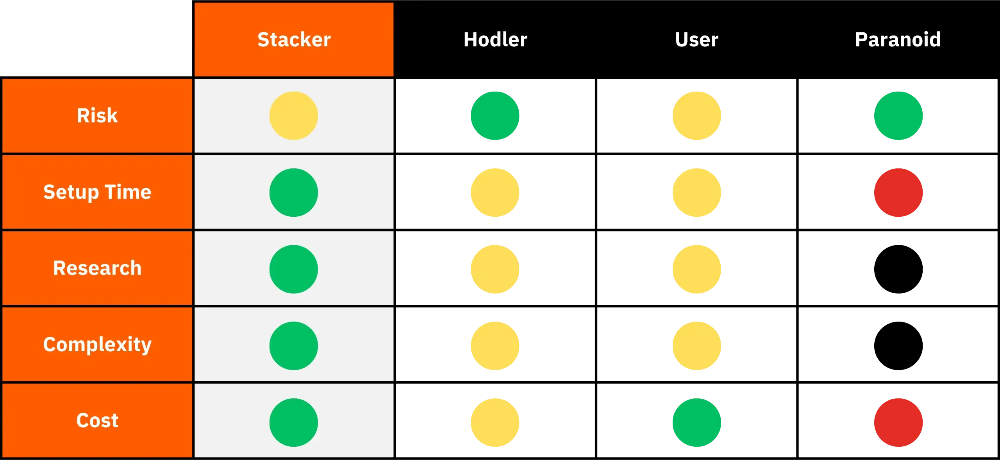

Để dễ dàng theo dõi mà không ảnh hưởng đến tính bảo mật, hãy thiết lập Watch-only wallet để theo dõi số dư bằng khóa công khai.

https://planb.network/tutorials/wallet/mobile/blockstream-green-watch-only-66c3bc5a-5fa1-40ef-9998-6d6f7f2810fb

### Đánh giá hồ sơ xếp chồng của bạn

Những người xếp chồng thành công thể hiện những đặc điểm sau:

- Tổ chức**: Giữ ngân sách, bám sát kế hoạch. Người xếp chồng phải đảm bảo rằng kế hoạch tích lũy của họ khả thi trong nhiều năm.
- Kỷ luật**: Thực hiện theo lịch trình của bạn mà không phản ứng với tiếng ồn của thị trường. Sự đều đặn được ưu tiên hơn những điều chỉnh bốc đồng. Tuy nhiên, vẫn có thể thực hiện những điều chỉnh hợp lý.
- Kiên nhẫn**: Phần thưởng của việc xếp chồng không đến ngay lập tức. Chiến lược này diễn ra trong thời gian dài, đôi khi mất nhiều năm, trước khi mang lại kết quả hữu hình. Những người thành công là những người có thể kiên nhẫn, không bị ảnh hưởng bởi sự biến động ngắn hạn.
- Kiến thức tài chính**: Hiểu biết vững chắc về DCA, quản lý rủi ro và các nguyên tắc cơ bản của thị trường Bitcoin giúp bạn đầu tư tự tin. Một người xếp chồng thông minh được trang bị tốt hơn để chống lại sự nghi ngờ và tránh đưa ra quyết định bốc đồng trong thời kỳ biến động cao.
- Tầm nhìn dài hạn**: Một người xếp chồng tin tưởng mạnh mẽ vào tiềm năng công nghệ của Bitcoin. Trọng tâm của họ không phải là biến động giá ngắn hạn mà là tăng đều đặn lượng nắm giữ của họ qua nhiều năm.

Tóm lại, chiến lược xếp chồng lý tưởng cho những ai muốn xây dựng vị thế Bitcoin theo thời gian, giảm rủi ro biến động và duy trì quyền tự chủ hoàn toàn mà không cần phải dán mắt vào biểu đồ.

Tiếp theo: chúng ta sẽ khám phá một hồ sơ người dùng bitcoin hoàn toàn khác; người dùng tích cực.

## Người dùng Bitcoin năng động: Tích hợp Bitcoin vào cuộc sống hàng ngày

<chapterId>e0a022ab-207c-571f-b4ad-c432214a756c</chapterId>

:::video id=5f6a7b8c-9d0e-1f2a-3b4c-5d6e7f8a9b0c:::

Trở thành người dùng Bitcoin tích cực có nghĩa là vượt ra ngoài các chiến lược đầu tư dài hạn. Không giống như hodler hoặc stacker chủ yếu tiết kiệm mà không chi tiêu, người dùng tích cực coi Bitcoin là phương tiện thực sự của Exchange**. Họ sử dụng nó để thanh toán cho hàng hóa và dịch vụ và tích cực tham gia vào nền kinh tế đối trọng.

### Tại sao nên áp dụng chiến lược người dùng tích cực?

Sử dụng Bitcoin hàng ngày mang lại lợi ích cho cả cá nhân và tập thể:

- Hỗ trợ hệ sinh thái Bitcoin thông qua việc áp dụng**:

Mỗi giao dịch củng cố tính hợp pháp của Bitcoin như một loại tiền tệ và khuyến khích nhiều thương nhân và dịch vụ chấp nhận nó hơn. Sử dụng Bitcoin là bỏ phiếu cho tiện ích của nó. Tiền có giá trị từ khả năng tạo điều kiện thuận lợi cho thương mại; không phải trao đổi hàng hóa. Nếu không có thương nhân nào chấp nhận một loại tiền tệ, thì nó không có giá trị khách quan. Bạn có thể mua càng nhiều hàng hóa và dịch vụ bằng nó, thì nó càng trở nên hữu ích. Bằng cách chọn thanh toán bằng Bitcoin, bạn đang hướng giá trị đến những thương nhân chấp nhận nó. Điều này làm tăng lợi nhuận của họ và theo thời gian, có thể làm giảm lợi nhuận của những đối thủ cạnh tranh từ chối nó. Trong toàn bộ cộng đồng, động lực này có thể thúc đẩy sự chấp nhận rộng rãi hơn đối với Bitcoin và góp phần vào một chu kỳ áp dụng có lợi.

- Tận dụng các tính năng độc đáo của Bitcoin**:

Bitcoin cung cấp một số tính năng mạnh mẽ, chẳng hạn như giao dịch nhanh thông qua Lightning Network và không bị kiểm duyệt, giám sát tài chính và thuế phát hành. Giá trị cốt lõi của nó nằm ở việc xóa bỏ sự kiểm soát của chính phủ đối với tiền Supply và cho phép các giao dịch không bị kiểm duyệt. Nếu những lợi thế này phù hợp với nhu cầu và giá trị cá nhân của bạn, bạn có thể thấy rằng hồ sơ Người dùng hoạt động phù hợp với bạn.

- Học bằng cách làm**:

Việc sử dụng Bitcoin tích cực giúp bạn phát triển kinh nghiệm thực tế. Bạn sẽ trở nên quen thuộc với các loại Wallet, quyền riêng tư thanh toán và quản lý UTXO. Việc sử dụng hàng ngày trở thành môi trường học tập thực tế.

Những thách thức bao gồm sự phức tạp về mặt kỹ thuật, sự biến động giá cả và nhu cầu bảo mật tốt để ngăn ngừa mất tiền.

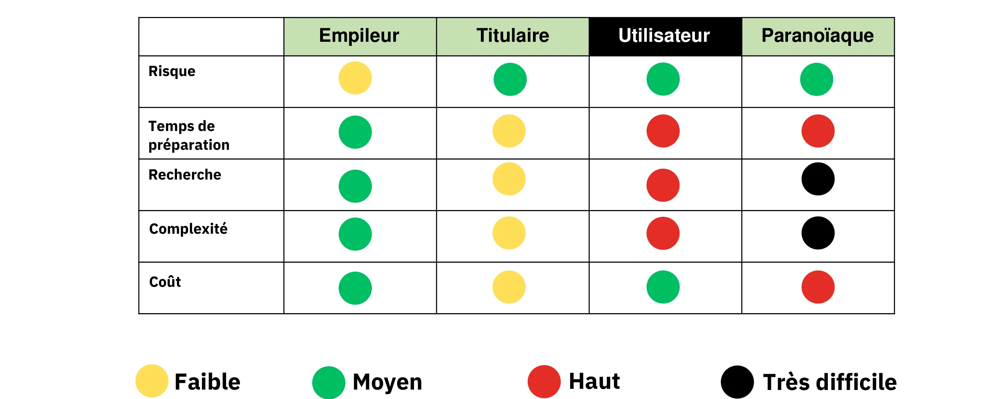

### Kế hoạch đầu tư cho người dùng tích cực

Việc áp dụng Bitcoin cho các khoản thanh toán hàng ngày đòi hỏi một cách tiếp cận chu đáo và có cấu trúc. Không giống như Hodler hoặc Stacker, Người dùng hoạt động phải quản lý cả tính bảo mật lâu dài của tiền của họ và sự tiện lợi của các giao dịch hàng ngày. Đạt được sự cân bằng phù hợp giữa lưu trữ Cold an toàn và khả năng truy cập dễ dàng vào tiền chi tiêu là điều cần thiết để chiến lược này hoạt động hiệu quả.

#### 1. Phân tách ví rõ ràng

Người dùng tích cực nên sử dụng hai loại ví khác nhau để cân bằng giữa tính bảo mật và sự tiện lợi:

- Cold Wallet (Hardware Wallet) để đảm bảo tiết kiệm dài hạn.

https://planb.network/tutorials/wallet/hardware/coldcard-q-73e86d1a-6fe6-4d8b-bb15-8690298020e3

https://planb.network/tutorials/wallet/hardware/jade-plus-green-873099a4-35ec-4be8-b31a-6e7cd6a41ec0

https://planb.network/tutorials/wallet/hardware/ledger-nano-s-plus-75043cb3-2e8e-43e8-862d-ca243b8215a4

https://planb.network/tutorials/wallet/hardware/ledger-flex-3728773e-74d4-4177-b39f-bd923700c76a

https://planb.network/tutorials/wallet/hardware/passport-74e53858-3fa2-43f9-b866-573297546236

https://planb.network/tutorials/wallet/hardware/bitbox02-6af8940f-e19b-4008-8c83-81017032608c

https://planb.network/tutorials/wallet/hardware/portal-bd6e83f0-0100-4689-aeb3-513cca944ace

https://planb.network/tutorials/wallet/hardware/satochip-e9bc81d9-d59b-420d-9672-3360212237ba

https://planb.network/tutorials/wallet/hardware/seed-signer-ee2c284a-0e23-49a4-b0ca-4a4702072973

https://planb.network/tutorials/wallet/hardware/tapsigner-ab2bcdf9-9509-4908-9a4a-2f2be1e7d5d2

- Một hoặc nhiều ví Hot di động cho các giao dịch hàng ngày. Thông thường, một người dùng hoạt động sẽ có cả On-Chain Hot Wallet và Lightning Wallet.

https://planb.network/tutorials/wallet/mobile/aqua-8e6d7dd3-8c03-45cc-90dd-fe3899a7d125

https://planb.network/tutorials/wallet/mobile/bitkit-wallet-a7224674-85c4-4045-9baf-37018d89550c

https://planb.network/tutorials/wallet/mobile/blink-7ea5f5a4-e728-4ff9-b3f9-cf20aa6fc2bd

https://planb.network/tutorials/wallet/mobile/blixt-04b319cf-8cbe-4027-b26f-840571f2244f

https://planb.network/tutorials/wallet/mobile/blockstream-green-e84edaa9-fb65-48c1-a357-8a5f27996143

https://planb.network/tutorials/wallet/mobile/blue-wallet-2f4093da-6d03-4f26-8378-b9351d0dbc90

https://planb.network/tutorials/wallet/mobile/breez-46a6867b-c74b-45e7-869c-10a4e0263c06

https://planb.network/tutorials/wallet/mobile/lipa-61019fbd-deb7-4b3c-8cda-0402a4b2e780

https://planb.network/tutorials/wallet/mobile/nunchuk-6cbcb406-ec84-478f-afac-bb4da366a6fa

https://planb.network/tutorials/wallet/mobile/phoenix-0f681345-abff-4bdc-819c-4ae800129cdf

https://planb.network/tutorials/wallet/mobile/wallet-of-satoshi-39149d86-e42b-4e8f-ae9f-7e061e7784f7

https://planb.network/tutorials/wallet/mobile/zeus-embedded-advanced-3e89603c-501d-439c-8691-d4a0d0de459b

Việc tách biệt tiền của bạn theo cách này giúp giảm rủi ro trong trường hợp Wallet được sử dụng để thanh toán hàng ngày bị xâm phạm.

#### 2. Thiết lập nút của riêng bạn

Người dùng tích cực thường hướng đến mục tiêu giảm sự phụ thuộc vào bên thứ ba đáng tin cậy, tùy thuộc vào hoàn cảnh cá nhân của họ. Một trong những cách hiệu quả nhất để đạt được điều này là chạy nút Bitcoin của riêng họ. Điều này cho phép họ sử dụng mạng độc lập trong khi tăng cường tính riêng tư của các giao dịch của họ.

https://planb.network/tutorials/node/bitcoin/bitcoin-core-linux-568c13a6-8746-4d63-8e95-f4a61c5ae0ed

https://planb.network/tutorials/node/bitcoin/bitcoin-core-mac-windows-9684ab02-e0af-41c9-8102-86ac7c7727f3

https://planb.network/tutorials/node/bitcoin/bitcoin-knots-e04b2196-4df2-4246-86ef-c02269c29098

https://planb.network/tutorials/node/bitcoin/raspiblitz-d8cdba2e-a682-46cf-9fdc-d8602fbeac02

https://planb.network/tutorials/node/bitcoin/mynode-a481fef3-2fd3-4df3-91c0-112cffa094eb

https://planb.network/tutorials/node/bitcoin/start9-8c8b6827-8423-4929-bcba-89057670ed6a

Đối với những người thường xuyên sử dụng Lightning Network, việc quản lý nút LND, LDK hoặc Core-Lightning của riêng họ có thể là một động thái thông minh. Nó cung cấp cho họ toàn quyền kiểm soát việc mở và đóng kênh, tăng quyền tự chủ và thậm chí có thể giúp giảm phí giao dịch; đặc biệt là khi so sánh với các giải pháp tự động như Phoenix hoặc tệ hơn là ví Lightning lưu ký.

https://planb.network/tutorials/node/lightning-network/alby-hub-62e6356c-6a6d-4134-8f22-c3b6afb9882a

#### 3. Thu thập Bitcoin thường xuyên

Người dùng tích cực cần cân bằng giữa khoản tiết kiệm dài hạn và số tiền Bitcoin dự trữ để sử dụng hàng ngày.

Có một số cách để sở hữu Bitcoin, tùy thuộc vào mức độ riêng tư mà bạn đang tìm kiếm:

- Mua theo cách truyền thống thông qua các nền tảng được quản lý** như Bitfinex hoặc Bull Bitcoin (lý tưởng để nạp thêm tiền vào Cold Wallet của bạn);

https://planb.network/tutorials/exchange/centralized/bitfinex-dc306d39-bd96-4ab9-a278-a322316716db

https://planb.network/tutorials/exchange/centralized/bitstack-29fd71be-9570-42c6-8f6f-cd355d62e746

https://planb.network/tutorials/exchange/centralized/bitstamp-5a36c896-bff5-46d7-b505-ff069c3ac47c

https://planb.network/tutorials/exchange/centralized/bull-bitcoin-europe-0ccf713e-efcd-44ec-8205-211f49ac7d53

https://planb.network/tutorials/exchange/centralized/kraken-1ef03e25-9b42-49bd-a47d-249e1a13cfc6

https://planb.network/tutorials/exchange/centralized/paymium-92603f76-b985-49ce-81e5-f4fa0df776e5

https://planb.network/tutorials/exchange/centralized/relai-v2-30a9671d-e407-459d-9203-4c3eae15b30e

https://planb.network/tutorials/exchange/centralized/stackinsat-5af6a380-f3c6-4246-9f81-9957a16ab066

- Thu thập thông tin không cần KYC** thông qua các dịch vụ ngang hàng như Peach, Robosats hoặc ATM Bitcoin; cho phép bạn nạp tiền vào Wallet mà không cần tiết lộ thông tin cá nhân.

https://planb.network/tutorials/exchange/peer-to-peer/bisq-v2-c1c6a702-6c16-4101-8b90-62c424017b80

https://planb.network/tutorials/exchange/peer-to-peer/hodlhodl-d7344cd5-6b18-40f5-8e78-2574a93a3879

https://planb.network/tutorials/exchange/peer-to-peer/lnp2pbot-v2-e6bcb210-610b-487d-970c-7cce85273e3c

https://planb.network/tutorials/exchange/peer-to-peer/peach-c6143241-d900-4047-9b73-1caba5e1f874

https://planb.network/tutorials/exchange/peer-to-peer/robosats-b60e4f7c-533a-4295-9f6d-5368152e8c06

- Kiếm tiền bằng Bitcoin**, Trở thành người dùng tích cực không chỉ là chi tiêu BTC; mà còn là kiếm tiền. Nếu bạn điều hành một doanh nghiệp, hãy cân nhắc chấp nhận Bitcoin làm phương thức thanh toán. Nếu bạn là nhân viên, hãy xem liệu chủ lao động của bạn có cung cấp tùy chọn nhận toàn bộ hoặc một phần lương của bạn bằng BTC không.

https://planb.network/tutorials/business/point-of-sale/swiss-bitcoin-pay-2-a78b057e-ed11-47ac-860c-71019fcb451a

https://planb.network/tutorials/business/point-of-sale/open-node-e69a0c1c-47f7-4932-8494-e6f26c3c9784

https://planb.network/tutorials/business/point-of-sale/btcpay-server-928eb01e-824b-4b57-a3e8-8727633beddc

#### 4. Quản lý chi phí chủ động

Việc lựa chọn chi tiêu bitcoin thường bị chỉ trích. Một số người dùng Bitcoin thích chi tiêu tiền pháp định, mà họ cho là kém chất lượng hơn và do đó muốn loại bỏ, thay vì chi tiêu bitcoin. Nhưng tư duy này có hai nhược điểm chính: thứ nhất, nó bỏ qua những lợi thế của Bitcoin như một phương tiện thanh toán (xem phần trước) và thứ hai, nó đặt ra câu hỏi: tại sao lại giữ tiền pháp định, được coi là ít giá trị hơn, để chi tiêu?

Một cách tiếp cận hợp lý hơn là phương pháp "Chi tiêu và Thay thế". Nghĩa là chi tiêu Bitcoin vì tất cả các lý do đã nêu trước đó, và sau đó, thay vì để khoản tiết kiệm Bitcoin của bạn giảm đi, bạn thay thế Sats đã chi bằng cách mua những khoản mới bằng tiền pháp định.

Để giúp việc chi tiêu Bitcoin dễ dàng hơn, có rất nhiều công cụ có sẵn, chẳng hạn như [BTC Map](https://btcmap.org/), cho bạn biết các thương gia trên toàn thế giới chấp nhận Bitcoin. Một số thương gia này thậm chí còn cho phép bạn đặt hàng trực tuyến và giao sản phẩm.

Vì chúng ta vẫn đang trong giai đoạn chuyển tiếp khi không phải tất cả các thương gia hàng ngày đều chấp nhận BTC, nên có một số giải pháp đơn giản nhưng hiệu quả. Ví dụ, mua thẻ quà tặng bằng Bitcoin là một giải pháp thực tế và nhiều nhà cung cấp như Bitrefill, Coinsbee hoặc The Bitcoin Company cung cấp dịch vụ này.

https://planb.network/tutorials/exchange/centralized/bitrefill-8c588412-1bfc-465b-9bca-e647a647fbc1

#### 5. Nhận thức và tính linh hoạt về công nghệ

Giao thức Bitcoin, cùng với các hệ thống Layer-2 như Lightning Network và toàn bộ ứng dụng Layer liên quan đến các hệ sinh thái này, đang phát triển nhanh chóng. Là người dùng tích cực, bạn nên:

- Luôn cập nhật các giải pháp mới giúp việc áp dụng hàng ngày trở nên dễ dàng hơn;
- Thường xuyên kiểm tra các công cụ và dịch vụ mới để cải thiện trải nghiệm của người dùng;
- Điều chỉnh chiến lược của bạn dựa trên những tiến bộ công nghệ và thay đổi của thị trường.

### Đánh giá hồ sơ người dùng đang hoạt động của bạn

Bạn có phù hợp để trở thành người dùng Bitcoin tích cực không? Sau đây là những đặc điểm chính xác định hồ sơ này:

- Chủ nghĩa thực dụng và Commitment:** Bạn có động lực để tích hợp Bitcoin vào cuộc sống hàng ngày của mình và đóng vai trò tích cực trong sự phát triển của hệ sinh thái của nó. Bạn nhận ra cả những lợi ích và thách thức đi kèm với nó.
- Trình độ chuyên môn:** Bạn đã nắm vững cách thức hoạt động của ví Bitcoin và Lightning Network; hoặc bạn háo hức muốn học. Bạn thoải mái điều hướng các khái niệm nâng cao như quản lý UTXO.
- Tính linh hoạt và khả năng thích ứng:** Bạn sẵn sàng thử các công cụ mới, chuyển đổi giữa các giải pháp và điều chỉnh hoạt động của mình khi hệ sinh thái Bitcoin phát triển và nhu cầu của bạn thay đổi.
- Kỷ luật tài chính:** Bạn quản lý chi tiêu và tiết kiệm Bitcoin của mình một cách cẩn thận. Bạn hiểu tầm quan trọng của việc tách biệt rõ ràng các khoản tiền hàng ngày với các khoản tiết kiệm dài hạn.

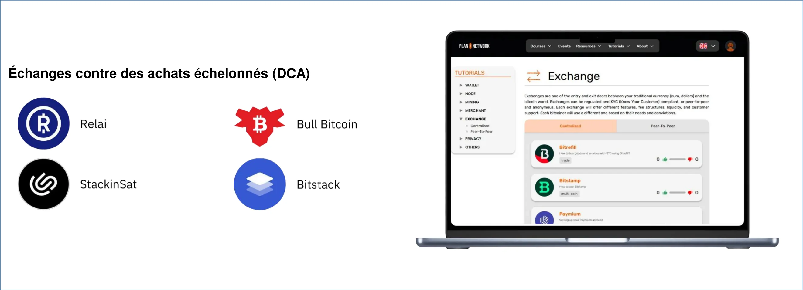

Tóm lại, người dùng tích cực đóng vai trò trực tiếp trong việc thúc đẩy hệ sinh thái Bitcoin phát triển. Bằng cách kết hợp Bitcoin vào thói quen hàng ngày của họ, họ không chỉ hỗ trợ việc áp dụng mà còn phát triển chuyên môn của riêng họ.

Trong chương tiếp theo, chúng ta sẽ khám phá hồ sơ người dùng Bitcoin cuối cùng và có lẽ là hấp dẫn nhất: người dùng hoang tưởng.

## Người chơi Bitcoin hoang tưởng: Quyền riêng tư là trên hết

<chapterId>5c624acd-662e-5134-ab7a-fb75cde7c3f8</chapterId>

:::id video=6a7b8c9d-0e1f-2a3b-4c5d-6e7f8a9b0c1d:::

Đối với những người dùng Bitcoin hoang tưởng, quyền riêng tư không phải là tùy chọn; mà là điều thiết yếu. Trong một thế giới mà gần như mọi động thái tài chính đều được theo dõi, họ coi việc bảo vệ danh tính và lịch sử giao dịch của mình là một phần không thể thương lượng khi sử dụng Bitcoin. Họ thường rất nhận thức được những rủi ro liên quan đến việc tiết lộ dữ liệu cá nhân (đặc biệt là khi sử dụng các sàn giao dịch tuân thủ KYC yêu cầu xác minh ID).

Đối với họ, mọi hành động đều quan trọng. Mọi giao dịch, mọi thiết lập Wallet và mọi tương tác với mạng đều được cân nhắc cẩn thận. Chỉ một sơ suất nhỏ cũng có thể tiết lộ thông tin nhạy cảm liên kết danh tính của họ với tài sản Bitcoin của họ. Mục tiêu cuối cùng của họ? Sử dụng Bitcoin theo cách giữ kín danh tính, vị trí và tình hình tài chính của họ.

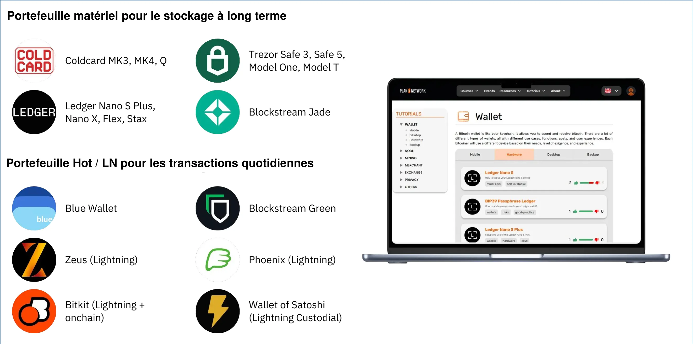

### Tại sao lại phải thận trọng như vậy?

Việc lựa chọn tư duy coi trọng quyền riêng tư mang lại một số lợi ích chính:

- Tự chủ về tài chính:** Bằng cách tránh xa sự giám sát của các ngân hàng, chính phủ và tập đoàn, bạn tự bảo vệ mình khỏi sự giám sát và can thiệp không mong muốn.
- Bảo vệ tài sản:** Nếu điều kiện kinh tế hoặc chính trị trở nên bất ổn, bên thứ ba sẽ khó có thể truy tìm hoặc thu giữ Bitcoin của bạn nếu nó không liên quan đến danh tính của bạn.
- Cải thiện an toàn cá nhân:** Những người được biết là sở hữu một lượng lớn Bitcoin có thể trở thành mục tiêu. Việc giữ kín danh tính của bạn sẽ làm giảm nguy cơ bị nhắm mục tiêu.
- Không bị phân biệt đối xử**: Một số dịch vụ hoặc chính phủ có thể chặn các giao dịch hoặc tài khoản dựa trên hoạt động trước đây của bạn hoặc bạn là ai. Quyền riêng tư giúp kiểm soát quyền lực đó.
- Giữ đúng với nguồn gốc của Bitcoin:** Bitcoin được thiết kế như một hình thức tiền không kiểm duyệt và không cần xin phép. Bảo vệ quyền riêng tư của bạn là một phần của việc tôn vinh sứ mệnh ban đầu đó.

Đây là một phản ứng thông minh, được tính toán trước những mối đe dọa thực sự tồn tại trong bối cảnh kỹ thuật số và tài chính ngày nay. Đúng vậy, cách tiếp cận này đòi hỏi nhiều nỗ lực hơn. Cần có thời gian, kiến thức kỹ thuật và kỷ luật. Nhưng đối với những người chọn con đường này, không chỉ là sử dụng Bitcoin; mà là giành lại quyền kiểm soát tiền bạc, danh tính và sự tự do của họ.

Họ không chỉ là nhà đầu tư hay người dùng; họ đang từ chối tham gia vào một hệ thống đòi hỏi phải biết mọi thứ về họ.

### Kế hoạch đầu tư hoang tưởng

Người dùng Bitcoin hoang tưởng tuân theo một chiến lược nghiêm ngặt được xây dựng xung quanh hai mục tiêu cốt lõi: bảo vệ tính ẩn danh và tối đa hóa bảo mật. Kiểu người dùng này tìm cách tránh tiếp xúc với các nền tảng được quản lý (đặc biệt là các nền tảng yêu cầu KYC), loại bỏ khả năng truy xuất giao dịch và bảo vệ tiền của họ khỏi sự giám sát, tịch thu và các mối đe dọa bên ngoài khác.

#### 1. Thiết lập ví và nút

Người dùng hoang tưởng không bao giờ trộn tiền dựa trên nguồn gốc hoặc mục đích sử dụng. Thay vào đó, họ phân chia Bitcoin của mình theo mục đích, sử dụng nhiều ví chuyên dụng:

- A Cold Wallet (có khoảng cách không khí và/hoặc tự làm)** Các khoản nắm giữ dài hạn được lưu trữ trong các ví có khoảng cách không khí hoặc tự làm có độ bảo mật cao. Đây thường là các thiết bị nguồn mở hoặc có mã có thể xác minh, chẳng hạn như Jade, Coldcard, SeedSigner, Portal hoặc Passport... Bất cứ khi nào có thể, họ sẽ mua các thiết bị này một cách ẩn danh; bằng cách trả tiền mặt hoặc sử dụng Bitcoin tại một cửa hàng thực tế hoặc bằng cách đặt hàng trực tuyến với các tùy chọn vận chuyển kín đáo và thanh toán bằng BTC. Ví dụ, tại Pháp, [Bitcoin Bazar](https://bitcoinbazar.fr/) là một cửa hàng như vậy. Bạn có thể tìm kiếm các nhà cung cấp tương tự trong khu vực của mình.

https://planb.network/tutorials/wallet/hardware/jade-plus-sparrow-938abf16-e10a-4618-860d-cd771373a262

https://planb.network/tutorials/wallet/hardware/coldcard-q-advanced-b8cc3f29-eea9-48fe-a953-b003d5b115e0

https://planb.network/tutorials/wallet/hardware/passport-74e53858-3fa2-43f9-b866-573297546236

https://planb.network/tutorials/wallet/hardware/portal-bd6e83f0-0100-4689-aeb3-513cca944ace

- Hot Wallet cho các giao dịch hàng ngày**, Đối với chi tiêu thường xuyên, người dùng hoang tưởng sẽ chọn ví tập trung vào quyền riêng tư như Ashigaru, Wasabi Wallet hoặc Sparrow wallet. Những ví này hỗ trợ các tính năng nâng cao như: giao dịch chi tiêu mini-CoinJoin, payjoin, công cụ CoinJoin tiềm năng, kiểm soát tiền xu, gắn thẻ UTXO hoặc khả năng kết nối thông qua nút Bitcoin của riêng bạn.

https://planb.network/tutorials/wallet/desktop/sparrow-c674e2ac-d46f-4c82-92a7-7d1b0e262f5d

https://planb.network/tutorials/wallet/desktop/wasabi-a0b51540-32d2-4ed2-98aa-801da5d35cf6

- Việc chạy **nút Bitcoin** của riêng họ là điều cần thiết. Nó đảm bảo kiểm soát hoàn toàn việc phát sóng giao dịch và tránh phụ thuộc vào cơ sở hạ tầng của bên thứ ba. Nó cũng bảo vệ quyền riêng tư, ngăn chặn kiểm duyệt và cho phép họ tự xác minh các quy tắc của giao thức Bitcoin. Cho dù trên Linux, Windows, macOS hay thông qua các thiết lập cắm và chạy như RaspiBlitz, myNode hoặc Start9, người dùng hoang tưởng coi nút của họ là trụ cột không thể thương lượng của chủ quyền.

https://planb.network/tutorials/node/bitcoin/bitcoin-core-linux-568c13a6-8746-4d63-8e95-f4a61c5ae0ed

https://planb.network/tutorials/node/bitcoin/bitcoin-core-mac-windows-9684ab02-e0af-41c9-8102-86ac7c7727f3

https://planb.network/tutorials/node/bitcoin/bitcoin-knots-e04b2196-4df2-4246-86ef-c02269c29098

https://planb.network/tutorials/node/bitcoin/raspiblitz-d8cdba2e-a682-46cf-9fdc-d8602fbeac02

https://planb.network/tutorials/node/bitcoin/mynode-a481fef3-2fd3-4df3-91c0-112cffa094eb

https://planb.network/tutorials/node/bitcoin/start9-8c8b6827-8423-4929-bcba-89057670ed6a

- Để giao dịch qua **Lightning Network** trong khi vẫn giữ nguyên mức độ kiểm soát và tùy ý, họ cũng vận hành nút Lightning của riêng mình. Điều này cho phép họ quản lý các kênh trực tiếp và chi tiêu theo cách giảm thiểu giám sát hoặc sự phụ thuộc vào các dịch vụ lưu ký.

https://planb.network/tutorials/node/lightning-network/alby-hub-62e6356c-6a6d-4134-8f22-c3b6afb9882a

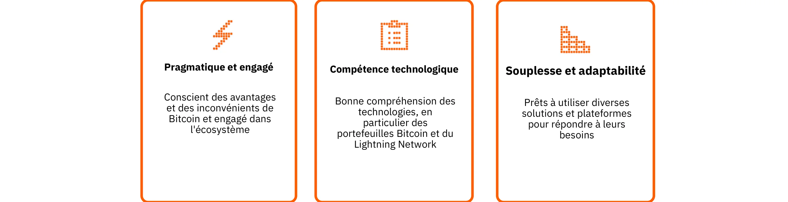

Bảo mật không dừng lại ở đó. Để sao lưu cụm từ seed, người dùng hoang tưởng sử dụng bản sao lưu bằng kim loại kết hợp với phong bì niêm phong chống giả mạo. Họ thường xuyên xác minh rằng bản sao lưu vẫn không bị xâm phạm và kiểm tra các quy trình khôi phục Wallet để sẵn sàng cho mọi tình huống bất trắc.

https://planb.network/tutorials/wallet/backup/backup-mnemonic-22c0ddfa-fb9f-4e3a-96f9-46e2a7954270

https://planb.network/tutorials/wallet/backup/recovery-test-5a75db51-a6a1-4338-a02a-164a8d91b895

Khi nói đến việc bảo mật tiền tiết kiệm, họ có thể triển khai các thiết lập phức tạp hơn như ví đa chữ ký (có hoặc không có khóa thời gian).

https://planb.network/tutorials/wallet/desktop/liana-306ef457-700c-4fdd-b07a-8fb7a8a29f04

Các cấu hình này làm giảm rủi ro. Việc thêm BIP39 passphrase vào cụm từ seed sẽ tăng thêm một lớp bảo vệ nữa cho Layer và đảm bảo rằng quyền truy cập vào quỹ của họ không thể bị xâm phạm chỉ bằng một lần phát hiện.

https://planb.network/tutorials/wallet/backup/passphrase-a26a0220-806c-44b4-af14-bafdeb1adce7

Một Bitcoiner hoang tưởng tất nhiên sẽ có một kế hoạch thừa kế được cân nhắc kỹ lưỡng cho số bitcoin của họ. Chủ đề quan trọng này sẽ được đề cập chi tiết trong phần tiếp theo của khóa học.

Nói rộng hơn, loại người dùng này áp dụng cách tiếp cận tiên tiến, có ý thức về quyền riêng tư vào toàn bộ hoạt động tính toán. Họ dựa vào các công cụ mã nguồn mở, an toàn tôn trọng quyền riêng tư của người dùng trong mọi Layer của cuộc sống số của họ:

- Hệ điều hành**, cả trên điện thoại và máy tính của họ;

https://planb.network/tutorials/computer-security/operating-system/grapheneos-08d43d7a-0b22-4638-a151-578d48d32d88

https://planb.network/tutorials/computer-security/operating-system/linux-mint-da44852e-513f-4004-949a-8fde60c1bca5

https://planb.network/tutorials/computer-security/operating-system/ubuntu-78a3be56-5d51-4ec3-8629-0dd27c352ab5

- Công cụ xác thực** ;

https://planb.network/tutorials/computer-security/authentication/authy-a76ab26b-71b0-473c-aa7c-c49153705eb7

https://planb.network/tutorials/computer-security/authentication/bitwarden-0532f569-fb00-4fad-acba-2fcb1bf05de9

https://planb.network/tutorials/computer-security/authentication/keepass-f8073bb7-5b4a-4664-9246-228e307be246

https://planb.network/tutorials/computer-security/authentication/security-key-61438267-74db-4f1a-87e4-97c8e673533e

- Công cụ truyền thông**;

https://planb.network/tutorials/computer-security/communication/ivpn-5a0cd5df-29f1-4382-a817-975a96646e68

https://planb.network/tutorials/computer-security/communication/mullvad-968ec5f5-b3f0-4d23-a9e0-c07a3e85aaa8

https://planb.network/tutorials/computer-security/communication/proton-mail-c3b010ce-254d-4546-b382-19ab9261c6a2

https://planb.network/tutorials/computer-security/communication/tor-browser-a847e83c-31ef-4439-9eac-742b255129bb

- Công cụ quản lý dữ liệu**.

https://planb.network/tutorials/computer-security/data/integrity-authenticity-21d0420a-be02-4663-94a3-8d487f23becc

https://planb.network/tutorials/computer-security/data/proton-drive-03cbe49f-6ddc-491f-8786-bc20d98ebb16

https://planb.network/tutorials/computer-security/data/veracrypt-d5ed4c83-7c1c-4181-95ea-963fdf2d83c5

Nếu bạn muốn tìm hiểu thêm về chủ đề bảo mật CNTT, chúng tôi cung cấp khóa học năm nhất hoàn chỉnh dành riêng cho chủ đề này:

https://planb.network/courses/99c46148-7080-4915-a7e0-9df0e145cd47

#### 2. Mua bitcoin ẩn danh

Một nguyên tắc cốt lõi đối với nhà đầu tư hoang tưởng là mua Bitcoin mà không liên kết nó với danh tính thực tế của họ. Để tránh các nền tảng KYC và ngăn chặn dấu vân tay On-Chain, họ chuyển sang một số chiến lược:

- Nền tảng mua P2P** như Bisq, Robosat, LNP2PBot, Peach, HODL HODL, v.v.;

https://planb.network/tutorials/exchange/peer-to-peer/bisq-v2-c1c6a702-6c16-4101-8b90-62c424017b80

https://planb.network/tutorials/exchange/peer-to-peer/hodlhodl-d7344cd5-6b18-40f5-8e78-2574a93a3879

https://planb.network/tutorials/exchange/peer-to-peer/lnp2pbot-v2-e6bcb210-610b-487d-970c-7cce85273e3c

https://planb.network/tutorials/exchange/peer-to-peer/peach-c6143241-d900-4047-9b73-1caba5e1f874

https://planb.network/tutorials/exchange/peer-to-peer/robosats-b60e4f7c-533a-4295-9f6d-5368152e8c06

- Giao dịch tiền mặt trực tiếp**, ví dụ như tại các buổi gặp mặt Bitcoin địa phương;

https://planb.network/courses/1c643dc9-a15f-4f9e-93b6-cb3c58b4ee35

- Máy ATM Bitcoin**;
- Kiếm Sats** bằng cách cung cấp hàng hóa hoặc dịch vụ trong Exchange cho Bitcoin;
- Mining bitcoin**.

https://planb.network/tutorials/mining/hardware/attakai-0d177e6b-e167-4b25-8e38-4ec74213d1fb

https://planb.network/tutorials/mining/hardware/braiin-mini-miner-b4c5cb2c-e7ee-4521-a750-edefb0747db3

https://planb.network/tutorials/mining/hardware/bitaxe-d317e1a7-d775-401d-85df-51f4f2217566

Các sàn giao dịch tập trung hoàn toàn bị tránh vì những rủi ro mà chúng gây ra; cả về quyền riêng tư lẫn khả năng bị kiểm duyệt hoặc tịch thu.

#### 3. Ngăn chặn theo dõi trên chuỗi

Ngay cả sau khi mua coin ẩn danh, vẫn có khả năng rò rỉ dữ liệu cá nhân On-Chain nếu bạn không cẩn thận. Người dùng hoang tưởng thực hiện các bước bổ sung để bảo vệ quyền riêng tư ở cấp độ giao dịch:

- Tránh tái sử dụng Address**, bằng cách thủ công hoặc sử dụng các công cụ tiên tiến như Thanh toán im lặng hoặc BIP47;
- Gắn nhãn UTXO của bạn**;
- Thực hành kiểm soát góc khi chi tiêu** ;
- Tránh việc hợp nhất UTXO**;
- Sử dụng các cấu trúc giao dịch bảo vệ quyền riêng tư**: coinjoin, payjoin, ricochets và mini-payment coinjoin...

Họ cũng quen thuộc với những điều cơ bản của giám sát Blockchain và biết cách các công ty theo dõi hoạt động. Bằng cách hiểu được các phương pháp và mô hình được các công ty phân tích chuỗi sử dụng, họ có thể thực hiện các bước chủ động để tránh rơi vào các bẫy đã biết.

Đối với những ai muốn tìm hiểu sâu hơn về quyền riêng tư và khả năng chống giám sát của On-Chain, chúng tôi cung cấp khóa đào tạo nâng cao năm thứ hai về các hoạt động bảo mật của Bitcoin:

https://planb.network/courses/65c138b0-4161-4958-bbe3-c12916bc959c

#### 4. Luôn cảnh giác và cập nhật chiến lược của họ

Giao thức Bitcoin, Lightning Network và các công cụ liên quan đang liên tục phát triển. Người dùng hoang tưởng vẫn cảnh giác và thích nghi:

- Luôn cập nhật thông tin về các kỹ thuật bảo mật và công cụ bảo mật mới
- Thường xuyên kiểm tra các công cụ và dịch vụ mới để duy trì hoạt động thiết lập của chúng
- Kiểm tra thường xuyên xem ví phần cứng và nút có được cập nhật và hoạt động chính xác không
- Kiểm tra định kỳ rằng các bản sao lưu (ví dụ: phong bì Mnemonic đã niêm phong) không bị giả mạo
- Theo dõi diễn biến pháp lý để điều chỉnh chiến lược của họ theo thời gian thực

### Đánh giá hồ sơ hoang tưởng của bạn

Áp dụng chiến lược hoang tưởng không phải là quyết định tùy tiện. Nó đòi hỏi kỷ luật nghiêm ngặt, sự siêng năng liên tục và đầu tư đáng kể thời gian để thành thạo các công cụ và biện pháp bảo mật tốt nhất.

Cách tiếp cận này có phù hợp với bạn không?

Sau đây là những đặc điểm chính của một người chơi bitcoin hoang tưởng:

- Cảnh giác và có ý thức bảo mật**: Bạn coi trọng quyền riêng tư của mình và sẵn sàng thực hiện các biện pháp phòng ngừa bổ sung để ngăn chặn bất kỳ rò rỉ thông tin cá nhân nào. Bạn coi giám sát tài chính là mối đe dọa nghiêm trọng và tích cực tìm cách bảo vệ bản thân khỏi nó.
- Độc lập**: Bạn từ chối dựa vào bất kỳ dịch vụ của bên thứ ba nào để lưu trữ, quản lý hoặc chuyển bitcoin của mình. Bạn đã sẵn sàng lưu trữ các nút Bitcoin và Lightning của riêng mình, sử dụng ví phức tạp và chịu toàn bộ trách nhiệm quản lý các bản sao lưu và khóa riêng của mình.
- Không tin tưởng**: Bạn chủ động tránh các nền tảng KYC và thích các phương pháp thu thập P2P ẩn danh, ngay cả khi điều đó có nghĩa là phải trả phí bảo hiểm cho chúng. Bạn hiểu rằng bất kỳ dữ liệu cá nhân nào được chia sẻ một ngày nào đó có thể được sử dụng để chống lại bạn.
- Có kiến thức và kỷ luật**: Bạn đam mê an ninh mạng và công nghệ tăng cường quyền riêng tư. Bạn dành thời gian để nghiên cứu các giải pháp khả dụng, thử nghiệm các công cụ, tự tìm hiểu về các phương pháp hay nhất và áp dụng các phương pháp nghiêm ngặt để giảm thiểu rủi ro.
- Thực dụng và Thực tế**: Bạn hiểu rằng ẩn danh hoàn toàn là điều gần như không thể, nhưng bạn cố gắng giảm thiểu khả năng tiếp xúc của mình càng nhiều càng tốt trong khi vẫn cân bằng được quyền riêng tư, bảo mật và khả năng sử dụng. Cách tiếp cận của bạn liên tục phát triển để ứng phó với các mối đe dọa mới và sự phát triển của công nghệ.

Nếu những đặc điểm này nghe quen thuộc, thì chiến lược này có thể phù hợp với bạn. Nó đòi hỏi nhiều nỗ lực và liên tục, nhưng nó cung cấp mức độ tự chủ tài chính cao và bảo vệ chống lại việc giám sát, tịch thu hoặc truy xuất nguồn gốc tiền của bạn.

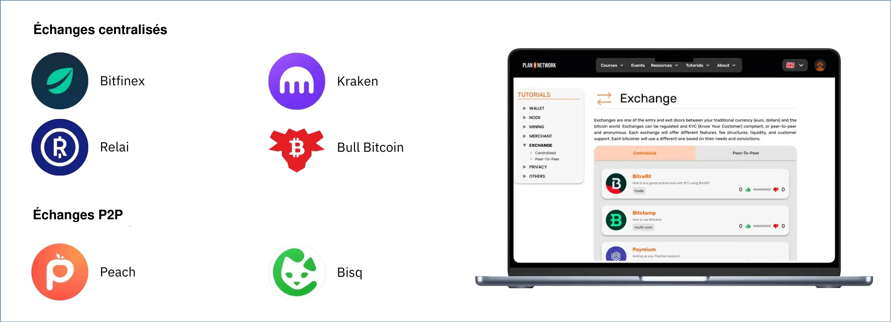

Cách tiếp cận này đặc biệt phù hợp nếu bạn:

- Giữ một lượng đáng kể Bitcoin,
- Sống dưới chế độ độc tài,
- cần bảo vệ sự ẩn danh của bạn vì lý do cá nhân, chuyên môn hoặc lý tưởng.

Trong phần tiếp theo của khóa học, chúng ta sẽ thảo luận về một chủ đề quan trọng thường bị bỏ qua: cách chuyển bitcoin của bạn trong trường hợp khẩn cấp.

# Bảo vệ người thừa kế và tài sản của bạn

<partId>0b8a9528-719b-4a2d-bd50-1e173a896570</partId>

## Tạo kế hoạch thừa kế

<chapterId>233c88d3-2e8e-5eba-ac06-efe67a209038</chapterId>

:::video id=7b8c9d0e-1f2a-3b4c-5d6e-7f8a9b0c1d2e:::

Đảm bảo việc truyền tải bitcoin của bạn là một trách nhiệm thường bị bỏ qua nhưng lại rất quan trọng. Quyền tự chủ tài chính mà Bitcoin cung cấp cũng đi kèm với nhu cầu quản lý tài sản cẩn thận. Nếu không có điều này, những người thừa kế của bạn có thể thấy mình không thể tiếp cận được số tiền mà bạn kiếm được theo Hard. Trong chương này, chúng ta sẽ khám phá những điều cơ bản của việc lập kế hoạch tài sản khi áp dụng cho Bitcoin.

### Tại sao cần phải chuẩn bị kế hoạch kế nhiệm Bitcoin?

Hãy tưởng tượng một sự kiện bất ngờ (tai nạn hoặc tình huống không lường trước) và bạn không còn ở đây nữa. Gia đình bạn, vốn đã đau buồn, giờ phải đối mặt với một thách thức khác: truy cập bitcoin của bạn. Họ có thể đã nghe bạn nói về khóa riêng tư, cụm từ Mnemonic và tính không thể đảo ngược của các giao dịch, nhưng những khái niệm này có thể không rõ ràng với họ. Họ phải tự mình tìm hiểu.

Sau đó bạn có hai lựa chọn:

- Dành thời gian để lập một kế hoạch rõ ràng, có cấu trúc cho phép những người thân yêu của bạn truy cập vào bitcoin của bạn một cách dễ dàng và an toàn;
- Không làm gì cả, hy vọng họ sẽ tự tìm ra. Nhưng nếu họ mắc lỗi, mất quyền truy cập vào Wallet hoặc vô tình gửi tiền đến nhầm Address, tài sản của bạn có thể mất mãi mãi.

Chỉ cần dành 15 phút đến một giờ cho kế hoạch thừa kế có thể tạo nên sự khác biệt. Đây không chỉ là vấn đề thận trọng mà còn là cách thể hiện trách nhiệm với những người có thể tin tưởng bạn.

### Mục tiêu của Kế hoạch Kế nhiệm Bitcoin

Trong cuốn sách *[Cryptoasset Inheritance Planning](https://www.amazon.com/gp/product/1947910116/)*, Pamela Morgan đã phác thảo bốn mục tiêu chính cho một kế hoạch thừa kế vững chắc:

- Đảm bảo người thừa kế của bạn có thể truy cập vào bitcoin của bạn vào đúng thời điểm (nhưng không phải trước đó);
- Giảm thiểu rủi ro bị trộm cắp hoặc bị xâm phạm trước khi họ thừa kế bitcoin;
- Hãy đảm bảo rằng những người thừa kế của bạn biết cách bảo vệ bitcoin lâu dài nếu họ muốn;
- Tránh tranh chấp gia đình và hạn chế các vấn đề pháp lý phức tạp khi chuyển giao tài sản tiền điện tử.

Một kế hoạch được cân nhắc kỹ lưỡng không chỉ là việc chuyển giao tài sản; mà còn là bảo vệ những người thân yêu của bạn khỏi những sai lầm phổ biến và các mối đe dọa tiềm ẩn.

Chương này lấy cảm hứng từ tác phẩm của [Pamela Morgan](https://x.com/pamelawjd). [Cuốn sách của bà](https://www.amazon.com/gp/product/1947910116/) và trong khi cuốn sách của bà cung cấp phương pháp chi tiết và được chuyên gia xác thực để lập kế hoạch thừa kế Bitcoin, **nội dung này không cấu thành tư vấn pháp lý**. Đây là phương pháp đã được chứng minh, nhưng mỗi người nên tự nghiên cứu và điều chỉnh các khuyến nghị cho phù hợp với hoàn cảnh cá nhân và quyền hạn của mình.

[Pamela Morgan](https://x.com/pamelawjd) đã hào phóng cho phép sử dụng [tác phẩm của cô ấy](https://www.amazon.com/gp/product/1947910116/) cho khóa học này và chúng tôi sẽ làm theo cách tiếp cận của cô ấy để tạo ra một kế hoạch thừa kế Bitcoin cụ thể. Trong chương này, chúng tôi sẽ tập trung vào phần đầu tiên của cuốn sách của cô ấy.

Để hiểu rõ hơn về cách tạo kế hoạch kế thừa Bitcoin, chúng ta sẽ xem xét ví dụ về Cédric, một người dùng Bitcoin điển hình, người cần sắp xếp cách thức chuyển giao tài sản của mình nếu có điều gì bất ngờ xảy ra.

Hồ sơ của anh ấy:

- Nhà đầu tư dài hạn không giao dịch thường xuyên;
- Sở hữu một chiếc Hardware Wallet và một chiếc Wallet di động để sử dụng thỉnh thoảng;
- Sử dụng một nền tảng KYC Exchange duy nhất để mua bitcoin;
- Được anh họ giới thiệu với Bitcoin;
- Không có altcoin hoặc sử dụng Lightning Network.

Mục tiêu của chúng tôi là tạo ra một kế hoạch đơn giản, hiệu quả phù hợp với hồ sơ của Cédric trước khi chuyển sang các tình huống phức tạp hơn liên quan đến những loại người dùng khác.

### Trước khi bạn bắt đầu

Hãy dành 30 phút thời gian của bạn. Không phải cho bản thân bạn, mà cho những người phụ thuộc vào bạn. Lập kế hoạch bất động sản là một nhiệm vụ quan trọng, nhưng thường bị trì hoãn, bỏ bê hoặc thậm chí là phớt lờ. Quá nhiều người, ngay cả những người thận trọng nhất, cũng trì hoãn... cho đến khi quá muộn. Hàng nghìn bitcoin đã bị mất do thiếu tầm nhìn xa. Đừng mắc phải sai lầm này! Đây là **BƯỚC CUỐI CÙNG** trong hành trình hướng đến chủ quyền tài chính của bạn: đảm bảo sự giàu có Bitcoin của bạn cho những người thân yêu của bạn.

#### Bạn cần gì?

Hãy đảm bảo rằng bạn có một môi trường yên tĩnh, không bị sao nhãng, sau đó chuẩn bị một số công cụ sau:

- 4 đến 5 tờ giấy trắng;
- Cái bút;
- 2 phong bì;
- Một cuốn sổ điện thoại hoặc Address;
- Một máy tính (tùy chọn).

#### Những quan niệm sai lầm phổ biến về kế hoạch thừa kế

Nhiều người trì hoãn bước này vì những quan niệm sai lầm ngăn cản họ hành động. Sau đây là một số huyền thoại phổ biến, được Pamela Morgan nêu trong _Cryptoasset Inheritance Planning_ (trang 18):

- "*Tôi cần thuê luật sư.*"** → **Sai**. Mặc dù luật sư có thể hữu ích trong các vấn đề pháp lý, nhưng có thể lập kế hoạch thừa kế Bitcoin kỹ thuật mà không cần luật sư. Điều quan trọng nhất là phải có hướng dẫn rõ ràng và dễ hiểu;
- "*Tôi cần tin tưởng một bên thứ ba.*"** → **Sai**. Kế hoạch của bạn có thể được thiết kế theo cách giảm thiểu nhu cầu tin tưởng, chẳng hạn như phân phối thông tin cho nhiều bên hoặc sử dụng các giải pháp đa chữ ký, có hoặc không có khóa thời gian;
- "*Việc lập kế hoạch sẽ khiến tài sản của tôi dễ bị đánh cắp.*"** → **Sai**. Một kế hoạch được cân nhắc kỹ lưỡng sẽ bảo vệ chống lại các nỗ lực trộm cắp trong khi đảm bảo rằng những người thừa kế của bạn có thể lấy lại tiền của bạn một cách an toàn. Tuy nhiên, điều quan trọng cần lưu ý là không có giải pháp nào là hoàn hảo: một kế hoạch thừa kế sẽ làm tăng nguy cơ bị trộm cắp, tùy thuộc vào thông tin được chia sẻ. Chúng ta sẽ thảo luận chi tiết hơn về vấn đề này sau;
- "*Giá trị bitcoin của tôi quá nhỏ để lên kế hoạch.*"** → **Sai**. luôn tốt hơn khi lên kế hoạch trước. Những người thân yêu của bạn có thể không biết chính xác số lượng Bitcoin mà bạn sở hữu, và đó là điều tốt. Nhưng nếu có chuyện gì xảy ra với bạn, họ sẽ không muốn lấy lại nó sao, ngay cả khi họ không biết chính xác số lượng? Giá trị của Bitcoin có thể tăng đáng kể theo thời gian, vì vậy, bạn nên tạo điều kiện để họ dễ dàng tiếp cận tiền của mình hơn và tránh tạo cho họ hy vọng hão huyền về giá trị hoặc để họ phải tìm kiếm thứ gì đó có thể không tồn tại.
- "*Những người thừa kế của tôi sẽ tự tìm ra.*"** → **Sai**. Bitcoin không giống như một tài khoản ngân hàng thông thường. Nếu không có hướng dẫn rõ ràng, những người thân yêu của bạn có thể không bao giờ có thể truy cập vào tiền của bạn hoặc chỉ tìm thấy một phần tiền. Không giống như các tài khoản ngân hàng, nơi các tổ chức tài chính hoặc công chứng viên liên lạc với các thành viên gia đình sau khi chết, không có bên trung gian nào sẽ thông báo cho gia đình bạn về Bitcoin Wallet của bạn. Do đó, bạn phải đưa nó vào kế hoạch di sản của mình một cách rõ ràng;
- "*Smart contract có thể quản lý mọi thứ.*"** → **Sai**. Smart contract, chẳng hạn như multi-sig Wallet có khóa thời gian, có thể là một phần của giải pháp, nhưng nó sẽ không bao giờ thay thế được một kế hoạch có cấu trúc tốt, đặc biệt là đối với những người không quen với Bitcoin. Cả hai giải pháp đều bổ sung cho nhau.

Đã đến lúc hành động. Hãy dành 30 phút này để lập kế hoạch thừa kế của bạn. Đây là một bước đơn giản nhưng có thể tạo nên sự khác biệt cho những người thân yêu của bạn.

### Bước 1: Chọn đúng người để hỗ trợ người thừa kế của bạn

Khi nói đến việc truyền lại tài sản thừa kế trong Bitcoin, những người thân yêu của bạn có thể sẽ không quen với việc quản lý khóa riêng hoặc khôi phục ví. Họ sẽ cần sự hỗ trợ bên ngoài từ những cá nhân có năng lực và đáng tin cậy. Cách tiếp cận lý tưởng là chọn ít nhất hai người khác nhau:

- Một người họ hàng đáng tin cậy**, người sẽ đảm bảo kế hoạch của bạn được thực hiện suôn sẻ. Họ không nhất thiết phải có kiến thức sâu rộng về Bitcoin, nhưng họ phải là người mà người thừa kế của bạn có thể tin cậy.
- Người dùng Bitcoin có kinh nghiệm**, có thể cung cấp hỗ trợ kỹ thuật để khôi phục tiền, quản lý ví và hiểu các quy trình liên quan.

Những người bạn chọn sẽ không bao giờ được phép truy cập trực tiếp vào khóa riêng tư của bạn (hoặc cụm từ Mnemonic) nhưng họ cần có khả năng:

- Hướng dẫn người thừa kế của bạn thu hồi và đảm bảo tiền;
- Giải thích những điều cơ bản về ví Bitcoin, cụm từ khôi phục và giao dịch;
- Giúp tránh những lỗi thường gặp.

Trên giấy tờ sẽ trở thành kế hoạch thừa kế Bitcoin của bạn, hãy tạo một bảng so sánh các ứng viên tiềm năng, đánh giá mức độ tin cậy của họ, kiến thức của họ về Bitcoin và cách liên hệ với họ. Ví dụ:

| Person               | Trust Level     | Bitcoin Knowledge   | Contact Methods         | Notes                                                                                                                   |
|----------------------|-----------------|----------------------|--------------------------|------------------------------------------------------------------------------------------------------------------------|
| My brother Bob       | Very high       | Low                  | Phone & email            | Bob doesn't know Bitcoin well, but he's 100% reliable. He can ensure the process goes smoothly.                        |
| My cousin Nathan     | High            | Medium               | Phone & Instagram        | Has some Bitcoin knowledge and can guide my heirs. Aware of the plan. #1 to talk to in case of need.                   |
| Ricco (Bitcoiner friend) | Medium      | Very high            | Twitter, email & photo   | Very technically skilled, but should never have access to the funds. To be contacted for technical support.            |
| Bitcoin YouTuber     | Low             | High                 | YouTube channel          | Good information source for learning, but cannot intervene directly.                                                   |

Nếu bạn không có thành viên gia đình đáng tin cậy hoặc có năng lực, bạn cũng có thể cân nhắc thuê một chuyên gia, chẳng hạn như luật sư chuyên về thừa kế Bitcoin hoặc dịch vụ lập kế hoạch di sản chuyên biệt. Điều quan trọng là những người thừa kế của bạn có thể tiếp cận được sự trợ giúp kỹ thuật đáng tin cậy trong khi vẫn duy trì được tính bảo mật và bí mật của tiền của bạn.

### Bước 2: Tạo một bản kiểm kê nhanh chóng và dễ dàng

Trước khi nghĩ đến việc bảo mật hoặc chuyển giao bitcoin của bạn, điều quan trọng là phải lập danh mục rõ ràng về tài sản Bitcoin của bạn. Danh mục này sẽ đóng vai trò là nền tảng để tổ chức kế hoạch thừa kế của bạn và sẽ giúp những người thừa kế của bạn hiểu được tài sản của bạn ở đâu và cách tiếp cận chúng.

Mục tiêu ở đây không phải là cải thiện ngay lập tức tính bảo mật của bạn mà chỉ đơn giản là lập danh mục tình hình hiện tại của bạn. Đây là ảnh chụp nhanh về bitcoin của bạn và phương tiện để truy cập chúng. Bạn có thể điều chỉnh và tăng cường tính bảo mật sau khi hoàn tất đợt kiểm kê đầu tiên này.

Hãy xem xét tất cả những nơi bạn có bitcoin hoặc tiền pháp định liên quan đến Bitcoin. Điều này có thể bao gồm:

- Nền tảng Exchange**: Tài khoản có BTC hoặc tiền pháp định được liên kết với giao dịch mua Bitcoin của bạn.
- Ví Hot (di động hoặc máy tính để bàn)**: Ứng dụng được cài đặt trên điện thoại của bạn, được sử dụng cho các giao dịch hàng ngày;
- Ví phần cứng**: Thiết bị vật lý lưu trữ khóa riêng của bạn ngoại tuyến;
- Các giải pháp khác**: Multisig, ví giấy, khóa riêng được lưu trữ đặc biệt, v.v.

Sử dụng bảng để lập cấu trúc cho bản kiểm kê này. Ý tưởng không phải là lưu trữ tài liệu này trực tuyến mà là giữ nó ở một nơi an toàn, lý tưởng nhất là trên giấy. Ví dụ:

| General | Storage type | Assets held | Localization | Mnemonic backup | Password (PIN, passphrase...) | Notes |
| --------------------- | ---------------- | -------------- | --------------------------------- | ------------------------------------------------------------------------ | ----------------------------------------------------------------------------------------------- | --------------------------------------------------------------------------------------------------------------- |
| Bitfinex | BTC & Euros | Accessible online | None (custodial platform) | | Bitwarden & 2FA password manager with Authy app on my phone | I bought my BTC here. Funds must be withdrawn after purchase |
| Physical wallet | Jade Plus | BTC | Personal safe at home | Copy at my Uncle Bob's and in a bank safe at BNP Paribas | passphrase stored at my mother's. PIN code stored on Bitwarden password manager. PIN code stored on Bitwarden password manager. | I use 2 separate wallets: a normal one with only the mnemonic phrase and one with a passphrase. |
| Green Wallet | BTC | On my Iphone 15 | Copy of the seed in my safe at home | PIN code stored on the Bitwarden password manager. | The application is in hidden mode. | The application is in hidden mode |

Ở giai đoạn này, bạn có thể cảm thấy thôi thúc phải điều chỉnh ngay lập tức việc phân bổ quỹ, cải thiện an ninh hoặc thậm chí mua hoặc bán thêm bitcoin. Đừng hành động ngay! Mục tiêu ở đây không phải là hành động mà là thiết lập một bức ảnh chụp nhanh về tình hình hiện tại của bạn. Bạn luôn có thể cải thiện kế hoạch của mình sau này, nhưng hiện tại, hãy tập trung vào việc hoàn thành kiểm kê một cách kỹ lưỡng nhất có thể.

Sau khi hoàn tất việc kiểm kê, việc xác định điểm yếu và tổ chức quy trình truyền tải an toàn và hiệu quả sẽ dễ dàng hơn nhiều.

### Bước 3: Viết thư

#### Tại sao lại là thư viết tay?

Điều quan trọng là kế hoạch thừa kế của bạn phải rõ ràng, dễ đọc và an toàn. Để đạt được điều này, hãy viết thư bằng tay bằng mực trên giấy và tránh các tài liệu kỹ thuật số có thể bị xâm phạm. Bức thư này không phải là di chúc hoặc tuyên bố pháp lý, mà là hướng dẫn thực tế để giúp những người thân yêu của bạn khôi phục bitcoin của bạn một cách an toàn.

Bức thư phải đơn giản, trực tiếp và chứa đựng những nội dung thiết yếu sau đây:

- Phần giới thiệu giải thích bản chất của tài sản cần thu hồi;
- Thông tin liên lạc của những người đáng tin cậy có thể hỗ trợ người thừa kế của bạn trong quá trình phục hồi;
- Một bản kê khai tài sản rõ ràng, bao gồm phương pháp lưu trữ và thông tin chi tiết về quyền truy cập;
- Hướng dẫn bảo mật cụ thể để tránh lỗi hoặc lừa đảo;
- Thông điệp cuối cùng, cùng với bất kỳ hướng dẫn pháp lý nào nếu có.

#### Mẫu thư thừa kế

Đây là một mô hình lấy cảm hứng từ Kế hoạch kế thừa tài sản mã hóa của Pamela Morgan. Tất nhiên, bạn nên điều chỉnh nó cho phù hợp với tình hình cá nhân của mình:

---
**Ngày: `Chỉ định ngày`**

Kính gửi `Tên của người thừa kế`,

Nếu bạn đang đọc bức thư này, thì tôi không còn ở đây nữa. Trước hết, hãy biết rằng tôi yêu bạn và đã dành thời gian để chuẩn bị tài liệu này để giúp bạn quản lý bitcoin của tôi, có thể có giá trị. Đây không phải là một nhiệm vụ phức tạp, nhưng đòi hỏi sự cẩn thận và thận trọng. Bitcoin là một hệ thống ngang hàng: không có cách khắc phục nếu xảy ra lỗi. Vui lòng dành thời gian để đọc toàn bộ bức thư này trước khi thực hiện bất kỳ hành động nào.

#### 1. Liên hệ với những cá nhân đáng tin cậy

Tôi đã chỉ định một số người hỗ trợ bạn hiểu Bitcoin và thu hồi tài sản của tôi. Họ không bao giờ được phép tiếp cận trực tiếp với các khoản tiền nhưng có thể hướng dẫn bạn trong suốt quá trình:

- Anh trai tôi Bob: +33 6 00 00 00 00; bobmybrother@supermail.com. Bạn có thể tin tưởng Bob sẽ giúp bạn trong quá trình này. Mặc dù anh ấy không phải là người hiểu biết nhất về Bitcoin, nhưng anh ấy là người phù hợp để đặt câu hỏi về mọi thứ và đảm bảo sự thận trọng để đảm bảo thành công của bạn một cách an toàn.
- Anh họ tôi Nathan: +33 6 00 00 00 00; nathandelacroix@supermail.com. Nathan giới thiệu tôi với Bitcoin. Anh ấy rất giỏi về máy tính và có thể trả lời hầu hết các câu hỏi của bạn. Anh ấy cũng sở hữu một số Bitcoin và có thể hướng dẫn bạn về mặt kỹ thuật. Bạn đã gặp anh ấy tại các buổi họp mặt gia đình và tôi đã đưa một bức ảnh của anh ấy vào đây.
- Ricco: @RiccoSuperBitcoiner trên Twitter; ricco425@supermail.com. Tôi đã làm việc chặt chẽ với Ricco trong nhiều năm. Bạn chưa từng gặp anh ấy, vì vậy hãy đảm bảo bạn liên hệ đúng người bằng cách hỏi anh ấy "Tên con chó của Cédric là gì?" Nếu anh ấy trả lời "12", thì đó chính là anh ấy. Ricco là một chuyên gia Bitcoin rất thân thiện và có tay nghề cao. Anh ấy sẽ trả lời mọi câu hỏi của bạn và bạn có thể tin tưởng vào phán đoán của anh ấy về bảo mật Bitcoin. Đừng ngần ngại liên hệ với anh ấy, nhưng đừng bao giờ cho anh ấy quyền truy cập trực tiếp vào các quỹ.

Nghe có vẻ lạ, nhưng hãy liên hệ với tất cả họ. Ngoài ra, bạn có thể tìm hiểu thêm bằng cách nghe Andreas Antonopoulos trên YouTube và mua cuốn sách *Cryptoasset Inheritance Planning* của Pamela Morgan.

Hãy liên hệ với tất cả những người này và kiểm tra lại ý kiến của họ trước khi đưa ra quyết định quan trọng. **Đừng tin tưởng bất kỳ ai một cách mù quáng.**

#### 2. Bitcoin của tôi ở đâu?

Sau đây là danh mục chi tiết về tài sản của tôi, vị trí của chúng và cách tiếp cận chúng.

- Tôi sử dụng điện thoại (Samsung Galaxy S8) để truy cập Samourai Wallet của mình. Cụm từ khôi phục cho Wallet này được lưu thành hai bản: một bản được lưu trong két ngân hàng, bản còn lại với chú Bob. Mã PIN cần thiết để mở khóa cả điện thoại và Wallet của tôi được giữ ở nhà tôi và với bà tôi.
- Tôi truy cập nền tảng trực tuyến Exchange Bitfinex qua máy tính xách tay Dell 2018 của mình. Có thể vẫn còn bitcoin hoặc đô la. Để khôi phục số tiền này, bạn sẽ cần liên hệ trực tiếp với Bitfinex hoặc thử truy cập vào tài khoản của tôi. (**Hãy cẩn thận, điều này có thể là bất hợp pháp—hãy kiểm tra luật pháp địa phương của bạn**).
- Tôi đã bảo mật quyền truy cập vào tài khoản trực tuyến của mình bằng trình quản lý mật khẩu. Bản sao lưu của trình quản lý này được lưu trữ trong két ngân hàng. Tài khoản Bitfinex của tôi cũng được bảo vệ bằng xác thực hai yếu tố, có thể truy cập qua điện thoại của tôi (Samsung Galaxy S8, ứng dụng Authy) hoặc bằng cách sử dụng mã sao lưu mà tôi đã giữ ở nhà.
- Tôi sở hữu một Trezor Model One Hardware Wallet, truy cập qua PC của tôi bằng phần mềm Sparrow wallet. Cụm từ khôi phục cho Wallet này được lưu trữ thành hai bản: một bản trong két ngân hàng, bản còn lại với chú Bob. Mã PIN cho Wallet này được lưu trữ tại nhà tôi và với mẹ tôi. Bản thân thiết bị có thể được lưu trữ trong két an toàn tại văn phòng của tôi. Tôi sử dụng BIP39 passphrase trên Trezor Model One của mình. passphrase này rất quan trọng để truy cập vào tiền trong thiết bị. Bản sao lưu của passphrase này được lưu trữ ở hai vị trí: tại nhà tôi và với mẹ tôi.

Hãy thực hiện mọi biện pháp phòng ngừa cần thiết trước khi xử lý các khoản tiền này. Không bao giờ tiết lộ toàn bộ cụm từ khôi phục cho một người và chỉ chia sẻ những thông tin chi tiết này nếu thực sự cần thiết.

#### 3. Các biện pháp phòng ngừa và hướng dẫn an toàn

- Đừng vội vàng**. Hãy dành thời gian tìm hiểu trước khi hành động. Bitcoin an toàn khi sử dụng đúng cách.
- Không bao giờ đưa câu 24 từ cho chỉ một người**. Nếu ai đó yêu cầu bạn cấp quyền truy cập đầy đủ, hãy cẩn thận.
- Không kết nối ví của tôi với máy tính không xác định**. Sử dụng môi trường an toàn, ngoại tuyến nếu có thể.
- Hãy cẩn thận với lừa đảo**. Có rất nhiều vụ lừa đảo liên quan đến Bitcoin. Chỉ tin tưởng những người được đề cập trong thư này.
- Lưu mọi thứ bạn làm**. Ghi chú, ghi lại các bước quan trọng và bảo vệ quyền truy cập.

#### 4. Thông tin pháp lý và thông điệp cuối cùng

Bạn sẽ tìm thấy một bản sao di chúc của tôi trong hồ sơ cá nhân của tôi và với công chứng viên của tôi. Bức thư này không thay thế di chúc chính thức, nhưng nó sẽ hướng dẫn bạn quản lý bitcoin của tôi.

Hãy chăm sóc bản thân và nhớ rằng tôi yêu bạn. Mong muốn của tôi là những tài sản này hữu ích với bạn và giúp bạn tiến về phía trước với sự bình yên trong tâm hồn.

Chữ ký viết tay

Tên của bạn

Ngày

---
Đây là một ví dụ cụ thể về thư thừa kế. Hãy chắc chắn điều chỉnh nó cho phù hợp với hoàn cảnh cá nhân của bạn. Điều quan trọng nữa là quyết định mức độ chi tiết cần đưa vào quy trình khôi phục. Nếu bạn lo sợ người thừa kế của mình sẽ không thể khôi phục bitcoin của bạn với thông tin tối thiểu này, hãy cân nhắc viết hướng dẫn từng bước giải thích chi tiết quy trình.

Hơn nữa, bạn sẽ cần cân bằng lượng thông tin bạn tiết lộ trong kế hoạch thừa kế này. Bạn chia sẻ càng nhiều về các phương pháp bảo mật của mình, bạn càng có nguy cơ làm tổn hại đến an ninh của mình khi còn sống nếu lá thư này rơi vào tay kẻ xấu. Ví dụ, một tên trộm tìm thấy lá thư này sẽ biết ngay nơi để tìm thông tin quan trọng về Wallet. Mặt khác, nếu bạn chia sẻ quá ít, bạn sẽ khiến những người thừa kế của mình có nguy cơ không thể truy cập vào bitcoin của bạn. Do đó, bạn phải tìm một giải pháp trung gian.

Cuối cùng, tình thế tiến thoái lưỡng nan về kế hoạch thừa kế phản ánh các chiến lược bảo mật: luôn là về việc cân bằng rủi ro mất mát với rủi ro bị trộm cắp. Không ghi lại đủ thông tin sẽ làm tăng nguy cơ người thừa kế của bạn mất quyền truy cập vào bitcoin, trong khi chia sẻ quá nhiều có thể làm tăng nguy cơ bị trộm cắp ngay bây giờ.

### Bước 4: Xem lại và lưu trữ thư của bạn

Trước khi kết thúc, hãy đảm bảo rằng bức thư của bạn bao gồm:

- Danh sách rõ ràng những cá nhân đáng tin cậy cùng thông tin liên lạc của họ
- Một bản kê khai chi tiết về tài sản của bạn và nơi tìm thấy chúng
- Hướng dẫn chính xác về quyền truy cập và bảo mật
- Một thông điệp chu đáo và đầy lòng trắc ẩn gửi đến những người thừa kế của bạn

Tùy thuộc vào tình hình cá nhân của bạn, hãy tạo nhiều bản sao viết tay của lá thư này và lưu trữ chúng ở những nơi an toàn (một két sắt, với một người đáng tin cậy, v.v.). Thông báo cho những người thừa kế của bạn rằng kế hoạch thừa kế này tồn tại, mà không nhất thiết phải tiết lộ nội dung của nó ngay lập tức. Để bảo vệ thêm, bạn có thể muốn đặt lá thư trong một phong bì mờ chống giả mạo để đảm bảo rằng nó không bị truy cập mà không có sự cho phép của bạn.

Nếu cần, hãy tham khảo ý kiến luật sư hoặc công chứng viên để chính thức đưa kế hoạch của bạn vào khuôn khổ pháp lý.

**Xin chúc mừng!** Bạn đã hoàn thành một bước quan trọng trong việc bảo vệ tài sản Bitcoin của mình. Bây giờ bạn có thể tinh chỉnh kế hoạch thừa kế của mình bằng cách xem xét định kỳ và khám phá các giải pháp tiên tiến hơn như giảm thiết lập Multisig bằng khóa thời gian:

https://planb.network/tutorials/wallet/desktop/liana-306ef457-700c-4fdd-b07a-8fb7a8a29f04

Tài liệu tham khảo: [*Kế hoạch thừa kế tài sản tiền điện tử, Hướng dẫn đơn giản dành cho chủ sở hữu* - Pamela Morgan, 2018.](https://www.amazon.com/gp/product/1947910116/)

Xin gửi lời cảm ơn đặc biệt đến [Pamela Morgan](https://x.com/pamelawjd) vì công sức của cô ấy và đã cho phép nội dung này được điều chỉnh.

## Bây giờ bạn nằm trong số 0,1% người dùng Bitcoin chuẩn bị tốt nhất

<chapterId>5f4cfab9-9af1-584b-a1fe-a0769a991f19</chapterId>

:::id video=8c9d0e1f-2a3b-4c5d-6e7f-8a9b0c1d2e3f:::

Nếu bạn đã đi được đến đây, thì giờ bạn đã là một phần của nhóm thiểu số giác ngộ! Rất ít người đi được đến đây với Bitcoin, và bạn có thể tự hào về chặng đường mình đã đi. Có lẽ bạn đã làm theo tất cả các hướng dẫn được cung cấp trong khóa đào tạo này: Thiết lập Hardware Wallet đầu tiên của bạn, Bảo mật cụm từ khôi phục của bạn, Tạo kế hoạch trung bình hóa chi phí đô la (DCA), Có được Bitcoin có và không có KYC, Thậm chí đã lập kế hoạch thừa kế Bitcoin của bạn. Mỗi bước bạn thực hiện là một bước tiến tới chủ quyền tài chính thực sự.

Ngay cả khi bạn chưa làm tất cả mọi thứ, nhưng bạn cam kết sẽ sớm thực hiện, bạn đã đi trước một bước. Quyết tâm học hỏi và hành động mới là điều thực sự quan trọng. Bây giờ bạn đã hiểu tại sao Bitcoin lại là sự thay đổi quan trọng như vậy đối với tương lai của cá nhân và tập thể chúng ta.

Kể từ khi tôi bắt đầu giáo dục mọi người về Bitcoin, cả hệ sinh thái và tôi đều đã phát triển đáng kể. Khóa học này đã được cập nhật hoàn toàn để phản ánh những gì tốt nhất mà Bitcoin cung cấp ngày nay. Đó là một hành trình tuyệt vời cùng nhau!

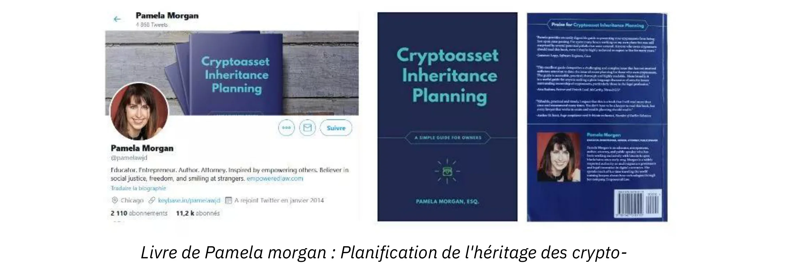

### Bước tiếp theo của Bitcoin là gì?

Nếu chúng ta nhìn vào đường cong giá logarit, một điều trở nên rõ ràng: chúng ta không bao giờ biết chính xác mình đang ở đâu trong chu kỳ. Có lẽ bạn đang đọc khóa học này khi một giai đoạn tăng trưởng mới đang bắt đầu, hoặc có lẽ bạn đang ở giữa một thị trường giá xuống. Dù trường hợp nào đi nữa, các chu kỳ vẫn tiếp tục, chắc chắn sẽ được đánh dấu bằng những mức cao ngoạn mục và đôi khi là những đợt điều chỉnh tàn khốc.

Nhưng ngoài giá cả, sự tăng trưởng của Bitcoin thật đáng kinh ngạc. Những gì bắt đầu như một dự án ít người biết đến trong giới cypherpunk đã trở thành một phong trào toàn cầu. Từ Silk Road đến sự chấp nhận của các tổ chức, Bitcoin đã khẳng định vị thế vững chắc của mình trong bối cảnh tài chính toàn cầu. Nó không còn được coi là một thử nghiệm bên lề nữa mà là một loại tài sản nghiêm túc được các tổ chức và hàng triệu cá nhân trên toàn thế giới chấp nhận.

Sự thay đổi trong nhận thức này đi kèm với tiến bộ kỹ thuật liên tục. Ví và cơ sở hạ tầng liên tục được cải thiện. Hàng năm, các giải pháp mới xuất hiện giúp Bitcoin an toàn hơn, bền bỉ hơn và thân thiện với người dùng hơn. Ngày nay, Bitcoin phi tập trung hơn, dễ tiếp cận hơn và dễ hiểu hơn bao giờ hết.

Tất nhiên, vẫn còn nhiều thách thức: quy định, quyền riêng tư, áp dụng rộng rãi hơn và phát triển nền kinh tế tuần hoàn. Nhưng miễn là cộng đồng vẫn năng động, tò mò và tham gia, Bitcoin sẽ vẫn là một giải pháp thay thế mạnh mẽ cho hệ thống tài chính truyền thống.

Một điều chắc chắn là: Bitcoin sẽ tiếp tục tồn tại; tạo ra một khối mới khoảng 10 phút một lần, không biết mệt mỏi, ngày này qua ngày khác, năm này qua năm khác. Chúng ta sẽ thấy nhiều người dùng, ví, sàn giao dịch hơn, cũng như nhiều quy định, rào cản kỹ thuật, khủng hoảng và đổi mới hơn.

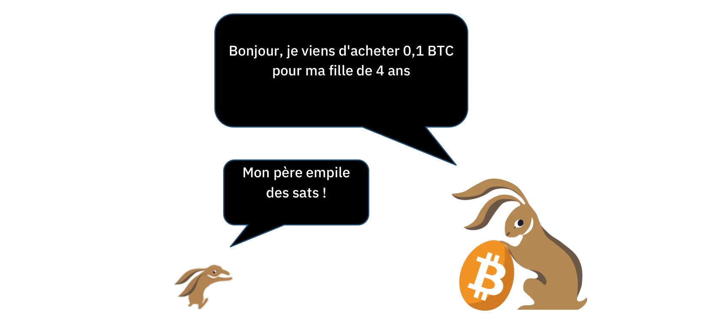

Khi các cuộc khủng hoảng toàn cầu tiếp diễn và lạm phát làm xói mòn sức mua của các loại tiền tệ fiat, Bitcoin sẽ tự nhiên thu hút nhiều người hơn, những người tìm kiếm sự tự do tài chính và chủ quyền cá nhân. Động lực này sẽ tiếp tục củng cố Bitcoin và thu hút những tài năng mới để cải thiện giao thức, các lớp mở rộng và các trường hợp sử dụng hàng ngày của nó về mặt bảo mật, quyền riêng tư và tiện ích.

### Bước tiếp theo của bạn là gì?

Trớ trêu thay, sự thay đổi lớn nhất không phải là Bitcoin mà là chính bạn.

Bạn sẽ phát triển cách bạn sử dụng, hiểu và liên hệ với Bitcoin. Có thể bạn sẽ phát triển niềm đam mê thực sự với nó, đủ để bắt đầu dạy người khác, tham gia vào cộng đồng hoặc đơn giản là bảo toàn tài sản của mình trong dài hạn. Dù bạn theo con đường nào, Bitcoin sẽ thay đổi thế giới quan của bạn; và có thể là mối quan hệ của bạn với sự tự do và trách nhiệm tài chính.

Sau đây là một số hướng dẫn bạn có thể thực hiện tiếp theo:

#### 1. Duy trì đà phát triển

Nếu chiến lược hiện tại của bạn có hiệu quả, hãy tiếp tục.

Tiếp tục xếp chồng Sats thường xuyên và duy trì các biện pháp bảo mật tốt nhất. Bạn đã xây dựng được nền tảng vững chắc và không cần phải tiến xa hơn nữa nếu mục tiêu chính của bạn chỉ đơn giản là bảo vệ khoản tiết kiệm Bitcoin của mình.

Hãy dành thời gian quan sát sự phát triển của hệ sinh thái, tinh chỉnh chiến lược và củng cố thiết lập nếu cần.

#### 2. Làm sâu sắc thêm kiến thức của bạn

Hành trình của bạn không kết thúc ở đây. Bitcoin là một thế giới không ngừng phát triển và luôn có nhiều điều để khám phá. Sau đây là một số hướng bạn có thể muốn khám phá để hiểu sâu hơn về Bitcoin:

- Để nâng cao khả năng bảo mật kỹ thuật số của bạn, hãy bắt đầu với khóa học bảo mật cơ bản của chúng tôi:

https://planb.network/courses/99c46148-7080-4915-a7e0-9df0e145cd47

- Nếu bạn quan tâm đến khía cạnh kinh tế và triết học của Bitcoin, hãy xem các khóa học chuyên sâu sau:

https://planb.network/courses/d07b092b-fa9a-4dd7-bf94-0453e479c7df

https://planb.network/courses/caa75343-ac90-4249-bcca-0e2e57c3a0f1

https://planb.network/courses/9d1bde6a-33e5-45dd-b7c0-94da72e45b11

- Các chủ doanh nghiệp quan tâm đến việc tích hợp Bitcoin vào chiến lược công ty của mình không nên bỏ lỡ::

https://planb.network/courses/a804c4b6-9ff5-4a29-a530-7d2f5d04bb7a

- Để khám phá câu chuyện hấp dẫn đằng sau sự ra đời của Bitcoin và những năm đầu của hệ thống, tôi thực sự khuyên bạn nên tham gia khóa học này:

https://planb.network/courses/a51c7ceb-e079-4ac3-bf69-6700b985a082

- Cuối cùng, nếu bạn tò mò về các khía cạnh kỹ thuật của Bitcoin và hệ sinh thái của nó, hãy khám phá các khóa đào tạo sau:

https://planb.network/courses/34bd43ef-6683-4a5c-b239-7cb1e40a4aeb

https://planb.network/courses/46b0ced2-9028-4a61-8fbc-3b005ee8d70f

https://planb.network/courses/65c138b0-4161-4958-bbe3-c12916bc959c

#### 3. Đóng góp vào Hệ sinh thái Bitcoin

Bitcoin không chỉ là một công cụ tài chính; đó là một phong trào. Tùy thuộc vào kỹ năng và sở thích của bạn, có nhiều cách bạn có thể đóng góp:

- Giáo dục và nâng cao nhận thức**: Giúp những người thân yêu của bạn hiểu về Bitcoin, chia sẻ kiến thức và tham gia vào các cuộc thảo luận tại địa phương;
- Phát triển các công cụ và ứng dụng**: Nếu bạn có kỹ năng kỹ thuật, đóng góp vào các công cụ nguồn mở là một cách tuyệt vời để mang lại giá trị cho Bitcoin;
- Tham gia cộng đồng địa phương**: Tham gia các sự kiện, buổi gặp gỡ và diễn đàn để gặp gỡ những người chơi bitcoin khác và lắng nghe quan điểm của Exchange về những phát triển mới nhất.

Nếu bạn muốn giúp giáo dục người khác, Plan ₿ Network luôn tìm kiếm những người đóng góp! Tất cả nội dung giáo dục của chúng tôi đều là mã nguồn mở và được lưu trữ trên GitHub. Chúng tôi hoan nghênh những người đóng góp giúp hiệu đính và dịch nội dung sang nhiều ngôn ngữ khác nhau; trong Exchange cho một vài Sats! Cho dù bây giờ hay sau này trong hành trình Bitcoin của bạn, bạn được mời tham gia [nhóm Telegram của chúng tôi dành cho những người đóng góp](https://t.me/PlanBNetwork_ContentBuilder) của Plan ₿ Network.

### Lời cuối cùng

Cảm ơn bạn rất nhiều vì đã tham gia khóa học BTC102.

Tôi tên là Rogzy, người sáng lập Découvre Bitcoin và đồng sáng lập Plan ₿ Network; một nền tảng được tạo nên bởi các đối tác mới đáng kinh ngạc của chúng tôi, Tether và Fulgur Ventures, và thông qua sứ mệnh chung của chúng tôi là giáo dục càng nhiều người càng tốt về Bitcoin.

Phản hồi của bạn vô cùng có giá trị. Hãy thoải mái để lại bình luận trên nền tảng và cho chúng tôi biết bạn nghĩ gì về phiên bản cập nhật này của khóa học. Những gợi ý của bạn giúp chúng tôi tiếp tục cải thiện chất lượng nội dung của mình.

Bây giờ bạn đã sẵn sàng để làm bài kiểm tra cuối cùng; bài kiểm tra gồm 40 câu hỏi sẽ xác nhận sự hiểu biết của bạn và cấp cho bạn chứng chỉ.

Chúc may mắn!

Tôi hy vọng sớm được gặp lại bạn trong một khóa học khác về Plan ₿ Network; dù là khóa học của tôi hay của một giáo viên tuyệt vời khác trong cộng đồng. Và biết đâu, chúng ta thậm chí có thể gặp nhau trực tiếp tại một hội nghị, sự kiện hoặc buổi gặp mặt Bitcoin.

Một lần nữa, xin chúc mừng bạn đã đi được bao xa. Và hãy nhớ rằng; mục tiêu chính của tôi sẽ luôn như vậy:

**Giúp càng nhiều người càng tốt đạt được chủ quyền tài chính thông qua Bitcoin.**

**Chúc bạn mọi điều tốt đẹp nhất trên hành trình cùng Bitcoin!**

# Phần cuối

<partId>a8425389-4a53-4b57-b9b4-36c1cab12de5</partId>

## Đánh giá & Xếp hạng

<chapterId>3f43175a-fb7a-5b1c-a887-7dcf615d7a3a</chapterId>

<isCourseReview>true</isCourseReview>
## Bài thi cuối kỳ

<chapterId>f3ff8089-8f89-56a8-be8c-b60296b4d91f</chapterId>

<isCourseExam>true</isCourseExam>
## Phần kết luận

<chapterId>b082b8eb-dabc-5d79-94cf-eb8f48fc1968</chapterId>

<isCourseConclusion>true</isCourseConclusion>