# फ्रेडरिक बास्टियाट की दुनिया में एक यात्रा

डेमियन थेलियर द्वारा संचालित यह कोर्स आपको फ़्रेडरिक बास्टियाट की दुनिया में गोता लगाने के लिए आमंत्रित करता है, जो एक फ्रांसीसी अर्थशास्त्री और दार्शनिक हैं, जिनके विचार समकालीन आर्थिक विचारों को प्रभावित करते रहते हैं। 21 वीडियो के माध्यम से, डेमियन थेलियर बास्टियाट के जीवन, उनके बौद्धिक प्रभावों, उनके वैचारिक विरोधियों, साथ ही साथ उनके आर्थिक सिद्धांतों का पता लगाते हैं।

पाठ्यक्रम की शुरुआत बस्तियात के जीवन और ऐतिहासिक संदर्भ के विस्तृत परिचय से होती है, उसके बाद एडम स्मिथ, जीन-बैप्टिस्ट से, एंटोनी डेस्टुट डे ट्रेसी, चार्ल्स कॉम्टे, चार्ल्स डनोयर और रिचर्ड कोबडेन जैसे विचारकों की जांच की जाती है। फिर, पाठ्यक्रम बस्तियात के विरोधियों पर नज़र डालता है, जिसमें रूसो, शास्त्रीय शिक्षा, संरक्षणवाद, समाजवाद और प्रूधों शामिल हैं।

पाठ्यक्रम का एक महत्वपूर्ण हिस्सा बास्टियाट द्वारा निंदा किए गए आर्थिक कुतर्कों को समर्पित है, जैसे कि "क्या देखा जाता है और क्या नहीं देखा जाता है," "मोमबत्ती बनाने वालों की याचिका," कराधान के माध्यम से लूट, और दो आर्थिक नैतिकताओं के बीच अंतर। पाठ्यक्रम बास्टियाट द्वारा वकालत किए गए आर्थिक सामंजस्य को भी संबोधित करता है, जिसमें बाजार का चमत्कार, जिम्मेदारी की शक्ति और सच्ची एकजुटता शामिल है।

अंत में, पाठ्यक्रम का समापन "कानून" पर चिंतन के साथ होता है, जिसमें संपत्ति के अधिकार, कानूनी लूट और राज्य की भूमिका जैसी प्रमुख अवधारणाओं को संबोधित किया जाता है। पाठ्यक्रम का निष्कर्ष फ्रेडरिक बास्टियाट की विरासत और आधुनिक अर्थशास्त्र पर उनके स्थायी प्रभाव पर फिर से विचार करता है।

फ्रेडरिक बास्टियाट के विचारों के इस समृद्ध अन्वेषण में डेमियन थेलियर के साथ जुड़ें और जानें कि किस प्रकार उनके विचार वर्तमान आर्थिक और राजनीतिक बहसों को प्रकाशित कर सकते हैं।

+++

# परिचय

<partId>e4a0cf13-2fc5-5ced-a528-ace3f9029f22</partId>

## पाठ्यक्रम अवलोकन

<chapterId>aa493f46-2d3a-4b76-ad79-ed44113a97f4</chapterId>

इस कोर्स का लक्ष्य आपको फ्रेडरिक बास्टियाट के जीवन, बौद्धिक प्रभावों, वैचारिक विरोधियों और आर्थिक सिद्धांतों की गहरी समझ प्रदान करना है। इस संरचित यात्रा के माध्यम से, आप यह पता लगाएंगे कि उनके विचारों ने आर्थिक सोच को कैसे आकार दिया है और वर्तमान बहसों को कैसे प्रभावित करना जारी रखा है।

**अनुभाग 1: परिचय**

हम अर्थशास्त्र के एक कम आंका जाने वाले प्रतिभाशाली व्यक्ति फ्रेडरिक बास्टियाट के सामान्य अवलोकन से शुरुआत करेंगे। आप उनके जीवन, बौद्धिक यात्रा और उस ऐतिहासिक संदर्भ के बारे में जानेंगे जिसमें उन्होंने अपनी सोच विकसित की। उनके लेखन और सिद्धांतों के दायरे को पूरी तरह से समझने के लिए इस संदर्भ को समझना आवश्यक है।

**अनुभाग 2: प्रभाव**

हम फ्रेडरिक बास्टियाट के आर्थिक विचारों को आकार देने वाले विचारकों का विश्लेषण करेंगे। आप जानेंगे कि एडम स्मिथ, जीन-बैप्टिस्ट से, एंटोनी डेस्टुट डे ट्रेसी, चार्ल्स कॉम्टे, चार्ल्स डनोयर और रिचर्ड कोबडेन जैसे प्रमुख लोगों ने उनके बौद्धिक विकास में कैसे योगदान दिया, जिससे मुक्त व्यापार और बाजार अर्थशास्त्र पर उनके चिंतन की नींव पड़ी।

**धारा 3: विरोधी**

इसके बाद, हम बास्टियाट द्वारा अपने वैचारिक विरोधियों की आलोचनाओं का पता लगाएंगे। चाहे वह रूसो हो, शास्त्रीय शिक्षा हो, संरक्षणवाद हो, समाजवाद हो या प्रूधों हो, आप समझेंगे कि बास्टियाट ने इन सिद्धांतों को आर्थिक और सामाजिक प्रगति में बाधा क्यों माना और कैसे उन्होंने उनके तर्कों का तीखे तर्क के साथ जवाब दिया।

**अनुभाग 4: आर्थिक भ्रांतियां**

यह खंड बास्टियाट द्वारा उजागर की गई आर्थिक भ्रांतियों को समर्पित है, जिसमें प्रसिद्ध "क्या देखा जाता है और क्या नहीं देखा जाता है" और "कैंडलमेकर्स की याचिका" शामिल है। हम इस बात की जांच करेंगे कि कैसे उन्होंने व्यंग्य और कठोर विश्लेषण के माध्यम से अपने समय की सामान्य आर्थिक त्रुटियों को कुशलता से प्रदर्शित किया, जो आज भी प्रासंगिक हैं।

**धारा 5: आर्थिक सामंजस्य**

यहाँ, आप अर्थव्यवस्था के बारे में बास्टियाट के सकारात्मक दृष्टिकोण को जानेंगे। हम बाजार के चमत्कार, व्यक्तिगत जिम्मेदारी की शक्ति और सच्ची और झूठी एकजुटता के बीच अंतर जैसी Address अवधारणाओं पर चर्चा करेंगे। बास्टियाट ने अर्थव्यवस्था को एक सुसंगत प्रणाली के रूप में देखा जहाँ अच्छी तरह से समझे गए स्वार्थ से आम लोगों को लाभ होता है। हम इसका कारण जानेंगे।

**धारा 6: कानून**

इस कोर्स को समाप्त करने के लिए, हम बास्टियाट के प्रमुख कार्य, "द लॉ" पर गहराई से विचार करेंगे, जहाँ उन्होंने संपत्ति के अधिकार, कानूनी लूट और राज्य की सीमित भूमिका पर अपने विचार प्रस्तुत किए हैं। आप समझ जाएँगे कि इस निबंध को व्यक्तिगत स्वतंत्रता और बाजार अर्थव्यवस्था के पक्ष में सबसे सम्मोहक घोषणापत्रों में से एक क्यों माना जाता है।

क्या आप यह जानने के लिए तैयार हैं कि फ़्रेडरिक बास्टियाट के विचार आज भी कैसे प्रासंगिक हैं? इस बौद्धिक यात्रा पर हमारे साथ जुड़ें जो अर्थशास्त्र के बारे में आपकी समझ को चुनौती दे सकती है!

## बास्टियाट: एक कम आंका गया प्रतिभाशाली व्यक्ति

<chapterId>7f21b617-9810-5484-ad1c-befc61432126</chapterId>

यह कोर्स फ्रेडरिक बास्टियाट का परिचय है, जो एक अज्ञात प्रतिभा और हमारे समय के लिए एक प्रकाश स्तंभ है। इस संक्षिप्त परिचय में, मैं आपको यह जानने में मदद करने की कोशिश करूँगा कि फ्रेडरिक बास्टियाट कौन थे और इस श्रृंखला के दौरान हम किन प्रमुख विषयों को कवर करेंगे।

दरअसल, फ्रेडरिक बास्टियाट, जो 1801 में पैदा हुए थे और 19वीं सदी के पहले हिस्से में रहे, कुछ समय तक एक महत्वपूर्ण लेखक रहे। और फिर, धीरे-धीरे, वे गायब हो गए और आज, कोई भी उनके बारे में नहीं सुनता, कोई नहीं जानता कि वे कौन हैं। फिर भी, विडंबना यह है कि इस लेखक का इतालवी, रूसी, स्पेनिश और अंग्रेजी सहित कई भाषाओं में अनुवाद किया गया है।

ऐसा लगता है कि द्वितीय विश्व युद्ध के बाद, उनकी एक किताब संयुक्त राज्य अमेरिका में प्रकाशित हुई थी। यह बहुत प्रसिद्ध हुई, इस हद तक कि रोनाल्ड रीगन ने खुद कहा कि यह उनकी पसंदीदा किताब है, और इस छोटी सी किताब का नाम "द लॉ" है। इस प्रकार बास्टियाट संयुक्त राज्य अमेरिका में दो सबसे प्रसिद्ध फ्रांसीसी लेखकों में से एक हैं, दूसरे लेखक फ्रांस में भी काफी प्रसिद्ध हैं, एलेक्सिस डे टोकेविले।

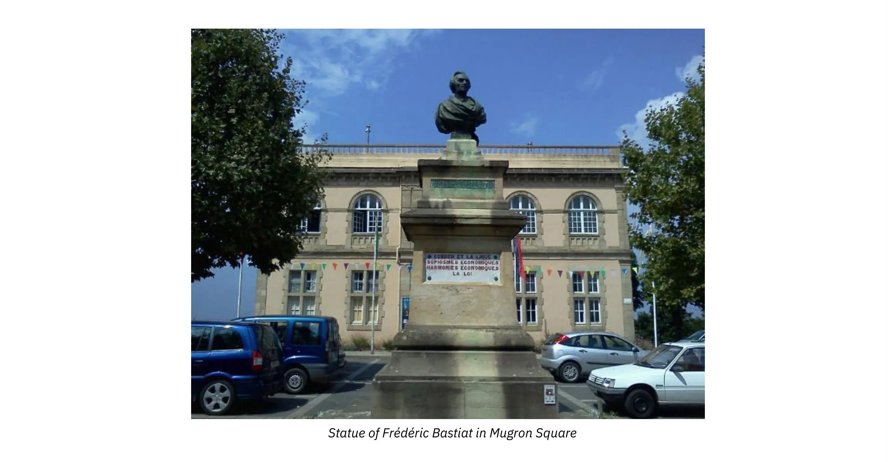

_(लैंड्स के मुग्रोन में बाज़ार स्थल, बास्टियाट शहर)_

तो, एक अपरिचित प्रतिभा लेकिन हमारे समय के लिए एक प्रकाश भी। वास्तव में, फ्रेडरिक बास्टियाट, जो बेयोन में पैदा हुए थे, ने अपने जीवन का पहला हिस्सा लैंड्स में बिताया, जहाँ उन्होंने एक कृषि संपदा का प्रबंधन किया जो उन्हें विरासत में मिली थी और उन्होंने अंततः एक उद्यमी के रूप में जीवन व्यतीत किया। और फिर, बहुत कम उम्र में, उन्हें अर्थशास्त्र में दिलचस्पी हो गई, उन्होंने इंग्लैंड की यात्रा की, उनकी मुलाकात रिचर्ड कोबडेन से हुई जो मुक्त व्यापार आंदोलन के नेता थे। बास्टियाट इस आंदोलन से मोहित हो गए, उन्हें विश्वास हो गया कि मुक्त व्यापार फ्रांस के लिए एक समाधान था और उसके बाद उन्होंने फ्रांस में अपने विचारों को फैलाने का प्रयास करने का फैसला किया। उन्होंने ऐसे लेख लिखे जो बहुत सफल रहे और वे उस समय जर्नल डेस इकोनॉमिस्ट्स नामक एक समाचार पत्र चलाने के लिए पेरिस चले गए।

वह समाज, सामाजिक व्यवस्था, न्याय, कानून, अधिकारों के बारे में विचारक और दार्शनिक भी थे। और इस संबंध में, हम कह सकते हैं कि बास्टियाट हमारे समय के लिए एक प्रकाश हैं। और मैं इसी के साथ अपनी बात समाप्त करना चाहूँगा। वह ऐसे व्यक्ति हैं जिन्होंने राजनीतिक बाजार के कामकाज को समझने की कोशिश की। बेशक, वह बाजार अर्थव्यवस्था के भी समर्थक हैं, जिनके लिए अंततः बाजार अर्थव्यवस्था ही धन बनाने का सबसे अच्छा तरीका है। लेकिन इसके अलावा, और यहीं पर उन्हें पहचाना नहीं जाता, उन्होंने राजनीतिक बाजार के तंत्र को समझा।

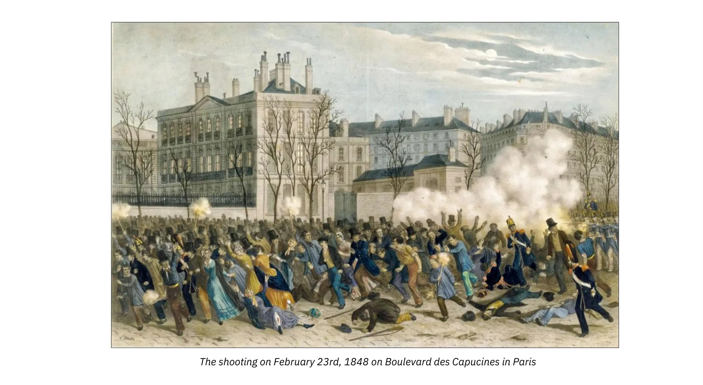

जब वे डिप्टी के रूप में चुने गए, तो यह द्वितीय गणराज्य के दौरान था, और तब से, यह लोग ही थे जो कानून बनाते थे। उस समय, बास्टियाट ने सभी दिशाओं में कानूनों की एक तरह की वृद्धि देखी, जिसमें सार्वजनिक सेवाओं, सामाजिक अधिकारों, करों आदि का निर्माण शामिल था।

---

> **राष्ट्रीय कार्यशालाएं**
> **एजेंडा.**
> चूंकि राष्ट्रीय कार्यशालाओं में नामांकित श्रमिकों ने उचित रूप से अनुरोध किया है कि उपलब्ध कार्य को यथासंभव समान रूप से और निष्पक्ष रूप से उनके बीच वितरित किया जाए;
> जबकि केवल 16,000 पुरुषों के लिए काम उपलब्ध है, और नामांकित पुरुषों की संख्या 50,000 से अधिक है;
> यह सहमति बनी है कि अगली सूचना तक तथा बेहतर व्यवस्था होने तक, प्रत्येक कंपनी 17 तारीख सोमवार से प्रति सप्ताह दो दिन काम करेगी।
> _गणराज्य के आयुक्त, राष्ट्रीय कार्यशालाओं के निदेशक,_
> **एमिल थॉमस.**

---

और उन्होंने महसूस किया कि मूल रूप से, वास्तव में कुछ भी नहीं बदला था। लोग मतदान और कानून के माध्यम से दूसरों की संपत्ति का निपटान करते थे, जिसे उन्होंने कानूनी लूट कहा। कानूनी लूट की यह घटना उनके काम के केंद्र में थी, विशेष रूप से इस छोटे से पाठ में जिसे उन्होंने अपने जीवन के अंत में लिखा था, "कानून," जहां उन्होंने कानूनी लूट की तुलना संपत्ति, संपत्ति के अधिकार से की है। वह दिखाते हैं कि, मूल रूप से, सामाजिक समस्या का वास्तविक समाधान स्वतंत्रता है, यानी संपत्ति, खुद पर नियंत्रण और अपने श्रम का फल।

इस पाठ्यक्रम में, हम फ्रेडरिक बास्टियाट के विचारों के माध्यम से एक साथ यात्रा करेंगे, जो कि उन लेखकों के प्रभावों से शुरू होगा जिन्होंने उनकी युवावस्था के आरंभ में ही उन्हें आकार दिया, फिर हम उनके आर्थिक कुतर्कों पर गौर करेंगे, और अंत में, हम इस महान ग्रंथ, "द लॉ" के साथ समापन करेंगे, जो हमें राजनीतिक बाजार के विश्लेषण से, समाज के विश्लेषण से परिचित कराएगा।

## जीवन और ऐतिहासिक संदर्भ

<chapterId>e9d92b63-83dd-552c-84e1-dd535608c109</chapterId>

1844 में, फ्रेडरिक बास्टियाट ने स्पेन की एक व्यापारिक यात्रा की। मैड्रिड, सेविले, कैडिज़ और लिस्बन में रहने के बाद, उन्होंने साउथेम्प्टन जाने और इंग्लैंड जाने का फैसला किया। लंदन में, उन्हें एंटी-कॉर्न लॉ लीग की बैठकों में भाग लेने का अवसर मिला, जिसके काम को उन्होंने दूर से देखा था। उन्होंने इस एसोसिएशन के मुख्य नेताओं से मुलाकात की, जिनमें रिचर्ड कोबडेन भी शामिल थे, जो उनके मित्र बन गए।

यहीं पर उनके जीवन की दिशा पूरी तरह बदल गई। वे खुद बताते हैं कि अर्थशास्त्री के रूप में उनका पेशा उसी क्षण तय हो गया था। फ्रांस लौटने पर उनके मन में एक ही विचार था: फ्रांस को इंग्लैंड में चल रहे उदारवादी आंदोलन से अवगत कराना।

फ्रेडरिक बास्टियाट का जन्म 30 जून, 1801 को बेयोन में हुआ था। 9 साल की उम्र में अनाथ होने के बाद, उन्होंने सोरेज़ के कैथोलिक कॉलेज में अपनी पढ़ाई जारी रखी। वह भाषाओं में प्रतिभाशाली थे, उन्होंने अंग्रेजी, स्पेनिश और यहां तक ​​कि बास्क भी सीखी। हालांकि, वह अपनी पढ़ाई से प्रेरित नहीं थे और उन्होंने बैकलॉरिएट लेने का फैसला नहीं किया, इसके बजाय बेयोन में अपने चाचा के आयात-निर्यात व्यवसाय में काम करना चुना।

1825 में, उन्हें अपने दादा से एक कृषि संपदा विरासत में मिली, जिसे उन्होंने अपने शब्दों में "सज्जन किसान" के रूप में प्रबंधित किया। तब उन्हें संपत्ति के अधिकारों की स्पष्ट परिभाषा की कमी के कारण होने वाली समस्याओं का प्रत्यक्ष सामना करना पड़ा। उन्होंने लैंडेस के केंद्र में स्थित अपने शहर मुग्रोन में शांति न्यायाधीश बनने का फैसला किया, जो बोर्डो और बेयोन के बंदरगाहों के बीच एक वाणिज्यिक और नदी का चौराहा है। बाद में, उन्हें लैंडेस की जनरल काउंसिल के सदस्य के रूप में चुना गया।

उन्होंने जल्दी ही राजनीतिक अर्थव्यवस्था के लिए एक जुनून विकसित किया और एडम स्मिथ, जीन-बैप्टिस्ट से, डेस्टुट डे ट्रेसी, चार्ल्स डनोयर और चार्ल्स कॉम्टे के कार्यों का अध्ययन किया। उन्होंने अंग्रेजी समाचार पत्र पढ़े, और यहीं पर उन्हें मुक्त व्यापार के लिए एक अंग्रेजी लीग के अस्तित्व के बारे में पता चला।

_(कहो, कोबडेन, स्मिथ, शेवेलियर, डुनोयर, डेस्टुट डी ट्रेसी)_

इंग्लैंड से लौटने पर उन्होंने एक लेख लिखा जिसका शीर्षक था: "दो लोगों के भविष्य पर अंग्रेजी और फ्रांसीसी टैरिफ का प्रभाव", जिसे उन्होंने पेरिस में जर्नल डेस इकोनॉमिस्ट्स को भेजा। यह लेख अक्टूबर 1844 के अंक में छपा और यह पूरी तरह सफल रहा। हर कोई उनके शक्तिशाली और तीखे तर्क, उनकी शांत और सुरुचिपूर्ण शैली की प्रशंसा करता था।

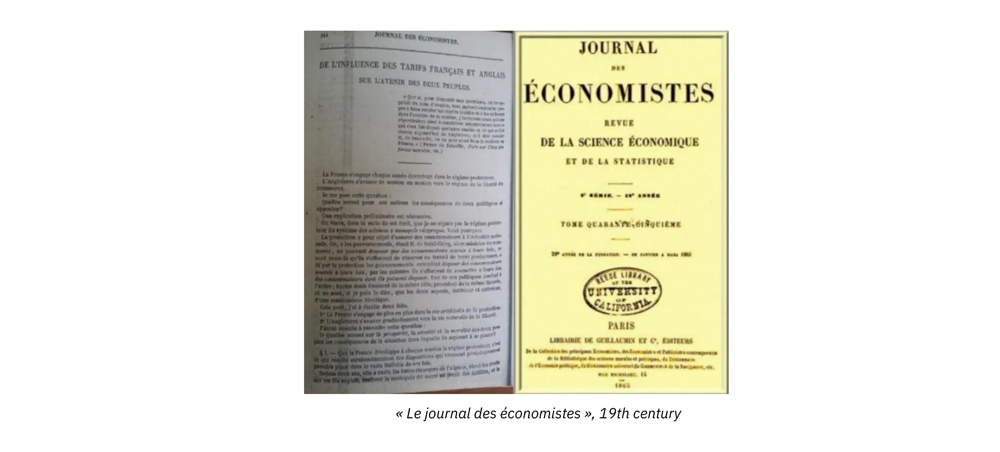

जर्नल डेस इकोनॉमिस्ट्स ने फिर उनसे और लेख लिखने के लिए कहा, और पॉलिटिकल इकोनॉमी सोसाइटी के कई सदस्यों, खास तौर पर जीन-बैप्टिस्ट से के बेटे होरेस से और एक प्रसिद्ध प्रोफेसर मिशेल शेवेलियर ने उन्हें बधाई दी और आर्थिक सच्चाई फैलाने के काम में उनके साथ बने रहने के लिए प्रोत्साहित किया। इसने पेरिस में एक नए जीवन की शुरुआत की।

उन्होंने सबसे पहले इकोनॉमिक सोफिज्म की शुरुआती श्रृंखला प्रकाशित की, जिसमें उन्होंने साहस और व्यंग्य के साथ संरक्षणवादियों पर हमला किया। पेरिस में, उन्होंने एक निजी कमरे में राजनीतिक अर्थव्यवस्था पर एक कोर्स भी शुरू किया, जिसमें छात्र अभिजात वर्ग उत्सुकता से भाग लेता था।

अगले वर्ष, उन्होंने फ्रांस में "एसोसिएशन फॉर फ्री ट्रेड" की स्थापना की और फ्रांस में संरक्षणवाद के खिलाफ लड़ाई में खुद को झोंक दिया। उन्होंने धन जुटाया, एक साप्ताहिक समीक्षा बनाई और पूरे देश में व्याख्यान दिए।

पहली बैठक 23 फरवरी, 1846 को बोर्डो में हुई, जिसके दौरान बोर्डो एसोसिएशन फॉर फ्री ट्रेड की स्थापना की गई। जल्द ही, यह आंदोलन पूरे फ्रांस में फैल गया। पेरिस में, सोसाइटी ऑफ इकोनॉमिस्ट्स के सदस्यों के बीच एक प्रारंभिक कोर का गठन किया गया, जिसमें प्रतिनिधि, उद्योगपति और व्यापारी शामिल हुए। मार्सिले, ल्योन और ले हावरे में भी महत्वपूर्ण समूह बने।

1848 की फरवरी क्रांति ने लुई-फिलिप की राजशाही को उखाड़ फेंका, जिसे जुलाई राजशाही (1830-1848) के रूप में जाना जाता है, और दूसरे गणराज्य का आगमन देखा। इसके बाद बास्टियाट को लैंड्स के डिप्टी के रूप में विधान सभा के सदस्य के रूप में चुना गया। वह राजशाहीवादियों और समाजवादियों के बीच एलेक्सिस डी टोकेविले के साथ केंद्र-बाएं में बैठे। वहां, उन्होंने नागरिक स्वतंत्रता जैसे व्यक्तिगत स्वतंत्रता की रक्षा करने का प्रयास किया और सभी प्रतिबंधात्मक नीतियों का विरोध किया, चाहे वे दक्षिणपंथी हों या वामपंथी। उन्हें वित्त समिति का उपाध्यक्ष चुना गया और उन्होंने अपने साथी प्रतिनिधियों को इस सरल सत्य की याद दिलाने का लगातार प्रयास किया, जिसे अक्सर संसदों में भुला दिया जाता है:

> कोई व्यक्ति किसी कानून के तहत कुछ लोगों को दे नहीं सकता, जबकि वह किसी अन्य कानून के तहत दूसरों से लेने के लिए बाध्य हो।

उनकी लगभग सभी पुस्तकें और निबंध उनके जीवन के अंतिम छह वर्षों, 1844 से 1850 के दौरान लिखे गए थे। 1850 में, बास्टियाट ने अपनी दो सबसे प्रसिद्ध रचनाएँ लिखीं: द लॉ और व्हाट इज़ सीन एंड व्हाट इज़ नॉट सीन शीर्षक से पुस्तिकाओं की एक श्रृंखला। द लॉ का अंग्रेजी, जर्मन, स्पेनिश, रूसी और इतालवी सहित कई विदेशी भाषाओं में अनुवाद किया गया है।

1850 में रोम में तपेदिक से उनकी मृत्यु हो गई। उन्हें रोम के सेंट लुइस डेस फ़्रैंकैस चर्च में दफनाया गया है।

# को प्रभावित

<partId>4d312b17-5740-5d33-8309-015e2b59b6dd</partId>

## एडम स्मिथ और जीन-बैप्टिस्ट से

<chapterId>bcc7a12a-6cc4-5061-85e3-0e31fb1f0a49</chapterId>

अर्थशास्त्र में, बास्टियाट ने हमेशा एडम स्मिथ और जीन-बैप्टिस्ट से के प्रति अपना आभार माना। 26 साल की उम्र में, उन्होंने अपने एक दोस्त को लिखा, "मैंने इन विषयों पर कभी नहीं पढ़ा, सिवाय इन चार पुस्तकों के, स्मिथ, से, डेस्टट और सेंसर।"

_(जीन-बैप्टिस्ट से और एडम स्मिथ)_

एडम स्मिथ और जे.-बी. से द्वारा परिकल्पित राजनीतिक अर्थव्यवस्था को एक ही शब्द में समाहित किया गया है: स्वतंत्रता। व्यापार की स्वतंत्रता, व्यक्तिगत स्वतंत्रता, मुक्त व्यापार और मुक्त पहल। मुक्त व्यापार का सबसे पहले फिजियोक्रेट्स जैसे कि फ्रांकोइस क्वेस्ने और विंसेंट डी गौर्ने ने बचाव किया था, और फिर एडम स्मिथ ने अपने विचारों को अपने स्वयं के अवलोकनों के साथ संश्लेषित किया। अंत में, 18वीं शताब्दी के अंत में, जीन-बैप्टिस्ट से ने अपने गुरु एडम स्मिथ के सिद्धांत के कुछ बिंदुओं को राजनीतिक अर्थव्यवस्था पर अपने उत्कृष्ट ग्रंथ में स्पष्ट और सही किया।

_(कहो, डेस्टुट डी ट्रेसी, क्वेस्ने, डी गौर्ने)_

एडम स्मिथ समृद्धि में रुचि रखते थे, न कि अपने आप में एक लक्ष्य के रूप में बल्कि व्यक्तियों के नैतिक उत्थान के साधन के रूप में। उनके लिए, राष्ट्रों की संपत्ति व्यक्तियों की संपत्ति से बनी होती है। एडम स्मिथ कहते हैं, अगर आप एक समृद्ध राष्ट्र चाहते हैं, तो व्यक्तियों को स्वतंत्र रूप से कार्य करने दें। और बाजार इसलिए काम करता है क्योंकि यह सभी को अपनी पसंद व्यक्त करने और अपने हितों को आगे बढ़ाने की अनुमति देता है।

18वीं सदी की शुरुआत में आधुनिक अर्थशास्त्रियों की सबसे बड़ी नवीनता यह है कि वे प्रत्येक व्यक्ति में रुचि रखते हैं, जो अपनी कार्य करने की क्षमता को बहाल करने की इच्छा रखता है, साथ ही यह भी सोचता है कि भावनाओं और संघर्षों को कैसे नियंत्रित किया जाए। मनुष्य स्वाभाविक रूप से वस्तुओं और सेवाओं के Exchange के माध्यम से अपने और अपने प्रियजनों के भाग्य को बेहतर बनाना चाहता है।

एडम स्मिथ यह दर्शाते हैं कि अपना हित केवल दूसरों के हित में कार्य करके ही पूरा किया जा सकता है:

> मुझे जो चाहिए वह दे दो, और तुम मुझसे वही पाओगे जो तुम्हें चाहिए। (...) हम अपने भोजन की अपेक्षा कसाई, शराब बनाने वाले या बेकर की उदारता से नहीं करते, बल्कि हम उनसे अपने हित के प्रति सम्मान की अपेक्षा करते हैं।

---

> "अपनी स्थिति को बेहतर बनाने के लिए प्रत्येक व्यक्ति का स्वाभाविक प्रयास... इतना शक्तिशाली होता है कि वह अकेले ही, बिना किसी सहायता के, न केवल समाज को धन और समृद्धि की ओर ले जाने में सक्षम होता है, बल्कि सैकड़ों अनुचित बाधाओं को भी पार कर सकता है, जो अक्सर मानवीय कानूनों की मूर्खता के कारण उसके संचालन में बाधा बनती हैं।"
> _राष्ट्रों की सम्पदा_
> _पुस्तक IV, अध्याय V_

---

जीडब्ल्यू-2 एक सकारात्मक-योग खेल है। जो एक को मिलता है, वह दूसरे को भी मिलता है। इस प्रकार यह राजनीतिक पुनर्वितरण से भिन्न है, जहाँ हमेशा एक विजेता और एक हारने वाला होता है। यदि हम अंग्रेजी स्कूल पर विचार करें, तो स्मिथ, रिकार्डो और उनसे पहले लॉक के लिए, मूल्य श्रम से जुड़ा हुआ है। मार्क्स के लिए भी यह वही है।

_(मार्क्स, रिकार्डो, स्मिथ, लोके)_

दूसरी ओर, बास्टियाट जीन-बैप्टिस्ट से के साथ स्वीकार करेंगे कि उपयोगिता ही मूल्य का सच्चा आधार है। श्रम मूल्य नहीं बनाता। कमी भी नहीं बनाती। सब कुछ उपयोगिता से ही उपजता है। वास्तव में, कोई भी व्यक्ति किसी सेवा के लिए तब तक भुगतान करने के लिए सहमत नहीं होता जब तक कि वह उसे उपयोगी न समझे। कोई भी व्यक्ति हमेशा उपयोगिता ही पैदा करता है।

लेकिन बास्टियाट ने इस बिंदु पर भी से को बारीकी से समझा। यह वस्तुओं में मौजूद उपयोगिता के बारे में नहीं है, यह सेवाओं की सापेक्ष उपयोगिता के बारे में है। उनके अपने शब्दों के अनुसार, "मूल्य दो विनिमय सेवाओं का अनुपात है।" इसलिए, मूल्य व्यक्तिपरक है, और व्यक्तियों की प्राथमिकताओं को समझने का एकमात्र तरीका मुक्त बाजार में उनके व्यवहार का निरीक्षण करना है। बाजार व्यक्तिगत प्राथमिकताओं को प्रकट करता है और Exchange के माध्यम से समाज का महान नियामक है।

अर्थव्यवस्था मानव व्यवहार से प्राप्त कई सरल नियमों का पालन करती है। उनमें से एक, जिसे "से का नियम" कहा जाता है, इस प्रकार है: "उत्पादों और सेवाओं का उत्पादों और सेवाओं के लिए आदान-प्रदान किया जाता है।" उनका विचार है कि उत्पादन स्तर में वृद्धि से राष्ट्रों और व्यक्तियों को लाभ होता है क्योंकि यह पारस्परिक रूप से लाभकारी आदान-प्रदान के लिए बढ़े हुए अवसर प्रदान करता है।

दरअसल, उत्पाद केवल उन सेवाओं की प्रत्याशा में खरीदे जाते हैं जिनकी खरीदार अपेक्षा करता है: मैं उस संगीत के लिए डिस्क खरीदता हूँ जिसे मैं सुनूँगा, मैं उस फिल्म के लिए मूवी टिकट खरीदता हूँ जिसे मैं देखूँगा। और Exchange में, प्रत्येक पक्ष निर्णय लेता है क्योंकि वह यह निर्णय लेता है कि वह जो कुछ प्राप्त करता है उससे वह जो कुछ छोड़ता है उससे अधिक सेवाएँ प्राप्त कर सकता है। इस संदर्भ में, पैसा केवल एक मध्यस्थ वस्तु है, यह प्रदान की गई सेवा के लिए क्षतिपूर्ति करता है और अन्य सेवाओं को खोलता है।

बास्तियात के लिए, आदान-प्रदान की अर्थव्यवस्था, अर्थात् पारस्परिक सेवाओं की स्वतंत्र रूप से पेशकश और स्वीकृति, शांति और समृद्धि का आधार है, जो हितों के सामंजस्य को संभव बनाती है।

लेकिन जीन-बैप्टिस्ट से, फ्रेडरिक बास्टियाट को भी एक महत्वपूर्ण अवधारणा विरासत में मिली है, वह है लूटपाट की अवधारणा। वे से के शब्दों को दोहराते हुए कहते हैं:

> जीवन के संरक्षण, अलंकरण और सुधार के लिए आवश्यक चीजों को प्राप्त करने के केवल दो तरीके हैं: उत्पादन और लूट।

उत्पादक अनुनय, बातचीत और जीडब्ल्यू-5 का सहारा लेते हैं, जबकि लुटेरे बल और छल का सहारा लेते हैं। इसलिए लूट को रोकना और श्रम के साथ-साथ संपत्ति को सुरक्षित रखना कानून पर निर्भर है। जैसा कि एडम स्मिथ ने पहले ही कहा था, नागरिकों की सुरक्षा सुनिश्चित करना सार्वजनिक प्राधिकरण का मुख्य मिशन है, और यही वह है जो करों के लगाने को वैध बनाता है।

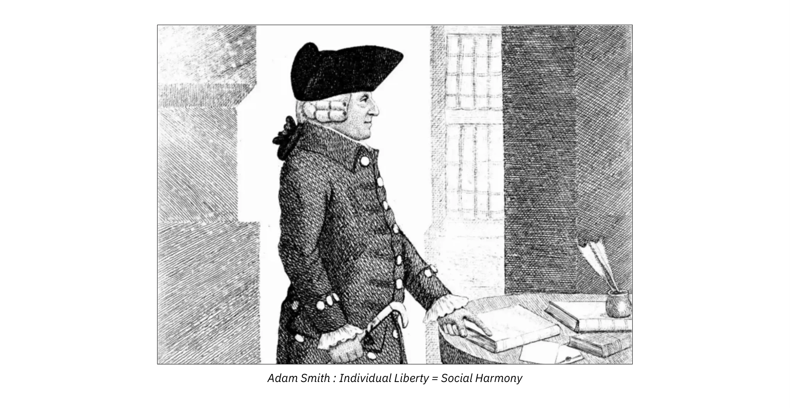

## एंटोनी डेस्टुट डे ट्रेसी

<chapterId>ddf64e9f-2ce0-5651-8eb8-bae578eb0b9b</chapterId>

यह बहुत कम लोगों को ज्ञात है, लेकिन डेस्टुट डी ट्रेसी का संयुक्त राज्य अमेरिका के भावी राष्ट्रपति थॉमस जेफरसन पर निर्णायक प्रभाव था, जब वे 1780 के दशक में पेरिस में राजदूत थे।

> प्रत्येक व्यक्ति के लिए उसका पहला देश उसकी मातृभूमि है, और दूसरा फ्रांस है" और "अत्याचार तब होता है जब लोग अपनी सरकार से डरते हैं; स्वतंत्रता तब होती है जब सरकार लोगों से डरती है।
>

> थॉमस जेफरसन

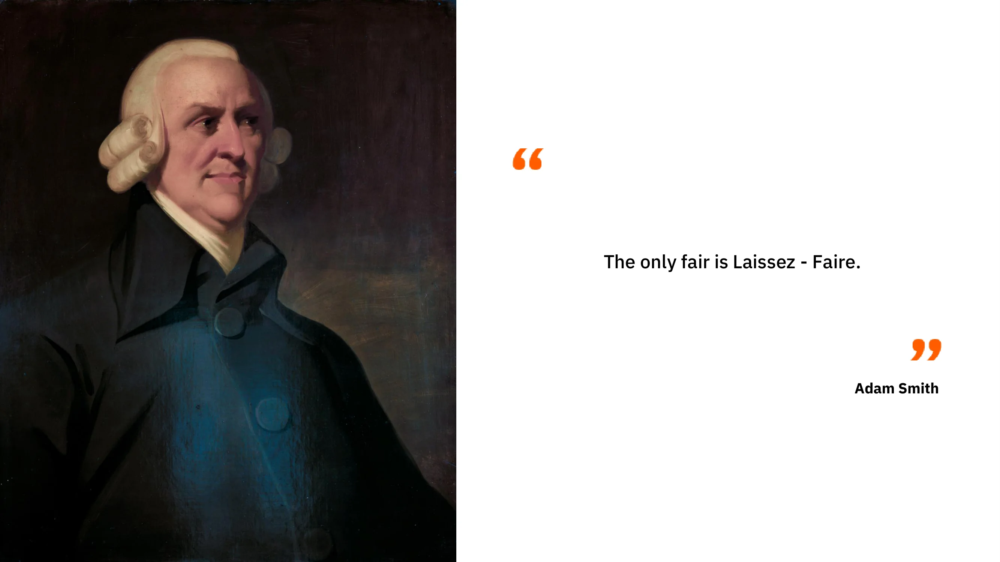

दरअसल, राजनीतिक अर्थव्यवस्था पर उनके ग्रंथ ने संरक्षणवाद और नेपोलियन के विस्तार की निंदा की। इसलिए बोनापार्ट ने इसे फ्रांस में प्रकाशन से प्रतिबंधित कर दिया था। हालाँकि, इसका अंग्रेजी में अनुवाद किया गया और जेफरसन ने खुद संयुक्त राज्य अमेरिका में इसे प्रकाशित किया। उन्होंने इस पाठ को वर्जीनिया विश्वविद्यालय की पहली राजनीतिक अर्थव्यवस्था की पाठ्यपुस्तक बनाया, जिसकी स्थापना उन्होंने हाल ही में चार्लोट्सविले में की थी। ग्रंथ 1819 तक फ्रांस में प्रकाशित नहीं हुआ था!

डेस्टुट डे ट्रेसी, एक दार्शनिक और अर्थशास्त्री, तथाकथित "आइडियोलॉग्स" स्कूल के नेता थे, जिसमें कैबनीस, कोंडोरसेट, कॉन्स्टेंट, डौनो, से और जर्मेन डे स्टेल जैसे लोग शामिल थे। वे फिजियोक्रेट्स के उत्तराधिकारी और टर्गोट के प्रत्यक्ष शिष्य हैं।

विचारधारा से ट्रेसी का तात्पर्य केवल उस विज्ञान से था जो विचारों, उनकी उत्पत्ति, उनके नियमों, भाषा के साथ उनके संबंधों, यानी अधिक समकालीन शब्दों में, ज्ञानमीमांसा के अध्ययन से संबंधित है। "विचारधारा" शब्द में वह अपमानजनक अर्थ नहीं था जो मार्क्स ने बाद में "लेसेज-फेयर" के अर्थशास्त्रियों को बदनाम करने के लिए दिया था। विचारधारा आंदोलन की पत्रिका को ला डेकाडे फिलोसोफिक एट लिटरेरे कहा जाता था।

यह क्रांतिकारी काल पर हावी रहा और जीन-बैप्टिस्ट से द्वारा निर्देशित किया गया। डेस्टुट डे ट्रेसी को 1808 में फ्रेंच अकादमी और 1832 में नैतिक और राजनीतिक विज्ञान अकादमी का सदस्य चुना गया। उनकी बेटी ने 1802 में जॉर्जेस वाशिंगटन डे ला फेयेट (पहले अमेरिकी राष्ट्रपति के बेटे) से शादी की, जो उस समय फ्रांस और युवा अमेरिका के बीच मौजूद निकटता को दर्शाता है।

राजनीतिक अर्थव्यवस्था पर उनके ग्रंथ का उद्देश्य "हमारी विभिन्न आवश्यकताओं को पूरा करने के लिए हमारी सभी शारीरिक और बौद्धिक क्षमताओं को नियोजित करने का सबसे अच्छा तरीका जांचना" है। उनका विचार है कि व्यापार सभी मानवीय अच्छाइयों का स्रोत है; यह दुनिया की सभ्य, तर्कसंगत और शांत करने वाली शक्ति है। राजनीतिक अर्थव्यवस्था का महान सूत्र उनके द्वारा इस प्रकार तैयार किया गया है: "व्यापार समाज का पूरा हिस्सा है, जैसे श्रम धन का पूरा हिस्सा है।" वास्तव में, वह समाज को "विनिमय की एक सतत श्रृंखला के रूप में देखता है जिसमें दोनों ठेकेदार हमेशा लाभ कमाते हैं।" इसलिए, बाजार शिकार के विपरीत है। यह दूसरों को गरीब बनाए बिना कुछ को समृद्ध बनाता है। जैसा कि बाद में कहा जाएगा, यह "शून्य-योग खेल" नहीं है, बल्कि एक सकारात्मक-योग खेल है।

हमारे लेखक राजनीतिक अर्थव्यवस्था को विनिमय के विज्ञान के रूप में परिभाषित करने तक नहीं जाते हैं। लेकिन यही तर्क बास्टियाट द्वारा लिया जाएगा और आगे बढ़ाया जाएगा। बेचना वस्तुओं का Exchange है, किराए पर लेना सेवाओं का Exchange है, और उधार देना केवल एक स्थगित Exchange है। इस प्रकार राजनीतिक अर्थव्यवस्था बास्टियाट के लिए "Exchange का सिद्धांत" बन जाती है।

डेस्टुट डे ट्रेसी के अनुसार, संपत्ति अनिवार्य रूप से हमारी प्रकृति से, हमारी इच्छा की क्षमता से उत्पन्न होती है। यदि मनुष्य कुछ नहीं चाहता, तो उसके पास न तो अधिकार होंगे और न ही कर्तव्य। अपनी आवश्यकताओं को पूरा करने और अपने कर्तव्यों को पूरा करने के लिए, मनुष्य को अपने श्रम के माध्यम से अर्जित साधनों का उपयोग करना चाहिए। और सामाजिक संगठन का वह रूप जो इस लक्ष्य के अनुरूप है, निजी संपत्ति है। इसलिए सरकार का एकमात्र उद्देश्य संपत्ति की रक्षा करना और शांतिपूर्ण Exchange की अनुमति देना है।

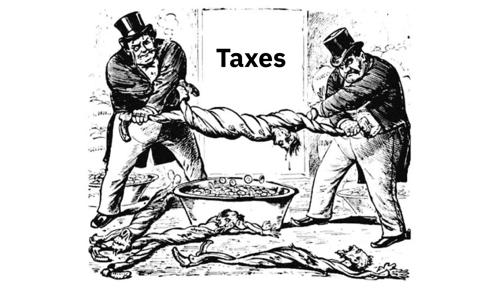

उनके लिए, सबसे अच्छे कर सबसे उदारवादी होते हैं, और वे चाहते हैं कि राज्य के व्यय यथासंभव सीमित हों। वे सार्वजनिक ऋण, करों, बैंकिंग एकाधिकार और व्यय के रूप में सरकार द्वारा समाज की संपत्ति की लूट की निंदा करते हैं। एक बार फिर, कानून को केवल स्वतंत्रता की रक्षा के लिए काम करना चाहिए; इसे कभी भी लूट नहीं करनी चाहिए।

अंत में, उन्होंने यह सिफारिश जोड़ी, जिसकी प्रासंगिकता अभी भी बरकरार है:

> सरकार को ऐसा ऋण नहीं लेना चाहिए और न ही लेने देना चाहिए, जिससे भावी पीढ़ियां प्रभावित हों और राज्य हमेशा बर्बादी की ओर जाएं।

निष्कर्ष में, विचारकों के पास एक गहन अंतर्ज्ञान था, अर्थात उत्पादन और विनिमय ही राजनीतिक समस्याओं का वास्तविक समाधान और युद्धों का सच्चा विकल्प हैं। युद्ध हमेशा हिंसक होते हैं, चाहे वे आंतरिक हों, जैसे क्रांति के दौरान, या बाहरी, जैसे प्राचीन राजाओं और नेपोलियन द्वारा छेड़े गए युद्ध।

## चार्ल्स कॉम्टे और चार्ल्स डनॉयर

<chapterId>80bc5c4e-ac07-52c8-9dd7-e224ac291bda</chapterId>

सभी सभ्यताओं का इतिहास लूटने वाले वर्गों और उत्पादक वर्गों के बीच संघर्ष की कहानी है। यह उन दो लेखकों का सिद्धांत है, जिनकी हम चर्चा करने जा रहे हैं। वे वर्ग संघर्ष के एक उदार सिद्धांत के प्रवर्तक हैं, जिसने फ्रेडरिक बास्टियाट को कार्ल मार्क्स जितना ही प्रेरित किया, हालाँकि बाद वाले ने इसे विकृत कर दिया।

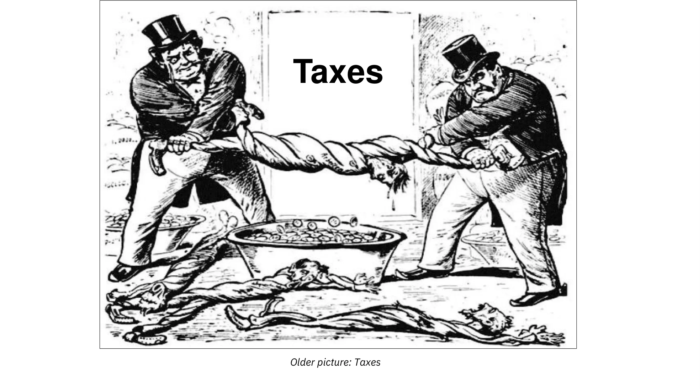

कॉम्टे और डुनोयर के लिए, लूट, जिसका अर्थ है समाज में कमज़ोर लोगों पर मज़बूत लोगों द्वारा की जाने वाली सभी तरह की हिंसा, मानव इतिहास को समझने की सबसे बड़ी कुंजी है। यह एक वर्ग द्वारा दूसरे वर्ग के शोषण की सभी घटनाओं का मूल है।

यदि फ्रेडरिक बास्टियाट को अपनी आर्थिक शिक्षा स्मिथ, डेस्टुट डे ट्रेसी और से से मिली है, तो उन्हें अपनी राजनीतिक शिक्षा भी 'ले सेन्सेर' पत्रिका के नेताओं चार्ल्स कॉम्टे और चार्ल्स डनोयर से मिली है।

इस समीक्षा (1814-1819) ने, जिसका नाम सौ दिनों के बाद ले सेन्सेर यूरोपियन रखा गया, उदार विचारों का प्रसार किया, जो 1830 में तीन गौरवशाली दिनों के विद्रोह और ड्यूक ऑफ ऑर्लियंस, लुई-फिलिप प्रथम के सत्ता में आने के साथ ही सफल हो गए।

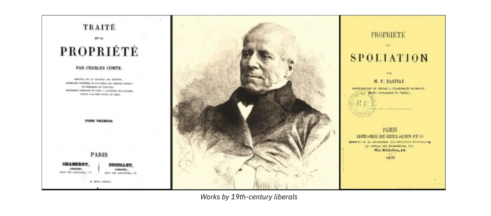

ऑगस्टे कॉम्टे के चचेरे भाई और से के दामाद चार्ल्स कॉम्टे इस समीक्षा के संस्थापक हैं। जल्द ही उनके साथ चार्ल्स डुनोयर भी शामिल हो गए, जो उनके जैसे ही एक न्यायविद थे, और फिर एक युवा इतिहासकार, ऑगस्टिन थिएरी, जो सेंट साइमन के पूर्व सचिव थे। समीक्षा के प्रत्येक अंक के पहले पन्ने पर उनका आदर्श वाक्य "शांति और स्वतंत्रता" था।

समीक्षा का लक्ष्य क्या है? शीर्षक ही अपने आप में बोलता है: सरकार को सेंसर करना। जनता की राय को जागृत करके सत्ता की मनमानी के खिलाफ लड़ना, प्रेस की स्वतंत्रता की रक्षा करना।

_(बेंजामिन कॉन्स्टेंट)_

वे बेंजामिन कॉन्स्टेंट से प्राचीन और आधुनिक लोगों के बीच के अंतर को अपनाते हैं, जो एक तरफ युद्ध और दूसरी तरफ वाणिज्य और उद्योग द्वारा चिह्नित हैं। लेकिन वे कहते हैं कि राजनीतिक अर्थव्यवस्था सामाजिक घटनाओं की सबसे अच्छी व्याख्या प्रदान करती है। वे विशेष रूप से समझते हैं कि जब संपत्ति के अधिकार और मुक्त व्यापार का सम्मान किया जाता है तो राष्ट्र शांति और समृद्धि प्राप्त करते हैं। अब से, उनके लिए, राजनीतिक अर्थव्यवस्था राजनीति का सच्चा और एकमात्र आधार है। दर्शन के लिए, जो खुद को सरकार के रूपों की अमूर्त आलोचना तक सीमित रखता है, आर्थिक हितों के ज्ञान पर आधारित सिद्धांत को प्रतिस्थापित किया जाना चाहिए।

> राजनीतिक अर्थव्यवस्था ने यह प्रदर्शित करके कि लोग कैसे समृद्ध होते हैं और कैसे अवनति करते हैं, राजनीति की सच्ची नींव रखी है।
>

> डुनोयेर

इस नए सामाजिक सिद्धांत में Elements में से एक शामिल है जो मार्क्स और एंगेल्स के वैज्ञानिक समाजवाद की आधारशिला बन जाएगा: वर्ग संघर्ष। लेकिन वर्ग संघर्ष के उदारवादी सिद्धांत में क्या शामिल है, और यह मार्क्सवाद से कैसे भिन्न है?

यह उस व्यक्ति से शुरू होता है जो अपनी ज़रूरतों और इच्छाओं को पूरा करने के लिए काम करता है। जिस क्षण से कोई व्यक्ति सृजन करता है, यानी चीज़ों की उपयोगिता बढ़ाता है, उनके मूल्य को बढ़ाता है, वह उद्योग में संलग्न होता है। यहाँ, एक उद्योगपति एक उद्योग का मालिक नहीं है, जैसा कि वर्तमान भाषा सुझा सकती है, बल्कि एक उत्पादक है, चाहे वह जिस भी क्षेत्र में काम करता हो। इसीलिए उनके सिद्धांत को उद्योगवाद कहा जाता है। यह मानता है कि समाज का लक्ष्य व्यापक अर्थों में उपयोगिता का निर्माण करना है, यानी मनुष्यों के लिए उपयोगी वस्तुएँ और सेवाएँ।

इस बिंदु पर, व्यक्तियों के सामने दो मौलिक विकल्प हैं: वे दूसरों द्वारा उत्पादित धन को लूट सकते हैं, या वे स्वयं धन उत्पन्न करने के लिए काम कर सकते हैं। किसी भी समाज में, कोई भी स्पष्ट रूप से उन लोगों में अंतर कर सकता है जो लूट पर जीते हैं और जो उत्पादन पर जीते हैं। एन्सियन रेजीम के तहत, कुलीन वर्ग ने कर के एक नए रूप से जीवन यापन करने के लिए सबसे मेहनती लोगों पर सीधे हमला किया। लालची कुलीन वर्ग के बाद नौकरशाहों की भीड़ ने जगह बनाई, जो कम लालची नहीं थे।

जबकि मार्क्स के लिए वर्ग विरोध, उत्पादक गतिविधि के भीतर ही, कर्मचारियों और नियोक्ताओं के बीच स्थित है, कॉम्टे और डुनोयर के लिए, संघर्षशील वर्ग, एक ओर समाज के उत्पादक हैं, जो करों का भुगतान करते हैं (जिनमें पूंजीपति, श्रमिक, किसान, विद्वान आदि शामिल हैं) और दूसरी ओर गैर-उत्पादक हैं, जो करों द्वारा वित्तपोषित किराए पर रहते हैं, "निष्क्रिय और भक्षक वर्ग" (नौकरशाह, अधिकारी, राजनेता, सब्सिडी या सुरक्षा के लाभार्थी)।

फिर, मार्क्स के विपरीत, सेंसर यूरोपियन के लेखक वर्ग युद्ध की वकालत नहीं करते हैं। इसके बजाय, वे सामाजिक शांति के लिए अभियान चलाते हैं। और उनके अनुसार, यह केवल समाज के अराजनीतिकरण के माध्यम से ही प्राप्त किया जा सकता है। इस उद्देश्य के लिए, सबसे पहले सार्वजनिक कार्यालयों की प्रतिष्ठा और लाभों को कम करना महत्वपूर्ण है। फिर उत्पादकों को राजनीतिक निकाय में प्रभाव देना महत्वपूर्ण है।

अंततः, विश्व को एक वर्ग द्वारा दूसरे वर्ग के शोषण से मुक्त करने का एकमात्र तरीका उस तंत्र को नष्ट करना है जो इस शोषण को संभव बनाता है: संपत्ति को वितरित करने और नियंत्रित करने तथा उससे संबंधित लाभों ("पदों") के आवंटन की राज्य की शक्ति।

उनके विचार, अत्यंत नवीन, फ्रेडरिक बास्टियाट के जीवन में सदैव अंकित रहेंगे, जो स्वयं राजनीतिक संकटों पर गहन विचारक बन गए।

## कोबडेन और लीग

<chapterId>7181435c-5eae-56e4-8e55-02a24273fdd6</chapterId>

यह 1838 की बात है, मैनचेस्टर में, कुछ लोग, जो उस समय तक बहुत कम जाने जाते थे, कानूनी तरीकों से गेहूं के भूस्वामियों के एकाधिकार को खत्म करने का तरीका खोजने के लिए इकट्ठा होते हैं और जैसा कि बास्टियाट ने बाद में बताया, इसे पूरा करते हैं,

> बिना रक्तपात के, केवल राय की शक्ति से, एक ऐसी क्रांति जो उतनी ही गहरी थी, शायद उससे भी अधिक गहरी जो हमारे पूर्वजों ने 1789 में की थी।

इस बैठक से कॉर्न लॉ या अनाज कानून, जैसा कि बास्टियाट उन्हें कहते हैं, के खिलाफ लीग उभरेगी। लेकिन बहुत जल्दी, यह लक्ष्य संरक्षणवाद के पूर्ण और एकतरफा उन्मूलन का हो जाएगा।

मुक्त व्यापार के लिए यह आर्थिक लड़ाई 1846 तक पूरे इंग्लैंड में जारी रही। फ्रांस में, कुछ लोगों को छोड़कर, इस विशाल आंदोलन के अस्तित्व के बारे में पूरी तरह से जानकारी नहीं थी। फ़्रेडरिक बास्टियाट को 1843 में एक अंग्रेज़ी अख़बार पढ़कर लीग के अस्तित्व के बारे में पता चला, जिसकी सदस्यता उन्होंने संयोग से ली थी। उत्साहित होकर उन्होंने कोबडेन, फ़ॉक्स और ब्राइट के भाषणों का अनुवाद किया। फिर उन्होंने कोबडेन के साथ पत्र-व्यवहार किया और अंततः 1845 में वे लीग की विशाल बैठकों में भाग लेने के लिए लंदन गए।

यह पूरे राज्य में हजारों सदस्यों के साथ मुक्त व्यापार के लिए आंदोलन का अभियान था, जिसने बास्टियाट की कलम को आग लगा दी और उनके जीवन की दिशा को मौलिक और निर्णायक रूप से बदल दिया।

लीग की तुलना एक यात्रा करने वाले विश्वविद्यालय से की जा सकती है, जो देश भर में अपनी बैठकों में भाग लेने वाले लोगों को आर्थिक रूप से शिक्षित करता था - आम लोग, उद्योगपति, किसान और किसान, जिन सभी को लीग ने अपने संरक्षण में लिया था और जिनके हितों पर अनाज कानूनों का दमन किया गया था। रिचर्ड कोबडेन आंदोलन की आत्मा और एक उत्कृष्ट आंदोलनकारी थे।

वह एक आकर्षक और प्रखर वक्ता थे, उनमें अर्थशास्त्रियों के अमूर्त प्रवचनों से कहीं अलग, प्रभावशाली और संक्षिप्त वाक्यांशों का आविष्कार करने की अद्भुत प्रतिभा थी।

> रोटी का एकाधिकार क्या है? उसने कहा। यह रोटी की कमी है। आपको यह जानकर आश्चर्य होगा कि इस मामले पर इस देश के कानून का कोई और उद्देश्य नहीं है, सिवाय रोटी की सबसे बड़ी संभावित कमी पैदा करने के। और फिर भी यह और कुछ नहीं है। कानून केवल कमी के माध्यम से ही अपना लक्ष्य प्राप्त कर सकता है।

1845 में, बास्टियाट ने पेरिस में अपनी पुस्तक कोबडेन एंड द लीग प्रकाशित की, जिसमें उनके अनुवादों के साथ टिप्पणियाँ भी थीं। पुस्तक इंग्लैंड की आर्थिक स्थिति, लीग की उत्पत्ति और प्रगति के इतिहास पर एक परिचय के साथ शुरू होती है। 1815 के बाद से, इंग्लैंड में संरक्षणवाद बहुत विकसित हो गया था। विशेष रूप से, अनाज के आयात को सीमित करने वाले कानून थे, जिनके लोगों के लिए बहुत कठोर परिणाम थे। वास्तव में, उस समय रोटी बनाने के लिए गेहूं आवश्यक था, जो एक महत्वपूर्ण वस्तु थी। इसके अलावा, यह प्रणाली अभिजात वर्ग, यानी बड़े जमींदारों के पक्ष में थी, जो इससे किराया प्राप्त करते थे।

> बास्टिएट ने लिखा है कि इंग्लैंड में एक साथ कुछ लुटेरे और एक बड़ी संख्या में लूटे गए लोग मौजूद हैं, तथा पहले वाले के वैभव और दूसरे वाले के दुख के बीच का निष्कर्ष निकालने के लिए किसी को महान अर्थशास्त्री होने की आवश्यकता नहीं है।

लीग का लक्ष्य संसद पर अनाज कानून को निरस्त करने के लिए दबाव बनाने के लिए जनमत जुटाना था। लंबे समय में, कोबडेन और उनके दोस्तों की उम्मीद थी:

- औद्योगिक आउटलेट बढ़ाएँ
- रोजगार में वृद्धि
- रोटी की कीमत कम करो
- प्रतिस्पर्धा के माध्यम से कृषि और उद्योग को अधिक कुशल बनाना
- राष्ट्रों के बीच शांति को बढ़ावा देना

_(जेरेमी बेन्थम)_

बेंथम के उपयोगितावाद के अनुयायी, कोबडेन का मानना ​​था कि श्रम और व्यापार की स्वतंत्रता सीधे तौर पर समाज के सबसे अधिक संख्या वाले, सबसे गरीब और सबसे अधिक पीड़ित लोगों के हितों की सेवा करती है। इसके विपरीत, मनमाने निषेध और विशेषाधिकारों के साधन के रूप में सीमा शुल्क केवल कुछ सबसे शक्तिशाली उद्योगों को ही लाभ पहुंचा सकता है।

1841 के चुनावों में, कोबडेन सहित लीग के पाँच सदस्य संसद के लिए चुने गए। 26 मई, 1846 को, एकतरफा मुक्त व्यापार राज्य का कानून बन गया। तब से, यूनाइटेड किंगडम ने स्वतंत्रता और समृद्धि का एक शानदार दौर देखा।

दिलचस्प बात यह है कि बास्टियाट ने उनकी पद्धति का एक हिस्सा अपनाया; उन्होंने उनकी भाषा को आत्मसात किया और इसे फ्रांसीसी संदर्भ में बदल दिया। कोबडेन और लीग पर किताब जल्द ही सफल हो गई, और बास्टियाट ने अर्थशास्त्रियों की दुनिया में सनसनीखेज प्रवेश किया। उन्होंने मुक्त व्यापार के पक्ष में बोर्डो में एक संघ की स्थापना की और फिर इसे पेरिस ले गए। उन्हें जर्नल डेस इकोनॉमिस्ट्स का नेतृत्व करने की पेशकश की गई। आंदोलन का जन्म हुआ, और यह 1848 तक जारी रहा।

1866 में बास्टियाट की मृत्यु के बाद ही नेपोलियन तृतीय ने इंग्लैंड के साथ एक मुक्त व्यापार संधि पर हस्ताक्षर किये, जो उस व्यक्ति के लिए एक प्रकार की मरणोपरांत विजय थी, जिसने अपने छोटे से जीवन के अंतिम छह वर्ष इस महान विचार के लिए समर्पित कर दिये थे।

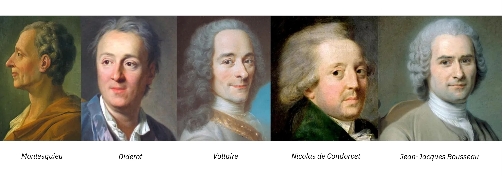

_(मिशेल शेवेलियर)_

मुक्त व्यापार का प्रश्न आज भी प्रासंगिक बना हुआ है। स्कूलों में भूगोल की पाठ्यपुस्तकों का दावा है कि वैश्वीकरण इसके लिए जिम्मेदार है और गरीब देशों को जीवनयापन के लिए पश्चिमी सहायता की आवश्यकता है। फिर भी, 20 वर्षों में अत्यधिक गरीबी आधी हो गई है। खुलेपन को चुनकर, भारत, चीन या ताइवान जैसे देश गरीबी से बचने में सक्षम हुए हैं, जबकि उत्तर कोरिया या वेनेजुएला जैसे बंद देशों में ठहराव की विशेषता है। संयुक्त राष्ट्र के अनुसार, 1990 में 36% मानवता पूर्ण अभाव में जी रही थी। अब वे 2010 में "केवल" 18% हैं। अत्यधिक गरीबी एक बड़ी चुनौती बनी हुई है, लेकिन यह घट रही है।

# विरोधियों

<partId>f902ed30-269e-5e44-a76d-8efd1a4e4085</partId>

## रूसो

<chapterId>c3926110-e0b2-503c-96d9-5d3a6a661484</chapterId>

फ्रेडरिक बास्टियाट, जिन्होंने 1840 के दशक में खुद को अभिव्यक्त किया, ज्ञानोदय दार्शनिकों की उस पीढ़ी के उत्तराधिकारी हैं जिन्होंने सेंसरशिप के खिलाफ और बहस की स्वतंत्रता के लिए लड़ाई लड़ी। मोंटेस्क्यू, डिडेरो, वोल्टेयर, कोंडोरसेट के बारे में सोचें, लेकिन रूसो के बारे में भी।

उनके लिए, विचार सरल था: जितना अधिक विचारों को व्यक्त करने की अनुमति दी जाती है, उतना ही अधिक सत्य आगे बढ़ता है और उतनी ही आसानी से त्रुटियों का खंडन किया जाता है। विज्ञान हमेशा इसी तरह आगे बढ़ता है।

_(मोंटेस्क्यू, डाइडरॉट, वोल्टेयर, कोंडोरसेट, रूसो)_

इसके विपरीत, बहुत कम लोगों ने यह समझा है कि जो विचारों के लिए सच था, वही वस्तुओं और सेवाओं के लिए भी सच था। दूसरों के साथ व्यापार करने की स्वतंत्रता के वास्तव में दो गुण हैं: कुशल होना और अधिक न्यायपूर्ण वितरण की ओर ले जाना। न केवल रूसो ने इसे नहीं समझा, बल्कि उन्होंने कानून और अधिकार के झूठे विचार के नाम पर इस स्वतंत्रता के खिलाफ लड़ाई भी लड़ी। समाजवाद के प्रमुख स्रोतों में से एक, बास्टियाट ने नोट किया, रूसो की राय है कि संपूर्ण सामाजिक व्यवस्था कानून से निकलती है।

बास्टियाट वास्तव में रूसो को समाजवाद और सामूहिकता का सच्चा अग्रदूत मानते हैं। द सोशल जीडब्ल्यू-9 के लेखक के एक कथन में उनके दर्शन का बहुत अच्छा सार है: "नागरिक बनने के बाद ही हम मनुष्य बनना शुरू करते हैं।"

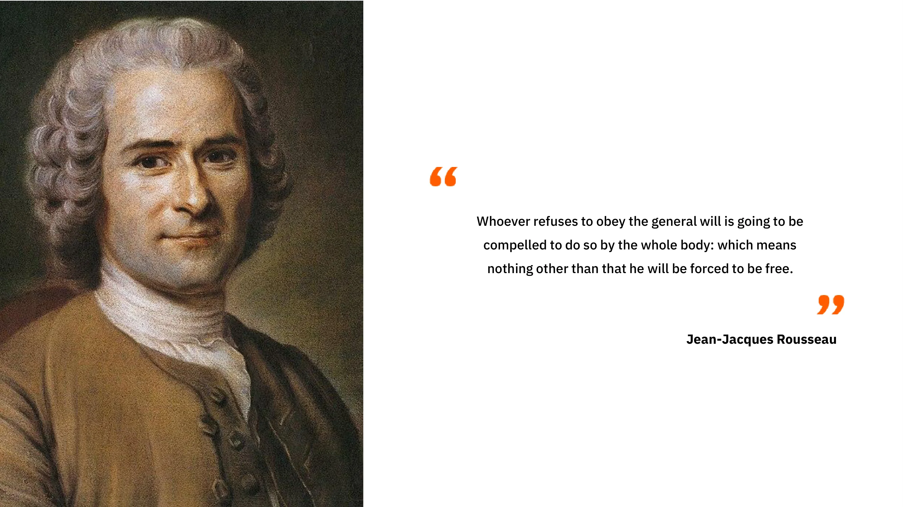

शुरू में, मनुष्य केवल एक बुर्जुआ होता है। लेकिन बुर्जुआ एक गणना करने वाला होता है; वह अपना तात्कालिक सुख चाहता है, वह अपनी इंद्रियों, अपनी इच्छाओं, अपने विशेष हित का गुलाम होता है। संक्षेप में, वह तर्कसंगत नहीं है, इसलिए वह स्वतंत्र नहीं है। उसे शिक्षित होने की आवश्यकता है, ताकि वह समझ सके कि उसका सच्चा हित सामान्य हित है। यही कारण है कि रूसो ने द सोशल जीडब्ल्यू-10 में लिखा:

---

> जो कोई भी सामान्य इच्छा का पालन करने से इनकार करता है, उसे पूरे निकाय द्वारा ऐसा करने के लिए मजबूर किया जाएगा: जिसका अर्थ और कुछ नहीं बल्कि यह है कि उसे स्वतंत्र होने के लिए मजबूर किया जाएगा।
> (जीन-जैक्स रूसो)

---

इस सिद्धांत के अनुसार, मनुष्य के अंदर दो इच्छाएँ होती हैं: एक इच्छा जो व्यक्तिगत हित की ओर प्रवृत्त होती है, जो बुर्जुआ की होती है, और एक इच्छा जो सामान्य हित की ओर प्रवृत्त होती है, जो नागरिक की होती है। लोगों को, बलपूर्वक भी, तर्कसंगत लक्ष्य, सामान्य हित की ओर ले जाना, लोगों को स्वतंत्र होने की ओर ले जाना है। वे वास्तव में एक तर्कसंगत लक्ष्य चाहते हैं, भले ही वे इसे न जानते हों।

इसलिए, रूसो के अनुसार, पुरुषों को उस लक्ष्य के नाम पर बाध्य करना पूरी तरह से वैध है, जिसे वे स्वयं, यदि वे अधिक प्रबुद्ध होते, तो अपनाते, लेकिन जिसका वे अनुसरण नहीं करते क्योंकि वे अंधे, अज्ञानी या भ्रष्ट हैं। समाज की स्थापना उन्हें वह करने के लिए मजबूर करने के लिए की गई है जो वे सहज रूप से करना चाहते हैं यदि वे प्रबुद्ध होते। और ऐसा करके, कोई उनके साथ हिंसा नहीं करता है क्योंकि वह उन्हें "स्वतंत्र" होने की ओर ले जाता है, अर्थात, सही विकल्प चुनने के लिए, ऐसे विकल्प जो उनके सच्चे स्व के अनुरूप हों।

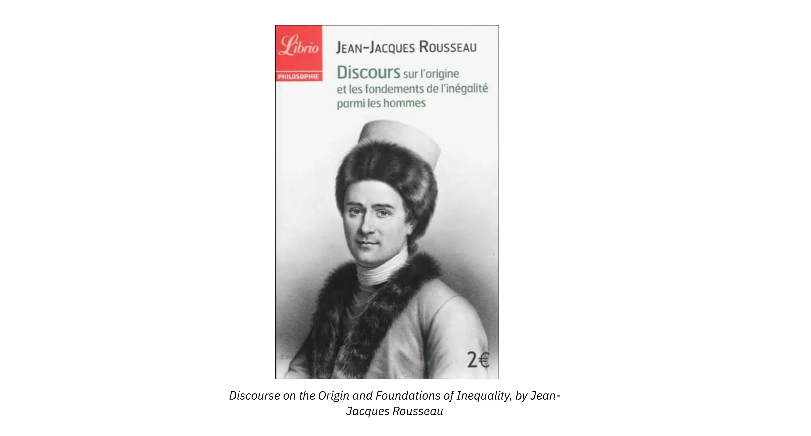

इस बात से सहमत होकर कि अच्छा समाज कानून की रचना है, रूसो ने विधिनिर्माता को असीमित शक्ति प्रदान की। व्यक्तियों को कुशल व्यक्तियों, नागरिकों में बदलना उसके ऊपर निर्भर है।

लेकिन, संपत्ति को अस्तित्व में लाना भी कानून पर निर्भर करता है। रूसो के अनुसार, संपत्ति तभी वैध हो सकती है जब उसे विधायिका द्वारा विनियमित किया जाए। वास्तव में, बुराई असमानता और दासता में निहित है, जो दोनों ही संपत्ति से उत्पन्न होती हैं। यह ताकतवर लोगों का आविष्कार है जिसने बुरे समाज, बुर्जुआ समाज और वर्चस्व के संबंधों को जन्म दिया है। असमानता की उत्पत्ति और नींव पर अपने प्रवचन में, वह यह प्रसिद्ध अंश लिखते हैं:

> पहला व्यक्ति जिसने ज़मीन के एक टुकड़े पर बाड़ लगाकर कहा: यह मेरा है, और लोगों को इतना सरल पाया कि वे उस पर विश्वास कर सकें, वही नागरिक समाज का सच्चा संस्थापक था। कितने अपराध, युद्ध, हत्याएँ, कितने दुख और आतंक से मानव जाति को बचाया जा सकता था, वह व्यक्ति जिसने खूँटियाँ उखाड़कर या खाई को भरकर अपने साथियों से चिल्लाकर कहा था: "इस धोखेबाज़ की बात सुनने से सावधान रहो; तुम खो गए हो अगर तुम भूल गए कि फल सभी के हैं और धरती किसी की नहीं है!"

इसलिए, प्राकृतिक संपत्ति बुराई का स्रोत है। और मार्क्स, रूसो के एक महान पाठक, इसे याद रखेंगे। इस बुराई का मुकाबला कैसे करें? सामाजिक Contract के माध्यम से, रूसो जवाब देते हैं। वास्तव में, अच्छा समाज वह है जो Contract से उत्पन्न होता है जो समुदाय के लिए अपने सभी अधिकारों के साथ व्यक्ति के अलगाव को निर्धारित करता है। उसके बाद, यह समुदाय पर निर्भर करता है कि वह कानून के माध्यम से व्यक्ति को अधिकार प्रदान करे।

रूसो के विपरीत, फ्रेडरिक बास्टियाट कहते हैं कि "मनुष्य जन्म से ही संपत्ति का स्वामी होता है।" उनके लिए, संपत्ति मनुष्य की प्रकृति, उसके संविधान का एक आवश्यक परिणाम है। वे लिखते हैं कि "मनुष्य जन्म से ही संपत्ति का स्वामी होता है, क्योंकि वह ऐसी ज़रूरतों के साथ पैदा होता है जिनकी संतुष्टि जीवन के लिए अपरिहार्य है, ऐसे अंगों और क्षमताओं के साथ जिनका उपयोग इन ज़रूरतों की संतुष्टि के लिए अपरिहार्य है"। लेकिन क्षमताएँ केवल व्यक्ति का विस्तार हैं, और संपत्ति केवल क्षमताओं का विस्तार है। दूसरे शब्दों में, यह काम में हमारी क्षमताओं का उपयोग है जो संपत्ति को वैध बनाता है।

बास्टियाट के अनुसार, समाज, लोग और संपत्ति कानून से पहले मौजूद हैं, और उनका यह प्रसिद्ध कथन है: "ऐसा नहीं है कि कानून होने की वजह से संपत्तियां हैं, बल्कि इसलिए कि संपत्तियां हैं इसलिए कानून हैं"। इसलिए कानून को नकारात्मक होना चाहिए: इसे लोगों और उनकी वस्तुओं पर अतिक्रमण को रोकना चाहिए। संपत्ति कानून का _अस्तित्व_ है, न कि इसके विपरीत।

## शास्त्रीय शिक्षा

<chapterId>87d9a8c9-2352-5cb2-8b93-678118a8145c</chapterId>

24 फरवरी, 1848 को पेरिस में तीन दिनों तक चले दंगों के बाद राजा लुई-फिलिप प्रथम ने अपनी सत्ता त्याग दी। इसी के साथ द्वितीय गणराज्य का जन्म हुआ।

बास्टियाट पेरिस में थे और उन्होंने इन घटनाओं को प्रत्यक्ष रूप से देखा। बाद में उन्होंने लिखा:

> 24 फरवरी को, मुझे, कई अन्य लोगों की तरह, डर था कि राष्ट्र खुद पर शासन करने के लिए तैयार नहीं है। मुझे स्वीकार करना चाहिए, मुझे ग्रीक और रोमन विचारों के प्रभाव से डर लगता था जो अकादमिक एकाधिकार द्वारा हम सभी पर थोपे जाते हैं।

यह अंश आश्चर्यजनक है। ग्रीक और रोमन पुरातनता का इससे क्या संबंध है?

बास्टियाट प्लेटो के रिपब्लिक और दार्शनिक-राजा के अपने सिद्धांत का उल्लेख करते हैं, लेकिन स्पार्टा का भी, जिसकी रूसो बहुत प्रशंसा करते थे, रोमन साम्राज्य का, जिसके लिए नेपोलियन बहुत उदासीन थे। दुर्भाग्य से, बास्टियाट के अनुसार, ये ग्रीक और रोमन विचार एक झूठे आधार पर आधारित हैं: विधायक की सर्वशक्तिमानता का विचार, कानून की पूर्ण संप्रभुता का विचार।

दर्शन, राजनीति या इतिहास की लगभग किसी भी किताब को खोलकर देखना ही काफी है, यह विचार हमारी संस्कृति में निहित है कि मानवता एक निष्क्रिय पदार्थ है जो राजनीतिक शक्ति से जीवन, संगठन, नैतिकता और समृद्धि प्राप्त करती है। अपने आप पर छोड़ दिए जाने पर, मानवता अराजकता की ओर प्रवृत्त होगी और केवल विधानपालक के रहस्यमय और सर्वशक्तिमान हाथ से ही इस आपदा से बचाई जा सकेगी। हालाँकि, बास्टियाट कहते हैं, यह विचार सदियों की शास्त्रीय शिक्षा द्वारा लंबे समय से परिपक्व और तैयार किया गया है।

सबसे पहले, वे कहते हैं, रोमन संपत्ति को एक विशुद्ध रूप से पारंपरिक तथ्य के रूप में देखते थे, लिखित कानून के एक कृत्रिम निर्माण के रूप में। क्यों? बस, बास्टियाट बताते हैं, क्योंकि वे गुलामी और लूट पर जीते थे। उनके लिए, सभी संपत्तियाँ लूट का फल थीं। इसलिए, वे अपने समाज की नींव को नष्ट किए बिना कानून में यह विचार पेश नहीं कर सकते थे कि वैध संपत्ति का आधार श्रम था।

उनके पास वास्तव में संपत्ति की एक अनुभवजन्य परिभाषा थी, "जस यूटेन्डी एट अबुटेन्डी" (उपयोग और दुरुपयोग का अधिकार)। हालाँकि, यह परिभाषा केवल प्रभावों से संबंधित थी, न कि कारणों से, दूसरे शब्दों में, संपत्ति की नैतिक उत्पत्ति से। संपत्ति को सही ढंग से स्थापित करने के लिए, किसी को मनुष्य के संविधान में वापस जाना चाहिए, और जरूरतों, क्षमताओं, श्रम और संपत्ति के बीच मौजूद संबंध और आवश्यक जुड़ाव को समझना चाहिए। रोमन, जो दास मालिक थे, क्या वे इस विचार को समझ सकते थे कि "हर आदमी खुद का मालिक है, और इसलिए उसका श्रम, और, परिणामस्वरूप, उसके श्रम का उत्पाद"? बास्टियाट आश्चर्य करते हैं।

> इसलिए, हमें आश्चर्य नहीं होना चाहिए, बास्टियाट ने निष्कर्ष निकाला है, कि अठारहवीं शताब्दी में रोमन विचार कि संपत्ति एक पारंपरिक तथ्य और कानूनी संस्था है, फिर से उभरी; कि कानून संपत्ति का परिणाम नहीं है, बल्कि संपत्ति ही कानून का परिणाम है।

वास्तव में, रूसो कानून पर संपत्ति आधारित करने के इस सामान्य कानूनी विचार को साझा करते हैं। रूसो कानून को, और परिणामस्वरूप लोगों को, व्यक्तियों और संपत्तियों पर पूर्ण शक्ति प्रदान करते हैं। और इस अवधारणा में, जो फ्रांसीसी क्रांति के बाद से गणतंत्र के विचार का गठन करती है, विधायक को समाज को संगठित करना चाहिए, एक सामाजिक वास्तुकार की तरह, एक मैकेनिक की तरह जो निष्क्रिय पदार्थ से मशीन का आविष्कार करता है, या एक कुम्हार की तरह जो मिट्टी को आकार देता है। इस प्रकार विधायक खुद को मानवता से बाहर, उससे ऊपर रखता है, अपनी चमकदार बुद्धि द्वारा बनाई गई योजनाओं के अनुसार, इसे अपनी इच्छानुसार व्यवस्थित करता है।

इसके विपरीत, बास्टियाट के लिए संपत्ति का अधिकार कानून से पहले है। इसे वे अर्थशास्त्रियों का सिद्धांत कहते हैं, जो न्यायविदों के सिद्धांत के विपरीत है। बास्टियाट कहते हैं कि "न्यायविदों के सिद्धांत में वस्तुतः गुलामी शामिल है, जबकि अर्थशास्त्रियों के सिद्धांत में स्वतंत्रता शामिल है।"

तो फिर आज़ादी क्या है? यह संपत्ति है, अपने श्रम के फल का आनंद लेने का अधिकार है, काम करने का अधिकार है, विकास करने का अधिकार है, अपनी क्षमताओं का उपयोग करने का अधिकार है, जैसा कि आप उचित समझें, राज्य द्वारा अपनी सुरक्षात्मक कार्रवाई के अलावा किसी अन्य तरीके से हस्तक्षेप किए बिना।

यह सोचकर दुख होता है कि हमारा सामाजिक और राजनीतिक दर्शन इस विचार पर अटका हुआ है कि हमारी सभी समस्याओं का समाधान ऊपर से, कानून से, राज्य से आना चाहिए। लेकिन यह समझा जा सकता है। ये विचार हर दिन स्कूलों और विश्वविद्यालयों में युवाओं में शिक्षा के एकाधिकार के माध्यम से डाले जाते हैं।

_ऐसे एकाधिकार एजेंट का उदाहरण कोई सरकारी संस्था हो सकती है_

हालाँकि, जैसा कि बास्टियाट हमें याद दिलाते हैं, एकाधिकार प्रगति को रोकता है।

## संरक्षणवाद और समाजवाद

<chapterId>ce6cb8a8-7dc9-5ef7-939d-9a559b4d2c74</chapterId>

_(रिचर्ड कोबडेन)_

जैसा कि हम पहले ही देख चुके हैं, यह सर्वप्रथम और सर्वोपरि कॉर्न कानूनों के उन्मूलन के लिए इंग्लिश लीग के साथ संरक्षणवाद के विरुद्ध कोबडेन की लड़ाई थी, जिसने बास्टियाट को लेख और फिर पुस्तकें लिखने के लिए प्रेरित किया।

संरक्षणवाद, वास्तव में, आर्थिक राष्ट्रवाद का एक रूप है। इसका उद्देश्य "राष्ट्रीय हितों की रक्षा" करने का दिखावा करते हुए विदेशी प्रतिस्पर्धा को खत्म करना है। इसके बाद वे सार्वजनिक अधिकारियों को विशुद्ध रूप से जनवादी असत्यों के एक सेट को स्वीकार करने के लिए मजबूर करने की कोशिश करते हैं, जिन्हें पुण्य के रूप में प्रस्तुत किया जाता है: नौकरियों की रक्षा, प्रतिस्पर्धात्मकता, आदि। बेशक, निर्वाचित अधिकारी उत्पादकों के दबाव के आगे झुक जाते हैं, क्योंकि यह उनके लिए अपने ग्राहकों को मजबूत करने और अपनी शक्ति का विस्तार करने का एक सुनहरा अवसर है।

_फ्रांस में उत्पादित ब्लेंडर के प्रचारात्मक विज्ञापन का एक उदाहरण_

---

> अरनॉड मोंटेबर्ग के साथ हमारी मुलाकात
> फ़्रांस में निर्मित,
> वह इस पर विश्वास करता है, हमने इसका परीक्षण किया

---

नौकरी की सुरक्षा के लिए तर्क को बास्टियाट एक भ्रांति कहते हैं। क्योंकि वास्तव में, यह एक कर के बराबर है। इसका प्रभाव उत्पादों को अधिक महंगा बनाना है। आइए बास्टियाट द्वारा दिए गए उदाहरण को ही लें।

कल्पना कीजिए कि एक अंग्रेजी चाकू हमारे देश में 2 यूरो में बिकता है, और फ्रांस में बने चाकू की कीमत 3 यूरो है। यदि हम उपभोक्ता को उसकी इच्छानुसार चाकू खरीदने की स्वतंत्रता दें, तो वह 1 यूरो बचा लेगा, जिसे वह कहीं और निवेश कर सकता है (किसी पुस्तक या पेंसिल में)।

अगर हम अंग्रेजी उत्पाद पर प्रतिबंध लगाते हैं, तो उपभोक्ता को अपने चाकू के लिए एक और यूनिट चुकानी होगी। इस प्रकार संरक्षणवाद के परिणामस्वरूप राष्ट्रीय उद्योग को लाभ होता है और दो नुकसान होते हैं, एक दूसरे उद्योग (पेंसिल) को और दूसरा उपभोक्ता को। इसके विपरीत, मुक्त व्यापार दो खुश विजेता बनाता है।

संरक्षणवाद भी वर्ग संघर्ष का ही एक रूप है। बास्टियाट के अनुसार, यह उत्पादकों के स्वार्थ और लालच पर आधारित व्यवस्था है। अपना पारिश्रमिक बढ़ाने के लिए किसान या उद्योगपति विदेशी उत्पादों के लिए बाजार बंद करने के लिए करों की मांग करते हैं, जिससे उपभोक्ताओं को उनके उत्पादों के लिए अधिक भुगतान करने के लिए मजबूर होना पड़ता है।

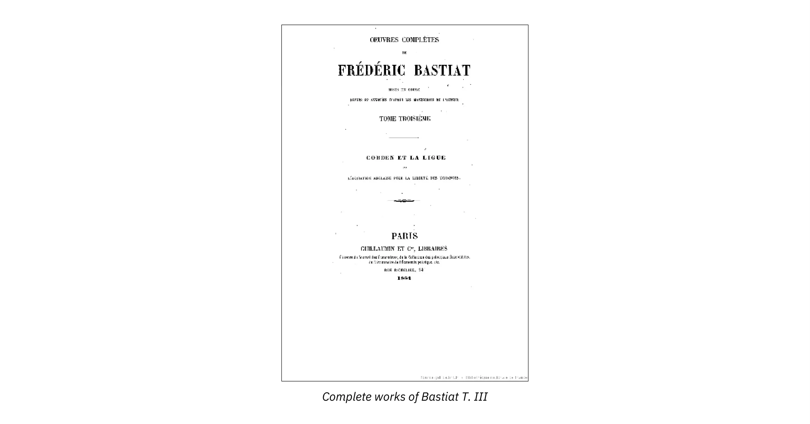

बास्टियाट दृढ़ता से उपभोक्ताओं का पक्ष लेते हैं। वर्ग हित के विरुद्ध, वे सामान्य हित की बात करते हैं, जो उपभोक्ता का हित है, अर्थात सभी का हित। राज्य को हमेशा उपभोक्ता के दृष्टिकोण से ही कार्य करना चाहिए।

फरवरी 1848 की क्रांति और उसके अवरोधों के साथ, संरक्षणवाद से भी अधिक दुर्जेय शत्रु उभरेगा, जिसके साथ इसकी कई समानताएं हैं: समाजवाद।

यह क्या है? यह एक राजनीतिक आंदोलन है जो कानून द्वारा श्रम के संगठन, उद्योगों और बैंकों के राष्ट्रीयकरण और कराधान के माध्यम से धन के पुनर्वितरण की मांग करता है। बास्टियाट अब अपनी सारी ऊर्जा, प्रतिभा और लेखन इस नए सिद्धांत के खिलाफ समर्पित करेंगे, जो केवल सत्ता के घातीय विकास और सतत वर्ग संघर्ष की ओर ले जा सकता है। इस प्रकार, क्रांति के पहले दिनों से, उन्होंने "ला रिपब्लिक फ्रांसेसे" नामक एक अल्पकालिक समाचार पत्र में योगदान दिया, जो जल्द ही एक प्रति-क्रांतिकारी पत्रिका के रूप में जाना जाने लगा। यह वह समय था जब उन्होंने संपत्ति, राज्य, लूट और कानून पर अपने पर्चे लिखे।

27 जून 1848 को, पेरिस में एक नए खूनी विद्रोह के अगले दिन, रिचर्ड कोबडेन को लिखे एक लम्बे पत्र में, उन्होंने उन कारणों पर विस्तार से चर्चा की जो इन घटनाओं के लिए जिम्मेदार हो सकते थे।

- 1° इनमें से पहला कारण आर्थिक अज्ञानता है। यही वह कारण है जो समाजवाद और झूठे गणतंत्रवाद के स्वप्नलोक को अपनाने के लिए दिमाग तैयार करता है। मैं इस बिंदु पर शास्त्रीय और विश्वविद्यालय शिक्षा की प्रवृत्तियों पर पिछले वीडियो का संदर्भ देता हूं।

- 2° राष्ट्र इस विचार से मोहित हो गया कि बंधुत्व और एकजुटता को कानून में शामिल किया जा सकता है। यानी, इसने मांग की कि राज्य सीधे अपने नागरिकों के लिए खुशी पैदा करे। यहाँ बास्टियाट कल्याणकारी राज्य की शुरुआत देखता है।

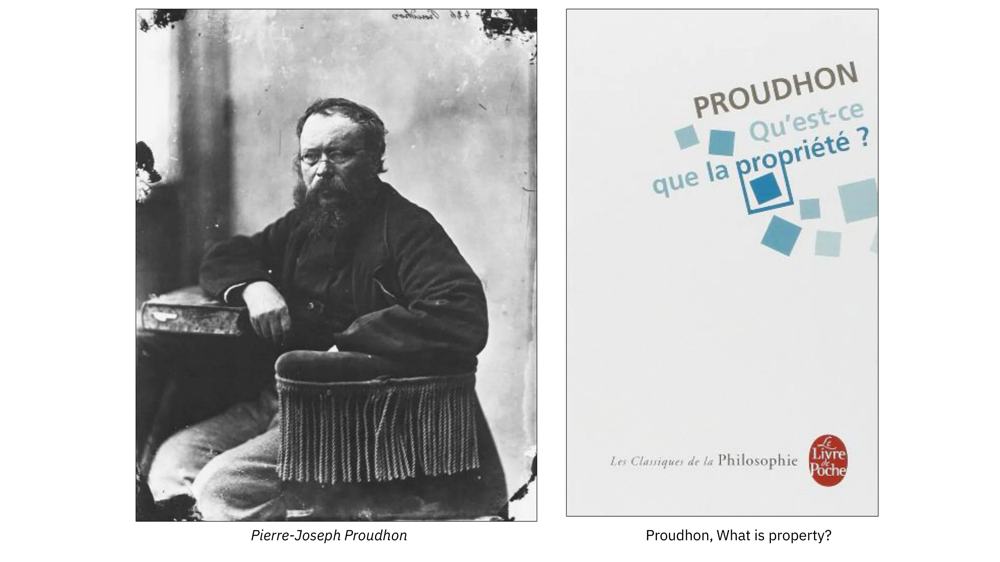

और इसके बाद भी वह इसके विपरीत प्रभावों का विश्लेषण करते रहेंगे। यहाँ एक उदाहरण दिया गया है, जिसका उल्लेख कोबडेन को लिखे पत्र में किया गया है:

> मानव हृदय की स्वाभाविक प्रवृत्ति के कारण, हर कोई राज्य से अपने लिए, कल्याण का अधिक हिस्सा माँगने लगा। यानी, राज्य या सार्वजनिक खजाने को लूटने के लिए लगा दिया गया। सभी वर्गों ने राज्य से, मानो अधिकार से, जीवनयापन के साधन माँगे। राज्य द्वारा इस दिशा में किए गए प्रयासों से केवल कर और बाधाएँ ही बढ़ीं और दुख में वृद्धि हुई।

- 3° बास्टियाट कहते हैं कि उनके विचार में, संरक्षणवाद इस अव्यवस्था की पहली अभिव्यक्ति थी। पूंजीपतियों ने अपने हिस्से की संपत्ति बढ़ाने के लिए कानून के हस्तक्षेप की मांग करके शुरुआत की। अनिवार्य रूप से, श्रमिक भी ऐसा ही करना चाहते थे।

---

> सफल होने के लिए
> वोट समाजवादी SFIO

---

निष्कर्ष के तौर पर, बास्टियाट के अनुसार, संरक्षणवादियों और समाजवादियों में एक बात समान है: वे कानून से यह नहीं चाहते कि हर किसी को अपनी क्षमताओं का स्वतंत्र प्रयोग करने और उनके प्रयासों के लिए उचित पुरस्कार मिले, बल्कि वे नागरिकों के एक वर्ग द्वारा दूसरे वर्ग का कमोबेश पूर्ण शोषण करने का पक्ष लेते हैं। संरक्षणवाद में, अल्पसंख्यक ही बहुसंख्यकों का शोषण करते हैं। समाजवाद में, बहुसंख्यक ही अल्पसंख्यकों का शोषण करते हैं। दोनों ही मामलों में, न्याय का उल्लंघन होता है और आम हितों से समझौता होता है। बास्टियाट उन्हें एक-दूसरे के खिलाफ खड़ा करता है।

> राज्य वह महान कल्पना है जिसके माध्यम से हर कोई एक दूसरे की कीमत पर जीने का प्रयास करता है।

## प्राउधों

<chapterId>96902abd-6915-5b25-a187-a4790162b86c</chapterId>

पियरे-जोसेफ प्राउडन 19वीं सदी के मध्य में फ्रांसीसी समाजवाद के प्रमुख प्रतिनिधियों में से एक हैं। वे 1840 में "व्हाट इज प्रॉपर्टी?" में दिए गए इस कथन के लिए विशेष रूप से प्रसिद्ध हैं: "संपत्ति चोरी है"।

इस कथन में तार्किक रूप से कुछ बेतुकापन है। क्योंकि अगर वैध रूप से अर्जित संपत्ति नहीं होती, तो तार्किक रूप से चोरी जैसा कोई कार्य नहीं हो सकता। इसीलिए प्रूधों ने बाद में स्पष्ट किया कि वह संपत्ति के वास्तविक वितरण को चोरी मानते हैं, न कि संपत्ति को, जिसे वह अराजकतावादी समाज के लिए आधारभूत क्रांतिकारी शक्ति के रूप में वर्णित करते हैं।

लेकिन प्रूधों एक व्यक्तिवादी अराजकतावादी हैं। वे सर्वहारा वर्ग या राज्य को सत्ता के वैध स्रोत के रूप में नहीं देखते। वे साम्यवाद की कड़ी आलोचना करते हैं और श्रमिक पारस्परिकता की वकालत करते हैं, जो संरचित सहकारी एकजुटता का एक रूप है, जो पारस्परिक सहायता के लिए संसाधनों के स्वैच्छिक पूलिंग पर निर्भर करेगा। यह कम ज्ञात है लेकिन बास्टियाट सिद्धांत रूप में इस विचार के बिल्कुल भी विरोधी नहीं थे। उन्हें बस इस बात का डर था कि राज्य इसे वास्तविक एकाधिकार वाली सार्वजनिक सेवा में बदल देगा। इतिहास उन्हें सही साबित करेगा।

दूसरी ओर, यह सर्वविदित है कि "द पॉवर्टी ऑफ फिलॉसफी" में मार्क्स ने प्रूधों और उनके समाजवाद पर हिंसक हमला किया था, जिसे उन्होंने तथाकथित "वैज्ञानिक" समाजवाद के पक्ष में "यूटोपियन" कहा था।

जून 1848 में, प्राउडन को बैस्टियाट के साथ नेशनल असेंबली के लिए चुना गया। वे परिचित थे और एक-दूसरे का बहुत सम्मान करते थे। हालाँकि, 1849 में, एक जोरदार विवाद में, बैस्टियाट ने ला वोइक्स डू पीपल के कॉलम में उनके साथ चौदह पत्रों का आदान-प्रदान किया। इस जोरदार Exchange में, उन्होंने मौद्रिक और बैंकिंग मुद्दों पर अपना रुख स्पष्ट किया। विवाद निम्नलिखित विकल्प पर आ गया: मुफ़्त ऋण या ऋण की स्वतंत्रता?

प्राउडन ने पूंजी पर ब्याज को गरीबी और स्थितियों की असमानता का प्रारंभिक कारण माना। उन्होंने एक राज्य बैंक (जीडब्ल्यू-13 बैंक या पीपुल्स बैंक) द्वारा असीमित मौद्रिक निर्माण की वकालत की, और "मुक्त ऋण" में सामाजिक समस्या का समाधान देखा। दूसरी ओर, बास्टियाट बैंकों की स्वतंत्रता के समर्थक थे, जिसका अर्थ है पेशे तक पहुँच की स्वतंत्रता के माध्यम से मौद्रिक परिसंचरण का विनियमन, अपने स्वयं के धन पर एक आवश्यक जिम्मेदारी और प्रतिस्पर्धा की स्वतंत्रता के साथ।

बास्टियाट ने कई चरणों में अपने प्रतिद्वंद्वी का खंडन किया। सबसे पहले, उन्होंने मुफ़्त ऋण और मौद्रिक सृजन के विपरीत प्रभावों का विश्लेषण किया। ऐसी प्रणाली केवल बैंकों और निजी अभिनेताओं द्वारा सबसे जोखिमपूर्ण और सबसे लापरवाह कार्यों को प्रोत्साहित कर सकती है क्योंकि उन्हें पता है कि वे राज्य द्वारा, यानी करदाताओं के पैसे से सुरक्षित हैं: "सभी लोगों को ऐसी स्थिति में रखना एक गंभीर मामला है जहाँ वे कहते हैं: चलो किसी और की संपत्ति के साथ अपनी किस्मत आजमाते हैं; अगर मैं सफल होता हूँ, तो मेरे लिए उतना ही अच्छा है; अगर मैं असफल होता हूँ, तो दूसरों के लिए बहुत बुरा है।" एक दूरदर्शी कथन क्योंकि यह हमारे युग पर लागू हो सकता है।

केंद्रीय बैंकों द्वारा अपनाई गई कम ब्याज दरों की नीति कृत्रिम रूप से धन बनाने का एक तरीका है। और पिछली शताब्दी में वित्तीय प्रणाली के लगातार संकट, राज्यों की ऋणग्रस्तता, इसके प्रत्यक्ष परिणाम हैं।

फिर बास्टियाट बताते हैं कि मज़दूर वर्ग की क्रय शक्ति में सुधार करना संभव है, लेकिन दूसरे तरीकों से, ज़्यादा न्यायपूर्ण और ज़्यादा प्रभावी तरीके से। उनके लिए, ब्याज दरों में कमी भी उदार नीति का लक्ष्य है। लेकिन यह पूंजी की मुक्ति और संचय के ज़रिए ही हासिल किया जा सकता है, ब्याज के उन्मूलन यानी मुफ़्त ऋण से नहीं।

दरअसल, बास्टियाट के अनुसार, मानवता की प्रगति पूंजी के निर्माण के साथ मेल खाती है। पूंजी और किराया नामक अपने पैम्फलेट में, बास्टियाट हमें रॉबिन्सन क्रूसो के साथ अपने द्वीप पर यह समझाते हैं।

बिना संचित पूंजी या सामग्री के रॉबिन्सन की मृत्यु निश्चित है। फिर वह बताते हैं कि पूंजी दो तरीकों से मज़दूर को समृद्ध बनाती है:

- इससे उत्पादन बढ़ता है, जिससे उपभोग के लिए वस्तुओं की कीमत कम हो जाती है;
- जिसका प्रभाव मजदूरी में वृद्धि के रूप में होता है।

आधुनिक समाज में, पूंजी एक समान शक्ति के रूप में कार्य करती है। दरअसल, बास्टियाट कहते हैं:

> जब पूंजी बढ़ती है, तो वह स्वयं से प्रतिस्पर्धा करती है; उसका पारिश्रमिक घटता है, या दूसरे शब्दों में, ब्याज दर गिर जाती है।

निष्कर्ष में, प्रूधों और बास्टियाट दोनों ने पूंजी संचय के महत्व और कुछ लोगों द्वारा दूसरों का शोषण करने की प्रवृत्ति को पहचाना। हालाँकि, वे एक जैसे निष्कर्ष पर नहीं पहुँचे। मार्क्स की तरह प्रूधों ने भी पूंजीवादी देशों में आम जनता की बढ़ती दरिद्रता का अनुमान लगाया था। बास्टियाट का मानना ​​था कि पूंजीवाद सभी वर्गों में अभूतपूर्व समृद्धि लाएगा और एक महत्वपूर्ण मध्यम वर्ग का विकास होगा। वास्तव में ऐसा ही हुआ।

# आर्थिक कुतर्क

<partId>59686d1d-58c6-59a8-9fc4-74a10d24cdbe</partId>

## क्या देखा जाता है और क्या नहीं देखा जाता

<chapterId>25fb02a9-5d68-5c58-bd0f-d4b8e1fd91f9</chapterId>

इस अध्याय में, मैं एक बिलकुल नई तकनीक, एक क्रांतिकारी तकनीक का अनावरण करूँगा। एक शोधकर्ता ने बायोनिक चश्मे की एक जोड़ी विकसित की है जिसके सामने एक अल्ट्रा-शक्तिशाली मिनी-कैमरा लगा हुआ है। यह तकनीक नंगी आँखों से असंभव विवरणों को देखने की अनुमति देती है। भुजाओं में एक इलेक्ट्रॉनिक चिप है जो मेरे स्मार्टफ़ोन के माध्यम से छवियों को सीधे क्लाउड पर भेजती है।

इन चश्मों के पहले प्रोटोटाइप के आविष्कारक फ्रेडरिक बास्टियाट थे, जिन्होंने 1850 में एक प्रसिद्ध पैम्फलेट में लिखा था: _से क्वोन वोइट एट से क्वोन ने वोइट पास_। ये चश्मे अर्थशास्त्री के हैं। वे हमारे जीवन पर अधिकारियों द्वारा लिए गए निर्णयों के परिणामों को मापने की अनुमति देते हैं। वे ऐसे चश्मे हैं जो "हमें वह देखने की अनुमति देते हैं जो हम नहीं देखते हैं": क्लाइंटलिस्ट नीतियों और झूठे आर्थिक सिद्धांतों के कारण होने वाला विनाश। अक्सर हम उनके पीड़ितों को नहीं देखते हैं, न ही उनके लाभार्थियों को, संक्षेप में, आधिकारिक भाषणों में किए गए दावों के विपरीत उनके वास्तविक प्रभावों को, जिसे बास्टियाट "आर्थिक कुतर्क" कहते हैं।

बास्टियाट के अनुसार, अच्छे अर्थशास्त्री को समाज पर राजनीतिक निर्णयों के प्रभावों का वर्णन करना चाहिए। हालाँकि, उन्हें किसी विशेष समूह पर उनके अल्पकालिक प्रभावों के बारे में नहीं, बल्कि पूरे समाज के लिए उनके दीर्घकालिक परिणामों के बारे में सावधान रहना चाहिए। इन नीतियों के पीड़ित कौन हैं और लाभार्थी कौन हैं? किसी निश्चित कानून या राजनीतिक निर्णय की छिपी हुई लागतें क्या हैं? करदाताओं ने सरकार के बजाय करों में उनसे लिए गए पैसे का क्या किया होगा? बास्टियाट के अनुसार अच्छे अर्थशास्त्री द्वारा पूछे गए ये प्रश्न हैं।

इस प्रकार, पब्लिक वर्क्स में, बास्टियाट लिखते हैं:

> राज्य एक सड़क बनाता है, एक महल बनाता है, एक गली को सीधा करता है, एक नहर खोदता है; ऐसा करके वह कुछ श्रमिकों को काम देता है, यही दिखाई देता है; लेकिन वह कुछ अन्य लोगों से काम छीन लेता है, यही दिखाई नहीं देता।

सबसे प्रसिद्ध कुतर्कों में से एक है टूटी खिड़की का भ्रम। कुछ लोग दावा करते हैं कि घर में खिड़की टूटने से अर्थव्यवस्था को नुकसान नहीं होता क्योंकि इससे ग्लेज़ियर को फ़ायदा होता है। लेकिन बास्टियाट दिखाएंगे कि विनाश हमारे हित में नहीं है क्योंकि इससे धन का सृजन नहीं होता। इससे जितना लाभ होता है, उससे कहीं ज़्यादा खर्च होता है। पड़ोसी की खिड़की तोड़ने वाला छोटा लड़का ग्लेज़ियर को काम देता है। लेकिन यहाँ बताया गया है कि उसके दोस्त उसे कैसे सांत्वना देते हैं:

> हर बादल में एक चांदी की परत होती है। ऐसी दुर्घटनाएँ उद्योग को चालू रखती हैं। सभी को जीवित रहने की ज़रूरत है। अगर खिड़कियाँ कभी न टूटीं तो ग्लेज़ियर का क्या होगा?

इस प्रकार, कीन्स के अनुसार, व्यय को मजबूर करके संपत्ति का विनाश, अर्थव्यवस्था को प्रोत्साहित करेगा और उत्पादन और रोजगार पर "गुणक प्रभाव" डालेगा। यह केवल वही है जो दिखाई देता है।

लेकिन जो नहीं देखा जाता वह यह है कि मालिक उस पैसे से क्या खरीद सकता था, लेकिन अब उसे बिना किसी चीज के काम चलाना पड़ रहा है, क्योंकि उसे अपनी खिड़की की मरम्मत पर जो खर्च करना पड़ रहा है। जो नहीं देखा जाता वह यह है कि टूटी हुई खिड़की के मालिक ने जो अवसर खोया है। वह ग्लेज़ियर को दी गई राशि को किसी और चीज़ में लगा सकता था। अगर उसे खिड़की की मरम्मत पर खर्च नहीं करना पड़ता, तो वह पैसे को अपने उपभोग पर खर्च कर सकता था, इस तरह उत्पादन के लिए लोगों को रोजगार दे सकता था।

इस प्रकार, खिड़की के टूटने से अर्थव्यवस्था को कोई अधिक "उत्तेजना" नहीं मिलेगी, जितना कि बिना खिड़की के टूटने से। हालांकि, पहले मामले में शुद्ध घाटा होगा: खिड़की का मूल्य।

सीखने के लिए पहला सबक यह है कि एक "अच्छा" निर्णय या एक "अच्छी" नीति वह होती है जिसकी लागत समाज पर संसाधनों के दूसरे आवंटन की लागत से कम होती है। किसी नीति की प्रभावशीलता का मूल्यांकन न केवल उसके प्रभावों के आधार पर किया जाना चाहिए, बल्कि उन विकल्पों के आधार पर भी किया जाना चाहिए जो हो सकते थे। यह "अवसर लागत" की अवधारणा है, जो बास्टियाट को प्रिय है।

दूसरा सबक यह है कि विनाश अर्थव्यवस्था को बढ़ावा नहीं देता जैसा कि कीनेसियन सोचते हैं, बल्कि यह दरिद्रता की ओर ले जाता है। भौतिक वस्तुओं के विनाश का अर्थव्यवस्था पर सकारात्मक प्रभाव नहीं पड़ता है, लोकप्रिय धारणा के विपरीत। फ्रेडरिक बास्टियाट के पाठ के अंतिम शब्दों का उपयोग करें: "समाज अनावश्यक रूप से नष्ट की गई वस्तुओं का मूल्य खो देता है।"

आइए एक मौजूदा उदाहरण लेते हैं। जैसे ही मोटर वाहन उद्योग संघर्ष कर रहा होता है, नीति निर्माता इसे "पुनः शुरू" करने के लिए स्क्रैपेज योजनाओं की कल्पना करते हैं। हम जो देखते हैं वह रेनॉल्ट और प्यूज़ो की बिक्री में वृद्धि है। हम यह नहीं देखते कि अन्य आर्थिक क्षेत्रों को नुकसान हो रहा है और यह कि अच्छी तरह से काम करने वाली कारें नष्ट हो रही हैं।

लेकिन अर्थव्यवस्था को बढ़ावा देने के और भी तरीके हैं। अगर राज्य रोजगार को बढ़ावा देने के लिए प्रमुख परियोजनाओं में शामिल होता है या कुछ औद्योगिक क्षेत्रों में धन निवेश करता है, तो क्या यह विकास के लिए अच्छी खबर नहीं है? बास्टियाट का जवाब होगा कि अब नहीं। क्योंकि सार्वजनिक व्यय को किससे वित्तपोषित किया जाएगा? करों में वृद्धि करके या ऋण लेकर, यानी अदृश्य लेकिन बहुत वास्तविक लागतों से, जो विकास को प्रभावित करेगी। इसके अलावा, सरकार कुछ भी उत्पादन नहीं करती है; यह केवल संसाधनों को उनके निजी उपयोग से हटा देती है। और जो हम नहीं देखते हैं वह यह है कि कई चीजें उत्पादित की जा सकती थीं यदि सरकारी कार्यक्रमों को वित्तपोषित करने के लिए निजी क्षेत्र से पूंजी वापस नहीं ली गई होती।

अंततः, कीन्स से लगभग एक शताब्दी पहले, हम कह सकते हैं कि बास्टियाट ने कीन्स के उन कुतर्कों का खंडन किया था, जिनमें दावा किया गया था कि राज्य ऋणग्रस्तता अर्थव्यवस्था को प्रोत्साहित करती है तथा सार्वजनिक व्यय से विकास होता है।

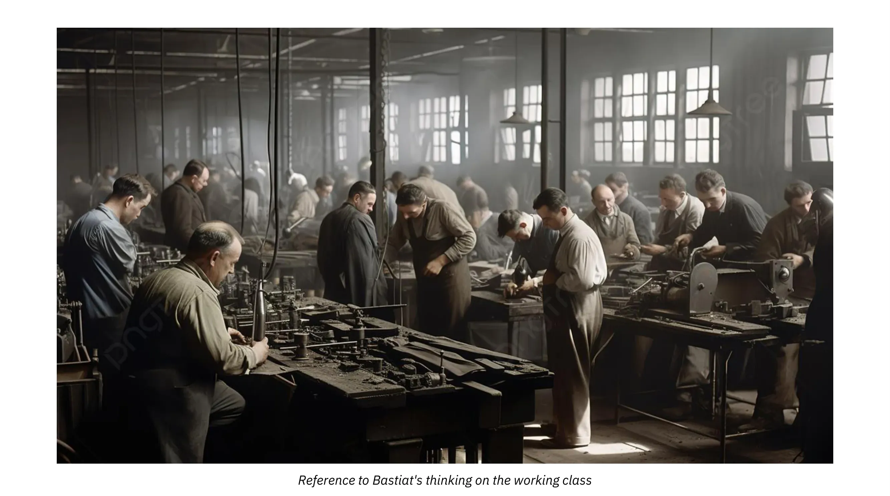

इस पुस्तक श्रृंखला से हमें यह सीख मिलती है कि राज्य के हस्तक्षेप के विपरीत प्रभाव होते हैं जो दिखाई नहीं देते। केवल एक अच्छा अर्थशास्त्री ही उन्हें पहले से देख सकता है। राजनीति वह है जो हम देखते हैं। अर्थव्यवस्था वह है जो हम नहीं देखते।

## मोमबत्ती बनाने वालों की याचिका

<chapterId>f4e759ed-1cb2-55c7-885e-0a60244758a4</chapterId>

1840 में, चैंबर ऑफ डेप्युटीज ने फ्रांसीसी उद्योग की रक्षा के लिए आयात करों में वृद्धि करने वाले कानून के लिए मतदान किया। यह प्रसिद्ध आर्थिक देशभक्ति है, जिसका सामना हम आज भी करते हैं।

_ऊपर: मरीन ले पेन, एक फ्रांसीसी राजनीतिज्ञ_

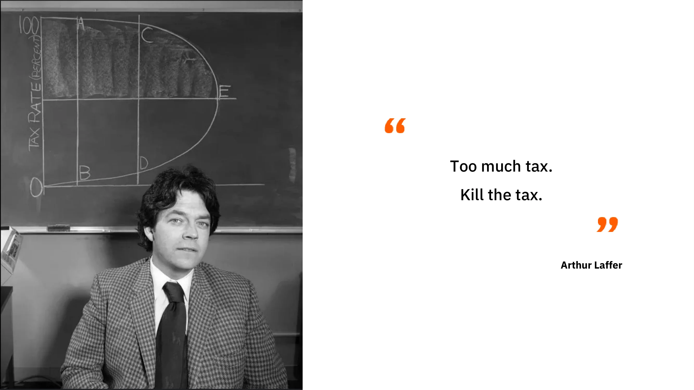

इसके बाद बास्टियाट ने एक व्यंग्यात्मक पाठ लिखा जो बाद में उनकी सबसे प्रसिद्ध कृतियों में से एक बन गया: "मोमबत्ती निर्माताओं की याचिका"। यह दर्शाता है कि किस तरह उत्पादकों के कुछ सुव्यवस्थित दबाव समूह नागरिकों के नुकसान के लिए राज्य से अनुचित विशेषाधिकार प्राप्त करते हैं। साथ ही, यह संरक्षणवादी कानून की बेतुकी और विनाशकारी प्रकृति को भी दर्शाता है।

---

> हमारी मोमबत्तियों की रक्षा करें!

---

इस याचिका में मोमबत्ती निर्माता प्रतिनिधियों से एक खतरनाक प्रतिद्वंद्वी के खिलाफ कानूनी सुरक्षा की मांग कर रहे हैं:

> हम एक विदेशी प्रतिद्वंद्वी की असहनीय प्रतिस्पर्धा से पीड़ित हैं, जो, ऐसा प्रतीत होता है, प्रकाश उत्पादन के लिए इतनी बेहतर स्थिति में है कि वह हमारे राष्ट्रीय बाजार में बहुत कम कीमत पर अपना माल भर देता है।

तो, यह अनुचित विदेशी प्रतियोगी कौन है? यह कोई और नहीं बल्कि सूर्य है। फिर उत्पादक इस बात पर प्रकाश डालते हैं कि "राष्ट्रीय श्रम के लिए राष्ट्रीय बाजार" को सुरक्षित रखने में क्या अवसर होगा, एक कानून के माध्यम से आदेश देकर "सभी खिड़कियां, रोशनदान, शेड, शटर, ब्लाइंड, पर्दे, पंखे की रोशनी, एक शब्द में सभी उद्घाटन, छेद, दरारें और दरारें जिनके माध्यम से सूर्य का प्रकाश घरों में प्रवेश करने का आदी है"।

दूसरे शब्दों में, मोमबत्ती बनाने वाले फ्रांस की अर्थव्यवस्था पर "विदेशी प्रतियोगी" (सूर्य) के हानिकारक प्रभावों को प्रदर्शित करने का प्रयास करते हैं। क्योंकि सूर्य न केवल मोमबत्तियों के समान "उत्पाद" प्रदान कर सकता है, बल्कि यह मुफ़्त में भी प्रदान करता है। दो सौ साल बाद, यह कहानी अविश्वसनीय रूप से प्रासंगिक बनी हुई है। उन टैक्सी ड्राइवरों पर विचार करें जो वीटीसी और उबर पर प्रतिबंध लगाने के लिए कानून की मांग करते हैं। उन बुकस्टोर्स के बारे में सोचें जो अमेज़ॅन पर प्रतिबंध लगाना चाहते हैं।

इस कथा में बास्टियाट का असली विरोधी राजनीतिक और चुनावी संरक्षणवाद है, जो पूरी तरह से उत्पादकों के लालच और उपभोक्ताओं की नासमझी पर निर्भर करता है। वह उस समय के बुरे पूंजीपति और राज्य के बीच मिलीभगत का पर्दाफाश करता है। बाजार में नवाचार करने और उसके अनुकूल ढलने के बजाय, बुरा पूंजीपति वह होता है जो संरक्षणवाद के माध्यम से राजनीतिक लाभ प्राप्त करना चाहता है। इसका परिणाम हमेशा उपभोक्ता के लिए लूटपाट, यानी अन्याय होता है।

संक्षेप में कहें तो संरक्षणवाद उपभोक्ताओं के विरुद्ध उत्पादकों के पक्ष में जानबूझकर अपनाई गई नीति है। हालांकि, बास्टियाट के अनुसार, सामान्य हितों के सच्चे प्रतिनिधि उपभोक्ता ही हैं, क्योंकि हम सभी उपभोक्ता हैं।

संरक्षणवाद भी एक छुपे हुए तर्क पर आधारित है जो अंततः एक भ्रांति साबित होता है:

- हम जितना अधिक काम करेंगे, हम उतने ही अधिक अमीर होंगे;
- हमें जितनी अधिक कठिनाइयों पर विजय पाना है, हम उतना ही अधिक परिश्रम करते हैं;
- इसलिए, जितनी अधिक कठिनाइयों पर हमें विजय प्राप्त करनी होगी, हम उतने ही अधिक समृद्ध होंगे।

आइए इस बेतुकेपन को बस्तियाट द्वारा बताई गई कुछ छोटी कहानियों से स्पष्ट करें। आर्थिक कुतर्कों की दूसरी श्रृंखला के अध्याय III में, वह एक बढ़ई की कल्पना करता है जो मंत्री को संरक्षणवादी कानून बनाने के लिए एक याचिका लिखता है। बढ़ई इस प्रकार अपना अनुरोध तैयार करता है: श्री मंत्री, एक ऐसा कानून बनाएं जो यह निर्धारित करे कि "कोई भी व्यक्ति कुंद कुल्हाड़ियों से बने बीम और जॉइस्ट के अलावा कुछ भी उपयोग नहीं कर पाएगा।" दूसरे शब्दों में, एक ऐसा कानून बनाएं जो फ्रांस में तेज कुल्हाड़ियों के उपयोग को प्रतिबंधित करे। इस प्रकार, जहां आम तौर पर 100 कुल्हाड़ी के वार दिए जाते हैं, वहां 300 देने की आवश्यकता होगी। बढ़ई की मांग बहुत अधिक होगी और इसलिए उन्हें बेहतर वेतन मिलेगा।

अध्याय XVI में, एक और बहुत ही विडंबनापूर्ण पाठ है, जिसका शीर्षक है: दायाँ हाथ और बायाँ हाथ। एक जांच के बाद, एक शाही दूत एक रिपोर्ट तैयार करता है जिसमें वह राजा को सभी श्रमिकों के दाहिने हाथ काटने या कम से कम बाँधने का प्रस्ताव देता है। इस प्रकार, वह आगे कहता है, काम और परिणामस्वरूप धन में वृद्धि होगी। उत्पादन बहुत अधिक कठिन हो जाएगा, जिसके लिए अतिरिक्त श्रमिकों की बड़ी संख्या में भर्ती और मजदूरी में वृद्धि की आवश्यकता होगी। देश से गरीबी गायब हो जाएगी।

हर कीमत पर नौकरियाँ पैदा करने के इस तर्क का पालन करते हुए, ट्रकों की जगह ठेले और फावड़े की जगह चम्मच क्यों नहीं रख दिए जाते? इन सभी कुतर्कों में एक बात समान है: वे साधन को साध्य से भ्रमित करते हैं। बास्टियाट के लिए, अर्थव्यवस्था का लक्ष्य नौकरियों का संरक्षण नहीं है। हमें काम की उपयोगिता का आकलन उसकी अवधि और तीव्रता से नहीं, बल्कि उसके परिणामों से करना चाहिए: ज़रूरतों की संतुष्टि, उपयोगिता।

साधन और साध्य का यह भ्रम "धन ही धन है" नारे में पाया जाता है।

यह वह स्वयंसिद्ध सिद्धांत है जो अधिकांश राज्यों की मौद्रिक नीति को नियंत्रित करता है। वास्तव में, पैसे की मात्रा में कृत्रिम वृद्धि बैंकों को व्यक्तियों और राज्यों को आसानी से अपना कर्ज चुकाने के लिए पैसे उधार देने की अनुमति देती है, यह "वह है जो हम देखते हैं"। लेकिन "जो हम नहीं देखते" वह यह है कि पैसे का यह सृजन, किसी वास्तविक धन सृजन पर आधारित नहीं है, मुद्रास्फीति और बचतकर्ताओं की बर्बादी का कारण बनेगा।

इसलिए, बास्टियाट के अनुसार, सच्चा धन उपयोगी चीजों का वह समूह है जिसे हम अपनी ज़रूरतों को पूरा करने के लिए काम के ज़रिए पैदा करते हैं। इस प्रकार धन केवल Exchange का एक आम तौर पर इस्तेमाल किया जाने वाला साधन है, यह केवल एक मध्यस्थ की भूमिका निभाता है।

## कराधान के माध्यम से लूट

<chapterId>551fc499-2119-5a52-9114-412d29434c22</chapterId>

> जब अमीर लोग अपना वजन कम करते हैं तो गरीब लोग मर जाते हैं।

लाओ-त्ज़ु को दिया गया यह उद्धरण उस कर प्रणाली के अपरिहार्य परिणाम का वर्णन करता है जिसका उद्देश्य अमीरों को दूसरों की तुलना में अधिक नुकसान पहुंचाना है।

फिर भी, क्या आपने कभी यह कहते सुना है:

> कराधान सबसे अच्छा निवेश है: यह खाद की तरह है! देखें कि यह कितने परिवारों का भरण-पोषण करता है, और विचार करें कि यह उद्योग पर क्या प्रभाव डालता है: यह अनंत है, यह जीवन है।

फ्रांस में, जहाँ सार्वजनिक व्यय को लाभ माना जाता है, कर अन्य देशों की तुलना में अधिक हैं। लेकिन बास्टियाट हमें तुरंत चेतावनी देते हैं: "हर सार्वजनिक व्यय में, दिखने वाले अच्छे के पीछे एक बुराई छिपी होती है जिसे पहचानना अधिक कठिन होता है।"

यह किस बारे में है?

अर्थव्यवस्था हमारे जीवन पर राजनीतिक निर्णयों के अच्छे या बुरे प्रभावों का वर्णन करती है। हालाँकि, बास्टियाट के अनुसार, अर्थशास्त्री को न केवल किसी विशेष समूह पर उनके अल्पकालिक प्रभावों के प्रति चौकस रहना चाहिए, बल्कि पूरे समाज के लिए उनके दीर्घकालिक परिणामों के प्रति भी चौकस रहना चाहिए।

> हम जो देखते हैं वह सामाजिक योगदान द्वारा अनुमत श्रम और लाभ है। हम जो नहीं देखते हैं वह वे कार्य हैं जो इसी योगदान से उत्पन्न होंगे यदि इसे करदाताओं पर छोड़ दिया जाए। हम जो देखते हैं वह सामाजिक योगदान द्वारा अनुमत श्रम और लाभ है। हम जो नहीं देखते हैं वह वे कार्य हैं जो इसी योगदान से उत्पन्न होंगे यदि इसे करदाताओं पर छोड़ दिया जाए।
>

> एफ. बास्टियाट

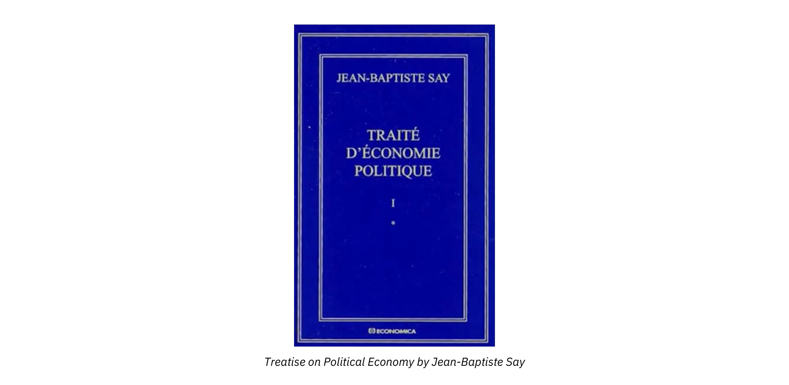

शुरू से ही, वह इस प्रचलित तर्क का खंडन करते हैं कि करों से वित्तपोषित सार्वजनिक व्यय से नौकरियाँ पैदा होती हैं। दरअसल, करों से कुछ भी पैदा नहीं होता क्योंकि राज्य द्वारा जो खर्च किया जाता है, उसे करदाता खर्च नहीं करते।

इसके अलावा, राज्य व्यक्तियों की तुलना में अधिक अपव्ययी है। वास्तव में, वह हमें याद दिलाता है, राज्य के पास कुछ भी नहीं है; यह कोई धन पैदा नहीं करता है। सार्वजनिक व्यय अक्सर अपव्यय का स्रोत होता है क्योंकि व्यक्तियों से जब्त की गई भारी रकम उनके मालिकों की जिम्मेदारी से बच जाती है और उनके स्थान पर नौकरशाहों द्वारा खर्च की जाती है, जो दबाव समूहों के अधीन होते हैं।

बेशक, Exchange में प्राप्त समतुल्य सार्वजनिक सेवा के लिए भुगतान के रूप में, कराधान पूरी तरह से उचित है। लेकिन फ्रांस में, राज्य ने करों को कई भूमिकाएँ सौंपी हैं।

शुरू में, इसे आम खर्चों को कवर करने के लिए माना जाता था। फिर, करों को अर्थव्यवस्था को विनियमित करने में भी भूमिका दी गई। इस मामले में, राजनेताओं और नौकरशाहों के पास शक्ति है जो केवल उनकी सद्भावना तक ही सीमित है। अपनी कृत्रिम संरचनाओं में मग्न होकर, वे अपने पक्ष में या प्रतिकूल रूप से अपनी मर्जी के अनुसार कमोबेश क्षेत्रों पर कर लगाकर और उन्हें विनियमित करके अर्थव्यवस्था को आकार देते हैं।

अंत में, करों को एक सामाजिक भूमिका सौंपी गई। उन्हें सामाजिक न्याय का साधन बनाया गया। इस प्रकार, करों को सभी पर एक जैसा प्रभाव नहीं डालना चाहिए। करों का पुनर्वितरण होना चाहिए, उन लोगों से जिनके पास "अधिक है" उन लोगों तक "जिनके पास कम है।"

समस्या यह है कि कर, जैसा कि कल्पना की गई है, सत्ता में बैठे लोगों की मनमानी के अधीन हैं। वे कुछ सामाजिक श्रेणियों के पक्ष में या विपक्ष में होते हैं, यह इस बात पर निर्भर करता है कि सत्ता उनसे वोट की अपेक्षा करती है या नहीं। इसके अलावा, प्रगतिशील दरें सार्वजनिक खजाने को बहुत कम लाभ देती हैं। हालांकि, वे बहुमत को अल्पसंख्यक को ज़ब्त करने की अनुमति देते हैं और स्वाभाविक रूप से ज़ब्त करने योग्य बन जाते हैं।

इसलिए बास्टियाट ने पहले ही लाफ़र वक्र को समझ लिया था। आर्थर लाफ़र एक अमेरिकी अर्थशास्त्री हैं जो 1974 में प्रकाशित अपने प्रसिद्ध "वक्र" (एक दीर्घवृत्त) के लिए जाने जाते हैं, जो दर्शाता है कि कर की दर कम होने पर करों से होने वाली आय बढ़ती है। यह अत्यधिक कराधान के घटते प्रतिफल का सिद्धांत है।

> बहुत अधिक कर, कर को ख़त्म कर देता है।
>

> आर्थर लाफ़र

राजनेता भोलेपन से यह मान लेते हैं कि कर दरों और कर राजस्व के बीच एक स्वचालित और निश्चित संबंध है। उन्हें लगता है कि वे कर की दर को दोगुना करके कर राजस्व को दोगुना कर सकते हैं। लैफ़र के अनुसार, ऐसा दृष्टिकोण इस तथ्य को नज़रअंदाज़ करता है कि करदाता नए प्रोत्साहनों के जवाब में अपना व्यवहार बदल सकते हैं।

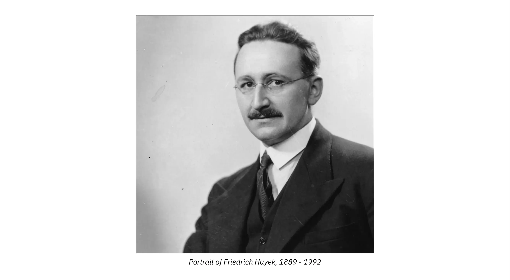

लाफ़र वक्र दर्शाता है कि जब कर दरें 100% पर होती हैं तो सरकार कोई राजस्व एकत्र नहीं करती है। इसके विपरीत, करों में कोई भी कमी आर्थिक गतिविधि और इस प्रकार राज्य के राजस्व को प्रोत्साहित करने का काम करती है। वास्तव में, सीमांत कर दरों को कम करने से निवेश, कार्य, रचनात्मकता को बढ़ावा मिलता है और इस प्रकार आर्थिक विकास को बढ़ावा मिलता है। पर्याप्त कटौती से कर आधार को महत्वपूर्ण रूप से व्यापक बनाकर सार्वजनिक राजस्व बढ़ाने के लिए पर्याप्त आर्थिक प्रोत्साहन मिल सकता है।

बास्टियाट यह भी कह सकते हैं कि करों को कम करने के साथ-साथ राज्य के व्यय को कम करने पर भी उतना ही ध्यान दिया जाना चाहिए। फिर भी, फ्रेडरिक बास्टियाट की शिष्या मार्गरेट थैचर ने इसे बहुत सटीक ढंग से कहा:

> लक्ष्य अमीरों को गरीब बनाना नहीं है, बल्कि गरीबों को अमीर बनाना है।

और यह बात उन्होंने समाजवादियों को संबोधित करते हुए कही।

## दो नैतिकताएँ

<chapterId>c518e449-f638-553c-9a49-15da48023d41</chapterId>

बहुत से लोग मोलिएर की कॉमेडी "टारटफ या इम्पोस्टर" को जानते हैं, जिसमें एक चालाक भक्त एल्मायर को बहकाने और उसके पति ऑर्गन को ठगने का प्रयास करता है। कोई ऐसे पाखंडी के धोखे से खुद को कैसे बचा सकता है जो आपके खिलाफ साजिश रचते हुए आपका भला करने का दिखावा करता है?

बास्टियाट का कहना है कि इस तरह के ढोंग को खत्म करने के दो तरीके हैं: टार्टफ को सुधारें या ऑर्गन को समझाएँ। बेशक, टार्टफ हमेशा रहेंगे, लेकिन अगर उनकी बात सुनने वाले ऑर्गन कम होंगे तो उनकी नुकसान पहुँचाने की शक्ति बहुत कम हो जाएगी।

स्वतंत्रता के दुरुपयोग की जड़ में मानवीय तर्क की कमज़ोरी है। यह मनुष्य की मुख्य सीमा है और कई बुराइयों का कारण है। इसलिए, मानवीय कृत्यों की उपयोगी या हानिकारक, और इस प्रकार न्यायसंगत या अन्यायपूर्ण प्रकृति के बारे में विवेक को जागृत करना आवश्यक है, चाहे वे व्यक्तिगत हों या सामूहिक।

हालांकि, नागरिकों के निर्णय को प्रबुद्ध करने के दो पूरक तरीके हैं, जैसा कि बास्टियाट ने आर्थिक कुतर्कों की दूसरी श्रृंखला के एक अध्याय "दो नैतिकताएं" में रेखांकित किया है।

- प्रथम, एक "दार्शनिक या धार्मिक नैतिकता" है जो मानवीय क्रिया (व्यक्ति को एक एजेंट के रूप में) को शुद्ध और सही करके कार्य करती है;
- फिर, एक "आर्थिक नैतिकता" है, जो मनुष्य को "उसके कार्यों के आवश्यक परिणाम" (रोगी के रूप में मनुष्य) दिखाकर कार्य करती है।

वास्तव में, ये दो पूर्णतः पूरक नैतिक ढांचे हैं।

1. पहला हृदय को संबोधित करता है और व्यक्तियों को अच्छा करने के लिए प्रोत्साहित करता है; यह धार्मिक या दार्शनिक नैतिकता है। यह सबसे महान है। यह मनुष्य के हृदय में उसके कर्तव्य की चेतना को जड़ देता है। यह उससे कहता है:

> अपने आप को सुधारो; अपने आप को शुद्ध करो; बुराई करना छोड़ो; भलाई करो, अपनी वासनाओं को वश में करो; अपने हितों का त्याग करो; अपने पड़ोसी पर अत्याचार मत करो जिससे प्रेम करना और उसकी सहायता करना तुम्हारा कर्तव्य है; पहले न्याय करो और बाद में दान करो।

संक्षेप में, यह सद्गुण, निस्वार्थ कार्य सिखाता है। बास्टियाट कहते हैं कि यह नैतिकता हमेशा सबसे सुंदर और मार्मिक रहेगी, क्योंकि यह दिखाती है कि मनुष्य में सबसे अच्छा क्या है।

2. दूसरा तरीका बुराई की निंदा करने और उसके प्रभावों के ज्ञान के माध्यम से उससे लड़ने में मदद करता है, यह आर्थिक नैतिकता है। यह बुद्धि को संबोधित करता है न कि हृदय को, जिसका उद्देश्य पीड़ित को व्यवहार के नकारात्मक प्रभावों के बारे में बताना है। यह अनुभव के सबक को पुष्ट करता है। यह उत्पीड़ित जनता में सामान्य ज्ञान, ज्ञान और अविश्वास फैलाने का प्रयास करता है, जिससे उत्पीड़न अधिक कठिन हो जाता है।

यह आर्थिक नैतिकता धार्मिक नैतिकता के समान ही परिणाम की आकांक्षा रखती है, लेकिन मानवीय कार्यों के प्रभावों से शुरू होती है। यह हमें अन्यायपूर्ण या हानिकारक कार्यों के खिलाफ प्रतिक्रिया करना और उन कार्यों का बचाव करना सिखाती है जो न्यायसंगत या उपयोगी हैं।

यहाँ बास्टियाट ने विज्ञान की भूमिका पर प्रकाश डाला है, और विशेष रूप से आर्थिक विज्ञान की। हालाँकि यह पारंपरिक नैतिकता से अलग है, फिर भी इसकी भूमिका सभी रूपों में लूट का मुकाबला करने के लिए आवश्यक है। नैतिकता अपने इरादे में बुराई पर हमला करती है, यह इच्छाशक्ति को शिक्षित करती है। दूसरी ओर, विज्ञान इसके प्रभावों को समझकर बुराई पर हमला करता है, इस प्रकार सद्गुण की विजय को सुगम बनाता है।

ठोस रूप से, आर्थिक विज्ञान, जिसे बास्टियाट ने रक्षात्मक नैतिकता के रूप में वर्णित किया है, में आर्थिक कुतर्कों का खंडन करना शामिल है, ताकि उन्हें पूरी तरह से बदनाम किया जा सके, और इस प्रकार लूटने वाले वर्ग को उसके औचित्य और शक्ति से वंचित किया जा सके।

इसलिए, राजनीतिक अर्थव्यवस्था की एक स्पष्ट व्यावहारिक उपयोगिता है। यह छिपी हुई लागतों, प्रतिस्पर्धा में बाधाओं और सभी प्रकार के संरक्षणवाद में होने वाली बर्बादी को उजागर करती है।

एक बार फिर, अगर उनकी बात सुनने वाले ऑर्गन कम होते तो टारटफ्स की संख्या कम होती। इस मामले पर बास्टियाट का क्या कहना है, यहाँ बताया गया है:

> इसलिए धार्मिक नैतिकता को टार्टूफ्स के दिलों को छूना चाहिए, अगर यह कर सकती है। राजनीतिक अर्थव्यवस्था का काम उनके ठगों को समझाना है। इन दो तरीकों में से कौन सा तरीका सामाजिक प्रगति के लिए सबसे प्रभावी है? क्या यह कहा जाना चाहिए? मेरा मानना ​​है कि यह दूसरा तरीका है। मुझे डर है कि मानवता पहले रक्षात्मक नैतिकता सीखने की आवश्यकता से बच नहीं सकती।

बेशक, राजनीतिक अर्थव्यवस्था सार्वभौमिक विज्ञान नहीं है; यह दार्शनिक और धार्मिक दृष्टिकोणों को बाहर नहीं करता है। "लेकिन इसके नाम पर ऐसा अतिशयोक्तिपूर्ण दावा किसने प्रदर्शित किया है?" बास्टियाट आश्चर्य व्यक्त करते हैं।

एक बात तो तय है, राजनीति ही वह चीज नहीं है जो चीजों की दिशा बदल सकती है और मनुष्य को परिपूर्ण बना सकती है। इसके विपरीत, राजनीति को सीमित करना और उसकी सख्त भूमिका तक सीमित रखना जरूरी है, जो सुरक्षा है। सांस्कृतिक, पारिवारिक, धार्मिक और सहयोगी क्षेत्रों में, विचारों पर काम करके, शिक्षा और निर्देश के माध्यम से, संक्षेप में नागरिक समाज के माध्यम से जिम्मेदारी और एकजुटता को मजबूत किया जा सकता है।

# आर्थिक सामंजस्य

<partId>db04dfa4-a53e-5d3e-a307-a68ebc36dc4f</partId>

## बाज़ार का चमत्कार

<chapterId>895ccd1d-7b52-5a8b-8b2c-6ec0056cf632</chapterId>

क्या एक सामंजस्यपूर्ण समाज बिना लिखित कानून, नियम, दमनकारी उपायों के चल सकता है? अगर लोगों को स्वतंत्र छोड़ दिया जाए, तो क्या हम अव्यवस्था, अराजकता, अव्यवस्था नहीं देखेंगे? अगर कानून और केंद्रीकृत राजनीतिक संगठन के माध्यम से नहीं, तो किसी भी संगीत कार्यक्रम के बाहर काम करने वाले व्यक्तियों का मात्र एक साथ होना कैसे रोका जा सकता है?

यह तर्क अक्सर उन लोगों द्वारा दिया जाता है जो बाजार विनियमन या केवल समाज की मांग करते हैं जो व्यक्तियों को एक सुसंगत और सामंजस्यपूर्ण समग्रता में समन्वित करने में सक्षम हो।

यह बास्टियाट का दृष्टिकोण नहीं है। उनके अनुसार, सामाजिक तंत्र, आकाशीय तंत्र या मानव शरीर के तंत्र की तरह, सामान्य नियमों का पालन करता है। दूसरे शब्दों में, यह पहले से ही एक सामंजस्यपूर्ण रूप से संगठित संपूर्ण है। और इस संगठन का इंजन मुक्त बाजार है।

उन्होंने हमें बताया कि मुक्त बाजार का चमत्कार यह है कि यह उस ज्ञान का उपयोग करता है जिसे कोई भी व्यक्ति अकेले प्राप्त नहीं कर सकता है, तथा यह किसी भी कृत्रिम संगठन द्वारा दी जा सकने वाली संतुष्टि से कहीं बेहतर संतुष्टि प्रदान करता है।

बास्टियाट इस बाज़ार के फ़ायदों को समझाने के लिए कुछ उदाहरण देते हैं। हम इस घटना के इतने आदी हो गए हैं कि अब हम इस पर ध्यान ही नहीं देते।

उन्होंने कहा कि आइए हम एक गांव के बढ़ई पर विचार करें और देखें कि वह समाज को क्या-क्या सेवाएं प्रदान करता है और उसे क्या-क्या मिलता है:

> हर दिन, सुबह उठने पर, वह कपड़े पहनता है, और उसने खुद अपने कपड़े नहीं बनाए हैं। फिर भी, इन कपड़ों को उसके लिए उपलब्ध कराने के लिए, दुनिया भर में बहुत अधिक काम, उद्योग, परिवहन और सरल आविष्कार किए गए थे।
>

> फिर वह नाश्ता करता है। हर सुबह उसकी मेज़ पर रोटी पहुँचने के लिए ज़मीन को साफ करना पड़ता है, जोतना पड़ता है; लोहा, स्टील, लकड़ी, पत्थर को काम के औज़ारों में बदलना पड़ता है; सभी चीज़ें, जिन्हें अलग-अलग लिया जाए, तो न केवल स्थान में बल्कि समय में भी, बहुत ज़्यादा काम करना पड़ता है।
>

> यह व्यक्ति अपने बेटे को स्कूल भेजेगा, ताकि वह ऐसी शिक्षा प्राप्त कर सके जिसके लिए कई वर्षों तक शोध और अध्ययन की आवश्यकता होती है।
> वह बाहर जाता है: उसे एक पक्की और रोशनी वाली सड़क मिलती है।
>

> उसकी संपत्ति पर विवाद है: वह अपने अधिकारों की रक्षा के लिए वकील ढूंढेगा, उन्हें बनाए रखने के लिए न्यायाधीश ढूंढेगा, सजा को निष्पादित करने के लिए न्याय अधिकारी ढूंढेगा; सभी चीजें जो अभी भी अर्जित ज्ञान, इसलिए आत्मज्ञान और अस्तित्व के साधन की पूर्वकल्पना करती हैं।

बास्टियाट बाज़ार को सहयोग का एक विकेंद्रीकृत और अदृश्य साधन बताते हैं। मूल्य प्रणाली के ज़रिए यह हर किसी की ज़रूरतों और कौशल के बारे में जानकारी प्रसारित करता है, यह उन लोगों को जोड़ता है जो अपने अस्तित्व को बेहतर बनाने के लिए सहयोग करना चाहते हैं।

बास्टियाट ने निष्कर्ष निकाला कि चौंकाने वाली बात यह है कि इस व्यक्ति को समाज से मिलने वाले लाभों और अगर वह अपने संसाधनों पर निर्भर होता तो खुद को मिलने वाले लाभों के बीच बहुत ज़्यादा असमानता है। एक ही दिन में वह ऐसी चीज़ें खाता है जिन्हें वह खुद नहीं बना सकता।

1958 में, अमेरिकी लेखक लियोनार्ड रीड (फाउंडेशन फॉर इकोनॉमिक एजुकेशन) ने द फ्रीमैन पत्रिका में बास्टियाट की शैली में लिखा एक छोटा निबंध प्रकाशित किया, जो बहुत प्रसिद्ध हुआ: "आई, पेंसिल"। यह पाठ मुक्त बाजार क्या है, इसका एक रूपक है। इसकी शुरुआत इस तरह होती है:

> मैं एक लेड पेंसिल हूँ, एक साधारण लकड़ी की पेंसिल जिससे सभी लड़के-लड़कियाँ और वयस्क जो पढ़-लिख सकते हैं, परिचित हैं। यह मानव सभ्यता में सबसे सरल वस्तुओं में से एक है। और फिर भी इस धरती पर एक भी व्यक्ति नहीं जानता कि मुझे कैसे बनाया जाए।

यह बास्टियाट के लाखों व्यक्तियों के बीच अदृश्य सहयोग के विचार को फिर से दर्शाता है जो एक दूसरे को नहीं जानते हैं, जिसके परिणामस्वरूप एक पेंसिल जैसी सांसारिक चीज़ का निर्माण होता है। कोई भी व्यक्ति अपने आप पेंसिल बनाना नहीं जानता। फिर भी, लाखों मनुष्य अनजाने में इस साधारण पेंसिल के निर्माण में भाग लेते हैं, बिना किसी उच्च अधिकारी के उनके आचरण को निर्देशित किए मूल्य प्रणाली के भीतर अपने ज्ञान और कौशल का आदान-प्रदान और समन्वय करते हैं। यह कहानी दर्शाती है कि अपने वैध हितों की खोज में काम करने वाले स्वतंत्र व्यक्ति किसी भी योजनाबद्ध और केंद्रीकृत आर्थिक रणनीति की तुलना में समाज के लाभ के लिए अधिक कार्य करते हैं।

1976 में अर्थशास्त्र के नोबेल पुरस्कार विजेता मिल्टन फ्रीडमैन ने भी आम जनता को यह समझाने के लिए इस पेंसिल कहानी को दोहराया कि बाजार अर्थव्यवस्था किस प्रकार काम करती है।

अपनी टेलीविज़न सीरीज़ फ़्री टू चूज़ के एक एपिसोड में, वह एक पेंसिल जैसी साधारण और साधारण चीज़ के विभिन्न घटकों का विश्लेषण करते हैं और दुनिया भर में हज़ारों आर्थिक अंतर्क्रियाओं द्वारा उत्पन्न सहज व्यवस्था के चमत्कार को उजागर करते हैं। जो लोग एक-दूसरे को नहीं जानते, जो एक ही धर्म या रीति-रिवाज़ साझा नहीं करते, फिर भी इस वस्तु को बनाने के लिए समन्वय करने में कामयाब होते हैं। वह निष्कर्ष निकालते हैं कि मुक्त बाज़ार न केवल समृद्धि बल्कि सद्भाव और शांति सुनिश्चित करने के लिए भी आवश्यक है।

फ्रेडरिक हायेक ने 1945 में अपने निबंध "समाज में ज्ञान का उपयोग" में पहले ही स्पष्ट कर दिया था कि समृद्धि के लिए बाजार अर्थव्यवस्था और निर्णयों का विकेंद्रीकरण क्यों महत्वपूर्ण है। हायेक के अनुसार, किसी भी केंद्रीय योजनाकार या नौकरशाह के पास कभी भी आर्थिक कार्यों की संपूर्णता को सफलतापूर्वक निर्देशित करने के लिए पर्याप्त ज्ञान नहीं हो सकता है। केवल मुक्त बाजार में मूल्य प्रणाली ही लाखों स्वतंत्र अभिनेताओं को यह तय करने की अनुमति देती है कि संसाधनों को कुशलतापूर्वक कैसे आवंटित किया जाए।

आर्थिक नियोजन, जो बाजार से बेहतर होने का दावा करता है, न केवल संसाधनों के खराब आवंटन की ओर ले जाता है बल्कि एक वर्ग के दूसरे वर्ग पर आधिपत्य को भी बढ़ावा देता है। इसलिए समाजवाद न केवल एक बौद्धिक भूल है बल्कि एक ऐसी भूल है जो अंततः अपार अन्याय उत्पन्न करती है।

## स्वतंत्रता और जिम्मेदारी सामाजिक समस्या की कुंजी हैं

<chapterId>78baa7ef-2c80-5fc7-8881-c1be4662b96f</chapterId>

1845 में अल्फोंस डी लामार्टिन को लिखे एक पत्र में बास्टियाट ने लिखा कि उनका संपूर्ण दर्शन एक ही सिद्धांत में समाहित है:

> स्वतंत्रता सामाजिक संगठन का सर्वोत्तम रूप है।

हालाँकि, उन्होंने एक शर्त जोड़ दी:

> कानून को हर किसी के कार्यों के सकारात्मक या नकारात्मक परिणामों को खत्म नहीं करना चाहिए। यह जिम्मेदारी का मूल सिद्धांत है।

दूसरे शब्दों में, स्वतंत्रता और जिम्मेदारी को अलग नहीं किया जा सकता; वे अविभाज्य हैं। उनके लिए, उदारवाद समाजवाद से इस विश्वास से अलग है कि स्वतंत्रता जिम्मेदारी के बिना मौजूद नहीं हो सकती। लेकिन स्वतंत्रता और जिम्मेदारी शब्द वास्तव में किन वास्तविकताओं को कवर करते हैं?

स्वतंत्रता को अनिवार्य रूप से नकारात्मक तरीके से परिभाषित किया जाता है: स्वतंत्र होने का अर्थ है अपने अधिकारों के प्रयोग में बाहरी दबाव के बिना कार्य करना। हालाँकि, इसका मतलब सभी बाधाओं का अभाव नहीं है। क्योंकि स्वतंत्रता पारस्परिकता की मांग करती है: यह हमें दूसरों की संपत्ति का उल्लंघन किए बिना कार्य करने और इस प्रकार यदि आवश्यक हो तो किसी भी नुकसान की भरपाई करने के लिए बाध्य करती है। यह जिम्मेदारी है।

इसलिए, जिम्मेदारी एक तरह से स्वतंत्रता के सकारात्मक पहलू का प्रतिनिधित्व करती है: जब तक कोई व्यक्ति स्वतंत्र रूप से कार्य करता है, उसे अपने कार्यों के परिणाम, चाहे अच्छे हों या बुरे, भुगतने होंगे।

व्यक्तिगत उत्तरदायित्व रचनात्मकता का एक प्रमुख वाहक होने के साथ-साथ सावधानी और दूरदर्शिता के लिए एक प्रोत्साहन भी है।

जब कोई अपना पैसा खर्च करता है, तो वह बहुत ज़्यादा कर्ज में न फंस जाए, उत्पादों की गुणवत्ता, आपूर्तिकर्ताओं की विश्वसनीयता की जांच करता है, भले ही उसे भारी जुर्माना लगने का जोखिम क्यों न उठाना पड़े। जिम्मेदारी की शक्ति ऐसी होती है, स्वतंत्रता के साथ मिलकर यह सामाजिक प्रगति का सच्चा इंजन है।

लेकिन गैरजिम्मेदारी या जिम्मेदारी से वंचित होने की घटना कहां से आती है? फ्रेडरिक बास्टियाट हमें इस सवाल का जवाब देते हैं, एक राजनीतिक जवाब। वे कहते हैं, मैं उद्धृत करता हूं:

> राज्य का हस्तक्षेप हमसे शासन छीन लेता है।

दरअसल, राज्यवाद लगातार लोगों की निजी पहल और स्वतंत्र पसंद को कम करता है। यह उनके लिए वही करता है जो वे खुद कर सकते हैं और बेहतर कर सकते हैं। इस प्रकार यह व्यक्तियों को उनके कार्यों के परिणामों से वंचित करता है। यह जिम्मेदारी को नष्ट कर देता है।

बास्टियाट के अनुसार, कानूनों का अतिवृद्धि और राज्य का अत्यधिक हस्तक्षेप, सत्ता के लिए संघर्ष, लूटमार, विशेषाधिकार, एकाधिकार, युद्ध, संक्षेप में कहें तो सभ्यता की प्रगति में बाधा डालने वाली हर चीज को जन्म देता है।

कानून या नौकरशाही नियंत्रण के मार्ग को अत्यधिक पसंद करने का जोखिम यह है कि यह बाधाओं की बाढ़ लाकर सभी प्रेरणाओं को हतोत्साहित करता है, और इस प्रकार हमें उन अनेकानेक प्रगतियों से वंचित कर देता है जो निजी पहल और स्वतंत्र विकल्प द्वारा संभव होती हैं।

आइए इस मुद्दे को कुछ प्रमुख वर्तमान विषयों के माध्यम से स्पष्ट करें। पहला उदाहरण, 2008 का संकट।

_(एलन ग्रीनस्पैन, अमेरिकी केंद्रीय बैंक फेड के अध्यक्ष, 1987 से 2006 तक)_

वर्षों से, मौद्रिक नीति के नेताओं ने समझाया कि यदि सब कुछ ठीक होने पर मुनाफे का निजीकरण किया जाता है, तो दिवालियापन (बेलआउट, बचाव योजना, ब्याज दर में हेरफेर, मुद्रा मुद्रण, आदि) के मामले में नुकसान को साझा किया जाएगा। ऐसा करने से, उन्होंने एक नैतिक जोखिम पैदा किया, उन्होंने अनुचित जोखिम उठाने की सुविधा प्रदान की, और उन्होंने वित्तीय दुनिया को गैर-जिम्मेदाराना व्यवहार करने के लिए प्रोत्साहित किया। इस प्रकार उन्होंने वित्त को उस संकट में डाल दिया जिसका हमने अनुभव किया।

और यह घटना तब तक अनिश्चित काल तक दोहराई जाती रहेगी जब तक बैंक केंद्रीय प्राधिकारियों के अधीन रहेंगे, जो निर्णय और संचालन की सभी स्वायत्तता को समाप्त करके उन्हें संरक्षित करने वाले हैं।

एक और उदाहरण: सार्वजनिक सेवाएँ

प्रत्येक सार्वजनिक सेवा नौकरशाही अभिजात वर्ग की प्राथमिकताओं को लागू करती है, जो व्यक्तिगत स्वतंत्र पसंद के लिए हानिकारक है। बास्टियाट के अनुसार इसके दो परिणाम होते हैं: नागरिक "अपनी संतुष्टि पर स्वतंत्र नियंत्रण करना बंद कर देता है, और, अब जिम्मेदारी नहीं होने पर, स्वाभाविक रूप से उसके पास बुद्धिमत्ता नहीं रहती।" इसका कारण सरल है: प्रत्येक लिखित कानून बाध्यकारी होता है और यह सभी के लिए समान होता है, यह नागरिकों की विशेष स्थितियों, जरूरतों और प्राथमिकताओं को ध्यान में नहीं रखता है।

अंत में, सार्वजनिक सेवा गतिहीनता का कारण है। वास्तव में, जब निजी सेवाएँ सार्वजनिक हो जाती हैं, तो वे प्रतिस्पर्धा से बच जाती हैं। परिणामस्वरूप, बास्टियाट कहते हैं, मैं उद्धृत करता हूँ: "अधिकारी उस प्रेरणा से रहित है जो प्रगति की ओर ले जाती है।"

जब हम राष्ट्रीय शिक्षा की सार्वजनिक सेवा को देखते हैं, तो हम समझते हैं कि बास्टियाट का क्या मतलब है। यह अधिकांश माता-पिता को अपने बच्चों को पढ़ाने के बोझ से मुक्त करता है, जिससे स्कूल डेकेयर में बदल जाता है। यह शिक्षकों को नवाचार करने और जोखिम लेने के लिए प्रोत्साहित नहीं करता है क्योंकि ऐसी प्रणाली में वे नौकरशाहों द्वारा उनके बिना डिज़ाइन किए गए कार्यक्रम के निष्पादक मात्र होते हैं। अंत में, यह प्रत्येक व्यक्ति की विशेष आवश्यकताओं की वास्तविकता को अनदेखा करता है।

हम दूसरे पाठ्यक्रम में देखेंगे कि, बास्टियाट के अनुसार, राज्य की एकमात्र वैध सार्वजनिक सेवाएँ तीन हैं: सेना, पुलिस और न्यायपालिका। लेकिन जिम्मेदारी के बारे में निष्कर्ष निकालने के लिए, राज्य के हस्तक्षेप की समस्या यह है कि जो लोग निर्णय लेते हैं, वे परिणाम भुगतने वाले नहीं होते हैं।

दूसरे शब्दों में, सामूहिक विकल्प जिम्मेदार विकल्प नहीं हैं, क्योंकि एक ओर तो इनमें निर्णयकर्ताओं के लिए कोई जोखिम उठाने की आवश्यकता नहीं होती, तथा दूसरी ओर, ये दूसरों को कुछ निश्चित परिणाम भुगतने के लिए बाध्य करते हैं, जो उतना ही विनाशकारी है, जितना अनैतिक।

## जिम्मेदारी की शक्ति

<chapterId>0c078806-6c58-53f9-a720-5fb62386e56b</chapterId>

पिछले कोर्स में हमने देखा कि स्वतंत्रता और जिम्मेदारी सामाजिक समस्या के लिए महत्वपूर्ण क्यों हैं। अब हम इस बिंदु पर गहराई से विचार करेंगे और दिखाएंगे कि फ्रेडरिक बास्टियाट समाज को प्रभावित करने वाली बुराइयों और उनके समाधान को किस तरह देखते हैं।

उदारवादियों की कभी-कभी बुराई को नज़रअंदाज़ करने और आदर्श दुनिया में शुद्ध और पूर्ण स्वतंत्रता के स्वप्नलोक का निर्माण करने के लिए आलोचना की जाती है। हमारे लेखक के बारे में यह आलोचना बिल्कुल निराधार है।

मानव समाज के इतिहास में व्याप्त बुराई को कोई भी नज़रअंदाज़ नहीं कर सकता: अन्याय, युद्ध और पीड़ा। हम इन बुराइयों को खत्म करने में सक्षम होना चाहेंगे। इसके अलावा, यह आधुनिक दर्शन के एक बड़े हिस्से का उद्देश्य है, रूसो से लेकर हाइडेगर तक, हेगेल और मार्क्स के माध्यम से।

फ़्रेडरिक बास्टियाट कहते हैं कि बुराई न केवल एक निश्चित वास्तविकता है बल्कि इतिहास और मानवीय क्रियाकलापों में भी इसकी भूमिका है। इसे कम किया जा सकता है लेकिन निश्चित रूप से पूरी तरह से समाप्त नहीं किया जा सकता क्योंकि इसका मतलब होगा स्वतंत्रता और ज़िम्मेदारी को मारना। तो बुराई कहाँ से आती है, इसकी भूमिका क्या है और इसे कैसे रोका जा सकता है?

इन सवालों के जवाब देने के लिए, बास्टियाट मानवीय क्रियाकलापों का विश्लेषण करेंगे। यह वास्तव में अच्छाई और बुराई दोनों को जन्म दे सकता है।

बुराई सबसे पहले हमारी अपूर्णता से उत्पन्न होती है। बास्टियाट कहते हैं कि स्वतंत्र रूप से चुनाव करना गलत चुनाव करने का जोखिम उठाना है। वास्तव में, हम कई तरीकों से धोखा खा सकते हैं, यहाँ तक कि अपनी ज़रूरतों और हितों के बारे में भी। मनुष्य त्रुटिपूर्ण है, वह आर्थिक नियमों की भूमिका को समझने में या उन्हें उनके उद्देश्य से भटकाने में गलती करने के लिए प्रवृत्त है।

इसलिए, यह तर्क की अपूर्णता ही है जो मनुष्य की मुख्य सीमा है और जो हमारे दुखों का मूल है।

यदि बुराई मानवीय कमज़ोरी से उत्पन्न होती है, न कि स्वतंत्रता से, न ही मुक्त व्यापार से, तो इसका उपाय स्वतंत्रता या Exchange के दमन में नहीं, बल्कि ज़िम्मेदारी में ही है, क्योंकि यह सभी अनुभवों का स्रोत है। ज़िम्मेदारी का यह सिद्धांत इस प्रकार है, मैं बास्टियाट को उद्धृत करता हूँ:

> हर व्यक्ति जो कार्य करता है, उसे अपने कर्मों का पुरस्कार या दंड मिलता है।

इस प्राकृतिक स्वीकृति के माध्यम से, मनुष्य सीखता है, खोजता है, खुद को सुधारता है, प्रगति करता है और सुधार करता है। दूसरे शब्दों में, जिम्मेदारी पूर्णता और प्रगति का सिद्धांत है जैसा कि हमने पिछले पाठ्यक्रम में देखा है।

अगर कोई व्यक्ति अपने निर्णयों के अच्छे या बुरे परिणामों को झेलता है, तो वह अनुभव से सीखकर सुधार करने की ओर अग्रसर होगा। इसलिए, व्यक्तिगत जिम्मेदारी, जो कि बास्टियाट के अनुसार लोगों का महान शिक्षक है, व्यवहार और समाज के सभी विनियमन का मूल सिद्धांत है, को कार्य करने की अनुमति दी जानी चाहिए।

बुराई दुख पैदा करती है और दुख हमें दोष या त्रुटि का बोध कराता है, यह हमें सही रास्ते पर वापस लाता है। बुराई के ज्ञान से ही हम प्रगति करते हैं।

ऐसा इसलिए है क्योंकि मनुष्य गलतियाँ करने या गलत काम करने और उसके परिणाम भुगतने का जोखिम उठाता है, इसलिए उसे जिम्मेदार होने के लिए प्रोत्साहित किया जाता है। फिर वह खुद को बचाने के लिए उन खतरों का अनुमान लगाने का प्रयास करेगा जो उस पर हमला कर सकते हैं।

---

> गलती करना मानवीय स्वभाव है।

---

इस प्रकार, यह स्पष्ट है कि बास्टियाट अंधे होने से कोसों दूर हैं। वह बुराई के अस्तित्व से इनकार नहीं करते। मनुष्य कमज़ोर है, गलती और दोष की संभावना रखता है। बास्टियाट को कहीं भी इस तथ्य से इनकार करते नहीं देखा जा सकता कि व्यक्तिगत स्वतंत्रता का प्रयोग त्रुटि की संभावना, अनुचित या मूर्खतापूर्ण विकल्प की संभावना से जुड़ा हुआ है।

वह केवल इतना कहते हैं कि यदि बुराई का स्रोत स्वतंत्रता का अभाव है, तो इसका उपाय स्वतंत्रता में ही है, और अधिक विशेष रूप से व्यक्तिगत जिम्मेदारी के पूर्ण एवं समग्र पालन में है।

लेकिन अगर स्वतंत्रता का दुरुपयोग हमारी परेशानियों की जड़ है, तो इसका उचित उपयोग ही इसका उपाय है, यानी संपत्ति के अधिकार के आधार पर व्यक्तिगत जिम्मेदारी का पूरा और संपूर्ण प्रयोग। इसलिए, सामाजिक विनियमन जिम्मेदारी से होकर गुजरता है, न कि सभी क्षेत्रों में राज्य के हस्तक्षेप से, जो कि लूट और इस तरह बुराइयों के सबसे बड़े स्रोतों में से एक है।

रूसो के विपरीत, जो सामूहिक संस्थाओं के माध्यम से बुराई को मिटाना चाहते हैं, फ्रेडरिक बास्टियाट बुराई और त्रुटि की संभावना का बचाव करते हैं, जिसके बिना कोई स्वतंत्रता या व्यक्तिगत जिम्मेदारी नहीं है। क्योंकि यह वही है जो खोज की प्रक्रिया के माध्यम से, सामाजिक बुराइयों को आगे बढ़ाने और कम करने की अनुमति देता है।

यह स्पष्ट किया जाना चाहिए कि जिम्मेदारी के माध्यम से प्रगति का यह विकास किसी भी तरह से स्वचालित नहीं है। यह बिल्कुल भी, हेगेल या मार्क्स की तरह, एक प्रकार का प्राकृतिक या ऐतिहासिक नियतिवाद नहीं है, जो चमत्कारिक रूप से या यांत्रिक रूप से सद्भाव और प्रगति की ओर ले जाएगा। यह बुराई के क्रमिक और अनिश्चित रूप से कम होने के बारे में है और इसके निश्चित उन्मूलन के बारे में नहीं है।

## सच्ची और झूठी एकजुटता

<chapterId>fa2172e9-22fa-5c01-a3c8-1e8316c064a4</chapterId>

फ्रेडरिक बास्टियाट ने अपने प्रसिद्ध पैम्फलेट "द लॉ" में कानून की विकृति की निंदा की है, जिसमें "एकजुटता" के नाम पर वैधीकरण करना शामिल है, जिसे वास्तव में लूट कहा जाना चाहिए। वास्तव में, कानून के माध्यम से भाईचारा लागू करने की इच्छा में एक विरोधाभास है, जिसे हम आज "सामाजिक न्याय" या एकजुटता कहते हैं।

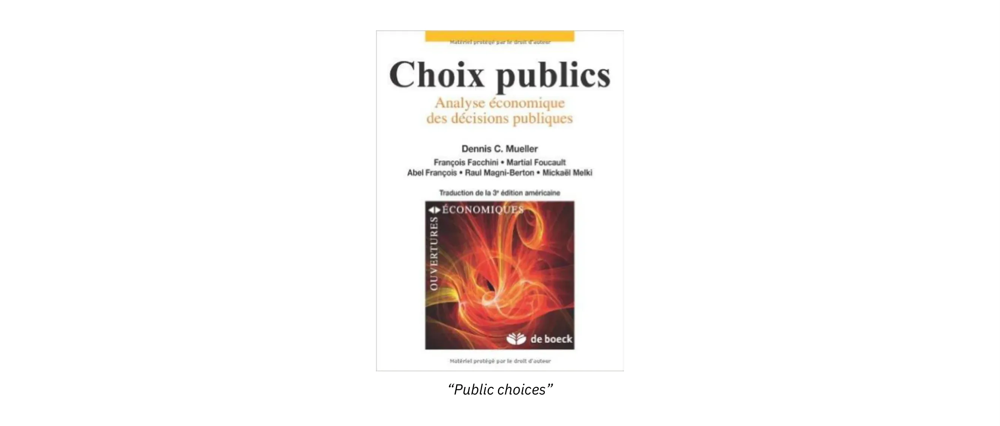

नैतिकता को स्वैच्छिक व्यवहार के रूप में परिभाषित किया जाता है। जब किसी व्यक्ति को कुछ ऐसा देने के लिए मजबूर किया जाता है जो वह नहीं देना चाहता, तो वह हमेशा चोरी का शिकार होता है।

दरअसल, जब कानून द्वारा दान देना अनिवार्य कर दिया जाता है, तो यह नैतिक रवैया नहीं रह जाता। देने के नैतिक रवैये की जगह "अधिकारों" के दावे ने ले ली है, जो दूसरों के श्रम पर दावा है। झूठी एकजुटता दूसरों की कीमत पर जीने का आह्वान है।

इसे ही बास्टियाट "कानूनी बिरादरी का कुतर्क" कहते हैं। आइए इस बिंदु पर उनका कथन उद्धृत करें:

> भाईचारा स्वतःस्फूर्त होता है, या नहीं भी। इसे घोषित करना इसे नष्ट करना है।

और फिर:

> सरकारें हमेशा वही काम करती हैं जो बलपूर्वक स्वीकृत किया जाता है। अब, किसी को न्याय करने के लिए मजबूर करना जायज़ है, उसे दानशील होने के लिए मजबूर करना नहीं। कानून, जब बलपूर्वक वह काम करने की कोशिश करता है जो नैतिकता अनुनय के माध्यम से हासिल करती है, तो दान के दायरे से बहुत दूर, लूट के दायरे में आ जाता है।
> फिर भी कानून की इस विकृति का एक नाम है, वह है समाजवाद, यानी राज्य द्वारा धन के जबरन पुनर्वितरण की विचारधारा। बास्टियाट के अनुसार, समाजवाद की विशेषता कानूनी लूट की विचारधारा है। लेकिन इस विचारधारा की चालाकी यह है कि यह अपनी हिंसा को भाषा के दुरुपयोग के तहत छुपाती है: एकजुटता या भाईचारे का आह्वान।

---

> परस्पर सहायता
> GUISY सोसायटी
> 1899

---

हालांकि, बास्टियाट के अनुसार, अनिवार्य राज्य एकजुटता का एक विकल्प है: "पारस्परिक सहायता समाज", पारस्परिक सहायता समितियों के माध्यम से लोगों की आपसी और सहज सहायता। लेकिन उन्होंने यह भी भविष्यवाणी की कि राज्य अंततः इन पारस्परिकों को जब्त कर उन्हें एक अद्वितीय और केंद्रीकृत निकाय बना देगा, जिससे खर्च और बर्बादी को बढ़ावा मिलेगा।

"न्याय और बंधुत्व" नामक एक पुस्तिका में, बास्टियाट ने सामूहिक आवश्यकताओं (पुलिस, न्याय, सेना) के वित्तपोषण के लिए एक सरलीकृत और निष्पक्ष कर प्रणाली के विचार की भी खोज की है: आय और लाभ एकल और आनुपातिक कर दर के अधीन होंगे। इसे आज "फ्लैट टैक्स" के रूप में जाना जाता है।

---

> नींव –
> **संवर्धित मूल्य**
> **समाज** के लिए
>

> स्विसफाउंडेशन

---

वास्तव में, अंतर-पारिवारिक एकजुटता, स्थानीय एकजुटता, या संगठित परोपकार उन देशों में अधिक विकसित है, जहां कर प्रणाली हल्की है और आर्थिक स्वतंत्रता अपेक्षाकृत उच्च स्तर की है, जैसे कि स्विट्जरलैंड और संयुक्त राज्य अमेरिका, जबकि यह उन देशों में काफी हद तक दबा हुआ है जहां राज्य ने बड़े पैमाने पर व्यक्तिगत जिम्मेदारी का स्थान ले लिया है, जैसे कि फ्रांस या जर्मनी।

उदार समाजों में प्रचलित "स्वार्थ" पर विलाप करना अक्सर फैशन बन जाता है। लेकिन इसका ठीक उल्टा सच है। जब समाज पर करों का बोझ होता है और व्यक्ति अपनी संपत्ति का मालिक नहीं रह जाता, तो उसे देने के लिए प्रोत्साहित नहीं किया जाता, बल्कि उसे खुद में सिमटने के लिए प्रोत्साहित किया जाता है।

वास्तव में, एक स्वतंत्र नागरिक समाज स्वार्थ पर आधारित नहीं होता: बाजार अर्थव्यवस्था अपने पड़ोसी की सेवा और पारस्परिकता के आधार पर संचालित होती है। कोई व्यक्ति अपने हित की सेवा केवल दूसरे के हित की सेवा करके ही कर सकता है, दूसरे को एक ऐसा प्रतिरूप प्रदान करके जो पारस्परिक रूप से लाभकारी Exchange की ओर ले जाता है। दूसरे शब्दों में, यह स्वैच्छिक Exchange है जो सच्ची एकजुटता पैदा करता है।

जबरन पुनर्वितरण का वास्तविक मानवीय एकजुटता से कोई लेना-देना नहीं है, जो निजी या स्वैच्छिक प्रकृति की होती है और जो परिवारों के भीतर या किसी संगठन के सदस्यों के बीच देखी जाती है।

इस प्रकार कानून की भूमिका पर ही बस्तियात समाजवादियों का विरोध करते हैं। वे लिखते हैं:

कानून किसी व्यक्ति को न्यायपूर्ण होने के लिए बाध्य कर सकता है, लेकिन वह उसे समर्पित होने के लिए बाध्य नहीं कर सकता। समाजवादियों की झूठी एकजुटता, शुद्ध राज्य दबाव के पक्ष में भक्ति को खत्म कर देती है, जो अधिनायकवाद का आधार बनती है।

# कानून

<partId>653cbe58-60e1-5401-8f91-4d9843ac6045</partId>

## संपत्ति का अधिकार

<chapterId>a48a0616-2105-5520-8312-e21a0b6489c7</chapterId>

संपत्ति से हमारा मतलब यहाँ ज़मीन से नहीं है। इसका मतलब है "श्रमिक का अपने श्रम से बनाए गए मूल्य पर अधिकार।" बास्टियाट स्पष्ट करते हैं:

> मेरा मानना ​​है कि संपत्ति के अधिकार में सबसे पहले अपने शरीर, फिर अपने श्रम और अंततः अपने श्रम के उत्पादों का निपटान करने की स्वतंत्रता शामिल है - जो यह भी साबित करता है कि एक निश्चित दृष्टिकोण से, स्वतंत्रता और संपत्ति के अधिकार को एक दूसरे से अलग नहीं किया जा सकता है।

इस बिंदु को स्थापित करने के बाद, संपत्ति के नैतिक आधार को समझने के लिए, बास्टियाट एक सरल मानवशास्त्रीय सिद्धांत से शुरू करते हैं कि शुरू से ही, मनुष्य को जीने के लिए काम करना चाहिए और उसके श्रम का फल उसकी क्षमताओं, यानी उसके व्यक्तित्व का विस्तार है।

> व्यक्तित्व, स्वतंत्रता, संपत्ति, यही मनुष्य है। इन तीन चीजों के बारे में हम बिना किसी द्वेषपूर्ण सूक्ष्मता के कह सकते हैं कि ये किसी भी मानवीय कानून से पहले और उससे श्रेष्ठ हैं।

इस अर्थ में समझा जाए तो संपत्ति का अधिकार उन अधिकारों में से है जो सकारात्मक कानून से नहीं आते बल्कि उससे पहले आते हैं और उसके अस्तित्व का कारण हैं। वास्तव में,

> कानून वैध बचाव के व्यक्तिगत अधिकार का सामूहिक संगठन है।
> कानून

इसका मिशन व्यक्ति और उसकी संपत्ति की रक्षा करना है।

_(फ़्रांकोइस क्वेस्ने, फ़िज़ियोक्रेट्स के नेता)_

इसलिए, अधिकार कानून जैसा नहीं है। अधिकार की पहचान संप्रभु के शब्द से नहीं होती है, न ही यह पूरी तरह से उसकी वैधता पर निर्भर करता है। यह एक परंपरा का उत्पाद है, कानून से पहले और उससे बेहतर एक कानूनी व्यवस्था है, जो खुद को विधायिका पर उतना ही लागू करती है जितना कि किसी भी आम नागरिक पर।

अधिकार "बनाया नहीं गया है"। इसका आविष्कार समाज के नियमों के आदर्श दृष्टिकोण से नहीं किया गया है; यह मनुष्य की प्रकृति और शिष्टाचार के नियमों में खोजा गया है, जो रीति-रिवाजों के ज्ञान द्वारा प्रेषित है।

व्यक्तियों के पास प्राकृतिक अधिकार हैं जो कानून से पहले मौजूद हैं: संपत्ति, स्वतंत्रता, व्यक्तित्व। कानून की भूमिका व्यक्ति के इन प्राकृतिक अधिकारों को संरक्षित करना होनी चाहिए। नतीजतन, राज्य को सीमित होना चाहिए। आज, हम कहेंगे कि बास्टियाट न्यूनतम राज्य के समर्थक हैं।

रूसो की प्रणाली में, जिसके बारे में हमने पिछले पाठ्यक्रम में चर्चा की थी, विधिनिर्माता का मिशन संपत्ति को व्यवस्थित करना, संशोधित करना, यहाँ तक कि उसे समाप्त करना है, यदि उचित समझा जाए। रूसो के लिए, संपत्ति प्राकृतिक नहीं बल्कि पारंपरिक है, ठीक वैसे ही जैसे समाज स्वयं है। यह विचार रोमन कानून से उपजा है, जिससे रूसो बहुत परिचित थे।

रोबेस्पिएरे, बदले में, यह सिद्धांत प्रस्तुत करते हैं कि "संपत्ति प्रत्येक नागरिक का कानून द्वारा उसे गारंटीकृत वस्तुओं के हिस्से का आनंद लेने और उसका निपटान करने का अधिकार है।"

रूसो के लिए, संपत्ति कानून से पहले नहीं है; यह केवल सामान्य इच्छा द्वारा स्थापित एक सम्मेलन है और इसके द्वारा तय की गई सीमाओं के भीतर है। नतीजतन, समाज और विधायकों की सद्भावना से स्वतंत्र कोई स्वतंत्रता या अधिकार नहीं है। लेकिन अगर कोई संपत्ति के अधिकार को अलग कर देता है, तो यह आसानी से झूठे अधिकारों को सही ठहराता है, जो केवल दूसरों के अधिकारों का उल्लंघन करके हासिल किए जाते हैं।

उदाहरण के लिए: काम करने का अधिकार या आवास का अधिकार।

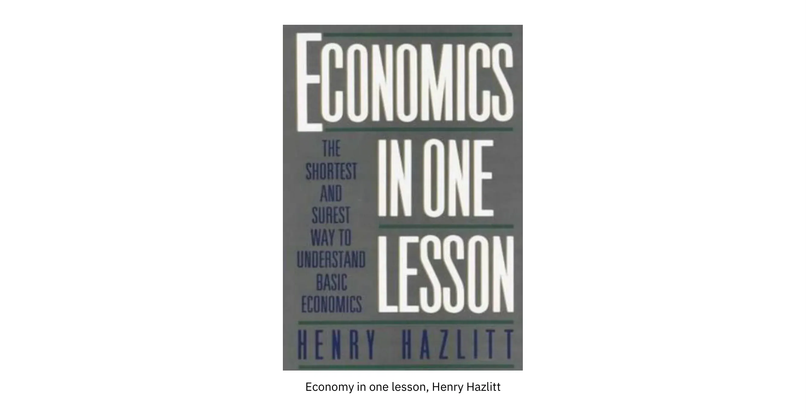

अगर मैं मुफ़्त में कुछ हासिल करना चाहता हूँ, तो किसी को मेरी तरफ़ से पैसे देने होंगे। और अगर राज्य पैसे देता है, तो चूँकि वह धन पैदा नहीं करता, इसलिए वह किसी से घर लेकर या उसके बराबर पैसे लेकर ही मुझे दे सकता है।

इस प्रकार, बास्टियाट के अनुसार, यह विचार कि संपत्ति का अधिकार कानून का निर्माण है, उन स्वप्नदर्शियों के लिए असीमित क्षेत्र खोल देता है जो अपनी योजनाओं के अनुसार समाज को आदर्श बनाना चाहते हैं।

प्राकृतिक स्वतंत्रता की व्यवस्था में, एक प्राकृतिक कानून मौजूद होता है, जो विधायकों की सनक से स्वतंत्र होता है। यह सभी लोगों के लिए वैध है और किसी भी समाज से पहले से मौजूद है। और प्रत्येक व्यक्ति के प्राकृतिक अधिकारों को सुनिश्चित करना सरकार का कर्तव्य है। एक न्यायपूर्ण समाज वह होता है जिसमें संपत्ति के अधिकारों का पूरा सम्मान किया जाता है, यानी दूसरों के किसी भी हस्तक्षेप से सुरक्षित रखा जाता है।

यहाँ, बास्टियाट खुद को फिजियोक्रेट्स की विरासत के साथ जोड़ते हैं, और उससे भी आगे, सिसरो और अरस्तू के कानून के दर्शन की परंपरा के साथ। कानून अधिकार नहीं बनाता है। इसका मिशन उनकी रक्षा करना है और इस प्रकार संपत्ति की रक्षा करना है, खुद की संपत्ति, व्यक्ति की अखंडता और किसी के श्रम के फल की संपत्ति।

_(सिसरो)_

## कानूनी लूट: कानून का विकृत रूप

<chapterId>b4122847-e477-578e-ba34-d35844ac4715</chapterId>

1850 में प्रकाशित उनकी प्रसिद्ध पुस्तिका "द लॉ" में बास्टियाट का मुख्य विचार यह दिखाना है कि क्यों और कैसे कानून लूटपाट का साधन बन गया है, अर्थात् विशेषाधिकारों, स्थितिजन्य लगान और राजकोषीय मनमानी का स्रोत बन गया है।

कानून का वास्तविक स्वरूप क्या है?

बास्टियाट ने कानून की प्राकृतिक मानवशास्त्रीय नींव रखने से शुरुआत की: जीवन, स्वतंत्रता और संपत्ति।

प्राकृतिक स्वतंत्रता की संस्थागत व्यवस्था वह है जिसके लिए समाज, व्यक्ति और संपत्ति कानून से पहले मौजूद होते हैं। इस व्यवस्था में, बास्टियाट कहते हैं:

> ऐसा नहीं है कि कानून होने के कारण गुण होते हैं, बल्कि ऐसा है कि गुण होने के कारण कानून होते हैं।
> संपत्ति और कानून

हर व्यक्ति को अपने जीवन की रक्षा करने और अपनी क्षमताओं का उपयोग करने की अनुमति है। और कानून इस वैध बचाव का सामूहिक संगठन है। कानून न्याय की रक्षा करता है। ऐसा सकारात्मक न्याय नहीं जो भाईचारा और एकजुटता को संगठित करे, बल्कि ऐसा नकारात्मक न्याय जो खुद को एक व्यक्ति के अधिकारों को दूसरे के अधिकारों पर हावी होने से रोकने तक सीमित रखता है।

हालांकि, जब कानून नकारात्मक होना बंद करके सकारात्मक हो जाता है, तो समाज में असमानता की भावना बढ़ती है और संघर्ष उत्पन्न होते हैं। अगर हम कानून के दायरे को अनिश्चित काल तक बढ़ाते हैं, यानी सरकार की जिम्मेदारी, तो हम "शिकायतों, नफरत, अशांति और विद्रोह की एक अंतहीन श्रृंखला" का द्वार खोलते हैं, वे लिखते हैं।

बास्टियाट कहते हैं कि झूठा परोपकार, कानून के विकृतीकरण का एक प्रमुख कारण है। कुछ लोग खुद को बाकी मानवता से ऊपर समझते हैं और दूसरों की तुलना में बेहतर विकल्प चुनने में सक्षम हैं।

वे बेहतर जानते हैं कि दूसरों के लिए क्या अच्छा है और वे अपनी भलाई की अवधारणा को सभी पर थोपते हैं; ये परोपकारी लोग हैं। उन्होंने झूठे अधिकार बनाए हैं जिन्हें आज सामाजिक अधिकार कहा जाता है। सामाजिक अधिकार दूसरों के श्रम पर अधिकार, अपनी संपत्ति का निपटान करने का अधिकार, अपने श्रम का फल: आवास का अधिकार, स्वास्थ्य का अधिकार, शिक्षा का अधिकार, काम का अधिकार, न्यूनतम मजदूरी आदि से अधिक कुछ नहीं हैं।

लूट क्या है? बास्टियाट हमें बताते हैं कि यह संपत्ति के बिल्कुल विपरीत है। लूट शब्द लैटिन के _स्पोलियारे_ से आया है, जिसका अर्थ है छीनना। हमने देखा है कि मनुष्य केवल चीजों को हड़प कर, अपनी क्षमताओं को चीजों पर लगाकर, यानी काम करके ही जीवित रह सकता है। अफसोस, वह अपने साथी मनुष्य की क्षमताओं के उत्पाद को भी हड़प सकता है, यानी उसे लूट सकता है।

कानून का पूरा मिशन इस कानून-बाह्य लूट को रोकना है, अर्थात संपत्ति और स्वतंत्रता, दो अविभाज्य चीजों की रक्षा करना है।

जैसे ही यह सिद्धांत रूप में स्वीकार कर लिया जाता है कि कानून को उसके वास्तविक उद्देश्य से भटकाया जा सकता है, कि वह संपत्तियों की गारंटी देने के बजाय उनका उल्लंघन कर सकता है, तो अनिवार्य रूप से एक वर्ग संघर्ष शुरू हो जाता है, या तो लूट के खिलाफ बचाव के लिए या इसे अपने लाभ के लिए संगठित करने के लिए।

प्राकृतिक अधिकारों की रक्षा करने के बजाय, कानून कॉर्पोरेट और श्रेणीबद्ध हितों की सुरक्षा में बदल जाता है। कानून द्वारा लूटपाट का आयोजन किया जाता है, जो इसे बनाने वाले वर्गों और उनके मित्रों या ग्राहकों के लाभ के लिए होता है। इस प्रकार बास्टियाट 20वीं सदी में सार्वजनिक विकल्प स्कूल की आशा करता है जिसके लिए कानून एक "राजनीतिक बाजार" का परिणाम है जिसके द्वारा व्यक्तियों के समूह दूसरों की कीमत पर अपने हितों को संतुष्ट करना चाहते हैं।

उनके अनुसार, कानून का उद्देश्य बस "सभी लूट को समाप्त करना" होना चाहिए। यदि राज्य निजी जीवन में हस्तक्षेप नहीं करता है, तो व्यक्ति प्रभावी रूप से मालिक हैं और अपने जीवन के लिए जिम्मेदार हैं। वे अपनी खुशी खुद बनाते हैं। वे अपने कार्यों के अच्छे या बुरे परिणामों को भुगतते हैं।

उन्हें यकीन है कि उनके प्राकृतिक अधिकार गारंटीकृत और अछूते हैं। सुरक्षित संपत्ति अधिकार लोगों को दीर्घकालिक योजनाएँ बनाने की क्षमता देते हैं क्योंकि उन्हें पता है कि उनकी संपत्ति लूट से सुरक्षित है।

> लूट का अभाव - यह न्याय, शांति, व्यवस्था, स्थिरता, समझौता, सामान्य ज्ञान का सिद्धांत है जिसे मैं अपनी पूरी ताकत के साथ, अफसोस! अपर्याप्त, अपने फेफड़ों से, अपनी आखिरी सांस तक घोषित करूंगा।

बास्टियाट ने उपरोक्त वाक्य अपनी मृत्यु से कुछ समय पहले द लॉ में लिखा था।

फ्रेडरिक बास्टियाट की मृत्यु के एक शताब्दी बाद, 1948 के मानव अधिकारों की सार्वभौमिक घोषणा में कानूनी लूट स्पष्ट रूप से दिखाई देती है, विशेष रूप से इसके अनुच्छेद 22 ("प्रत्येक को सामाजिक सुरक्षा का अधिकार है"), 23 ("प्रत्येक को काम करने का अधिकार है"), 24 ("प्रत्येक को आराम और अवकाश का अधिकार है"), 25 ("प्रत्येक को स्वास्थ्य और कल्याण के लिए पर्याप्त जीवन स्तर का अधिकार है"), 26 ("प्रत्येक को शिक्षा का अधिकार है")।

## कानून और राज्य की भूमिका

<chapterId>52258229-7c7c-592b-aa27-203b03aa41c9</chapterId>

1848 में, बास्टियाट डिप्टी थे। उन्हें वित्त आयोग का उपाध्यक्ष नियुक्त किया गया था। इसलिए, वे इस प्रश्न का उत्तर देने के लिए विशेष रूप से योग्य थे: राज्य क्या है? हम अपनी भलाई सुनिश्चित करने के लिए राज्य की ओर रुख करते हैं। लेकिन बास्टियाट हमें याद दिलाते हैं कि राज्य नागरिकों को कुछ भी नहीं दे सकता है जो उसने पहले उनसे नहीं लिया हो।

बास्टियाट ने एक आम तौर पर स्वीकृत समीकरण को पलटते हुए शुरुआत की: यह राज्य ही है जो राष्ट्र को बनाए रखता है। हालाँकि, राज्य नागरिकों को बनाए नहीं रख सकता क्योंकि यह धन का उत्पादन नहीं करता है; यह केवल इसे इधर-उधर ले जाता है, इसे पुनर्वितरित करता है। इसके विपरीत, यह नागरिक ही हैं जो धन के निर्माण के माध्यम से राज्य को बनाए रखते हैं।

इसके अलावा, राज्य अपने आप में अस्तित्व में नहीं है; केवल पुरुष ही राज्य का निर्माण करते हैं, जो शासन करते हैं, प्रशासन करते हैं, जो प्रत्यक्ष या अप्रत्यक्ष रूप से राज्य से जीते हैं। इसलिए, राज्य का प्रशासन करने वाले पुरुष अन्य लोगों की तरह हैं; वे अपने निजी हितों को संतुष्ट करना चाहते हैं।

और चूंकि राज्य की कार्रवाई पूरी तरह से पुनर्वितरणकारी है, इसलिए यह विशेष हित समूहों के दबाव के अधीन है। वास्तव में, कुछ विशेष हित समूहों ने यह समझ लिया है कि उत्पादक व्यवहारों की तुलना में राजनीतिक जुड़ाव के माध्यम से पैसा कमाना आसान है। वे राज्य की आड़ में दूसरों का पैसा चुराना चाहते हैं, कानूनों, करों और नौकरशाही बाधाओं के गुणन के माध्यम से बाजार की उत्पादन क्षमता को कमजोर करते हैं।

दूसरे शब्दों में, राज्य केवल ग्राहकवादी उद्देश्यों का पीछा करता है, और सामान्य हित की धारणा अर्थहीन है। कुछ लोगों द्वारा प्राप्त कोई भी लाभ दूसरों की कीमत पर होता है: यह शून्य-योग खेल नहीं बल्कि नकारात्मक-योग खेल है।

इस प्रकार, बास्टियाट ने एक शताब्दी पहले ही राजनीतिक बाजार की कार्यप्रणाली का विश्लेषण कर लिया था, जो 1950 के दशक के अंत में अर्थशास्त्र में नोबेल पुरस्कार विजेता जेम्स बुकानन और उनके सहयोगी गॉर्डन टुलॉक के तथाकथित पब्लिक चॉइस स्कूल के साथ सामने आया।

इसके अलावा, बास्टियाट का दावा है कि राज्य के पास ऐसे कोई अधिकार नहीं हैं जो पहले व्यक्ति में मौजूद न हों। राज्य को प्रत्येक व्यक्ति की संपत्ति की गारंटी देने का अधिकार क्यों है, चाहे बल द्वारा ही क्यों न हो? सिर्फ़ इसलिए क्योंकि यह अधिकार व्यक्ति में पहले से मौजूद है। कोई भी व्यक्ति को आत्मरक्षा के अधिकार से वंचित नहीं कर सकता, अपने व्यक्तित्व, अपनी क्षमताओं और अपनी संपत्तियों के खिलाफ़ हमलों को रोकने के लिए ज़रूरत पड़ने पर बल प्रयोग करने के अधिकार से वंचित नहीं कर सकता। आत्मरक्षा का यह प्राकृतिक अधिकार, जो सभी नागरिकों में मौजूद है, सामूहिक रूप ले सकता है और आम बल को वैध बना सकता है।

इसलिए, यह जानने के लिए कि क्या राज्य को कोई अधिकार वैध रूप से प्राप्त है, हमें यह पूछना होगा कि क्या यह अधिकार किसी व्यक्ति में उसके संगठन के आधार पर तथा किसी सरकार की अनुपस्थिति में निहित है।

इसीलिए राज्य किसी भी स्थिति में प्राकृतिक अधिकारों का उल्लंघन नहीं कर सकता; इसके विपरीत, उसे उनकी गारंटी देनी चाहिए।

यह आंतरिक और बाह्य दोनों तरह की सुरक्षा और न्याय सुनिश्चित करता है। यह अपने क्षेत्र में मजबूत और प्रभावी हो सकता है। लेकिन कानून इस बहुत सख्त भूमिका से बाहर नहीं निकल सकता क्योंकि तब यह दूसरों के लाभ के लिए कुछ लोगों से लूट का साधन बन जाता है। जब कानून विकृत होता है, तो यह अन्याय के साधन के रूप में कार्य करता है। कानून का विकृत होना हमेशा लूट की ओर ले जाता है, जैसा कि हमने पिछले पाठ्यक्रम में देखा है। यह तत्काल, स्वचालित, अपरिहार्य और निश्चित है। कानून को उसके क्षेत्र से बाहर ले जाना केवल प्राकृतिक अधिकारों का उल्लंघन कर सकता है। तब नागरिक समाज को राज्य प्रबंधन, यानी तकनीकी और नौकरशाही के पक्ष में उसकी शक्ति (प्राकृतिक संस्थाएं, अनुबंध, आदान-प्रदान, संघ) से वंचित कर दिया जाता है।

परिणामस्वरूप, बास्टियाट के अनुसार राज्य की एकमात्र वैध सार्वजनिक सेवाएँ तीन हैं: सेना, पुलिस और न्यायपालिका। दूसरे शब्दों में, राज्य को व्यक्तियों, उनकी स्वतंत्रता और उनकी संपत्ति की आंतरिक और बाहरी सुरक्षा सुनिश्चित करनी चाहिए। इसलिए यह सामान्य है कि हर कोई इस सुरक्षा में योगदान देता है। हालाँकि, इन वैध कार्यों से परे, राज्य द्वारा प्रदान की जाने वाली किसी अन्य सेवा में कोई भी अन्य योगदान जांच के अधीन है। इस दायरे से बाहर, बास्टियाट लिखते हैं:

> धर्म, शिक्षा, संघ, श्रम, विनिमय, सब कुछ निजी गतिविधि के क्षेत्र से संबंधित है, जो सार्वजनिक प्राधिकरण की निगाह में है, जिसका मिशन केवल निगरानी और दमन करना है।

सार्वजनिक सेवाओं के संबंध में उन्होंने एक सरल सिद्धांत बताया:

यदि आप कोई कार्य बनाना चाहते हैं, तो उसकी उपयोगिता सिद्ध करें। यह प्रदर्शित करें कि यह जो सेवाएँ प्रदान करता है, वह उसकी लागत के बराबर है। इसलिए, वह निष्कर्ष निकालते हैं कि सार्वजनिक क्षेत्र को केवल वही कार्य सौंपना उचित है जो निजी क्षेत्र बिल्कुल भी पूरा नहीं कर सकता।

संक्षेप में, जब कोई सरकार लोगों और संपत्ति की रक्षा करने के अपने मिशन से आगे बढ़ती है, तो वह हित समूहों को करदाताओं और उपभोक्ताओं की कीमत पर लाभ प्राप्त करने के लिए विशेषाधिकार और प्रभाव शक्ति की तलाश करने के लिए प्रोत्साहित करती है।

> राज्य वह महान कल्पना है जिसके माध्यम से हर कोई एक दूसरे की कीमत पर जीने का प्रयास करता है।

फ्रेडरिक बास्टियाट ने द स्टेट नामक एक लघु पुस्तिका में लिखा था।

## फ्रेडरिक बास्टियाट की विरासत

<chapterId>2a2a181a-e477-5be1-ba1f-af59490c364e</chapterId>

19वीं सदी के अंत में सार्वजनिक धन से वित्तपोषित विश्वविद्यालयों और शोध संस्थानों में समाजवाद और विशेष रूप से मार्क्सवाद के उदय के साथ ही बास्टियाट का प्रभाव कम होने लगा।

20वीं सदी के साथ, बास्टियाट का ज्ञान और लोकप्रियता गायब हो गई। अर्थशास्त्र की पाठ्यपुस्तकों में उनका उल्लेख नहीं किया गया। द्वितीय विश्व युद्ध के अंत तक स्वतंत्रता के विचारों में एक नई रुचि उभर कर सामने नहीं आई, जो स्पष्ट रूप से रूजवेल्ट और यूरोप में अधिनायकवादी शासन के साथ भूल गई थी। इस पुनरुत्थान के वास्तुकारों में से एक ऑस्ट्रियाई अर्थशास्त्री लुडविग वॉन मिज़ थे, जो कई यूरोपीय बुद्धिजीवियों में से एक थे, जो स्पेन और पुर्तगाल के माध्यम से यूरोप से भागकर अमेरिका पहुँचे थे।

1943 में न्यूयॉर्क में बसने के बाद, मिज़ेस ने सेमिनार आयोजित किए, जिसमें उल्लेखनीय प्रतिभाएँ शामिल थीं: जॉर्ज स्टिग्लर, मिल्टन फ्रीडमैन, दोनों भविष्य के नोबेल पुरस्कार विजेता, और मरे रोथबर्ड, जो उस समय कोलंबिया में छात्र थे। इन सेमिनारों के दौरान ही उन्होंने पहली बार शास्त्रीय उदारवाद के प्रमुख संदर्भों में से एक के रूप में बास्टियाट के बारे में बात की। उन्होंने अपने श्रोताओं को बास्टियाट के पर्चे, द लॉ, और द स्टेट प्रस्तुत किए, जिनका अभी तक अंग्रेजी में अनुवाद नहीं हुआ था। 1953 में, सेमिनार के प्रतिभागियों में से एक, लियोनार्ड रीड ने बास्टियाट द्वारा लिखित "द लॉ" का अंग्रेजी में अनुवाद करवाया और अपनी संस्था: फाउंडेशन फॉर इकोनॉमिक एजुकेशन के माध्यम से पूरे देश में पुस्तक वितरित करने का कार्य संभाला।

लेकिन फ्रेडरिक बास्टियाट के सिद्धांतों को लोकप्रिय बनाने वाला व्यक्ति न्यूयॉर्क टाइम्स के एक आर्थिक स्तंभकार हेनरी हेजलिट थे, जिन्होंने 1946 में प्रकाशित एक छोटी सी पुस्तक "इकोनॉमिक्स इन वन लेसन" लिखी। बास्टियाट के विचारों से स्पष्ट रूप से प्रेरणा लेते हुए, उन्होंने यह प्रदर्शित करने का लक्ष्य रखा कि राज्यवादी आर्थिक समाधानों की समस्या यह है कि वे अपने विनाशकारी दीर्घकालिक परिणामों पर विचार करने में विफल रहे हैं।

हेज़लिट ने अपनी किताब की शुरुआत बस्तियाट की टूटी खिड़की की कहानी सुनाकर की है। उन्होंने कहानी को एक सरल और अनोखे पाठ में संक्षेप में प्रस्तुत किया है:

> अर्थशास्त्र की कला में किसी भी कार्य या नीति के केवल तात्कालिक ही नहीं, बल्कि दीर्घकालिक प्रभावों को भी देखना शामिल है; इसमें उस नीति के परिणामों का पता लगाना शामिल है, न केवल एक समूह के लिए, बल्कि सभी समूहों के लिए।

इसके बाद हेज़लिट इस सबक को विभिन्न प्रकार की आर्थिक समस्याओं पर लागू करते हैं: किराया नियंत्रण, न्यूनतम मजदूरी कानून, युद्ध के कल्पित लाभ, सार्वजनिक कार्य और बजट घाटा, मौद्रिक मुद्रास्फीति, टैरिफ और अंततः बचत।

राष्ट्रपति चुने जाने से बहुत पहले ही बस्तियात रोनाल्ड रीगन के पसंदीदा अर्थशास्त्रियों में से एक थे। यह कम ही लोग जानते हैं, लेकिन आठ साल तक रीगन ने जनरल इलेक्ट्रिक कंपनी के लिए CBS पर उसके टेलीविज़न शो के होस्ट के रूप में काम किया और कंपनी के कर्मचारियों के प्रशिक्षण के लिए ज़िम्मेदार थे। उनका प्रशिक्षण कार्यक्रम बाज़ार अर्थव्यवस्था के परिचयात्मक ग्रंथों के इर्द-गिर्द बना था। चुने गए काम दो ऑस्ट्रियाई, हायेक और मिज़, दो अंग्रेज़, कोबडेन और ब्राइट और एक फ्रांसीसी, फ़्रेडरिक बस्तियात के थे।

बास्टियाट का अनुसरण करते हुए रीगन ने अपने कर्मचारियों को जो सबक सिखाया, वह यह है कि सार्वजनिक व्यय के माध्यम से विकास और रोजगार को प्रोत्साहित करने से बड़ा कोई मिथक नहीं है।

यह उल्लेखनीय है कि जॉन मेनार्ड कीन्स ने सुझाव दिया था कि सार्वजनिक व्यय गुणक के कारण उत्पादन बढ़ाता है: यदि सरकार पुल बनाती है, तो उस पुल के कर्मचारी रोटी खरीद सकेंगे, फिर बेकर जूते खरीद सकेंगे, इत्यादि। यदि निजी उद्योग में गिरावट आ रही है, तो इसे बड़े कार्यों से ठीक किया जा सकता है। यदि बेरोजगारी है, तो राज्य सार्वजनिक नौकरियां पैदा कर सकता है।

लेकिन जैसा कि बास्टियाट ने सटीक रूप से प्रदर्शित किया, राज्य के हस्तक्षेप के विपरीत प्रभाव होते हैं जो दिखाई नहीं देते। केवल एक अच्छा अर्थशास्त्री ही उन्हें पूर्वानुमानित करने में सक्षम है। आइए एक उदाहरण लेते हैं: यह मानना ​​एक भ्रम है कि सरकार "नौकरियाँ पैदा कर सकती है" क्योंकि हर सार्वजनिक नौकरी के लिए, यह बाजार में एक नौकरी को नष्ट कर देती है। वास्तव में, सार्वजनिक नौकरियों का भुगतान करों द्वारा किया जाता है। सार्वजनिक नौकरियाँ बनाई नहीं जाती हैं; उन्हें महसूस किया जाता है। राज्य द्वारा खर्च किया गया प्रत्येक पैसा अनिवार्य रूप से कर या ऋण के एक पैसे के माध्यम से प्राप्त किया जाना चाहिए।

रीगन ने जीई कर्मचारियों को समझाया कि अगर हम इस नज़रिए से देखें तो सरकारी खर्च के तथाकथित चमत्कार बिल्कुल अलग नज़रिए से दिखते हैं। क्योंकि कर उत्पादन को हतोत्साहित करते हैं और सार्वजनिक व्यय द्वारा सृजित संपत्ति उन संपत्तियों की पूरी तरह भरपाई नहीं कर सकती जिन्हें इन खर्चों के भुगतान के लिए लगाए गए करों द्वारा पैदा होने से रोका गया था।

संक्षेप में, रीगन ने बास्टियाट से समाज और मनुष्य के उदार दृष्टिकोण के कई महत्वपूर्ण सिद्धांत सीखे: राज्य पर नागरिक समाज की प्रधानता, चुनाव और व्यक्तिगत जिम्मेदारी का मूल्य, धन सृजन में उद्यमी का महत्व, एक लचीले और न्यूनतम कानूनी ढांचे का महत्व, जो अनुबंधों के लिए विश्वास और सम्मान की अनुमति देता है, मौलिक कानून कि धन का वितरण करने से पहले उसका सृजन किया जाना चाहिए, प्रतिस्पर्धी बाजारों में सभी को मौका देने की इच्छा...

# अंतिम अनुभाग

<partId>3b62de5c-5d4a-5182-ab14-f7ef13c97e28</partId>

## समीक्षाएँ और रेटिंग

<chapterId>db20170d-ceb6-56cd-b4e5-c690942f8b29</chapterId>

<isCourseReview>true</isCourseReview>

## अंतिम परीक्षा

<chapterId>7e2285c9-d7f4-4e30-a1f5-f78aae06b7b3</chapterId>

<isCourseExam>true</isCourseExam>

## निष्कर्ष

<chapterId>a3e98f2f-a072-4696-9553-5d24c6d236c9</chapterId>

<isCourseConclusion>true</isCourseConclusion>