# A journey through the economic history of freedom

In reaction to the ideas and institutions of the Ancien Régime, a great intellectual tradition developed in France in the early 18th century around a central notion: laissez-faire. It was a merchant, it is said, who first uttered this formula, when the minister Colbert came to ask him: "What can the State do to help you?". He replied: "Leave it to us".

Since then, a number of authors have explained the merits of this policy. The State, they argued, had a duty to stand back, to ensure respect for rights, but not to intervene in economic affairs, on pain of shaking and destroying everything. First, it must levy taxes in an egalitarian and fair manner (Vauban, Boisguilbert). Then, it must refrain from playing with money, lowering its value to finance itself at low cost (Cantillon after the John Law disaster; Dupont de Nemours before the Assignats disaster). It must guarantee freedom of labor, abolish guilds and fussy regulations on industry and commerce, which impede economic progress (d'Argenson, Gournay, the Physiocrats, Turgot).

Finally, the state must authorize the free circulation of goods - for which some have added laissez-passer to laissez-faire - enabling consumers to buy at the best price, and ensuring peace and fraternity between nations (Quesnay and the Physiocrats, Abbé de Saint-Pierre). In defending this laissez-faire ideal, 18th-century French economists laid the foundations of economic science. Having dominated their era, they can now guide our own.

+++

# Introduction

<partId>06d67531-19f1-4f8d-bf8f-77bbcc743672</partId>

## Course overview

<chapterId>202db3c6-0320-494d-8057-adc6f6563048</chapterId>

Welcome to HIS204!

The aim of this course is to explore the French origins of the laissez-faire concept, as it developed in the 18th century through a rich intellectual tradition. By tracing the thinking of the first French economists, we will discover the foundations of a political economy of freedom, marked by distrust of state intervention and the defense of a natural order conducive to progress and prosperity.

**Section 2: Forerunners** (in French)

In this first section, we immerse ourselves in the historical context of the turn of the 17th and 18th centuries, marked by the excesses of absolute monarchy and the first calls for fairer, more rational management of public affairs. Through the figures of Vauban, Boisguilbert and Cantillon, we discover early criticisms of state interventionism and a first outline of what would later become liberal political economy.

**Section 3: Reformers and Thinkers of the Early 18th Century** (in French)

This section focuses on those who, in the first decades of the 18th century, attempted to reform the French economy in the light of new principles. From the Abbé de Saint-Pierre to the Marquis d'Argenson, via Gournay and his followers, these thinkers proposed dismantling corporatist obstacles, liberalizing trade and promoting competition as the driving force behind development. Their often audacious proposals foreshadowed the great physiocratic ideas.

**Section 4: The Physiocratic School** (in French)

This section is devoted to one of the high points of French economic thought: the physiocratic school. We will study its origins, doctrinal foundations and main achievements, focusing on figures such as Quesnay and Dupont de Nemours. It is here that laissez-faire becomes a coherent system, based on the idea of a natural order to which the state must submit to guarantee prosperity for all.

**Section 5: The Enlightenment and Political Economy** (in French)

Finally, we'll look at how liberal economic thinking spread within the Enlightenment movement. Figures such as Voltaire, Turgot, Condillac and Condorcet extended and enriched the laissez-faire tradition. Their writings formed a bridge between the physiocrats and subsequent generations, particularly during the Revolution, when liberal ideas found new resonance.

Ready to rediscover the French roots of economic liberalism? Let's go !

# The Precursors

<partId>91565b10-6010-53cb-a2f4-9c2306c7ef8c</partId>

## Historical background

<chapterId>6a5fd101-6dfd-5d77-96c7-9e1aa4a19758</chapterId>

At the start of the 18th century, France was in a most worrying state. Farmers were barely producing what they needed, and were heavily taxed.

Urban artisans, locked into rigid guilds, innovated little and struggled to support one another. At the same time, other European nations outstripped France on all fronts, competing with its products. The commercial successes of England and Holland were on everyone's mind.

But how could we find a solution to the ills of the times? There was as yet no science of economics, and therefore no special medicine to apply. The principles of economic policy were still chosen indiscriminately, alternating between rather restrictive and more liberal periods. Certainly, we have models, historical references to follow. First there was Sully, Henri IV's minister, an advocate of agriculture and greater freedom of trade within France.

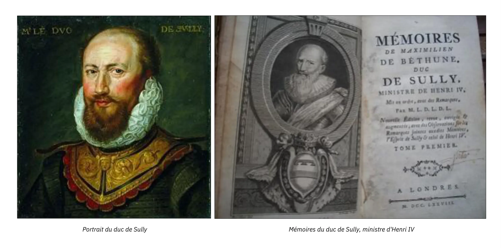

But then there's Colbert, Louis XIV's minister, who alternately supported regulation and freedom, but enforced regulation instead. Now, at the very end of the 17th century, Colbert has overtaken Sully: ministers claim his legacy and try to apply what they say are his maxims.

Colbert's maxims, in the minds of statesmen at the very end of the 17th century, were fourfold.

(1) The industry needs regulations and must be contained within the framework of corporations. These regulations specify, for example, how sheets and cloths should be made, their size and weight. There were hundreds of them, filling a special volume for each type of industry. In the eyes of Colbert's followers, these regulations were not enough, and the industry also needed to be supervised by corporations.

Anyone wishing to practise a trade had to spend several years as an apprentice, then as a journeyman, before attempting to attain mastery by successfully producing a "masterpiece" and paying a substantial sum to the guild. Competition within each trade is therefore severely limited.

(2) Trade is a zero-sum game. On the subject of trade, Colbert's followers shared the prejudices of the barbaric peoples of antiquity. According to Louis XIV's minister, trade is "a perpetual war". Why was this? The reason is simple. For Colbert and his successors, any increase in wealth for one country meant the impoverishment of another. We can't allow the English or the Dutch to get rich, because they'd steal our prosperity.

Products from these countries must therefore be banned or heavily taxed, and without scruples, because trade is a war in which the only thing we can hope for is the ruin of our enemies.

> The French can only increase their trade by crushing the Dutch
> Colbert

(3) If the state is short of money, simply raise more taxes. Colbert and his followers were far from thinking that taxpayers' wealth was a limited resource. There can be no problem with public spending, because it's only necessary to levy enough. And if the people revolt, it's because the ministers are doing a poor job of raising the money, for "the art of raising taxes consists in plucking the geese without making them scream too much", as Colbert cynically put it.

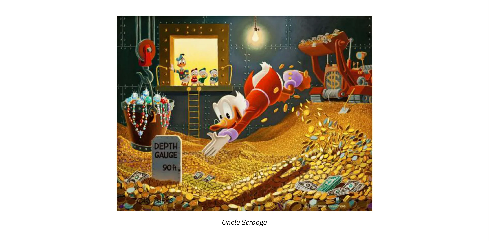

(4) Wealth is first and foremost gold and silver. Before the birth of economic science, many authors shared the same dogma on the nature of wealth, known as mercantilism. Colbert and his successors continued in this vein. In a nutshell, mercantilists believe that the sign of a nation's prosperity is the accumulation of precious metals, silver and gold.

> It is only the abundance of money in a state that makes the difference to its greatness and power.
> Colbert

The consequence of this is to favor exports at all costs, to amass gold and silver from other nations, and to limit imports to a minimum, to avoid sending them.

These, then, were the four principles that power had followed for several decades as France entered the 18th century. However, they were soon to be profoundly challenged. Between 1690 and 1710, several authors were struck by the disastrous state of France. They looked for the causes, and concluded that they lay precisely in those few maxims inherited from Colbert, which were so many sophisms. At the same time, they laid the foundations for the science of economics.

## Vauban

<chapterId>ee9c1e0e-96cc-5026-a5e2-963d68122786</chapterId>

Today, as tax pressure continues to grow in our country, at the risk of stifling national economic forces, voices are being raised calling for change. Whether consciously or unconsciously, the work of French economists who, since the 17th century, have criticized French taxation as chaotic, despotic and excessive, is the common basis for these reform proposals.

First in the chronological order of these tax reformers, and no less in that of merit, is the great marshal Sébastien Le Prestre Vauban, famous builder of strongholds and citadels.

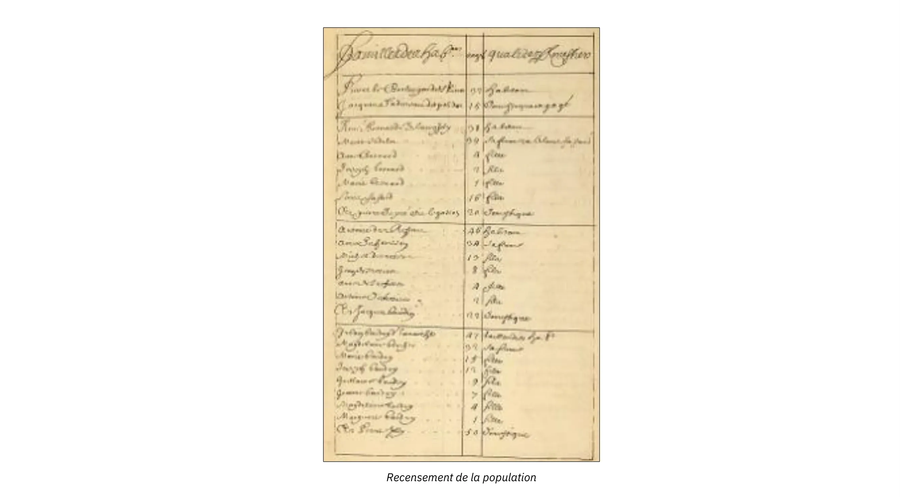

As we have unfortunately forgotten, Vauban the military man was also an economist. He took a keen interest in the fate of the masses, and in 1695 (Projet de capitation) and 1707 (Projet d'une dime royale) proposed a bold reform of taxation: to replace most existing taxes with a tax proportional to income, a flat tax before its time.

Vauban came to his ideas through curiosity. He was an astute observer, seeking to study social life and economic reality rigorously, almost scientifically. In particular, he insisted on the need to count, through censuses.

His second merit is the touching and truthful description of the misery of the masses of his time. Vauban wrote: "One must not flatter oneself; the interior of the kingdom is ruined, everything suffers, everything suffers and everything groans: one only has to see and examine the depths of the provinces, one will find even worse than I say". Far from being exaggerated, these gloomy views were a perfectly objective testimony to the reality of living conditions in the early 18th century. Aware of this, Alexis de Tocqueville described the findings of Vauban's Dîme Royale as "frightening", because they were true.

Vauban's other great merit as an economist is his attention to proposing far-reaching tax reform, capable of eradicating or reducing in intensity the evil he observed and described. In this, he hit the nail on the head, for the French economy under the Ancien Régime was paralyzed by taxation, which was unequal, unstable and illegible.

Through all his various economic and political memoirs, this reformer's ambition was above all the desire to relieve what he called "the lower part of the people who, by their labor, support and sustain the upper."

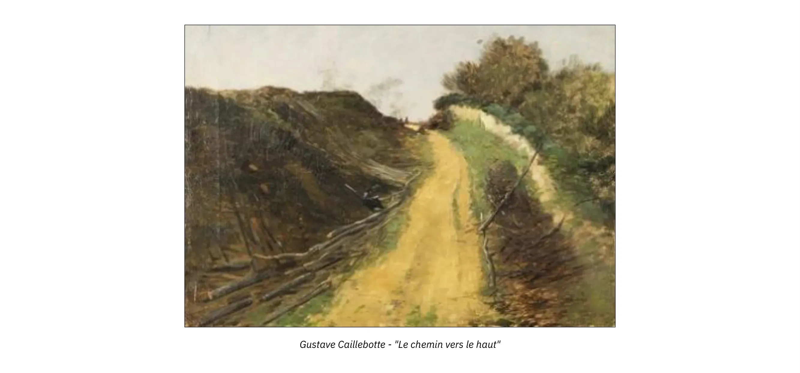

He understood how oppressive and disincentive taxation was for peasants, and he expressed this with clear-sightedness - something, incidentally, that is still perfectly observable today:

> The farmer lets the little land he has wither away, working it only half-heartedly, lest if it gave back what it could give back if well smoked and cultivated, the opportunity would be taken to tax it twice over.

Vauban was right, for as we know today, the Ancien Régime was marked by irrational and excessively rigorous taxation. It was this tax system, unjust in its distribution and therefore abusive in its weight, that Vauban set out to overcome.

The solution proposed by Vauban, a proportional tax, a flat tax on all incomes, would enable taxes to be distributed among all classes of citizens. Founded on a theory of the State that explained that public intervention was legitimate because it alone could protect individual rights and property, his tax reform would see all French citizens contribute to the effort, in strict proportion to their income: everyone would pay 10% of their income, for example.

In his Dîme royale project, the only one of his memoirs to be printed during his lifetime, Vauban wrote quite clearly:

> As all those who make up a State need its protection in order to subsist, [...] it is reasonable that all should also contribute, according to their income, to its expenses and upkeep [...]. Nothing, therefore, is so unjust as to exempt from this contribution those who are most able to pay it, in order to throw the burden onto those less able to pay, who succumb under the weight; which would, moreover, be very light if it were borne by all in proportion to the strength of each individual; whence it follows that any exemption in this respect is a disorder that must be corrected.

Shortly before his death, his idea was adopted by Louis XIV's ministers. Only, Vauban demanded that a proportional tax be introduced to replace all, or almost all, existing taxation. Instead, as is often the case, his tax was introduced, but all the others were retained.

## Boisguilbert

<chapterId>200149c6-b5fc-566e-ab0e-bafb1c3fed3c</chapterId>

Few of the French economists of the past now enjoy a celebrity in their own country commensurate with their talents. Boisguilbert is no exception.

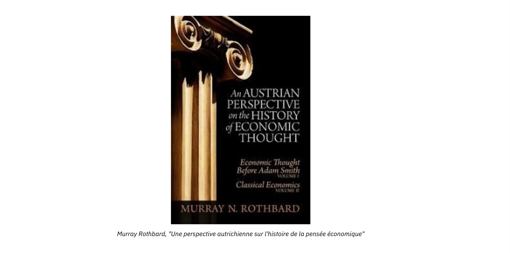

Unappreciated by the readers of his time, kept away from the circles of power by his eccentricity and excessive enthusiasm, this economist did not leave his mark on the 18th century either. Fortunately, he has been gradually rediscovered since the beginning of the last century.

However, this recent rediscovery shows that we have collectively reached a dead end. Boisguilbert's own merits have been lost by presenting him as the pioneer of a large number of theories and the precursor of a large number of authors. He is said to have understood Keynes's notion of underemployment, anticipated Say's Law, prepared Walras's general equilibrium, and even prefigured Marxist class analysis. "Who and what could Boisguilbert not be the precursor of?" one commentator finally asked.

Born in Rouen in 1746, Boisguilbert began an unsuccessful literary career as a student of Port-Royal in Paris, before acquiring various positions, including that of Lieutenant-General of Rouen. He then wrote several books to defend his ideas, including Détail de la France, in 1695, which he republished the following year with a very representative title: La France ruinée sous le règne de Louis XIV, par qui et comment, avec les moyens de la rétablir.

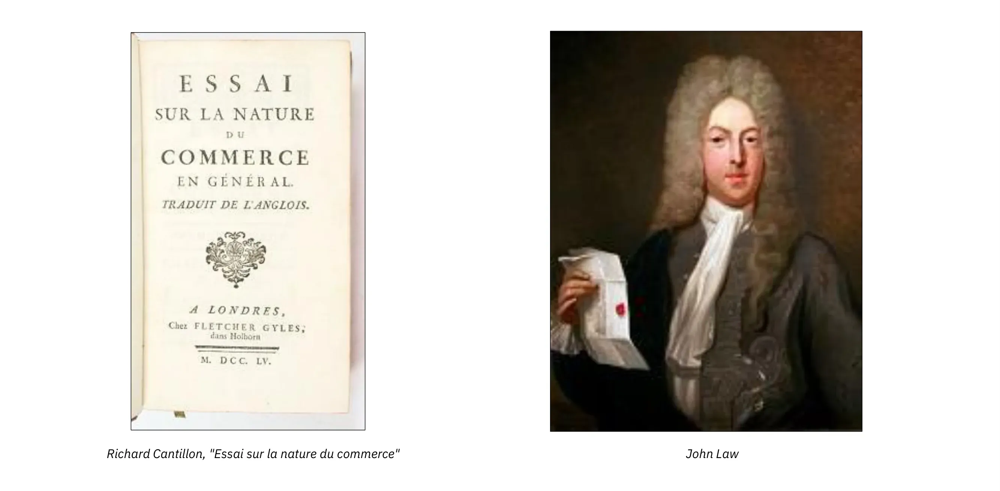

And such is the essence of Boisguilbert's books: French misery and its causes.

Boisguilbert, like Vauban, describes at length the misery of the French people at the end of the 18th century. He writes:

> Uncultivated or poorly cultivated land, exposed for all to see - that's France's corpse.

He describes vines being uprooted, peasants giving up farming and recurring famines.

Boisguilbert finds two main reasons for this misfortune. For if the people live in destitution, it is because they are prevented from consuming what is necessary, and the ruin of consumption has two causes.

Firstly, people were prevented from consuming because they were taxed arbitrarily. The taille, the personal tax of the time, was calculated blindly for each individual, and was liable to rise or fall without reason. Because of the numerous privileges, the burden fell on the poor peasants, who found themselves ruined. To counter this, Boisguilbert recommended establishing a proportional tax on all incomes, in the manner of Vauban.

The second reason for France's misery is that too many obstacles stand in the way of free trade in products, especially agricultural products. Customs at borders and even within the country, between different regions, paralyze all trade. These restrictions prevent equilibrium pricing and limit outlets. As a result, farmers can't make a living from their produce, because they can't sell it cheaply, and suffer the effects of unremunerative agricultural prices - a concern that is still very much alive today, and which lies at the heart of Boisguilbert's theory. On the subject of trade barriers, Boisguilbert's advice was to leave the roads clear, i.e. to establish free trade.

And freedom is his final conclusion. "It's not a question of acting," he says, "it's only necessary to stop acting with a very great violence that we do to nature, which always tends towards freedom and perfection." All will be well, he repeats tirelessly, "as long as nature is left to her own devices, that is to say, that she is given her freedom, and that no one interferes in this trade except to provide protection for all, and to prevent violence."

This last passage is crucial. Boisguilbert was the first to call for a distinctly laissez-faire economic policy, to make it his credo, and to build a veritable system around it. In his view, there is a natural order of things, and it must not be corrupted or destroyed by untimely public intervention. The state must not act on the economy, but let it act, otherwise it will cause misery.

Boisguilbert blames the "good souls", as he calls them, who want the people to be happy, but go about it all the wrong way. They wanted low bread prices for the people, but these low prices prevent farmers from making a living from their work, ruin them, drive them off their land and plunge them into misery. As we all know, hell is paved with good intentions.

## Cantillon

<chapterId>bc206d41-6a64-5688-a489-40fcfa0e5397</chapterId>

Author of Essai sur la nature du commerce en général (written around 1730, and published in 1755), Richard Cantillon is considered one of the pioneers of modern economics. In his History of Economic Thought, economist Murray Rothbard calls Cantillon the founder of modern economics.

Born in Ireland, Richard Cantillon moved to Paris as a young man and acquired French nationality. He worked as a banker and made his fortune during the John Law era.

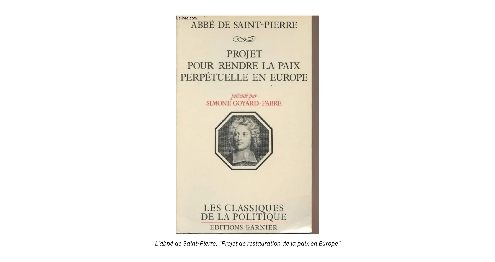

It was also on this occasion that he took up economic theory.

Around 1730, Cantillon wrote his Essai sur la nature du commerce en général.

This book can be interpreted as one of the first attempts at a general theory of economics. Cantillon is careful to identify what he calls the "general laws of economics", those that are in the nature of things, and not in the particular facts of any given country. Such an approach is revolutionary.

The great merits of Cantillon's Essay can be summed up in five areas: the theory of wealth, the notion of the entrepreneur, criticism of worthless currencies, the "Cantillon effects", and finally the defense of liberty.

First, the theory of wealth. Contrary to the mercantilism that prevailed at the time, Cantillon's analysis is based on the recognition that wealth is made up of products that are fit for human enjoyment. This wealth comes from nature, and is derived from it through human labor. His analysis of the nature of wealth strongly influenced Beccaria and Adam Smith, and through the latter the entire English classical school.

Secondly, Cantillon sees the entrepreneur, although not precisely defined, as the main and central player in economic activity. For Cantillon, what characterizes the entrepreneur is that he or she is a risk-taker, acting under uncertainty. With these ideas on the entrepreneur, Cantillon initiated a trend that would flourish with Turgot, and even more so with Say, to finally recognize the entrepreneur as having a place of his own in the economy, contrary this time to the assertions of the English school.

Third, money. In response to John Law's experiment, Cantillon explains what happens, or should happen, when money has no real value.

He sees two main consequences of the substitution of a currency without real value, such as paper money, for a metallic currency. The first consequence is what he calls "rejection by the people", meaning a growing distrust of worthless money. The second consequence is inflation. The weakening of money makes goods more expensive.

In his analysis of inflation, Cantillon went further than his contemporaries, and this is our fourth point. Observing the collapse of Law's system, Cantillon had become convinced that the effects of monetary inflation were far from uniform: while it enriched some, it impoverished others. He concluded that inflation did not affect everyone uniformly: depending on the channels through which the new money was transmitted, inflation had a redistributive effect. Those who benefit earliest from the new currency enjoy additional purchasing power, while the last users, faced with the inflation that has gradually set in, become poorer as a result of the new money being issued.

Finally, the fifth point. Despite some remnants of mercantilism, Cantillon's approach is fully liberal. He defends private property as the fundamental basis of civilization, explaining that no society is possible without private ownership of land and the products of labor. Cantillon also describes material inequality between men as natural and legitimate. In his view, there's nothing shocking about an efficient, courageous or exceptionally gifted worker earning more than an incompetent or lazy one. Finally, Cantillon believed that prices should always be determined freely, by the interplay of supply and demand, without the intervention of public authorities.

Of these five major ideas in his Essay, the most important is certainly the one to which his name has been given: the Cantillon effects. With this theory of the effects of inflation, Cantillon provides us with answers to a number of contemporary ills. It also helps us understand the consequences of recent expansionist and inflationary monetary policies, which have impoverished the middle classes and the rural world, and enriched mainly financial market operators, as well as the State, its agencies and civil servants, due to their joint proximity to the source of new issuance: the central bank and commercial banks.

# Reformers and Thinkers of the Early 18th Century

<partId>1f7b50d4-ce93-5db3-8396-43c1fa5419ff</partId>

## The Abbé de Saint-Pierre

<chapterId>13478fe2-4c12-593c-a410-54c2cfb7ef7f</chapterId>

Of all the authors we've selected to join the pantheon of 18th-century French laissez-faire thinkers, the Abbé de Saint-Pierre is undoubtedly the most misunderstood.

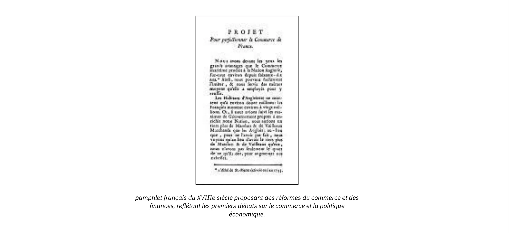

It's partly his fault, because he wrote so much, so much, and he's a pain to read, repeating himself over and over again. Jean-Jacques Rousseau tried to summarize his works; he began to do so, but soon abandoned the task, as he realized it was beyond his powers. In the mid-19th century, Gustave de Molinari did the abbé de Saint-Pierre great honor by publishing a comprehensive work on him, in which he paid tribute to the pacifist and economist that the abbé de Saint-Pierre was. But this was not enough to bring him out of oblivion, as he is still immersed in it today.

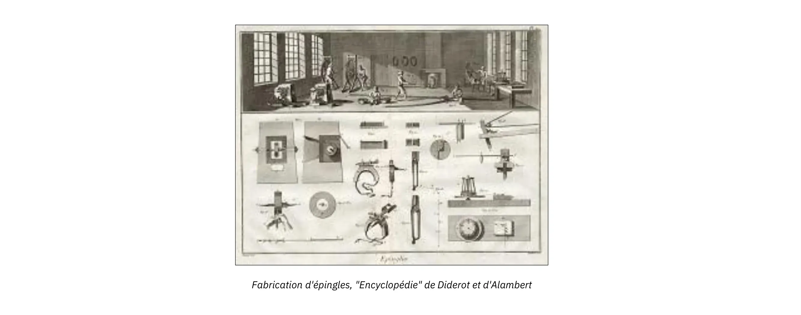

The Abbé de Saint-Pierre wrote on economics, but it's as a pacifist that we usually focus on him. He wrote a Project for Perpetual Peace, which predates Immanuel Kant's well-known Project for Perpetual Peace.

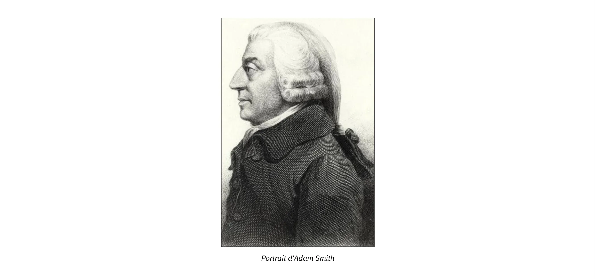

He shows that wars are destructive for those who lose them as well as for those who win them, and even for those who don't take part in them, as their trade is affected.

To combat the scourge of war, he recommended the creation of a kind of league of European nations. A European council would be formed to resolve the problems of each nation. Arbitration would be used to avoid resorting to arms. If one nation was unwise enough to embrace peace, if it threatened other European nations, the European entente would have something to answer for. In the event of such events, a European army would be formed, with forces provided by the various countries.

The life of the Abbé de Saint-Pierre also illustrates the critical intent behind the French laissez-faire approach. In 1695, he was admitted to the Académie française. He was expelled in 1718 for daring to criticize the outcome of Louis XIV's reign. In this, he is akin to Vauban and Boisguilbert, who dared to speak of the popular misery hidden beneath the splendor of the Sun King's reign.

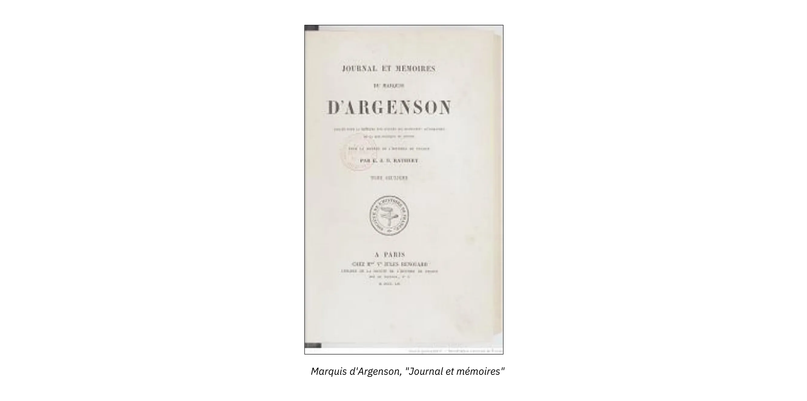

The Abbé de Saint-Pierre had argued that the reign of Louis XIV, the apogee of courtly luxury and military conquest, was not that of a virtuous king. He refused to accept that Louis XIV could deserve the title of Louis le Grand.

Ruining your neighbors and your people at the same time, that's not greatness," he said. The Académie française, which had come to devote itself full-time to praising the King in every possible literary guise, was outraged, and almost unanimously dismissed the Abbé de Saint-Pierre.

In economics, he always followed the principle of utility, like Bentham later, and generally provided good insights. He was, to be sure, still steeped in mercantilism, at a time when no one had yet fully detached himself from it.

However, the Abbé de Saint-Pierre also said some very accurate things about the economy.

Before Condillac, of whom this is one of the main merits, he set out the simple idea that in an exchange, both parties gain. We find it in his Projet pour perfectionner le Commerce de la France, dating from 1733. He expressly states:

> When a sale is made between merchants, the seller gains and so does the buyer; for, without a real or apparent reciprocal gain, neither the seller would sell at such and such a price, nor the buyer, for his part, would buy at such and such a price.

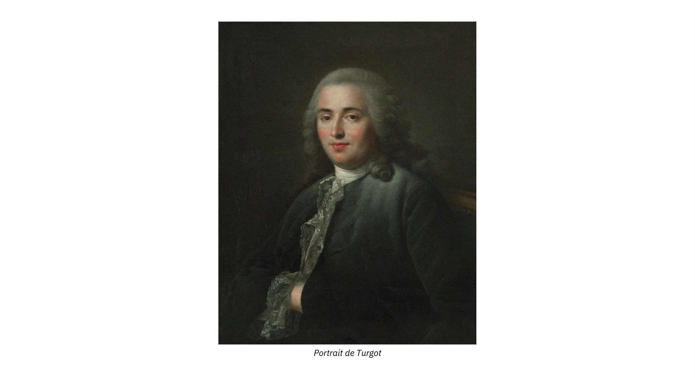

He also emphasized, before Vincent de Gournay, the virtues of work and the need to keep it attractive. "All work is toilsome," says the Abbé de Saint-Pierre, "and when a man sees that his work does not pay him or does not pay him enough, he remains idle and does not give himself useless pains." This same point was taken up by the Marquis d'Argenson, Vincent de Gournay and the physiocrats in their opposition to fussy regulations and the corporate system. Corporations and regulations, they argued, discourage the worker, cause him unnecessary hardship, and ultimately drive him into idleness, which he eventually finds preferable to productive activity carried out under these conditions.

## The Marquis d'Argenson

<chapterId>e9960ab4-72ec-5afd-8e97-bf89c83b62bc</chapterId>

The Marquis d'Argenson is a forgotten founder of the laissez-faire doctrine.

It was rediscovered by August Oncken, author of a book on the laissez-faire laissez-passer doctrine, who concludes that d'Argenson played a major role in the birth of this idea.

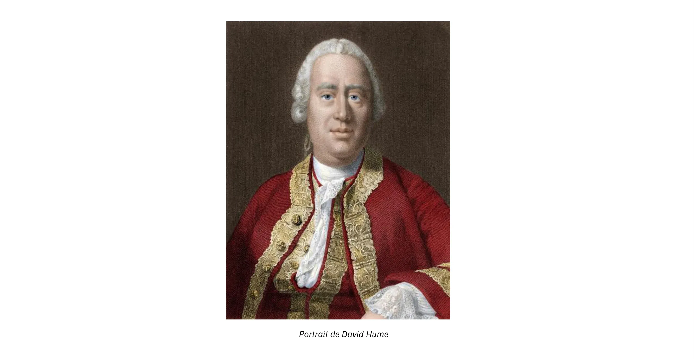

René-Louis Voyer, Marquis d'Argenson, was born in 1694. He began his career in politics, serving as a councillor in parliament and then in the Conseil d'État.

Thirty years before Adam Smith, the Marquis d'Argenson defended the merits of division of labor and specialization.

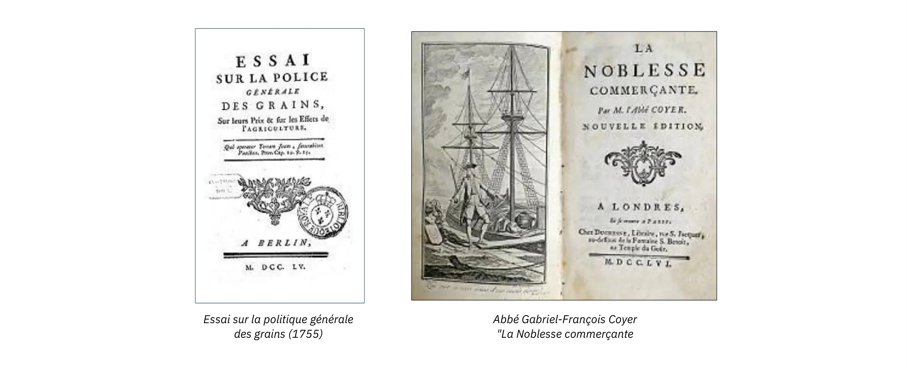

He strongly criticized the regulations that tended, he said, to modify the preferences of each place. He was astonished, for example, that Tours, a poor town at the time, should manufacture sheets and velvets as beautiful as those made in Genoa, a prosperous city known for its luxury. He concluded: "Each place must be allowed to choose its own factories. Freedom! Freedom!"

Nor did he fail to recognize another of Smith's central principles, the spontaneous order born of the pursuit of self-interest. The Marquis d'Argenson was convinced that direct, proximate interest stimulates human energy. He wrote that imperfection and fraud discredit the manufacturer, while diligence and good faith enrich him. The best arbiter of utility," he continued, "is the individual, the mass of the public who consume and are interested in buying well. "Everyone feels his interest," he wrote, "everyone takes the measures that are profitable to him, and it is in this general agreement that we discover the truth."

Before Adam Smith, he understood that self-interest of course leads to the general interest through the construction of a spontaneous natural order.

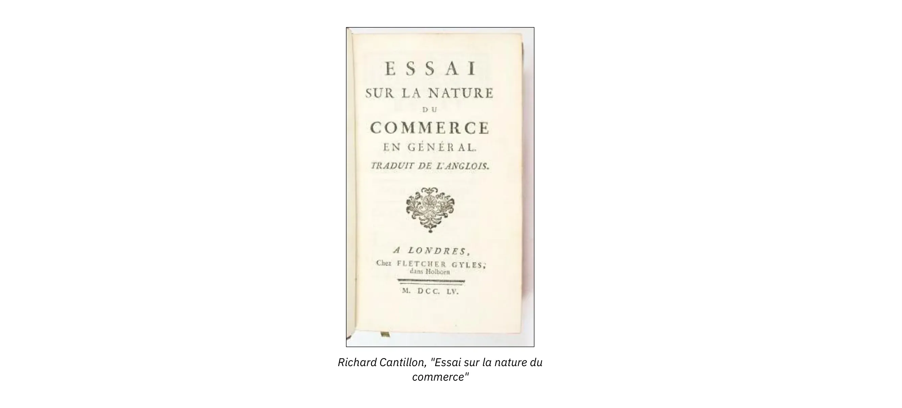

He compared society to a hive of bees, where each insect acts according to its instinct. The result of their actions," he said precisely, "is a great heap for the needs of the little society; but this has not been brought about by orders, or generals, which have obliged each individual to follow the views of their chief." Such a formulation is the closest we find in French economic writings to Adam Smith's famous invisible hand.

The Marquis d'Argenson was always outraged by the ideas shared by the ministers of the day. The only question they asked was: should we regulate in this way or that way, leading the economy in this direction or that?  Shouldn't we first examine," replied d'Argenson, "whether all these things should be directed, or left to their own devices?

To tell the truth, d'Argenson was astonished that people found it so hard to understand, or rather to see, the bad effects of regulations of all kinds on the economy. In his opinion, all you had to do was open your eyes to see them. So much is still going on today," he noted bitterly, "for the sole reason that they have escaped the law until now. Sometimes he despaired that his ideas were so little understood.

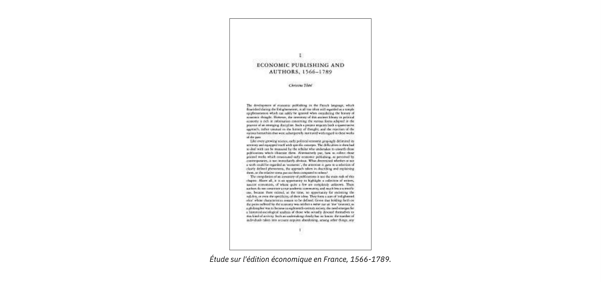

The ideal of economic policy he defended thus ran counter to the trends of his time. His ideal defined an essentially negative role for the state. the removal of obstacles is all that trade needs," he wrote. All it requires of public power are good judges, the punishment of monopoly, equal protection for all citizens, invariable currencies, roads and canals." This was the definition of the minimal state, which was to become one of the cornerstones of the French political economy tradition.

This vision of the role of the state in economic activity was naturally illustrated by the study of two major issues that stirred the economists and social thinkers of his time: the regulation of industry and the wheat trade.

First of all, he resented the regulations governing industry, which were privileges for some at the expense of others. the real cause of the decline of our factories," he wrote, "is the excessive protection afforded them. And it was with a no less lively credo that he expressed his criticism of the dirigiste zeal of the statesmen of his time:

> To lead industry against its will is to seek its ruin.

On the question of the subsistence trade, d'Argenson had no answer other than freedom. In his opinion, wheat shortages were caused by the government's monopoly and abusive precautions. All we had to do was let it go, and there would never be a wheat shortage in a country where the ports were open; foreigners, attracted like all other men by the lure of gain, would supply us with what we needed and take away our surplus. let it be," he would say, "and all will be well

## Vincent de Gournay

<chapterId>e8ae40dc-7450-552f-9ddc-9e02936cf425</chapterId>

Vincent de Gournay was one of the first representatives of laissez-faire in France, and one of its earliest advocates in public administration and intellectual circles. As such, he deserves a more than consistent mention in the history of ideas, a mention that is still rarely given to him. For my part, I have tried to highlight his merits in a recent book.

The son of a merchant, who became a merchant himself, Gournay acquired a large fortune before obtaining a position in the administration. As a member of the Bureau du Commerce, he was a fervent advocate of free labor and free trade.

Mixed up with all the great economists of his time, Gournay nevertheless wrote little, or rather published little. He wrote mainly administrative letters and memoirs, either unpublished or published by other authors after some editing.

We have from him (1) Remarques sur une traduction d'un ouvrage de l'économiste anglais Josiah Child ;

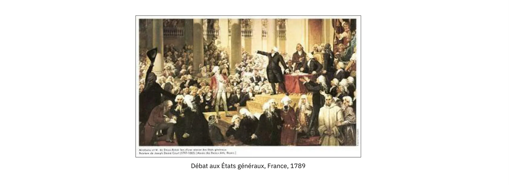

(2) "Observations" inserted in the Examen des avantages et des désavantages de la prohibition des toiles peintes ;

and (3) "Observations sur la compagnie des Indes" attached by Abbé Morellet to his Mémoire sur la situation actuelle de la compagnie des Indes (1769).

We also have, above all (4), memoirs from his work as intendant du commerce.

These writings show a clear foreign influence and the presence of some great structuring ideas.

For Gournay, foreign influence means recognizing the superiority of England and Holland. Gournay is convinced that these two nations have understood economics better than we have, and that we should follow their example. These two nations are the most prosperous," he says, "and they follow a completely different system than we do. We prohibit the entry of foreign goods, we enclose economic activity in draconian regulations, and they do the opposite. If they're more successful than we are, it's because we're following the wrong principles," concludes Gournay.

His ideas for reform focus on several main points.

First, we need to protect and promote work. Today, the French worker is treated like a criminal, controlled, monitored, and held in constant fear of not having complied with one of the thousands of regulations. All this hassle disgusts workers and makes them prefer idleness. But, adds Gournay, work is noble, and the only way to enrich a nation.

Secondly, manufacturers are locked into guilds that limit production. Access to each trade is very long and very costly, and each new worker must then scrupulously follow the routine enshrined in his or her guild's statutes. In this system, there's no room for excellence, innovation or progress.

Thirdly, trade in France was restricted by restrictive laws. For the benefit of the consumer, according to Gournay, it was necessary to allow competition between ports and to authorize the free importation of all goods, including grain and painted canvas, two highly regulated items of trade at the time. Gournay was one of the first to point out the origins of smuggling: for him, contraband developed only because an advantageous and useful trade was prohibited. He even adds another argument, namely that the smuggling profession is free, with no regulations, corporations or confiscatory taxes to pay. And with good reason, since the activity is illegal. But in any case, here are so many workers thrown into illegality, simply by a profusion of regulations.

Finally, Gournay noted that in England and Holland, two countries more prosperous than France, interest rates were lower than in France. He therefore insisted that interest rates should be lowered in France, so that economic activity could be financed on conditions as advantageous as elsewhere. Gournay did not, however, seek coercive, legislative methods. Above all, he insisted on the need to authorize the French to engage in money lending, still condemned by the Catholic Church.

On all these points, Gournay took part in the debate of ideas in the mid-eighteenth century. His defense of freedom of labor predates that of the Physiocrats by ten years, and that of Adam Smith by twenty. However, it was Vincent de Gournay who had the most visible influence on Turgot. Gournay took the young Turgot under his wing and trained him in his ideas.

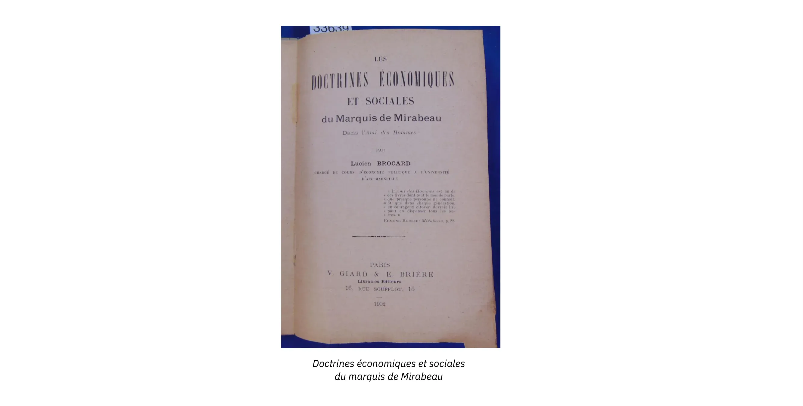

Later, Louis XVI's future minister composed an Eloge de Gournay in honor of his late friend. And if Turgot never fully embraced François Quesnay's physiocracy, it was because he retained an invincible attachment to his first master, Vincent de Gournay.

## The Gournay group

<chapterId>b86ba6bd-8f3a-5d8f-b098-4d0413f00deb</chapterId>

When it comes to the beginnings of economic science, history mainly remembers the first school of thought, the Physiocracy of François Quesnay and his disciples. Ten years earlier, however, there had been another, more informal, but equally important group, led by the economist Vincent de Gournay.

As we saw in the previous lesson, Gournay was fascinated by the example of foreign nations like England and Holland. He had the same admiration for their economists, such as Josiah Child, Jean de Witt and David Hume.

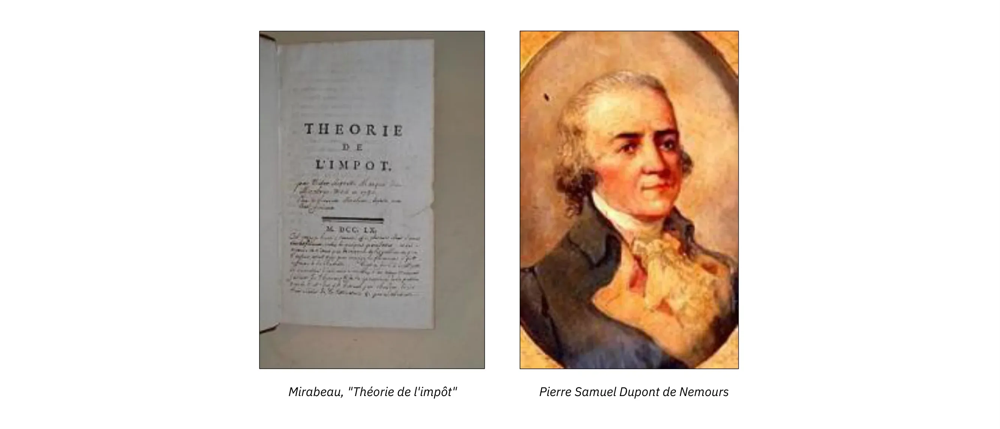

This prompted him to translate these economic writings and have them translated.

As it turned out, Gournay's position in the upper echelons of the French administration enabled him to make contact with all the economic specialists in France at the time. As a result, he assembled a group of extremely capable translators. Gournay himself translated Child and Culpeper; Abbé Le Blanc translated David Hume's Discours politique; Véron de Forbonnais translated the Spanish Geronymo de Uztariz; Turgot translated Tucker; Montesquieu fils translated Joshua Gee.

Thanks to the collaboration of several members of the Cercle de Gournay, many authors also published works under their own names. These books, as well as translations, were highly successful. These included Herbert's Essai sur la police générale des grains (6 editions in 4 years),

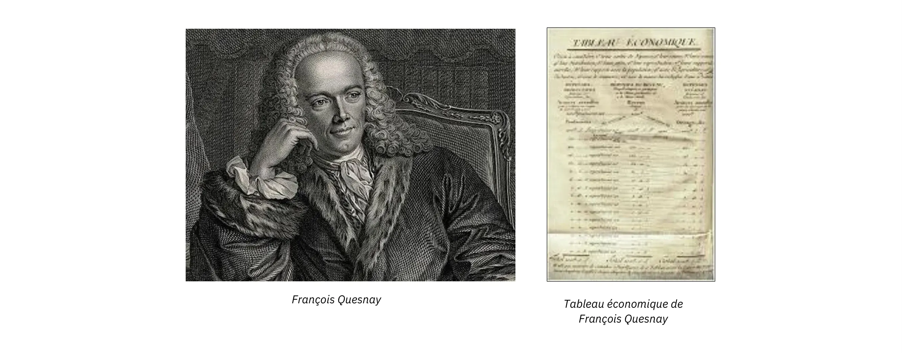

coyer's Noblesse commerçante (5 editions in 2 years),

remarques sur les avantages et les désavantages de l'Angleterre by Plumard de Dangeul (3 editions in the year of publication) and Mémoire sur les corps de métiers by Cliquot-Blervache and Gournay (2 editions in 1758).

The cercle de Gournay is also credited with launching the publication of Richard Cantillon's Essai sur la nature du commerce en général.

This book, written around 1730, remained in manuscript after the author's death. It was Gournay, with the help of his economist friends, who published it in 1755. According to Abbé Morellet, a member of the circle, Gournay recommended it to all the economists he knew.

The intellectual output of the Cercle de Gournay has had a considerable impact on the history of ideas. As such, the cercle de Gournay is to be placed at the origins of economic science in France. Christine Théré, from INED, has worked on economic publications throughout history, and shows that no fewer than 349 works on economics were published between 1750 and 1759, compared with just 83 between 1740 and 1749. This revolution in the 1750s is largely due to the Gournay circle.

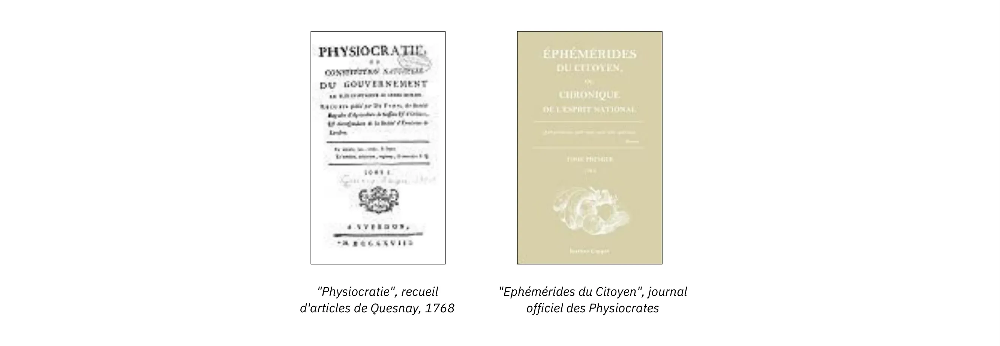

To spread a taste for economic discussion among the French population, Gournay and his friends worked to make these issues accessible through the novel. Thus, after a Mémoire sur les corps de métiers criticizing guilds, Gournay and Cliquot-Blervache helped Abbé Coyer write the text known as Chinki: histoire cochinchinoise applicable to other countries.

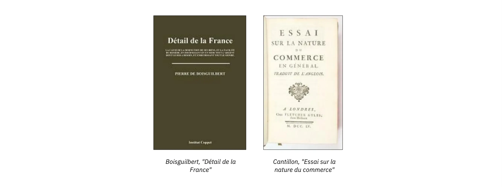

This is a short novel in which the main character, Chinki, abandons his land because of excessive taxation and tries to find craft work for his children in the city. But all trades are closed to them because of abusive guild regulations, and so he goes from disappointment to disappointment, all with a sense of humor.

The Cercle de Gournay was thus at the origin of an intense publishing activity. While this major contribution has been forgotten by historians of economic thought, it was very clear in the minds of contemporaries. The physiocrats, who structured their school in the 1760s, presented Gournay's group as direct precursors. In 1767, the economist Jacques Accarias de Serionne was even clearer in his praise. He wrote: "A few years ago, a small number of Frenchmen, also philosophers and citizens, began to imitate English writers. They first translated their models, and soon surpassed them in many things. They employed all the pleasures, all the riches of literature, to deal with useful things; they gave birth to and spread a taste for the sciences most necessary to the prosperity of the State." And indeed, in the decade of 1750, economic questions became fashionable. Voltaire famously said that, around 1750, the French abandoned novels to discuss the freedom of the wheat trade. The Mercure de France also observed this. In an issue from 1758, a few months before Gournay's death, we read: "Political economy is today's fashionable science. Books dealing with agriculture, population, industry, trade and finance are in the hands of an infinite number of people who, until recently, only leafed through novels." No better tribute could be paid to Gournay and the activity of his circle of economists.

## Mirabeau

<chapterId>2d2f802b-e3b6-556f-9025-a1b1dc4409ca</chapterId>

France has known two great Mirabeaus, father and son, but only one has gone down in history. The son Mirabeau, a revolutionary tribune and one of the central figures in the events of the French Revolution, has remained famous.

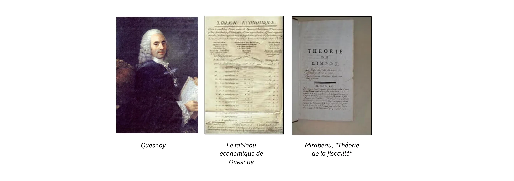

Through his talent and his place in French history, he made us forget his economist father, a pillar of François Quesnay's school, of which he had been the first member in 1758.

In fact, the Marquis de Mirabeau had enjoyed immense fame even before he joined the Physiocracy. This was in 1757, a year before he met Quesnay, with a book entitled L'Ami des Hommes. Traité de la population.

It was a huge success, perhaps the most successful economics book in history. No fewer than 20 editions were published between 1757 and 1760, with the public initially attributing the book to Montesquieu, struck by the quality of its reasoning. The Dauphin, father of Louis XVI, claimed to know the book by heart, and for a few months it was fashionable reading at Versailles.

Today it's a book that's no longer read, but it's often quoted; and already in the 19th century Edmond Roussel said:

> L'Ami des Hommes is one of those books that everyone talks about, that hardly anyone knows about, and that in every generation, one courageous citizen should read ... to exempt everyone else.

At the start of his career as an economist, Mirabeau was inspired by Richard Cantillon. For 15 years, he had possessed a manuscript of his Essai sur la nature du commerce en général, which he had patiently analyzed and commented on.

L'Ami des Hommes was originally conceived as a simple commentary on Cantillon's Essai. But as Mirabeau was a bit of an eclectic mind - in other words, a bit of a madman - he quickly deviated from his plan. In the end, in L'Ami des Hommes, Mirabeau simply talks about all the economic issues he knows, occasionally straying from Cantillon. It's a difficult book to read, with a far-fetched plan and digressions in every chapter.

Mirabeau himself admitted that it was chaos and that his style was apocalyptic.

In the chaos that is L'Ami des Hommes, a few ideas are worth noting:

- Mirabeau fights mercantilist prejudice about the nature of wealth
- He praises agriculture and criticizes its abandonment
- He complains about the condition of the people, especially the peasants
- Finally, he defends the freedom of trade and the brotherhood of nations in peace

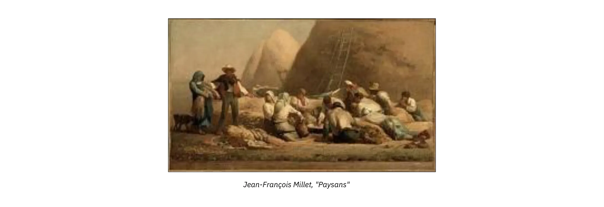

From this point of view, however, it's difficult to categorize the Mirabeau of L'Ami des Hommes as either liberal or anti-liberal, as he constantly oscillates, often without realizing it, between one and the other. Quite often, however, liberalism dominates, and he has lightning phrases like this:

> The real and only principle of political economy is to leave everything free.

With his greatest success behind him, Mirabeau was courted. François Quesnay, who had just taken an interest in economics, invited him to his entresol at Versailles.

They debate furiously, and in the end, something that normally never happens in debates, Mirabeau flatly admits he was wrong. He endorses Quesnay's ideas and declares himself ready to propagate them.

Together, they formed the core of what was to become the physiocratic school, thanks to the regular recruits they made. Immediately after Mirabeau's conversion, Quesnay used him to defend his ideas on taxation: the Théorie de l'Impôt, for which Mirabeau was sent to Vincennes prison for a few days, then exiled to Bignon.

Mirabeau subsequently did much to recruit new members for Quesnay's school. In particular, he succeeded in convincing the young Dupont de Nemours.

It was also at Mirabeau's that the Physiocrats met every Tuesday. Personalities such as Turgot and Adam Smith seem to have attended these meetings on one or more occasions.

Throughout his life, Mirabeau remained a tireless writer. He was the author of numerous economic works defending Quesnay's doctrine. Towards the end of his life, however, his influence waned. His style became even worse, to the point where his own brother wrote that he could no longer understand his prose. His ideas, now fully liberal, came up against the socialist or proto-communist reaction of authors like Mably and even Rousseau. He struggled to be read and published. He died in relative indifference in 1789, on the eve of the storming of the Bastille.

## Quesnay

<chapterId>7a35f20b-5ea0-544d-b290-bcd9c6f7f11a</chapterId>

François Quesnay is one of France's most famous economists.

His name is mentioned in every textbook on economics and the history of economic thought. They state that he composed the Tableau économique to represent the economy schematically, that he was the leader of the Physiocrat school, and that he was mistaken in thinking that only the earth is productive - and that Adam Smith finally came to set the record straight. That's pretty much the textbook summary of François Quesnay.

It's a pity to reduce him to this, because Quesnay was also the first economist to seek to base the defense of economic freedom on scientific grounds; he was one of the most listened-to and influential economists of his century, and finally he founded Physiocracy, which is much richer than this simple idea of production by nature alone, which is often caricatured.

We'll look at Physiocracy in more detail in the next three chapters. First, let's take a look at François Quesnay himself.

He was born in 1694 in Méré, into a peasant family where he didn't even learn to read. Educated by a local man, he went on to study at the College of Surgery, then went on to the Faculty of Medicine. At the age of 24, he became a surgeon in Mantes.

He became famous in 1730, at the age of 36, for his opposition to bloodletting, a practice he believed to be the result of false theories and prejudice. He also dared to challenge the guild system, in which surgeons alone were allowed to perform operations and doctors to give medicines; in many cases, the lower classes had to pay twice, and bring in two people, which revolted Quesnay.

In 1740, he became secretary to the Académie de chirurgie. In 1748, at the age of 54, he became Mme de Pompadour's personal physician. He moved to Versailles.

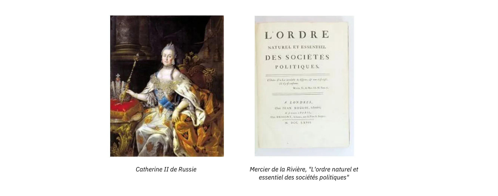

He was very close to Mme de Pompadour. Quesnay even said, when the favorite's disgrace was announced, that he wouldn't want to remain a doctor at Versailles without her: "I was attached to Mme de Pompadour in her prosperity; I will be in her disgrace."

He then published several medical books: Traité sur la Suppuration (1749), Traité sur la gangrène (1749), Traité des fièvres continues (1753), three works that were reprinted several times during his lifetime.

At the age of 60, initiated into the economic discussions fashionable at the time, he began to write about economics. In 1755, he wrote the article Farmers and Grains for the Encyclopédie.

They were published in 1757. That same year, he met the famous Mirabeau and managed to win him over to his ideas: the nucleus of Physiocracy was formed. Quesnay went on to compose the Tableau économique, which was printed on the royal press in front of the king, it is said, at the Château de Versailles, and from then on he regularly welcomed economists and philosophers to his Versailles entresol, where they discussed freely. Quesnay contributed to Mirabeau's Théorie de l'impôt, published in 1759.

Censorship intervened, Mirabeau was sent to prison, and Quesnay was reprimanded as well. From then on, he understood that he couldn't write publicly; he needed disciples.

He quickly found some: Baudeau, Dupont de Nemours, Le Trosne, Mercier de la Rivière and others. These were the men who would spread and popularize the master Quesnay's thinking. However, Quesnay, who needed disciples, was not entirely satisfied with the sectarian aspect of his group. Witness his letters to Mirabeau, in which he tells him:

> Think for yourself. I've found that my miserable drafts make you lazy. Think for yourself. You know as much as I do.

However, these disciples were very devoted to Quesnay, and contributed greatly to his popularity. When he died, Mirabeau delivered his eulogy and said, "We have lost our father, for we owed him everything." In truth, it was Quesnay who owed them everything: for without them he found himself stuck in Versailles, where his thinking had much to seduce or worry, but which interested few.

Thanks to the activity of his collaborators, his ideas had a platform: firstly newspapers, the Journal de l'Agriculture and the Ephémérides du Citoyen.

Then there were the works: in addition to the disciples' books, a major collection was published in 1768, to which Dupont de Nemours gave the title "Physiocracy".

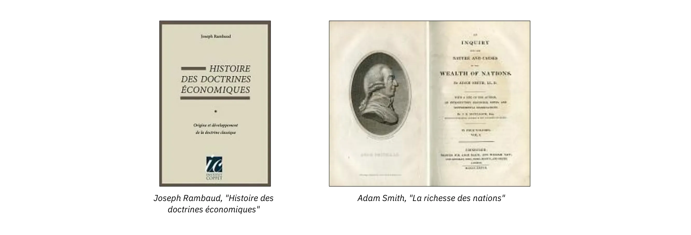

This book contains Quesnay's main contributions. It sets out the economic ideal of the leader of the Physiocrats, the ideal of an agricultural economy, where the law guarantees everyone the right to own property and the freedom to trade.

# The Physiocratic School

<partId>27af82c1-ad82-5c3b-8ce9-c674b67bbf7c</partId>

## History of the Physiocrats

<chapterId>4236ff8b-b53a-59e7-92c0-f96f9afa1c00</chapterId>

Physiocracy was fashionable not only in France, but throughout Europe, for barely a decade. After several years of slow maturation, it came to the fore in the mid-1760s. By the time Turgot came to power in 1776, it had already ceased to be popular, and the minister hid his sympathies for François Quesnay's school.

Its origins can be traced back to the development of economic ideas in the 1750s. From this point of view, several authors were instrumental in bridging the gap between Boisguilbert and the so-called Physiocrats. As we have already seen, Vincent de Gournay and his circle of economists were responsible for numerous publications, which passed on to the French the economic lessons learned abroad, as well as their passion for economics. The essence of the physiocrats' doctrine was already present in several books, notably Boisguilbert's Détail de la France and Cantillon's Essai sur la nature du commerce en général.

Since Boisguilbert, laissez-faire had known several advocates, in particular Vincent de Gournay and the Marquis d'Argenson.

What remained was to turn this mass of ideas into a precise and complete doctrine. The Marquis de Mirabeau was the first to attempt this. He took Cantillon's Essai as his model, and set about writing a comprehensive treatise on economic matters, which he entitled L'Ami des Hommes (The Friend of Men) and which met with great success.

The year was 1756, and the story of Physiocracy could begin. François Quesnay, a surgeon who had become personal physician to Mme de Pompadour, Louis XV's favorite, invited Mirabeau to Versailles to discuss his economic ideas.

In the end, Mirabeau agreed with Quesnay's ideas. From then on, they were to write: Quesnay produced a Tableau économique (1758) schematizing the circulation of wealth in the economy, and together they published Théorie de l'impôt (1759).

Their efforts were not well received. At court, indifference prevailed. The King recognized Quesnay's taste for theories and proudly called him "my thinker". But apart from this mark of affection, the work of the two economists ended in failure. With Théorie de l'impôt, they even managed to antagonize the tax administrators harshly criticized in the book. They demanded and obtained that Mirabeau be sent to prison. Madame de Pompadour got him out, but he remained in exile for a few weeks on his land at Bignon.

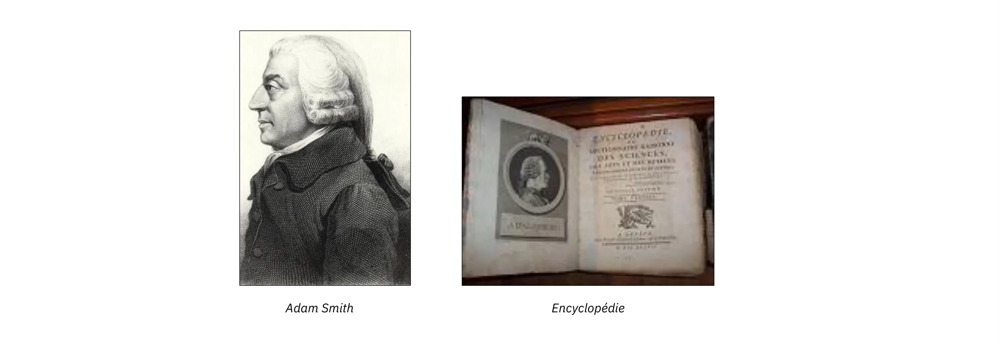

The first half of the 1760s passed in silence. Because of his position at Versailles, Quesnay was forced to stop writing, or at least not to publish anything in his own name. Mirabeau, who had already been condemned once, had been warned, and he was well aware that the King's favorite would not be able to save his bacon forever.

After this temporary silence, the two economists began recruiting disciples: this was the only way to popularize their ideas. By 1765, the successes were striking. Dupont de Nemours, Abeille, Mercier de la Rivière, Le Trosne and Baudeau quickly joined the ranks. They formed a school: they had their own journal, Éphémérides du Citoyen, and even met every Tuesday at Mirabeau's home.

Between 1765 and 1775, the Physiocrats were at the height of their fame. The literary world had eyes only for them, which allowed their ideas to spread. They were called economists, or the "sect" of economists to deride them. Whatever the case, their fame was total. After a trip to Metz in 1774, M. de Vaublanc wrote in his Mémoires of his astonishment: all around him, people were talking about economics and reasoning like Quesnay's pupils. "It was fashionable," he says. Everyone was an economist."

By 1770, however, their audience had begun to wane. The group experienced its first defections, and was less and less able to withstand the criticism, of which there were many: Condillac, Mably, Voltaire, Galiami, Linhuet, Graslin and even Adam Smith in Scotland.

Their newspaper no longer appeared regularly. This marked the end of the movement's active period.

Nevertheless, Physiocracy continued to have an influence well into the Revolution. In France first of all, through the intermediary of Turgot, a fellow traveler rather than a disciple, but also through its representative, Dupont de Nemours, whose life and works we will study later. But also throughout Europe, where physiocratic doctrine was received with enthusiasm. In Germany, by the Margrave of Baden, and in Italy, by Leopold of Tuscany, physiocratic theories even inspired economic reforms in favor of private property and freedom.

## The foundations of the Physiocrats' doctrine

<chapterId>4dbe5436-0578-57c2-b054-03ed00aa091a</chapterId>

The term Physiocracy, meaning "government by nature", was coined by Dupont de Nemours and given as the title of a collection of articles by Quesnay published in 1768.

This is an obscure formula. None of Quesnay's pupils has ever given us the true meaning.

That said, their system of thought was far from obscure. In fact, it was articulated around a few very clear principles, which we'll set out here.

### First principle: only agriculture is productive

This first idea is the one that has caught the attention of historians. Today, in textbooks and economics courses, this is what the Physiocrats are summed up as. They naively believed that agriculture alone was productive. That said, their doctrine is dismissed as irrelevant, and we move on to Adam Smith's analysis.

However, we can't criticize the Physiocrats for placing too much importance on agriculture, since in the mid-18th century, agriculture employed 90% of the population and formed the basis of the French economy.

The Physiocrats' idea is a subtle one. According to them, there is a difference between production and gain. The industrialist and the trader can earn: but it's only the farmer who produces, because production is a creation of useful matter, rather than an addition of utility to pre-existing matter.

We also need to understand why they rejected industry and craftsmanship as unproductive. At the time, these trades were locked into the guild system, from which innovation, investment and progress were banned.

### Second principle: legal despotism rather than democracy

Today, to insult someone, we say he's not a democrat. And while historians may forgive the Physiocrats their conception of the unique productivity of the land, they do not forgive their opposition to democracy, especially as they came at the height of this idea. In the middle of the Enlightenment, and right up to the eve of the Revolution, the Physiocrats were seen as the enemies of progress.

Tocqueville insisted on this idea:

> The Physiocrats are, it's true, very much in favor of free trade in goods, and laissez-faire or laissez-passer in commerce and industry; but as for political liberties properly so called, they don't give them a thought, and even, when they happen to present themselves to their imagination, they reject them out of hand.

The Physiocrats were liberal in economics, but not in politics. In his Maximes, Quesnay writes: "Let sovereign authority be unique and superior to all individuals in society, and to all the unjust enterprises of particular interests." And further on, in the same maxim: "The system of counter-force in a government is a fatal opinion, which reveals only discord between the great and the burdening of the small."

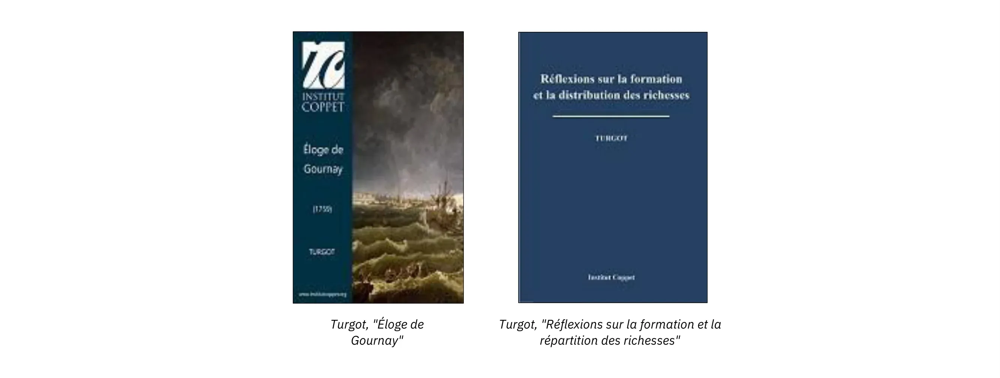

The Physiocrats, as Tocqueville noted, rejected democracy as soon as they saw its forms. They were skeptical of democracy: this was to be a constant in French political economy. For democracy is far from a perfect system: it is potentially the oppression of minorities by the majority; it can be an instrument of usurpation, tyranny and despoilment.

### Third principle: absolute respect for private property

To live, man must be able to work freely and keep the product of his labor for himself. This is the Physiocrats' conception. Property is the foundation of society. The state's sole mission is to protect the legitimate possessions of individuals. Moreover, from an economic point of view, the Physiocrats assert, the inviolability of property encourages work and effort, and is a condition of economic progress.

Quesnay expresses it in no uncertain terms: "Let the ownership of land and movable wealth be assured to those who are its rightful possessors, for the security of property is the essential foundation of economic order and the security of society; it is the security of permanent possession that provokes labor and the employment of wealth in the improvement and cultivation of land and in the enterprises of commerce and industry."

### Fourth principle: absolute freedom of trade

In his aforementioned maxims, Quesnay asserts: "Let complete freedom of commerce be maintained, for the safest, most exact and most profitable policing of internal and external trade for the nation and the State consists in full freedom of competition."

The Physiocrats recognize that when the state has intervened in the trade of goods, particularly wheat, it has caused more harm than good. It must be recognized, they say, that authority will never be able to administer trade as well as individuals do, because it would have to be able to follow every need, react to every change in demand or supply. Even the wisest government is incapable of doing this. So let it be, let it pass.

Beneficial by nature, trade must be completely and perfectly free. The title of one of Le Trosne's pamphlets is quite explicit: la liberté du commerce des grains, toujours utile et jamais nuisible.

### Fifth principle: All men are brothers

Virulent opponents of slavery, the Physiocrats were also great pacifists. "Our foreign policy is called peace", said Mirabeau simply. And in 1790, at the Constituent Assembly, Dupont de Nemours again followed this pacifist fiber when he proposed a bill banning offensive wars.

## The Physiocrats' achievements and influences

<chapterId>5b911105-796a-5e2e-a501-c7a364fc758e</chapterId>

As we saw in the first of the three chapters devoted to the Physiocrats, Quesnay's pupils were fashionable in France for around ten years. This infatuation with their ideas continued from their time until the end of the century. Here, we look at some of the achievements they can be credited with, and the influence they exerted on their successors in the field of economic thought.

Their greatest achievement, following on from the Gournay group, was to popularize economic ideas. Voltaire famously said that, around 1750, a nation satiated with poetry and novels began to reason about wheat. The Physiocrats took part in this movement, publishing literally hundreds of articles, pamphlets and books on free trade in wheat. The strong impetus given to the discussions by the Physiocrats can still be seen in the impressive number of economic works and pamphlets published in France between 1760 and 1775. As further evidence of the spread of economic ideas in France, we may recall the words of M. de Vaublanc, quoted in a previous lecture, who said in Metz in 1774 that people no longer spoke of anything but economics. "It was fashionable," he said. Everyone was an economist."

The defense of their ideas, in books, pamphlets and their journal Ephémérides du Citoyens, soon had repercussions on French economic policy. In 1763, an edict granted freedom of trade in grain, which Quesnay and Mirabeau had been pressing for. On several occasions, the authorities also relaxed the operation of trade guilds to guarantee greater freedom to work.

Success abroad came early. In Germany, the Margrave of Baden took a keen interest in physiocratic ideas, and maintained regular correspondence with Mirabeau and Dupont de Nemours.

He commissioned the economist Johann August Schlettwein, a staunch physiocrat, to introduce tax reform and liberalize the grain trade. In April 1770, a first experiment took place in the small village of Dietlingen. The villagers seem to have enthusiastically welcomed the measures, but the officials in place were not very supportive, which delayed the general operation.

In Russia, Catherine II was preparing a reform of legislation and asked Diderot to send her a brilliant mind to support her.

Impressed by his reading of L'ordre naturel et essentiel des sociétés politiques, published in 1767, he sent its author, the physiocrat Mercier de la Rivière, to him.

He left France in a blaze of glory, but was coldly received in St. Petersburg (apart from the climate), and the Tsarina was disappointed in him.

In Sweden, with Gustavus III, and in Italy, with Leopold of Tuscany, the Physiocrats also found followers ready to put their ideas into practice.

In France, the Physiocrats enjoyed a flamboyant success with the appointment of Turgot as Controller General of Finances in 1774.

Aware of the loss of notoriety they were experiencing, Turgot never presented himself as a faithful follower of the Physiocrats - nor indeed as an encyclopedist, although he was one, because they were hated by the clergy. Once in power, Turgot composed six famous edicts that represent the beginnings of a practical application of the Physiocratic program: freedom of trade, freedom of labor, the end of monopolies.

At the time of the French Revolution, the Physiocrats were no longer numerous. After the death of the Marquis de Mirabeau on July 13, 1789 - quite a symbol - only Abeille remained, who by now had distanced himself from Physiocracy, and Dupont de Nemours, who remained faithful to it. Appointed to the Assemblé, Dupont de Nemours carried the voice of Physiocracy and called for economic reforms in favor of property ownership and free trade.

He also fought, unsuccessfully, against assignats. Despite this failure, physiocratic thought was still very much present in the debate on ideas, and influenced the early achievements of the Revolution. Everything the Revolution did in favor of liberties," Joseph Rambaud would say, "was due to the Physiocrats.

Last but not least, the Physiocrats had a major influence on the history of economic thought. Adam Smith, who met them in Paris during his visit to France, was greatly inspired by their writings, and considered dedicating his book The Wealth of Nations to François Quesnay.

The leader of the Physiocrats died two years before the book's publication, and Smith removed this dedication from the front of his book. Having rectified their ideas on the productivity of the land, the classical economists took much away from Physiocracy, notably the arguments for free trade.

## Dupont de Nemours

<chapterId>6d585e0f-93b8-5b0a-a0a8-7f6e4a5bc68e</chapterId>

In the United States, DuPont, also known as "E.I. du Pont de Nemours et compagnie", is a multinational chemical and biological company.

Today, it has sales of over $35,000 billion and employs almost 65,000 people worldwide. It turns out that this company is closely linked to the destiny of Samuel-Pierre Dupont de Nemours, a French economist of the physiocratic school.

Born in 1739, Samuel-Pierre Dupont de Nemours became close to the Physiocrats at the age of twenty-four. At the time, he was looking for a vocation, and having read a short pamphlet entitled La Richesse de l'Etat, he set about criticizing it, as it was full of economic nonsense. So, in 1763, he published Réflexions sur la Richesse de l'Etat. The public praised this work, and some readers told him, "You're a disciple of Mirabeau!" But Dupont de Nemours didn't know Mirabeau.

Intrigued, he began reading Mirabeau's Ami des Hommes and Théorie de l'impôt. He met Mirabeau, then Quesnay, and joined their school. In 1765, he was offered the position of editor of the Journal de l'agriculture, du commerce et des finances, the leading periodical of its time in the field of economic thought.

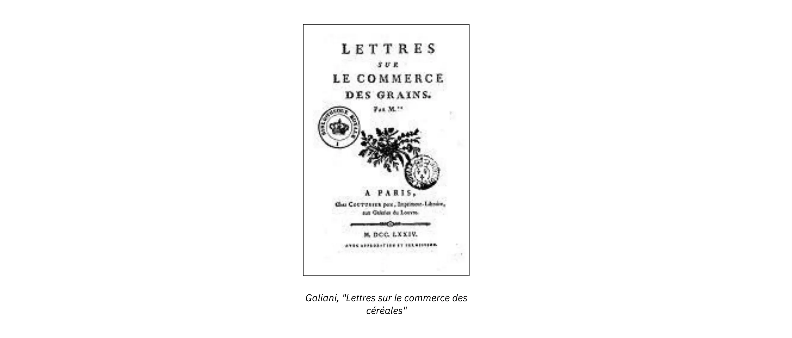

There were two reasons for this: Mirabeau and Quesnay had to remain silent, but Dupont de Nemours was also recognized as a future great.

Accounts from members of the physiocrat school agree that Dupont de Nemours quickly became a favorite in the eyes of François Quesnay. Quesnay used to say, "We must look after this young man, for he will speak when we are dead." One of the physiocrats, Abeille, was jealous of all the attention paid to Dupont de Nemours and distanced himself from Quesnay's school.

Dupont de Nemours always maintained his high regard for Quesnay.

He once said, "I was only a child when Quesnay held out his arms to me; it was he who made me a man." In any case, it was Quesnay who made Dupont de Nemours a major economist on the literary scene of the time. After the Journal de l'agriculture, he was offered the editorship of the Ephémérides du Citoyen, which became the official organ of the Physiocrats.

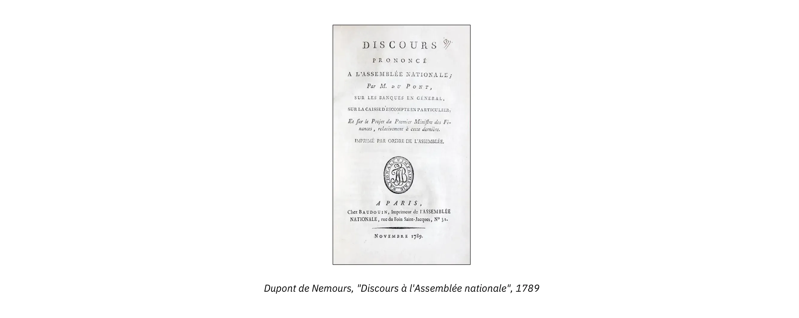

He made this periodical a mecca for economic theory, supporting it even during the Physiocrats' period of decline, writing almost all the final volumes himself. It was Dupont de Nemours, moreover, who coined the term "physiocratie", from two Greek words meaning together the government of nature. He used the term to entitle a collection of Quesnay's articles, published in 1768, and the term eventually became part of history. Among themselves, the physiocrats were known as "economists", and this is what they were still called during the French Revolution.

When Turgot joined the Ministry, Dupont de Nemours became his special advisor, and was the only physiocrat in contact with Turgot, who avoided contact with the others.

At the time of the Revolution, he was elected to the Nemours bailiwick and found himself at the Assembly, where another Monsieur Dupont sat. He was then called Dupont de Nemours, even though he was not a noble, but simply to distinguish him from the other Dupont. - Once again, the name stuck.

During the Revolution, he took up arms in August 1792 to defend the King from the crowds at the Tuileries Palace.

The King told him: "Monsieur Dupont, you are always found where you are needed!" After miraculously escaping the Terror - convicted and awaiting the guillotine, he escaped following the fall of Robespierre - he was driven into exile under Napoleon and found happiness in the United States, where one of his sons founded, with paternal assistance, the Dupont company.

Despite this busy life, during which he published dozens and dozens of articles, pamphlets and books, he remains relatively unknown to this day. Perhaps he is paying for having remained a convinced Physiocrat until a time when this doctrine was entirely out of fashion. Indeed, as Schumpeter wrote, Dupont de Nemours remained faithful to Physiocracy "throughout a career during which there was no shortage of opportunities to deny it". He was a man of conviction.

# The Enlightenment and Political Economy

<partId>d1c885ad-7cb1-5f81-816c-be312719d9f8</partId>

## Voltaire and the philosophers

<chapterId>16bcf7bf-dad4-5113-8c64-2800f04ff07b</chapterId>

The French 18th century saw the emergence of economic science and the first school of economic thought, Physiocracy. It was here that Adam Smith learned about economics, and French economists became recognized as world leaders. However, this century has not gone down in history as the century of economics, but as the century of philosophy. While the physiocratic movement's ambitions were in keeping with the philosophy of the Enlightenment, the attitude of philosophers, led by Diderot and Voltaire, deserves to be studied. We'll see that Enlightenment philosophers were instrumental in spreading the idea of laissez-faire in France.

The most famous achievement of Enlightenment philosophy is undoubtedly Diderot and d'Alembert's Encyclopédie.

Naturally, the economic articles were written by economists. For the first volumes, Diderot called on Forbonnais, then sought the collaboration of liberal economists: first François Quesnay (articles on Grains, Farmers, Men (unpublished)), then Turgot (Foires et marchés). These writings are of the utmost importance. In his articles, Quesnay laid the foundations for what was to become the physiocratic doctrine. Along with Tableau économique, they remain his most famous productions. Turgot, for his part, was still young, but in his article he developed the idea of laissez-faire, criticizing state intervention in the organization of markets.

In many other articles in the Encyclopédie, philosophers, led by Diderot, defend the ideal of freedom in everything: religion, politics and economics.

Freedom of work, in the face of the guild system, is also a recurring theme in articles such as Arts, Métier, Communauté, etc.

Diderot's background in economic theory is curious. In the Encyclopédie, he was always a strong advocate of economic freedom, and it was he who solicited the collaboration of liberal economists, as evidenced by a letter in which he outlined the articles that Turgot could compose for him. In the early years of Physiocracy, he was a follower and even a contributor to the success of Quesnay's school. In 1769 and 1770, he wrote for the Ephémérides du Citoyen, much to the chagrin of his anti-liberal philosopher friends, such as Melchior Grimm. However, he soon distanced himself from the group. Seduced by Abbé Galiani's high-spirited intelligence, he helped him publish his book on the grain trade in French, and indeed had it published just as Galiani was due to return to Italy.

This book represents the most virulent attack ever made on the ideas of the physiocrats, and dealt them a terrible blow. Diderot would later defend Galiani against the Abbé Morellet, who was close to the physiocrats, in the Apologie de Galiani. A few years later, at the time of Turgot's ministry, Diderot applauded the introduction of freedom of labor through the abolition of guilds. This time, Diderot, the son of a craftsman, found himself on the side of the liberal economists, and wrote a highly critical letter to Galiani, who said that freedom of labor would bring about the total ruin of French industry within twenty or thirty years - as we know from the Industrial Revolution. Back in the wake of the liberal economists, Diderot no longer inspired their confidence and remained isolated. Very characteristic is his letter to Dupont de Nemours, in 1774, in which he writes: "You used to have friendship for me; now you don't, because you're so busy that you no longer have time to love anyone."

Voltaire followed a similar path, due to the lack of solidity in his ideas on economics. An admirer of Vincent de Gournay, and a correspondent of the economists (Dupont de Nemours and Turgot in particular), he admired the work of the physiocrats, particularly their defense of agriculture. He praised them in a Diatribe to the author of the Ephémérides. However, he criticized their tax theory of a single land tax in a book, L'homme aux quarante écus, which also caused quite a stir. Finally, like Diderot, he celebrated the Turgot ministry, calling it a golden age and showering his two great edicts on freedom of work and freedom of trade with praise.

In the end, the philosophers' record is mixed. In addition to praising and criticizing the ideas of liberal economists, they helped to establish their place in the intellectual debate of the Enlightenment. In this respect, they contributed, partly voluntarily, partly involuntarily, to the development of the laissez-faire idea right up to the Revolution.

## Turgot, The Theorist

<chapterId>a8cd8185-8351-556b-8011-3a0c313e8a9d</chapterId>

In a famous passage in his history of economic thought, American economist Murray Rothbard celebrated what he called Turgot's "brilliance",

presenting him, along with Cantillon, as the greatest economist of the 18th century.

If Turgot reached such heights, he owed it to a combination of three factors. The first was his illustrious family, which produced numerous intendants. The second was the golden age in which he was born and raised. Turgot was 21 when Montesquieu published L'Esprit des Lois, and 24 when the first volume of the Encyclopédie appeared.

He was a contemporary of the Physiocrats, Voltaire, Diderot, d'Holbach, Adam Smith, Condorcet and others. The third factor was his intellectual precocity. A student at the Sorbonne, at the age of 22 he wrote a letter on paper money, delivered some remarkable speeches and, at 24, composed a list of 52 works to be done.

Although still a young man, he contributed to the Encyclopédie, writing the articles "Etymology", "Existence", "Expansibility", "Fair" and "Foundation". The only one of an economic nature, the article "Foire" recounts the origins of fairs and markets, and criticizes the increasing intervention of the state, which disrupts and paralyzes them.

During these early years, his teacher was Vincent de Gournay, who took him under his wing and befriended him. When Gournay died in 1759, Turgot wrote his eulogy, in which he gave a superb summary of the laissez-faire doctrine. In particular, he wrote: "From all points of view in which commerce may interest the State, private interest left to itself will always produce the general good more surely than government operations, always faulty and necessarily directed by a vague and uncertain theory."

In 1767, while intendant at the time, he wrote a précis d'économie entitled Réflexions sur la formation et la distribution des richesses (Reflections on the formation and distribution of wealth).

Division of labor, consumer sovereignty, private property, the role of capital, etc.: all the major economic themes are covered. Many historians, most recently Anne-Claire Hoyng, have highlighted the similarities between Turgot's book and Adam Smith's Wealth of Nations, published nine years later.

Turgot defended the freedom of the grain trade in letters to Abbé Terray, later communicated to the King, but half of which are now lost. He wrote:

> Sir, if there's any hurry, it's not to put new obstacles in the way of the most necessary trade of all; it's to remove those that have unfortunately been allowed to remain.
> If ever there was a time when the fullest, most absolute freedom, the most free of all obstacles, was needed, I dare say it's this time, and that never should less thought have been given to regulating the grain trade.

In 1769, Turgot wrote the article Valeurs et monnaie for Abbé Morellet's Dictionnaire de Commerce, which was never published. Galiani had already remarked that "man is the common measure of all things", foreshadowing the subjective analysis that Turgot would carry out thirty years later in this article, in which he develops this proposition and proves it.

In 1770, well before Bentham, Turgot wrote a memoir calling for freedom of interest rates and usury.

"It is a mistake to believe that the interest of money in trade should be fixed by the laws of princes," he says: "it is a current price which regulates itself, like that of all other commodities." In defense of this position, he refutes the opposition of Aristotle and the Church Fathers.

A remarkable summary of Turgot's laissez-faire doctrine can be found in a forgotten 1773 letter to Abbé Terray on the marking of irons:

> What politics must do is abandon itself to the course of nature and the course of commerce, no less necessary, no less irresistible than the course of nature, without pretending to direct it; because, to direct it without disturbing it and without harming oneself, one would have to be able to follow all the variations in the needs, interests and industries of men; you'd have to know them in a detail that's physically impossible to obtain, and on which the most skilful, most active, most detailed government will always risk being at least half wrong."

This is a very clear statement of the laissez-faire doctrine, and a foreshadowing of Friedrich Hayek's analysis of the claim to knowledge, i.e. the impossibility for a state to know economic forces in order to steer them.

## Turgot, the Reformer

<chapterId>9177429f-1679-51c4-bfd2-dd036d24a1cc</chapterId>

As we briefly mentioned in the previous chapter, Turgot was the son of a prominent family in the French civil service.

His father was Provost of Paris and his grandfather a steward. After a brilliant education, the youngest of the Turgot family set out to attain at least these positions.

For a time, he was Maître des requêtes, i.e. correspondent to the intendants at Versailles. It was a prestigious post, for which he had to obtain an age exemption, but Turgot was thinking bigger. The death of his master Gournay prompted him to set his sights even higher, and he applied for a position as intendant.

In 1759, he applied for the Grenoble intendancy, but was turned down. Instead, he was offered the post of Provost of Lyon, but declined. He applied for the intendancy of Brittany, but was also turned down. Finally, in 1761, he was offered the Limousin, and accepted, somewhat resignedly. He wrote to Voltaire: "j'ai le malheur d'être intendant" (I have the misfortune of being an intendant), perhaps meaning: "j'ai le malheur d'être intendant en Limousin" (I have the misfortune of being an intendant in Limousin).

In the Limousin region, peasants are poor and live in precarious conditions, especially when it comes to housing and food.  Education levels are extremely low. Roads, few in number, are in a disastrous state.

Too poor, the Limousin was of no interest to ministers. Turgot was therefore free to experiment with reforms. We can list three of Turgot's major projects in Limousin:

- size distribution, i.e. personal taxation (Turgot wanted to introduce as much objectivity as possible)
- corvée, tax in kind, forced labor for peasants to build roads. When he visited the region, he quickly realized that the roads were inadequate. He replaced the corvée with a cash tax.
- the recruitment of militias, armies of peasants for wartime service.

This was done by drawing lots, which led to fear and violence because of runaways. Turgot replaced these compulsory levies with paid volunteers.

These measures proved successful, and in July 1774 Turgot was appointed Minister. Given his lack of experience, the King first appointed him to the Ministry of the Navy. This appointment amused many. Turgot himself admitted: "I know nothing about the Navy" and Voltaire said: "I don't believe Turgot to be any more of a sailor than I am."

A month later, however, Turgot was appointed Contrôleur général des finances, i.e. Minister of Economy and Finance.

We know the letter in which he detailed his imperatives to Louis XVI: "No bankruptcy. No tax increases. No borrowing." This wisdom, criticized today as pointless "rigor", was intended to save the monarchy.

Turgot prepared six edicts to reform the French economy.

It was the first time, and already one of the last, that an economic specialist was given the freedom of action to reform his country's economy. Three of these edicts were major: one abolished corvées, another abolished guilds, and the third established freedom of grain trade.

When he entered the Ministry, Turgot knew he would have to deal with resistance from the privileged. "I will be feared, hated even by the majority of the court, by all those who solicit graces", he had told the King. The privileged joined forces against him, leading to his dismissal from the Contrôle Général des Finances. Voltaire, who supported Turgot's reforms, wrote in his correspondence:

> Ah, what disastrous news I hear! What will become of us? I am appalled! We'll never be able to console ourselves for having seen the birth and death of the Golden Age! This thunderbolt has struck my brain and my heart.

Since then, it has been argued, not always without validity, that France is an impossible country to reform. It has to be said that Turgot's failure sounds like an admission: he had been prepared by half a century of liberal economic theory, the philosophers of the Enlightenment were in his favor, and the King himself, with all his power, supported him.

In the end, the parliaments and the privileged prevailed, and the King had only to lament and say privately, "I see it well, it's only M. Turgot and I who loved the people."

## Condillac

<chapterId>0ba8dbb5-dcd5-5981-bf85-6c185e0bf192</chapterId>

Like mercantilism, which is its most obvious practical manifestation, Montaigne's sophism took a long time to disappear.

This sophism is the idea that trade, exchange, is a zero-sum game. Whatever one agent gains in an exchange is necessarily lost by the other. This is true, its proponents argue, between individuals as well as between nations.

Abbé de Condillac played a major role in destroying this misconception once and for all.

Definitely is perhaps an exaggeration, because in public debate, this sophism frequently resurfaces. Perhaps that's why Condillac remains a little-known economist. Apart from Austrian economists, few have understood the importance of his theory of exchange, and no one is interested in him any more.

For most historians of economic thought, the year 1776 is marked by the publication of The Wealth of Nations, which founded economic science. The fifteen lessons we have just given, in which we studied French economic science before Adam Smith, suffice to prove the error of this conception. In this year of 1776, moreover, another book perhaps deserves the praise of historians more than Adam Smith's: it is written by Condillac and is soberly entitled "Commerce and Government considered in relation to each other".

For Condillac, if the fallacy of exchange as a zero-sum game persists, the physiocrats are partly to blame, because they maintain that exchange is a relationship of equality. According to Condillac, this is false: exchange is an unequal relationship, where we always give less to get more.

Between the ideas of the Physiocrats and those of Condillac, one could not dream of a more perfect opposition. The Physiocrat economist Le Trosne had written:

> By its very nature, exchange is a contract of equality, based on equal value for equal value.

Condillac writes instead:

> Each contracting party always gives a lesser value for a greater one.

The opposition, however, is largely in the words. For both recognize that when you exchange a franc for a book, the book is worth a franc, or a franc is the price of the book.

The difference lies in Condillac's assertion that, since we are exchanging the franc for the livre, this means that, for us, the value of the livre is greater than that of our pièce d'un franc. We prefer the livre to the pièce d'un franc, and that's why we make the exchange.

Condillac's theory is not fundamentally contradictory to that of the physiocrats, but they don't speak the same language, so to speak. Le Trosne speaks of price when Condillac speaks of value, and vice versa.

Where Condillac is right is that while prices are equal between the two products exchanged, values are not, otherwise there would be no exchange.

To summarize Condillac's theory, we can list three propositions:

First proposition: goods are sought for their utility. This may seem obvious, but it's a central fact of economic science that people exchange goods to acquire utility, something that Jean-Baptiste Say, incidentally, developed perfectly.

Second proposition: value pre-exists and is the motive for exchange. The subjective judgment that each individual makes about goods and services implies that these same goods and services have a value for him, that they are worth more or less to each other according to the usefulness they appear to be able to bring. Of course, each individual judges differently from the next, and value is different from one individual to the next.

Lastly, price is the consequence of the exchange process. Products are not exchanged at the value I attribute to them, because the conditions of exchange also depend on the subjective value the seller attributes to these products. The relationship between buyer and seller, or between the buyer's subjective appreciation and the seller's subjective appreciation, establishes a price.

Condillac's ideas are fundamental. They help us understand why any exchange is always mutually beneficial.

They therefore entirely destroy the criticisms of free trade, since protectionism now appears as nothing more than a mechanism that prevents populations from doing each other good. Laissez-faire is also the conclusion of Condillac's work. Let men do as they please, for if public power protects freedom and property, men will always enrich one another by trading with one another.

## Condorcet

<chapterId>99e4aba6-da7f-5041-b02f-337158381515</chapterId>

Condorcet is certainly the most economistic philosopher of the Age of Enlightenment.

For much of his career, he occupied himself with everything other than economics, and rightly so, for his talent led to great progress in the sciences to which he was most devoted. But around 1770, he felt called to economic questions, perhaps because the philosophers, Voltaire and Diderot in particular, did not deign to devote their leisure time to them, but also because he had befriended Turgot.

Condorcet came very close to the ideas of laissez-faire and liberty in areas initially foreign to political economy. In his Lettre d'un théologien (Letter from a Theologian), he philosophically mocked the Catholic religion and expressed his wish to see the establishment of true freedom to believe and not to believe. In his crusade for tolerance and against religious fanaticism, Condorcet fought for the rehabilitation of the Chevalier de la Barre, and for a review of the trial of D'Etallonde, who had been sentenced to death for breaking a crucifix.

So he was ready to support liberty when his friend, Turgot, became Controller General of Finances.

From then on, Condorcet's career took a turn, and he became involved in the economic debate, tirelessly supporting the new minister's liberal reforms. In favor of competition and free trade, Condorcet also called for the abolition of corvées and guilds, and the fair distribution of taxes. He took these convictions to the forum of public opinion as the opportunity presented itself. He obviously did so with enthusiasm, for he wrote a great deal, and in one of his writings we find this sentence: "Allow me to speak to you again about the freedom of commerce, I like to occupy myself with this object."

Between 1774 and 1776, the period of Turgot's ministry, he made numerous contributions, all of them marked by his support for the laissez-faire approach. Lettres d'un laboureur de Picardie à M. Necker, auteur prohibitif, in defense of free trade. Monopoles et monopoleurs, in defense of free competition. Réflexions sur les corvées, to demand their abolition, followed by Sur l'abolition des corvées. Finally, Réflexions sur le commerce des blés (Reflections on wheat trade), which once again sings the hymn of freedom of trade and criticizes Necker's book on the same subject point by point.

In Lettres sur le commerce des grains, Condorcet defends several ideas.

Firstly, it is not true that the high grain prices observed at the time were the result of free trade. It was the consequence of poor harvests, and Condorcet proves it. He goes on to explain why laissez-faire is a suitable policy, and indeed the only suitable one, despite popular prejudice. For indeed, "we are so accustomed to seeing the government meddle in the wheat trade, that it seems that to do nothing would be an extraordinary and novel action." And further on: "Almost all men, and especially those who hold public office, believe that nothing is self-evident, and that all is lost if the Government does not interfere." From then on, Condorcet took up the arguments of the Physiocrats and Turgot, and established the superiority of free trade over any kind of interventionism.

This action to promote Turgot's liberal economic program was courageous, since Condorcet knew he would soon be subject to censorship. This did indeed happen, and his pamphlet on the abolition of corvées was destroyed and suppressed in 1776.

Sensitive to Condorcet's affection for his ideas, Turgot appointed him Inspector of Coins. Condorcet asked to resign as soon as his friend had left the Ministry.

Although he put all his energy into defending Turgot, Condorcet had no illusions about the outcome of his time at the ministry. Turgot said at the end of his life that he lived with the regret, he once wrote in a letter, "of not having been able to do my nation and humanity a good that I thought was very easy." Condorcet, more realistic, pointed to the opponents Turgot was bound to have: the king's favorites, the parliaments, the clergy, the nobility, the guilds and so on. These people wanted to be flattered, not reformed. Condorcet said to Turgot: "You're not at all a charlatan, and that's a fault, considering what we're like in Paris." And he was absolutely right, for in 1776, barely two years after his arrival, Turgot was already leaving the Contrôle Général des Finances.

## Liberal common sense under the Revolution

<chapterId>95e9a90d-e37a-58ff-b1ac-928b42e76ecf</chapterId>

Dupont de Nemours was the youngest disciple of François Quesnay, who had said of him: "We must look after this young man, for he will speak when we are dead." By the time the French Revolution struck, all the other leading exponents of Physiocracy were already dead, including the Marquis de Mirabeau, who managed to pass away on July 13, 1789.

Dupont de Nemours drew up the cahier de doléance for the baillage of Nemours.

This curious document contains all the complaints of liberal economists against restrictions on trade, monopolies and attacks on property. Dupont de Nemours was also elected to the National Assembly.

During the Revolution, he represented liberal common sense in the face of the ever-growing pressure of populism and interventionist demagoguery, which ultimately prevailed.

As early as November 1789, when there was talk of giving a monopoly to the Caisse d'Escompte, potentially transforming it into a public bank, the Banque de France, Dupont de Nemours reminded the audience of the virtues of competition.

It would be better," he says, "to leave the banking business to the laws of free trade.  And he adds:

> I didn't understand what the Minister meant when he told you about a privilege for the Caisse d'Escompte. If this privilege contains something exclusive, you must refuse it: you came here to destroy exclusive privileges, not to create new ones."

However, the Assembly overrode his criticisms and took a further step towards establishing a central bank and a banking monopoly.

In 1790, at the Constituent Assembly, Dupont de Nemours followed the pacifist lead of his old Physiocrat friends and proposed a bill banning offensive wars. The first article read: "The French Nation will not allow itself any offensive war to seize the territory of others, nor to undermine the rights or freedom of any Nation."

The bill was rejected.

That same year, 1790, debates began on the issue of a new paper currency to pay for government spending.

Dupont de Nemours firmly opposed the idea, and published a brochure entitled Effets des assignats sur le prix du pain (Effects of assignats on the price of bread). The title is apt, as the author explains that the creation of assignats would inevitably lead to inflation, i.e. higher prices for foodstuffs, including bread.

Dupont de Nemours had signed his brochure: par un ami du peuple (by a friend of the people). This short piece of writing caused quite a stir, as the Assembly was asked who had written it. Dupont de Nemours stood up and confessed that it was him, and that he wasn't ashamed to have chosen the name "ami du peuple" (friend of the people), since it was indeed a service to the people to fight against assignats.

Once again, his advice was ignored, and assignats were created.

We know what catastrophe and ruin they caused, and how miserable the people were, some having lost everything, when it turned out that the assignats were worthless and had to be burned.

A few years later, the Assembly began to consider the creation of a genuine Banque de France, with a monopoly on the production of money.

Dupont de Nemours, still firmly opposed to the idea of a public bank as nothing more than a monopoly, recalled as a wise old man the experience of the Assignats. He addressed the Assembly and said:

> Don't prepare yourself for regrets similar to those that tormented my colleagues in the Constituent Assembly. At the time, they rejected my proposal to use assignats only to pay for national property, and not to make them common currency. Today, people say: Ah! if only we had listened to Dupont de Nemours!

Nor was he listened to.

## Conclusion: passing the baton

<chapterId>ada8082f-db96-5e52-954f-719b47998153</chapterId>

French economic thought in the 18th century has remained less famous than that of the 19th century. From the point of view of the defense of liberty, however, it was in the 18th century that it all began. It was also in the 18th century that the laissez-faire principle, with all its revolutionary implications, was presented by numerous authors, from Boisguilbert to Dupont de Nemours.

Certainly, the likes of Jean-Baptiste Say, Frédéric Bastiat, Gustave de Molinari and Yves Guyot have left their mark on the history of French economic thought. But to study them on their own is not to understand them. For all these representatives of the French school of political economy emerged from the work of eighteenth-century economists. Their ideas were already germinating among these predecessors of the Age of Enlightenment.

Boisguilbert asserts that the good souls who claim to fix everything by involving the government are necessarily upsetting the economy from top to bottom, and that the natural order of things should be left to work itself out.

Cantillon asserts that money must not be manipulated according to political objectives. To let the state manage money as it pleases is to pave the way for immense financial and economic disorder.

Vincent de Gournay asserts that over-regulation of labor discourages the efforts of workers and craftsmen, and encourages them to laziness and inactivity. It is thanks to free competition that the economy can develop and a nation can prosper.

The Marquis d'Argenson asserts that no government is capable of foreseeing and measuring everything, and that we must therefore rely on the personal interests of each individual.

Quesnay and the physiocrats asserted that private property is the foundation of human society. Without private property, man loses the motivation to make efforts and to work, because he can neither enjoy the product of his labor nor accumulate.

Condillac asserts that exchange is always mutually advantageous and must therefore always, without exception, be left free. The state's sole mission must be to protect freedom and property.

All these ideas were taken up by 19th-century economists. Some, like Jean-Baptiste Say, gave scientific expression to these ideas in a rigorous Traité d'économie politique. Others, on the other hand, sought to popularize these fundamental maxims by investing the realm of fairy tales, novels and amusing little stories, as Frédéric Bastiat so skilfully did.

## Biography

<chapterId>17cf2865-e53c-5f3b-a5c2-a43560efaf01</chapterId>

SELECTIVE BIBLIOGRAPHY

Here you'll find a selection of over thirty writings:

1.	Pierre Clément, Histoire de Colbert et de son administration, Paris, 1874

Eli Heckscher, Mercantilism, 2 vols. London: Allen and Unwin. 1935

2. Vauban, Projet d'une dîme royale, 1707; reprint Institut Coppet, 2014; Anne Blanchard, Vauban, Fayard, 1996

3.	Boisguilbert, Détail de la France, 1695; republished by Institut Coppet, 2014

4. Félix Cadet, Pierre de Boisguilbert: precursor of the economists, Institut Coppet, 2014

5. Pierre de Boisguilbert ou la naissance de l'économie politique, Paris, INED, 1966

6. Richard Cantillon, Essai sur la nature du commerce en général, 1755; reprinted by Institut Coppet, 2015

7. Antoin Murphy, Richard Cantillon, banker and economist, Oxford, 1986

8. Gustave de Molinari, L'abbé de Saint-Pierre, Paris, 1859

9. Abbé de Saint-Pierre, Abrégé du projet de paix perpétuelle, Rotterdam, 1729

10. Abbé de Saint-Pierre, "Projet pour perfectionner le commerce de la France", in Les rêves d'un homme de bien, Paris, 1775, p.199

11. André Alem, Le marquis d'Argenson et l'économie politique au début du XVIIIe siècle, Institut Coppet, 2015

12. Journal et mémoires du marquis d'Argenson, Rathery edition, 9 vols, Paris, 1859-1867

13. Benoît Malbranque, Vincent de Gournay: the political economy of laissez-faire, Institut Coppet, 2016

14. Vincent de Gournay, Remarques sur la traduction de Josiah Child, L'Harmattan, 2008

15. Christine Théré & Loïc Charles (eds.), Le cercle de Gournay, INED, 2005

16. Antoin Murphy, "Le développement des idées économiques en France (1750-1756)", Revue d'histoire moderne et contemporaine, tome XXXIII, October-December 1986

17. Henri Ripert, Le marquis de Mirabeau: ses théories politiques et économiques, Paris, 1901

18. Lucien Brocard, Les doctrines économiques et sociales du marquis de Mirabeau in L'Ami des Hommes, Paris, 1902

19. Humbert de Montlaur, Mirabeau, l'Ami des Hommes, Perrin, 1992

20. Yves Guyot, François Quesnay et la Physiocratie, Institut Coppet, 2014

21. François Quesnay, Œuvres économiques complètes et autres textes, 2 vols, INED, 2005

22. Georges Weulersse, Le mouvement physiocratique en France (de 1756 à 1770), 2 vols, Paris, 1910

23. Georges Weulersse, La Physiocratie à la fin du règne de Louis XV (1770-1774), P.U.F., 1959

24. Georges Weulersse, La Physiocratie sous les ministères de Turgot et de Necker (1774-1781), P.U.F., 1950

25. Georges Weulersse, La physiocratie à l'aube de la révolution (1781-1792), EHESS, 1985

26. P. Jolly, Du Pont de Nemours, soldat de la liberté, Paris, P.U.F., 1956

27. Voltaire's economic writings, Institut Coppet, 2013

28. Gustave Schelle (ed.), Œuvres de Turgot et documents le concernant, Paris, 1913-1924

29. Benoît Malbranque, Le libéralisme à l'essai : Turgot intendant du Limousin (1761-1774), Institut Coppet, 2015

30. Pierre Foncin, Essai sur le ministère de Turgot, Paris, 1877

31. Auguste Lebeau, Condillac économiste, Paris, 1903

32. Condillac, Le commerce et le gouvernement considérés relativement l'un avec l'autre, 1776

33. Condorcet, Mélanges d'économie politique, in Eugène Daire (ed.), Mélanges d'économie politique, Paris, 1847

34. P. Jolly, Du Pont de Nemours, soldat de la liberté, Paris, P.U.F., 1956

# Final section

<partId>385bffab-aea1-5bcd-9569-62b3f30665b7</partId>

## Reviews & Ratings

<chapterId>a1e689d9-abd0-5dcb-ba56-a8d355d0a84f</chapterId>

<isCourseReview>true</isCourseReview>

## Final examination

<chapterId>bdb7fd98-33e7-11f0-9fe6-b785c859ffc5</chapterId>

<isCourseExam>true</isCourseExam>

## Conclusion

<chapterId>3b366ff6-03c8-5f6a-b4c0-ba8186e65d7e</chapterId>

<isCourseConclusion>true</isCourseConclusion>
