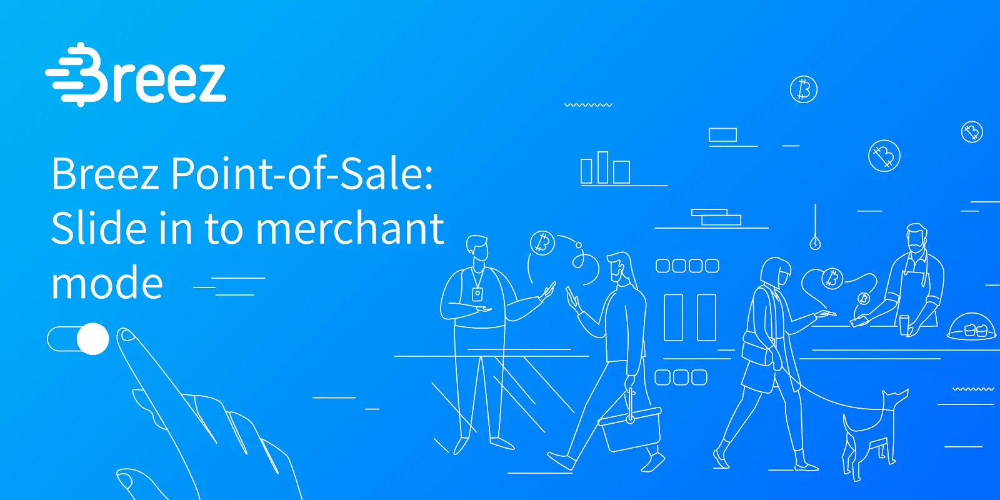
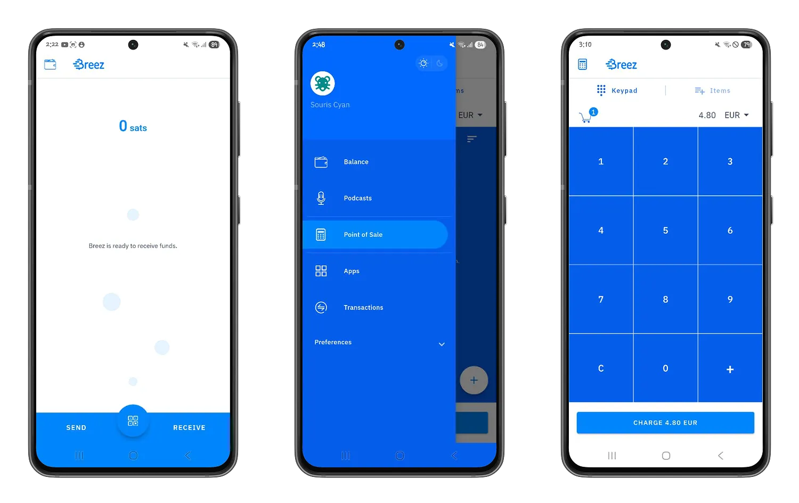
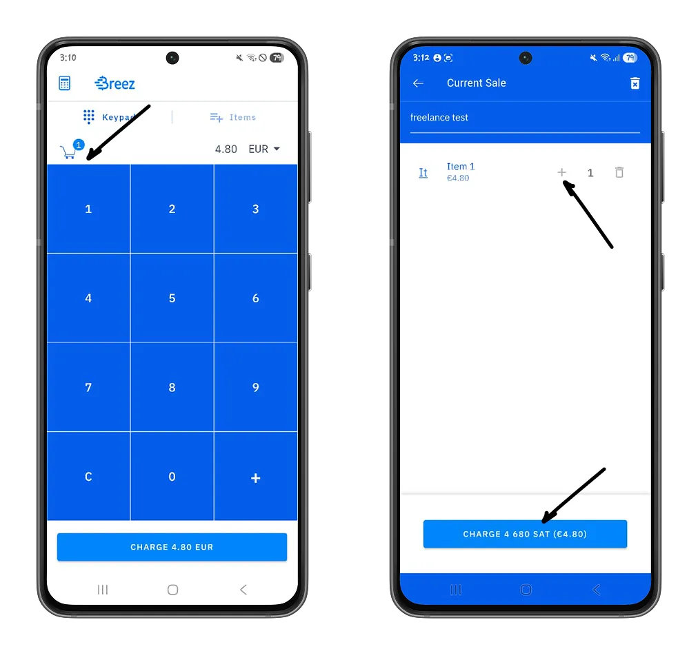
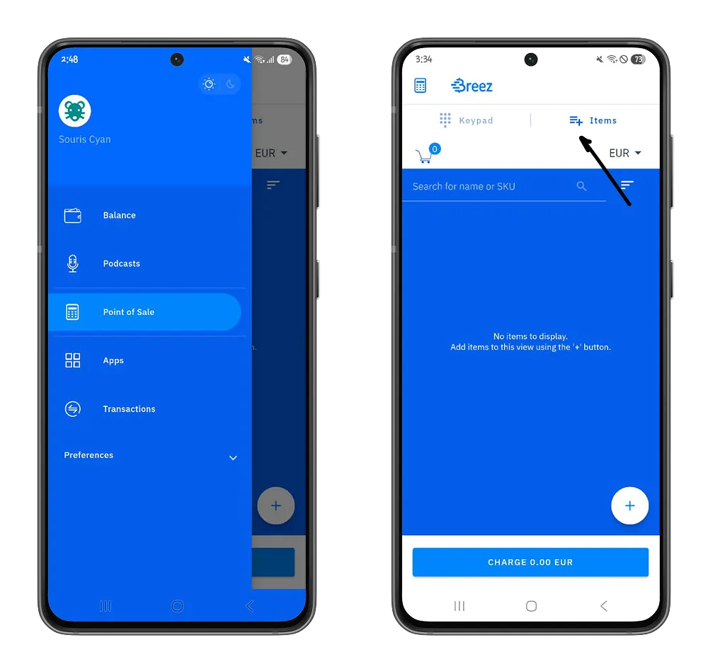
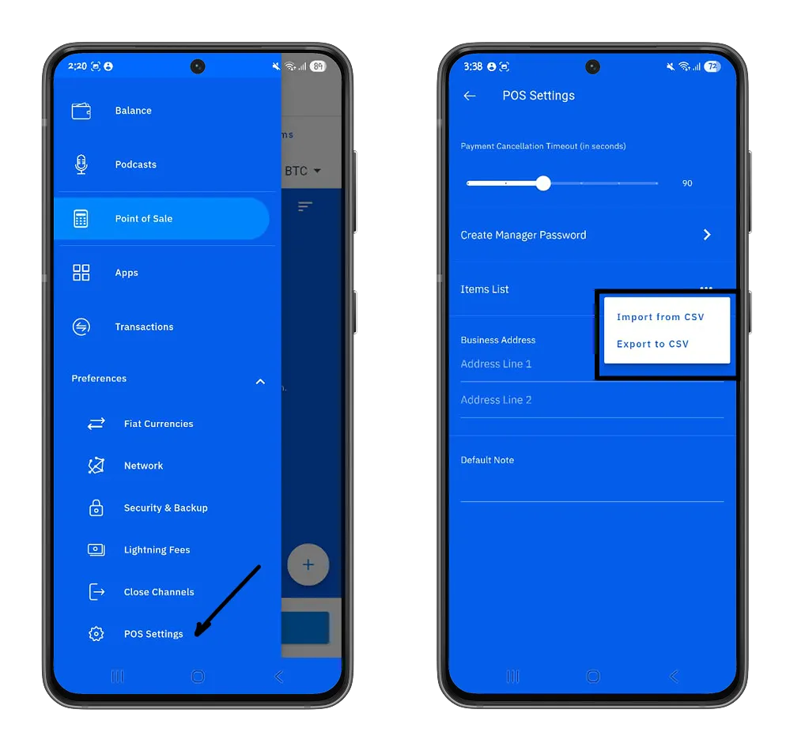
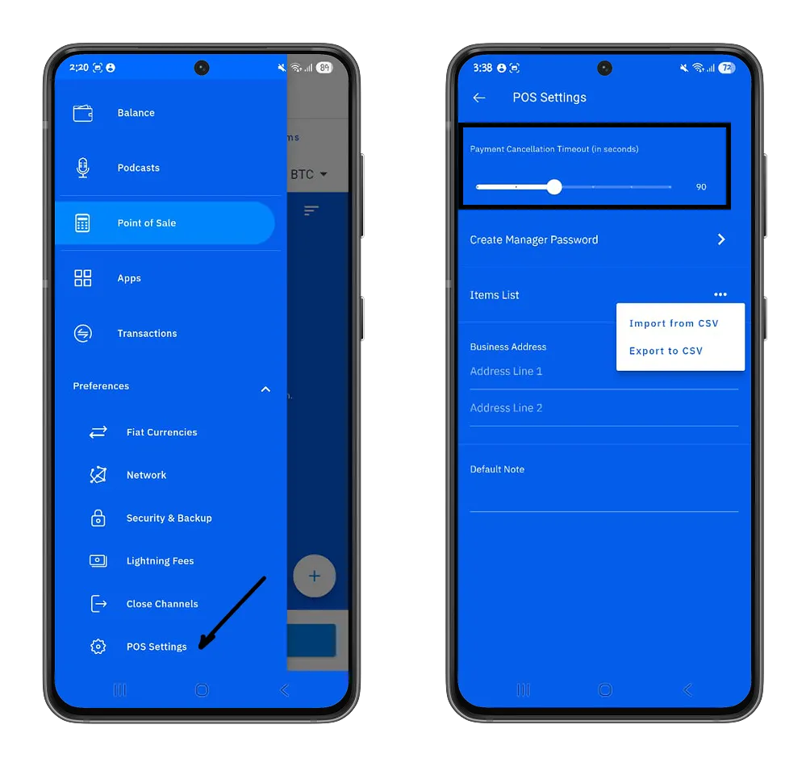
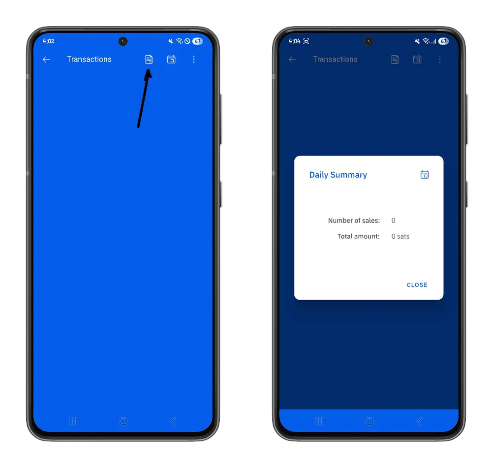

Depuis la pandémie COVID-19, les paiements numériques sans contact se sont généralisés, même dans les plus petits commerces. Durant cette période, de nombreux commerces ont découvert l'utilité pratique des solutions d'encaissement bitcoin, leur permettant de recevoir des paiements du monde entier. Toutefois, ces solutions sont parfois difficiles à utiliser ou ne sont pas adaptées pour les petits commerces. Dans ce tutoriel, nous partons à la découverte du point de vente de Breez qui se différencie par son approche simpliste et qui vous donne le plein contrôle de la gestion de vos bitcoins.

## Premiers pas avec Breez POS

Le Point de Vente Breez est un service « self-custodial » fourni par le portefeuille Breez. L'utilité de ce service est de permettre aux commerçants d'encaisser des paiements via Bitcoin tout en restant sur une interface simple, très similaire aux différents portefeuilles Lightning. Le point de vente Breez est disponible sur les plateformes de téléchargement Google Play Store (Android) et App Store (iOS).

⚠️ Il est important de noter que ces applications sont en cours de développement et qu'il peut y avoir quelques erreurs dans l'utilisation des fonctionnalités. Nous vous recommandons une utilisation modérée.

Au travers de cette application, Breez vous donne le contrôle sur les configurations réseaux et de frais tout en vous garantissant une souveraineté sur la gestion de vos bitcoins.  Vous pouvez parcourir les options que le portefeuille Breez en suivant notre tutoriel ci-dessous. Cette étape pourrait vous être bénéfique car elle vous renseigne sur l'écosystème du point de vente et les bonnes pratiques pour sécuriser au mieux les bitcoins associés à votre clé privée.

https://planb.network/tutorials/wallet/mobile/breez-46a6867b-c74b-45e7-869c-10a4e0263c06

https://planb.network/tutorials/wallet/backup/backup-mnemonic-22c0ddfa-fb9f-4e3a-96f9-46e2a7954270

Dans ce tutoriel nous nous focaliserons sur la section “Point de Vente” proposée afin de vous permettre de comprendre comment l'intégrer comme moyen d'encaissement dans vos commerces.

Le point de Vente est une partie intégrante du portefeuille Breez et se base principalement sur le Lightning Network pour encaisser des paiements. 

Dans le menu Point de Vente, vous avez directement une interface pour encaisser des paiements. Elle se subdivise en deux parties :

- **Le clavier** : Cette interface est pratique pour encaisser globalement un paiement lorsque vous connaissez le total des achats de votre client ou que vous n'avez pas besoin d'un catalogue de produits fixes dans votre activité (par exemple des prestations freelance).

Pour une première utilisation du point de vente Breez, vous devez encaisser un paiement de plus de 2500 satoshis (environ 3 euros au cours actuel). Ce montant payé uniquement lors de votre premier encaissement représente le coût de création d'un canal de paiement afin de pouvoir communiquer avec d'autres nœuds du Lightning Network, d'envoyer et de recevoir des satoshis.

- **Les articles** : Cette interface est idéale lorsque vous disposez d'un catalogue de produits avec des prix définis. Nous vous recommandons de pré-configurer vos produits puis de les utiliser pour générer des factures afin d'améliorer la traçabilité de vos encaissements.

Vous pouvez configurer manuellement chaque article à partir de cette interface en cliquant sur le bouton "**Plus**" puis en définissant le nom, le prix et un identifiant pour cet article.

Vous pouvez ensuite l'ajouter, définir sa quantité pour encaisser le paiement associé.

Lorsque votre catalogue est assez grand, cela pourrait devenir compliqué d'ajouter vos produits un à un. Pour cela, dans la section  **Préférences > Paramètres Point de Vente**, à partir du menu "Liste d'articles" vous pouvez importer et exporter automatiquement la liste de vos articles à partir de fichiers CSV.

Dans cette même section, vous pouvez définir la durée de validité de vos factures Lightning. A partir de ce moment, pour toutes vos factures, vos clients disposent de X secondes pour effectuer leur paiement, autrement vous devrez régénérer une autre facture Lightning.

En qualité de gérant, vous pouvez améliorer la sécurité de vos bitcoins en ajoutant un mot de passe qui sera requis pour tous les paiements sortants de votre portefeuille. Cette fonctionnalité est particulièrement utile lorsque vous n'êtes pas seul à gérer votre point de vente.

Dans le menu **Transactions**, vous retrouverez la liste des paiements que vous avez encaissés et sur une période bien définie en cliquant sur le bouton **Calendrier**.

Vous pouvez également avoir un résumé journalier de votre nombre de ventes et le total du montant encaissé en cliquant sur le bouton **Papier**.

Vous avez désormais une prise en main complète du point de vente proposé par Breez pour une intégration efficace dans votre commerce. Si ce tutoriel vous a été utile, nous vous recommandons notre tutoriel sur BE-BOP, une plateforme de e-commerce qui vous permet d'encaisser des paiements en bitcoins et de monétiser votre activité.

https://planb.network/tutorials/business/point-of-sale/be-bop-d8c40a3b-9090-48e7-9ba7-235d0c17e5fa