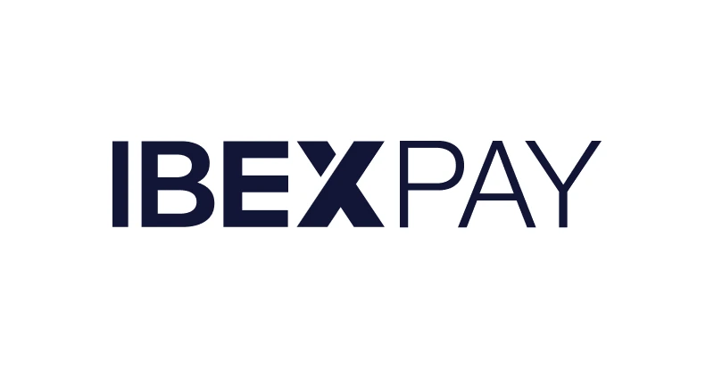
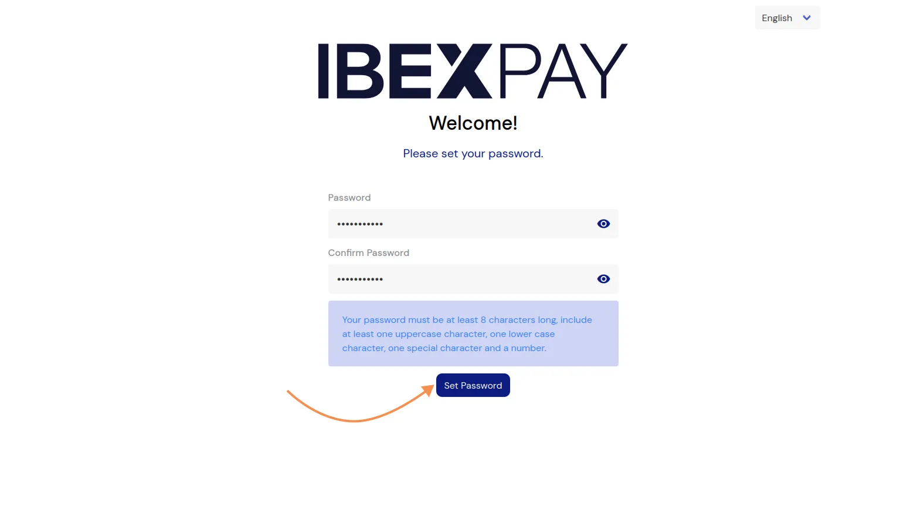
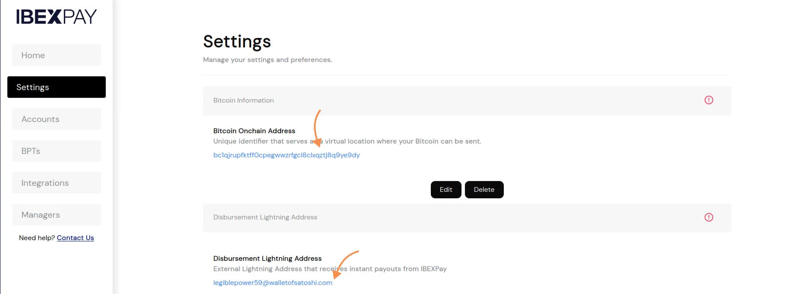
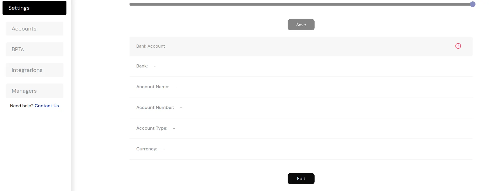
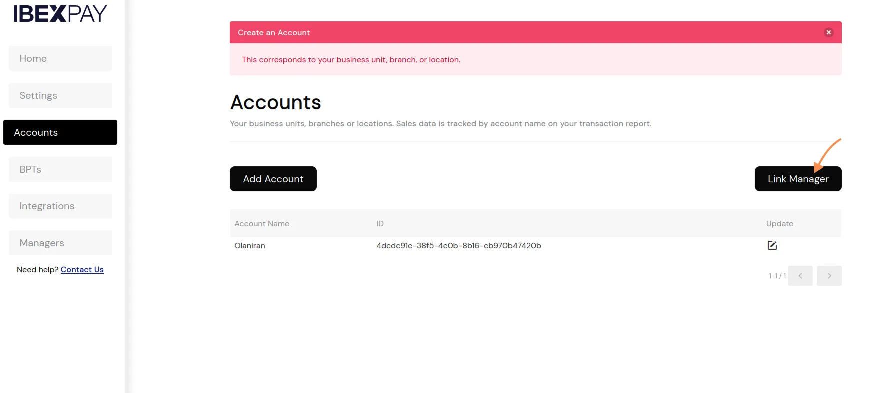
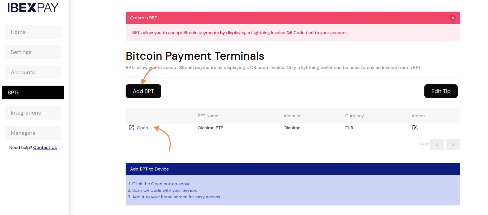
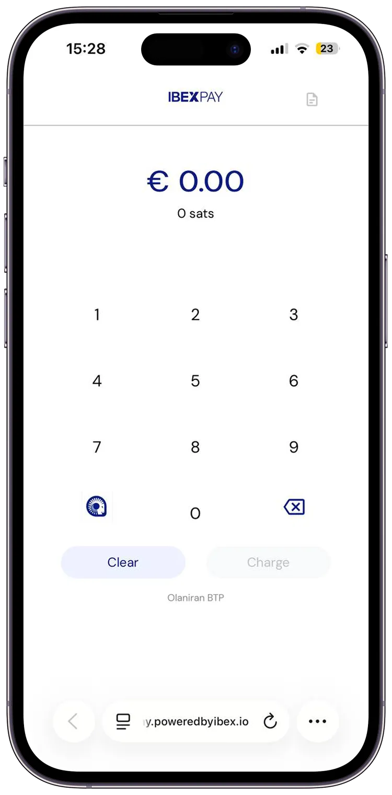

Rendre le Bitcoin utilisable par tout passe également par montrer son utilité et en quoi il s'intègre parfaitement dans votre activité.  Quoi de mieux que de montrer la puissance de Bitcoin par le fait qu'il vous permet d'encaisser des paiements tout au tour du globe.  Dans ce tutoriel, nous partons à la découverte de IbexPay, une plateforme simple qui vous permet d'intégrer bitcoin comme moyen de paiement aussi bien dans votre magasin physique que sur votre plateforme e-commerce.

## Débuter avec IbexPay

IbexPay est une plateforme custodial propulsé par la société IBEX, pionnière dans les services d'infrastructures Lightning. Pour obtenir un compte, rendez-vous sur la plateforme officielle de IbexPay puis cliquez sur le bouton "**Démarrer**".

Remplissez les différentes informations liés à votre commerce puis choisissez le pays dans lequel vous avez implanté votre commerce : cette étape est importante pour la devise qui sera utilisé pour encaisser les paiements.

IbexPay n'est malheureusement pas disponible pour la plupart des pays d'Afrique mais vous disposez d'une multitude d'options en Europe, En Asie et en Amérique.

Lorsque vous validez votre inscription, un mail vous sera envoyé afin que vous puissiez définir un mot de passe pour votre compte. Veuillez à définir un mot de passe fort qui protège les informations sensibles de votre commerce.

## Configurer son compte

IbexPay est une plateforme minimaliste et fluide qui vous permet de configurer et de commencer par encaisser des paiements via Bitcoin (onchain et Lightning) en un temps record. 

Après votre connexion, le tableau de bord vous présente une vue d'ensemble personnalisable sur les données des encaissements de votre commerce.

A partir de ce tableau de bord, vous pouvez :
- Consulter l'historique des transactions sur une période journalière, mensuelle, annuelle ou sur une période bien définie.
- Exporter l'historique sous un format excel (CSV).
- Consulter le montant total de satoshis qui vous sera envoyé sur votre adresse personnelle.
- Consulter l'équivalent en devise locale qui est disponible sur votre compte.

Dans le menu **Paramètres**, configurez toutes informations essentielles à votre commerce depuis vos adresses personnelles aux documents de votre entreprise.

Dans cette section, vous pouvez configurer votre adresse de réception bitcoin onchain et votre adresse Lightning. Ces deux informations sont utiles car toutes les 24 heures, IbexPay vous reversera directement le montant total de vos transactions des dernières 24 heures sur votre adresse bitcoin onchain configuré.

Ces informations seront vérifiés par l'équipe de IbexPay dans les plus brefs délais.

Une fois cette vérification terminée, vous avez également la possibilité de définir le pourcentage de bitcoin que vous souhaitez encaisser par transaction. Par exemple pour une transaction de 20 EUR payés via Lightning, si votre pourcentage Bitcoin est défini sur 30%, IbexPay dispatchera ce montant en 6 EURO équivalent en satoshis puis 14 EUR disponible dans votre balance FIAT.

Pour vous reverser votre solde en devise locale, IbexPay aura également besoin de vos informations bancaires. Configurez les informations de votre compte bancaire afin de percevoir vos versements.

Si vous êtes propriétaires de plusieurs boutiques, pas d'inquiétudes, vous pouvez créer un compte pour chacune de vos magasins et suivre distinctement les transactions depuis la même interface IbexPay.

Vous pouvez aussi assigner un manager différent pour chacune de vos comptes (boutiques). Pour cela, dans le menu **Managers**, créez un directeur de boutique en renseignant le nom du superviseur du magasin et son adresse e-mail. Ce superviseur recevra automatiquement un mail d'invitation afin de pouvoir administrer la boutique qui lui sera assignée.

Dans le menu **Comptes**, vous pouvez  relier un superviseur à une boutique en cliquant sur le bouton **Assigner un superviseur**.

Sélectionnez ensuite la boutique (compte) et le superviseur désigné puis cliquez sur le bouton relier.

## Les terminaux de paiement Bitcoin

Dans l'onglet **BTPs** (Terminaux de paiement Bitcoin), vous pouvez créer une page de point de vente utilisable à la caisse de votre boutique. Cliquez sur le bouton **Ajouter BTP**, puis renseignez :
- Le nom du terminal,
- la boutique associée à ce terminal et,
- la devise locale à utiliser

Une fois votre terminal de paiement créé, cliquez sur le lien pour vous rediriger sur l'interface d'encaissement.

Vous pouvez désormais commencer par créer des factures Lightning que vos clients et partenaires peuvent régler. En cliquant sur le logo IbexPay sur l'interface, vous avez un QR code que vous pouvez scanner sur votre smartphone afin d'avoir le point de vente IbexPay sur n'importe quel appareil.

## Intégration dans les commerces en ligne

IbexPay ne se limite pas qu'aux emplacements physiques de vos magasins.  Dans le menu **Intégrations**, retrouvez toutes les plateformes de e-commerce et solution de paiements associés à IbexPay. Vous pouvez notamment relier votre compte ibexPay via :
- API pour votre site e-commerce personnalisé,
- Woo-commerce
- Shopify
- Zaprite
- TiloPay
- et les pages de donations IbexPay.

