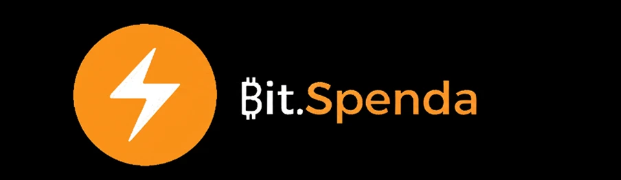
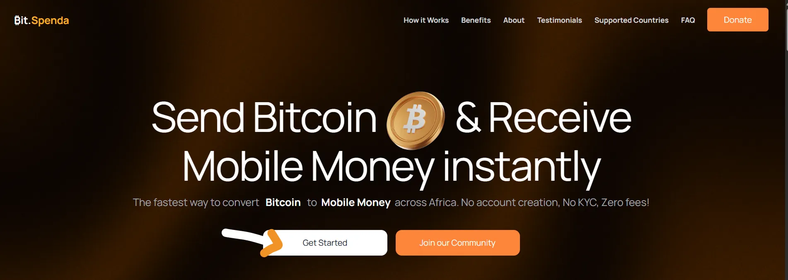

Les transferts transfrontaliers en Afrique représentent un véritable casse-tête le libre échange des biens et services. Face à ce problème, bitcoin est une innovation qui, si on sait bien le contextualiser, peut résoudre de nombreux problèmes que les sociétés africaines rencontre, de la souveraineté financière au libre échange de valeur. Aujourd'hui, nous partons à la découverte de BitSpenda, une initiative de Bitcoin Dua, une communauté ghanéenne grandissante.

## La genèse

BitSpenda est une plateforme d'échange de devise qui vous permet de faire une conversion entre Bitcoin et Mobile Money principalement au Ghana. Il vient pour régler un problème précis couramment constaté au Ghana mais également dans beaucoup de pays d'Afrique: les paiements transfrontaliers. Avec BitSpenda, vous êtes en mesure de faire des échanges rapides et anonymes que vous pouvez utiliser dans votre activité quotidienne. L'objectif principale de BitSpenda est de permettre des transactions fluides pour une adoption globale de Bitcoin au Ghana.

## Débuter avec BitSpenda

BitSpenda est une plateforme web sur laquelle vous pouvez faire des échanges entre Bitcoin et Mobile Money tout en préservant votre confidentialité. En effet, BitSpenda est un échangeur qui ne requiert aucun compte, aucune donnée personnelle, et aucune vérification d'identité : il n'y a que vous et votre transaction.

Faire une transaction avec BitSpenda est assez intuitif, requiert peu d'étapes. Sur le [site Web](https://bitspenda.app) officiel BitSpenda, cliquez sur le bouton "Démarrez", vous serez redirigez sur l'interface d'échange.

Actuellement, BitSpenda couvre trois pays : 
- Le Ghana avec les échanges de Bitcoin vers les numéros Mobile Money
- Le Nigéria via les virements bancaires
- Le Kenya au travers du Mobile Money M-pesa.

A partir de ces options, il est plus simple pour vous d'utiliser bitcoin via Lightning Network pour envoyer de l'argent dans ces pays et faire des achats quotidien sans avoir de la monnaie locale.

Dans ce tutoriel, nous prendrons comme exemple le Ghana et du Nigéria pour découvrir le processus de transactions simplifié avec BitSpenda.

### Le Mobile Money au Ghana

BitSpenda repose sur deux innovations financières et technologiques que sont le Bitcoin et le Mobile Money. Le premier permet de regagner sa souveraineté financière en faisant des transactions pseudonyme et l'intermédiaire d'une institution centrale et ceci, partout dans le monde et instantanément via la couche Lightning Network. Le second quant à lui, vient pour régler le problème de bancarisation très faible des sociétés africaines.

Sélectionnez le pays dans lequel vous êtes, ou le pays dans lequel vous souhaitez envoyer de l'argent.

Entrez ensuite le numéro Mobile Money du destinataire de votre échange.

Vérifiez puis confirmez le numéro et le montant de votre échange puis payez la facture Lightning associée à votre échange.

