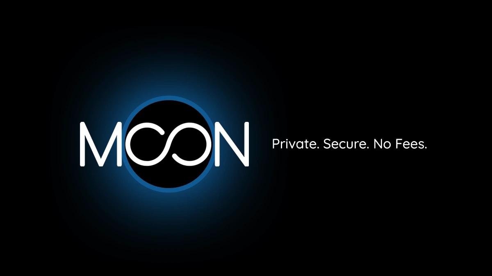

Moon est un service de cartes virtuelles qui innove de par son originalité. En effet, le projet Moon vise à vous permettre d'utiliser du bitcoin partout où des paiements par carte bancaire sont acceptés. Cette approche révèle l'intention particulière de Moon : rendre l'utilisation du bitcoin grand public au travers de paiements quotidiens à travers le monde. Dans ce tutoriel, nous vous emmenons à la découverte de ce service en vous présentant le projet et ses différentes fonctionnalités.

## Obtenir sa carte virtuelle

Les paiements en ligne représentent une révolution apportée par l'évolution d'Internet et amplifient les échanges entre tous les pays, indépendamment de leur position géographique. Dans ce contexte, deux géants se distinguent particulièrement de par leur couverture internationale : Visa et Mastercard. L'objectif de ces entreprises est de fournir des cartes de paiement, associées ou non à des comptes bancaires, pour permettre aux utilisateurs de payer et d'effectuer des achats.

Moon vient ajouter une innovation en plus : l'utilisation de bitcoin et des cryptomonnaies. Ce service permet d'exploiter les infrastructures de Visa afin que vous obteniez des cartes virtuelles rechargeables via bitcoin, sans pour autant détenir un compte bancaire et encore moins fournir des informations d'identification dans le but de vérifier votre identité. Avec Moon, vous disposez donc d'un service qui fait le pont entre vos bitcoins et les paiements par carte bancaire sur la plupart des sites qui acceptent les paiements bancaires. Vous pouvez ainsi utiliser vos bitcoins pour :

- Payer des cours sur une plateforme d'éducation
- Faire des achats en magasin
- Payer vos différents abonnements
- Commander en ligne

**IMPORTANT** : Nous soulignons que ce service peut ne pas fonctionner sur certaines plateformes acceptant les paiements bancaires (Visa).

### Avoir sa première carte

Rendez-vous sur la [plateforme officielle](https://paywithmoon.com) de Moon, puis cliquez sur le bouton **"S'inscrire"**, passez la vérification humaine (CAPTCHA), puis inscrivez-vous en renseignant votre email et votre mot de passe.

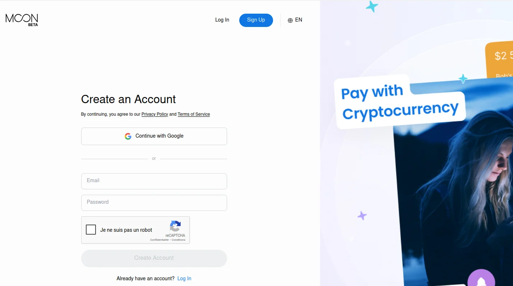

Une fois votre compte créé, sur le **"Tableau de bord"**, vous pouvez remarquer les sections suivantes:

- La limite de dépense mensuelle accordée par Visa.
- Le solde de crédit Moon.
- L'historique des transactions.
- L'ajout de nouvelles cartes.

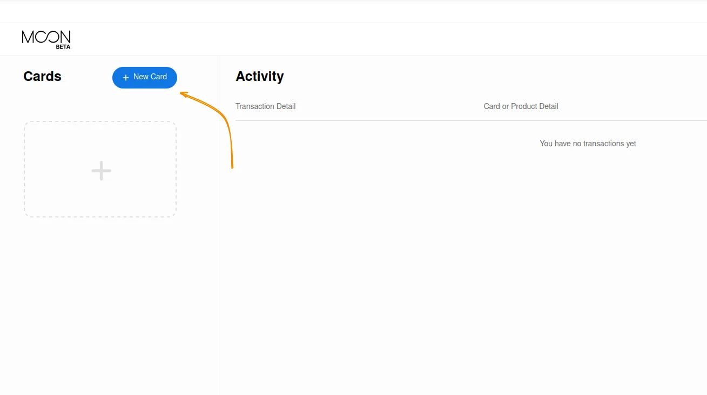

Pour obtenir une nouvelle carte, cliquez sur le bouton **"Nouvelle carte"**. Moon vous offre plusieurs types de cartes :

- **La carte Visa Moon 1X**, une carte virtuelle personnelle utilisable uniquement aux États-Unis et non rechargeable. Cette carte vous permet de dépenser jusqu'à 1000 dollars, sans aucun frais de transaction.
- **La carte Visa Moon X**, une carte virtuelle personnelle utilisable dans plus de 147 pays avec une limite de 4000 dollars de dépenses. Cette carte est valide pendant 3 ans et possède des frais de transaction à hauteur de 1% (avec un minimum de 1 USD de frais par transaction).

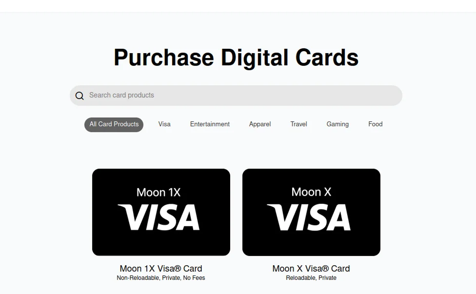

- **Des cartes cadeaux** qui vous permettent de payer des produits ou des abonnements spécifiques comme Google Play Store, PlayStation Store.

Dans ce tutoriel, nous utiliserons une carte Visa Moon X. Toutefois, le processus d'acquisition reste le même pour toutes les cartes virtuelles et cartes cadeaux de Moon.

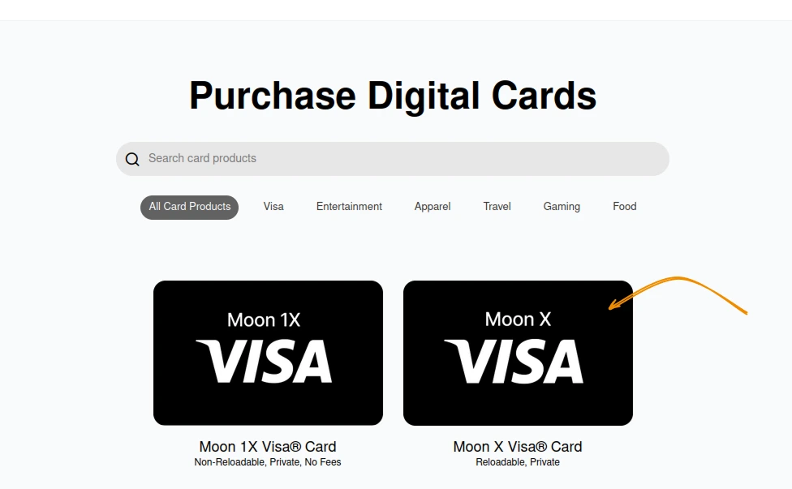

Cliquez sur le bouton **Acheter maintenant**, puis acceptez les conditions d'utilisation et d'éligibilité des cartes Visa.

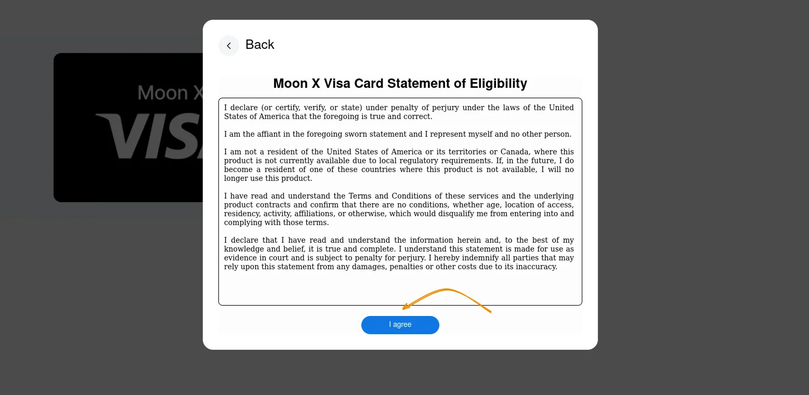

Félicitations, vous venez d'acquérir votre première carte virtuelle.

Vous pouvez recharger cette carte virtuelle en utilisant des crédits Moon.

Comme vous avez pu le remarquer, l'acquisition de cette carte ne requiert aucune information sensible sur votre identité. En utilisant Moon, vous protégez également vos données personnelles en garantissant un niveau de contrôle sur le partage et l'utilisation de ces données.

### Recharger sa carte

La recharge de la carte Moon s'effectue via les crédits Moon que vous pouvez payer par :

- bitcoin
- USDT - TRC20 (sur le réseau Tron)
- USDC sur Polygon

Après l'acquisition de votre carte virtuelle Moon, vous pouvez cliquer sur le bouton **"Acheter des crédits Moon"** ou cliquer sur le solde **"Crédits Moon"** affiché sur votre tableau de bord pour recharger votre compte Moon.

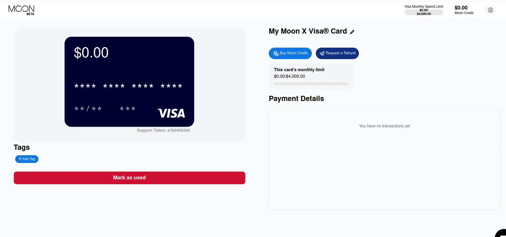

Un montant minimal de 5 USD est défini par recharge, sans limite supérieure de rechargement sur votre carte Moon X. Insérez le montant que vous souhaitez recharger, puis payez la facture Lightning générée.

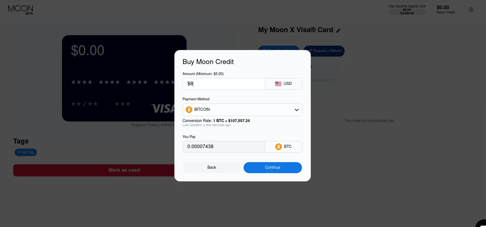

Votre carte sera automatiquement créditée lorsque le paiement de la facture Lightning est approuvé.

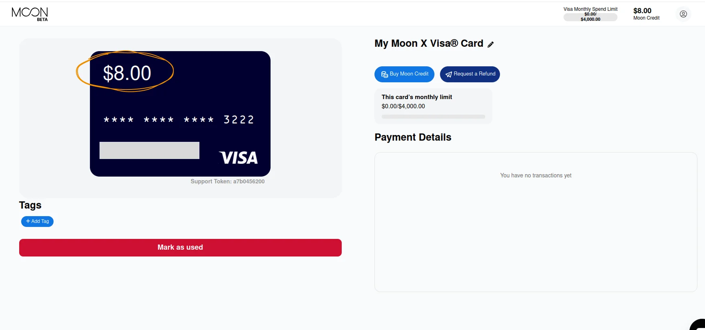

À partir de cette carte, vous pouvez payer des services et des produits en ligne comme avec une carte Visa normale. Par exemple, vous pouvez prendre le tout dernier cours sur le minage du bitcoin disponible sur notre plateforme.

https://planb.network/courses/the-world-of-bitcoin-mining-7750d9da-417a-4377-8e35-85c377168477

Vous pouvez retrouver l'intégralité de vos transactions sur le tableau de bord ou sur la page de détails de votre carte.

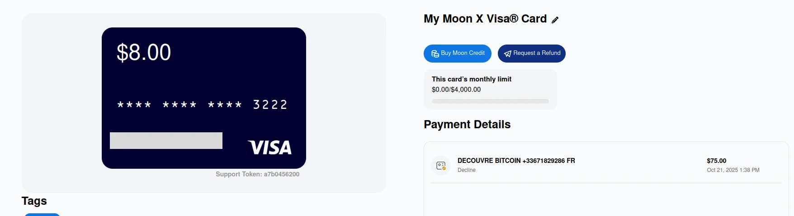

### Organiser ses cartes

Moon est un service qui vous permet d'avoir plusieurs cartes sur un même compte. Vous pouvez ainsi avoir une carte Visa Moon et des cartes cadeaux avec des soldes différents, ou payer des cartes cadeaux à partir de votre carte Visa Moon X.

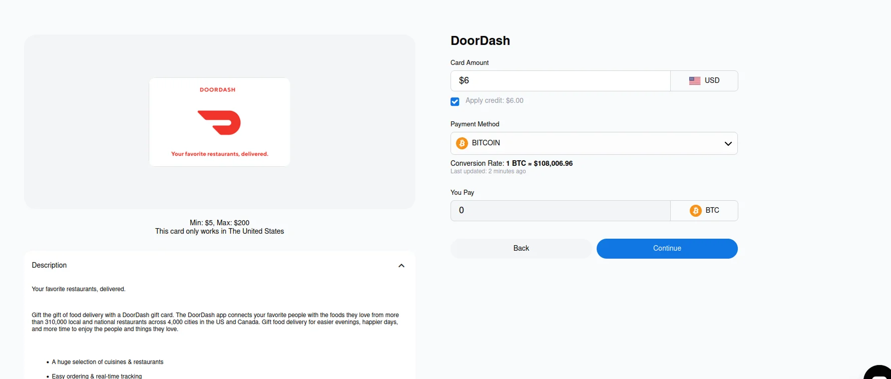

Lorsque vous cochez la case **Appliquer le crédit**, Moon prélève directement le montant de la recharge de votre carte cadeau depuis votre carte Visa.

Vous disposez désormais d'un processeur de cartes virtuelles basé sur l'infrastructure de Visa, qui respecte votre confidentialité et protège vos données.
Nous vous invitons à découvrir notre tutoriel sur Bitrefill afin d'utiliser bitcoin pour payer des cartes cadeaux de vos services favoris.

https://planb.network/tutorials/exchange/centralized/bitrefill-8c588412-1bfc-465b-9bca-e647a647fbc1