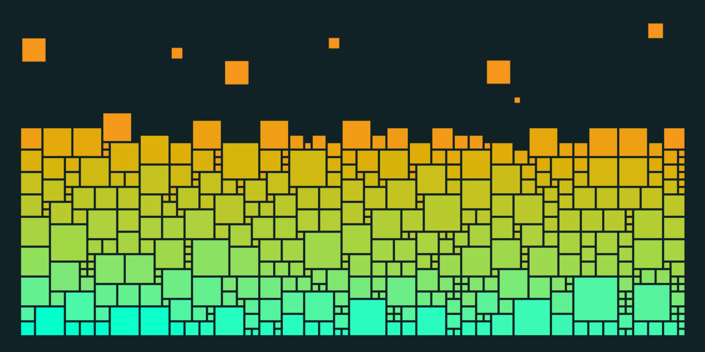
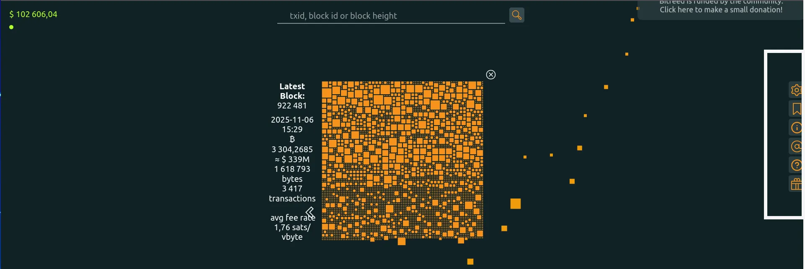
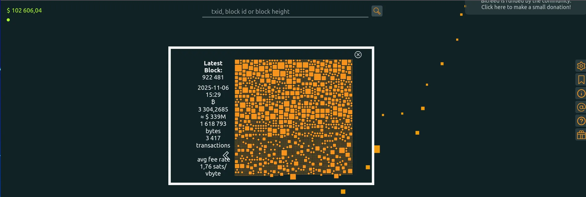
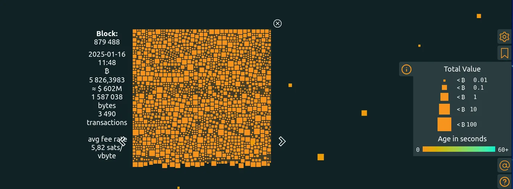
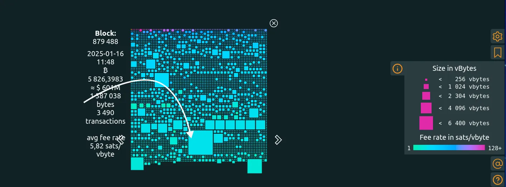
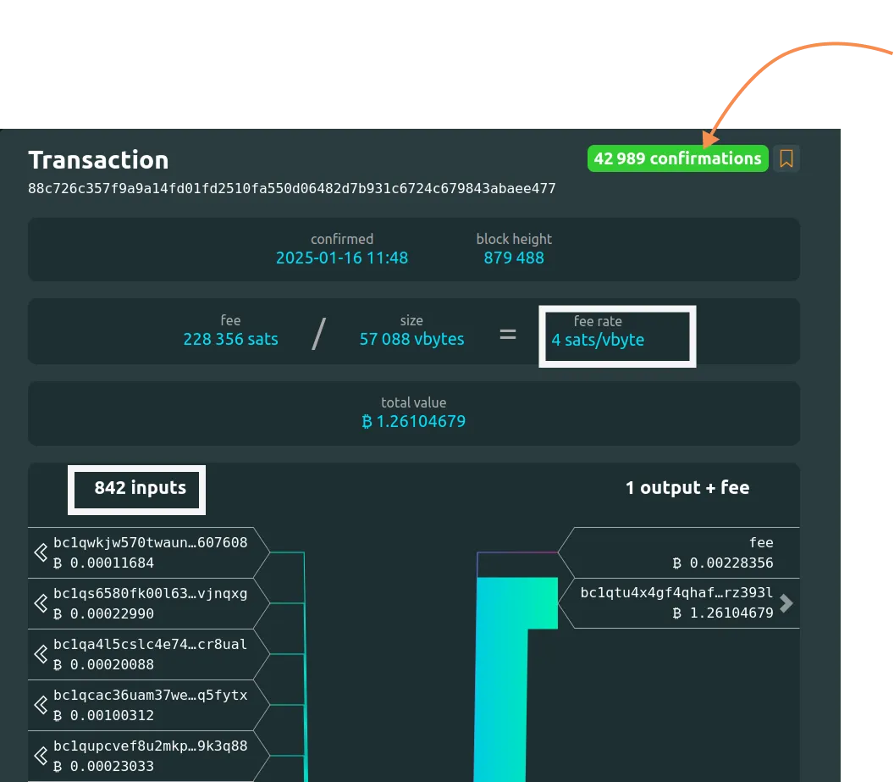
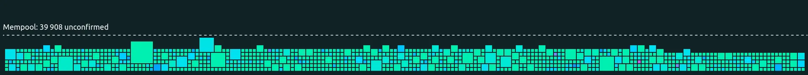
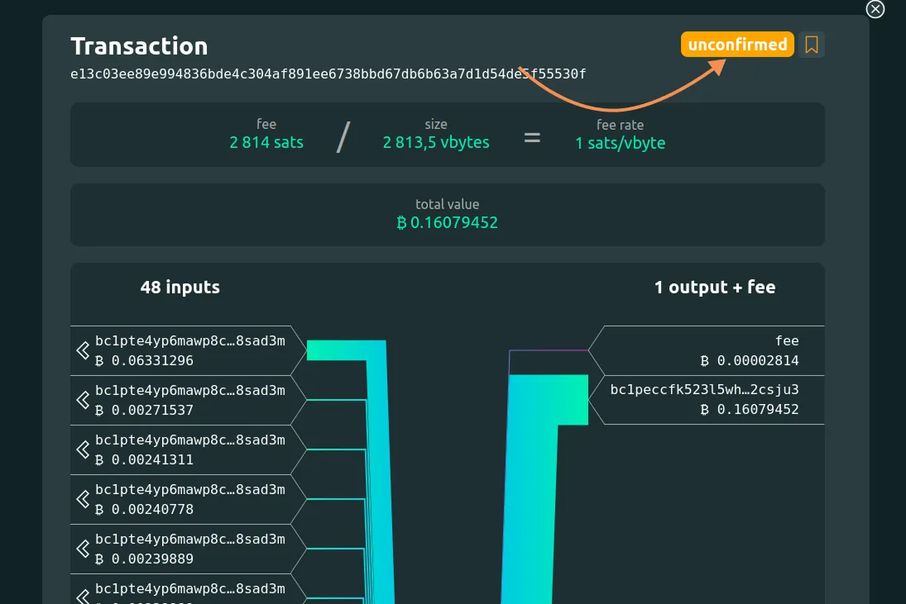

  

Bitfeed est une plateforme de visualisation de la couche principale (onchain)  du protocole Bitcoin. Elle a été initiée par un des contributeurs du projet Mempool.space et se démarque principalement par son aspect minimaliste et son utilisation simple.

https://planb.academy/tutorials/privacy/analysis/mempool-space-f3e468a1-92f1-43ce-b2e4-c3298fa0e02f

Dans ce tutoriel nous partons à la découverte de cet outil qui vous permet d'explorer l'ensemble des transactions et blocs du réseau.

## Débuter avec Bitfeed

Bitfeed est une plateforme qui focalise sur trois principaux points :

- **La consultations de la chaîne de blocs**,
- **La recherche de transactions**,
- **La visualisation du mempool.

### La consultation de la chaîne de blocs

Sur la page d'accueil de Bitfeed, vous retrouverez essentiellement :

- La barre de recherche : Cette section est le point d'entrée des interrogations sur la chaîne de blocs. Vous pouvez y rechercher un bloc spécifique via le numéro ou le hash dudit bloc. Vous avez également la possibilité de rechercher des transactions spécifiques et des adresses bitcoins afin de vérifier certaines informations sur les transactions sur le réseau.

Dans l'angle supérieur gauche, vous pouvez visualiser le prix courant du bitcoin estimé en dollars US (USD) et juste en dessous un point colorié généralement en vert qui représente l'état du réseau fonctionnant sans congestion.

Sur la barre latérale de droite se trouve le menu de la plateforme. A partir de ce menu vous pouvez personnaliser l'interface de la plateforme selon votre convenance, ajouter ou retirer des éléments et personnaliser les filtres de visualisation. Par exemple, visualiser la taille de chaque bloc par valeur ou par espace virtuel par octet (vBytes).

Au centre de la page, se trouve le dernier bloc miné avec la visualisation de l'ensemble des transactions incluses dans ce bloc. Cette section nous renseigne sur l'horodatage, la totalité des bitcoins impliqués dans ce bloc, la taille en octet du bloc, le nombre de transactions et la moyenne du ratio de frais de transaction par octet virtuel dans le bloc.

Vous pouvez remonter l'historique de la chaîne en cherchant un bloc spécifique dans la barre de recherche et vous pourrez la visualiser selon vos critères.
Prenons un exemple, nous souhaitons visualiser les transactions du bloc `879488`.

La première transaction de ce bloc représente la transaction **coinbase** qui permet au mineur de ce bloc de gagner la récompense de minage qui est dépensable qu'après 100 blocs minés ainsi que le total des frais des transactions incluses dans le bloc. Cette transaction est celle qui permet l'émission de nouveaux bitcoins sur le réseau.

https://planb.academy/courses/obtenir-ses-premiers-bitcoins-f3e3843d-1a1d-450c-96d6-d7232158b81f

Par défaut les transactions d'un bloc sont représentés selon deux critères:
-  la taille qui peut varier entre la valeur et le poids (vBytes) .
- La couleur qui peut varier entre l'âge et le ratio des frais de transactions par octet virtuel.

Nous pouvons donc conclure que l'ensemble des transactions incluses dans le bloc ont le même nombre de confirmations dans la chaîne de blocs et que les cubes les plus volumineux sont celles qui contiennent le plus de bitcoins.
Cette interprétation est d'autant plus confirmée par l'option **"Infos"** du menu qui nous renseigne sur la traduction de la couleur et de la taille des transactions du bloc.

Vous pouvez également visualiser les transactions d'un bloc en fonction des octets virtuels et du ratio de frais. Cette visualisation peut différer de la précédente car la valeur de bitcoin incluse dans une transaction ne définit pas la taille de cette dernière.

### La consultation des transactions

Vous pouvez rechercher une transaction en utilisant son identifiant via la barre de recherche. Vous pouvez également cliquer sur un cube pour avoir les informations liées à cette transaction.
Dans notre cas, prenons la transaction occupant le plus grand espace dans le bloc `879488`.

Vous constaterez que cette transaction possède `42 989` qui représente la différence entre le dernier bloc en cours de minage et notre bloc choisi. Ces confirmations participent au renforcement de la sécurité du réseau Bitcoin car pour modifier cette transaction de façon malicieuse, les attaquants doivent posséder la puissance de calcul équivalente pour réécrire l'entièreté de la chaîne de blocs principale.

La taille de cette transaction est de `57088 vBytes` principalement dû au nombre d'UTXOs impliqués dans la construction de la transaction (842 entrées).
Étonnement, nous pouvons remarquer que le ratio de frais de transaction est relativement bas (4 sats/vByte) compte tenu de la moyenne générale du ratio de frais de transaction présentée par le bloc (5,82 sats/vByte).

La transaction occupant le plus d'espace n'est donc pas forcément la transaction avec le ratio de frais de transaction le plus élevé.

En suivant la graduation du menu **Infos**, la transaction avec le ratio de frais de transaction le plus élevé est la plus violacée. Il s'agit donc de la transaction [bfd81fdde02055ced809419b4fae094576bc4384a1d0444c723b3ba052e99a35](https://bitfeed.live/tx/bfd81fdde02055ced809419b4fae094576bc4384a1d0444c723b3ba052e99a35) ayant un ratio de frais de transaction de `147,49 sats/vBytes`

https://planb.academy/courses/la-confidentialite-sur-bitcoin-65c138b0-4161-4958-bbe3-c12916bc959c

### Visualisation du Mempool

Le mempool est l'emplacement virtuel dans lequel les transactions Bitcoin en attente d'inclusion dans un bloc sont regroupées. Bitfeed permet la consultation du [mempool](https://planb.academy/resources/glossary/mempool) de plusieurs mineurs bitcoins offrant un large éventail de suivi de transactions.

Dans cette section, vous pouvez suivre l'ensemble des transactions valides et encore non confirmées sur la chaîne principale du réseau Bitcoin.

Vous avez désormais un guide d'utilisation de la plateforme Bitfeed pour traquer des blocs et des transactions afin de visualiser les informations disponibles sur la chaîne principale du réseau Bitcoin tout en profitant d'une interface minimaliste et simple à aborder. Si vous avez aimé ce tutoriel, nous vous recommandons de passer à l'étape supérieur : découvrir le Lightning Network via le projet Amboss.

https://planb.academy/tutorials/node/lightning-network/amboss-37044cad-0f85-41eb-af18-491384af1017