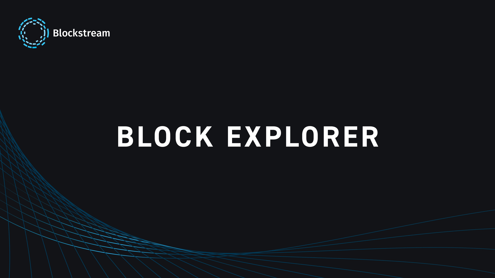

L'explorateur Blockstream est un projet qui facilite l'exploration des transactions et l'état global du protocole Bitcoin, ainsi que de la chaîne parallèle Liquid développée par la société Blockstream.

Initié en 2014 par Blockstream, fondée par le Dr Adam Back, l'explorateur [blockstream.info](https://blockstream.info) vise à fournir une infrastructure solide pour Bitcoin, garantissant l'interopérabilité et le suivi des transactions entre les couches (on-chain et Liquid), tout en renforçant la sécurité et la confidentialité des utilisateurs.

Dans ce tutoriel, nous présentons ce qui le distingue, ses services, et comment il offre un suivi fluide des opérations et de l'état des couches on-chain et Liquid de Bitcoin.

## Débuter avec l'explorateur Blockstream

### Naviguer sur la chaîne principale

Lorsque vous vous rendez sur l'explorateur Blockstream.info, sur le **Tableau de bord**, la chaîne principale du protocole Bitcoin est sélectionnée par défaut. À partir de cette interface, vous avez une vue d'ensemble de : 

- La taille de la chaîne principale : Les récents blocs minés.

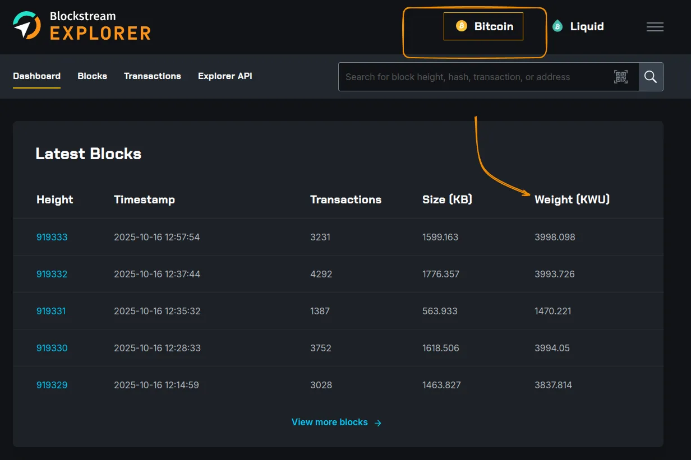

Cette section renseigne sur les récents blocs minés, l'horodatage, le nombre de transactions incluses dans chaque bloc, la taille en kilo-octets (kB) et la mesure de chaque bloc en unités de poids (**WU**). Cette dernière mesure est intéressante, car elle permet d'évaluer l'optimisation du bloc, sachant que chaque bloc de la chaîne principale est limité à `4_000_000 WU`, soit `4_000 kWU`.

- Les récentes transactions effectuées.

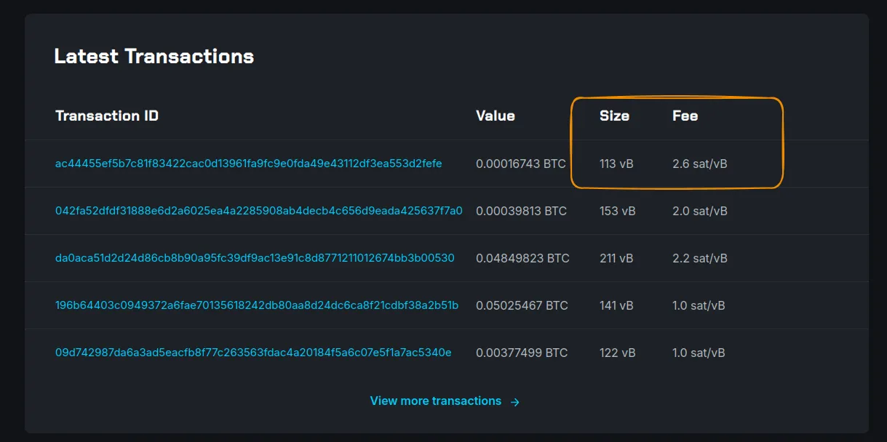

La section des transactions renseigne sur l'identifiant unique de la transaction, la valeur de bitcoin impliquée, la taille en virtual bytes (vB) — qui représente la somme de toutes les données (entrées et sorties) —, ainsi que le taux de frais associé. Par exemple, une transaction d'une taille de `153 vB` avec un taux de `2 sat/vB` entraîne des frais de `306 satoshis`.

### Une exploration fluide

À partir du menu **Blocs**, vous pouvez remonter l'historique de toute la chaîne principale en partant du dernier bloc miné.

En cliquant sur un bloc précis, vous pouvez avoir plus de détails concernant les informations et transactions inclus dans ce dernier. Par exemple, pour le bloc 919330 : vous avez le hash du bloc. Vous avez également la possibilité de naviguer vers le bloc précédent car chaque bloc miné  (en dehors du bloc Genesis) est lié au bloc précédent en gardant le hash de son prédécesseur. 

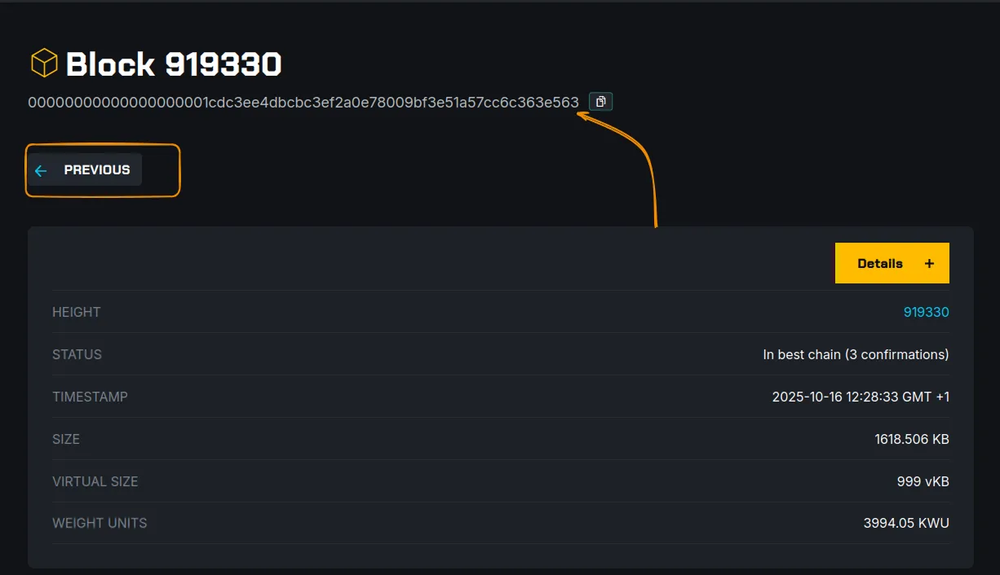

En cliquant sur le bouton **Détails**, vous pouvez avoir plus de renseignements sur ce bloc comme le statut qui confirme l'ajout de ce bloc à chaîne principale retenue et propagée. Vous avez aussi la difficulté à laquelle ce bloc est miné : cette difficulté représente la puissance de calcul nécessaire à la résolution du problème cryptographique du minage et est ajustée toute les 2016 blocs (environ 2 semaines).

En dessous de cette section de détails, nous retrouvons l'ensemble des transactions inclues dans ce bloc. 

La toute première transaction représente la transaction **coinbase**, qui se charge de donner la récompense du minage et la totalité des frais des transactions de ce bloc à l'adresse du mineur. Ces bitcoins ne sont dépensables par le mineur qu'après le minage de 100 autres blocs à la suite du bloc miné : autrement dit, pour dépenser ces bitcoins, il faudra attendre le minage du bloc 919430. Cette transaction est la seule qui n'a aucune entrée (n'utilise pas des bitcoins issus d'une transaction précédente).

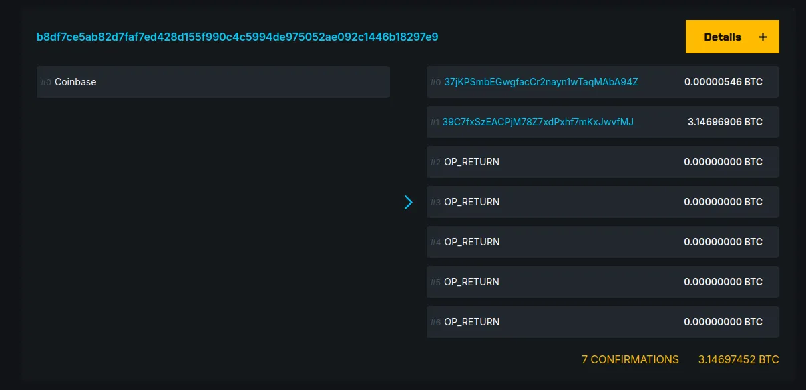

Toutes les autres transactions se constituent en deux sections : les entrées et les sorties. 

Pour que des bitcoins soient utilisés comme entrées dans une nouvelle transaction, l'initiateur de la transaction devra prouver sa possession en apportant une signature qui correspond à un script bien précis. Chaque morceau de bitcoins (UTXO) contient un script requérant une signature bien précise que seule la clé privée du détenteur est capable d'apporter. Ces scripts sont les SCRIPTSIG (ASM) écrits en Bitcoin Script et peuvent être de différents types. Dans cet exemple, nous pouvons remarquer que les UTXO utilisés étaient de type P2SH vers une sortie de type P2WPKH. 

Vous pouvez retracer l'historique d'un UTXO bien spécifique en utilisant des heuristiques. Nous vous invitons à découvrir les différentes heuristiques Bitcoin et les moyens de renforcer la confidentialité de vos transactions sur le protocole Bitcoin.

https://planb.network/courses/la-confidentialite-sur-bitcoin-65c138b0-4161-4958-bbe3-c12916bc959c

Prenons l'exemple de la dépense de la sortie de cette transaction. En cliquant sur l'identifiant de la transaction, nous sommes redirigés vers la section **Transactions** sur la page de détails de cette transaction.

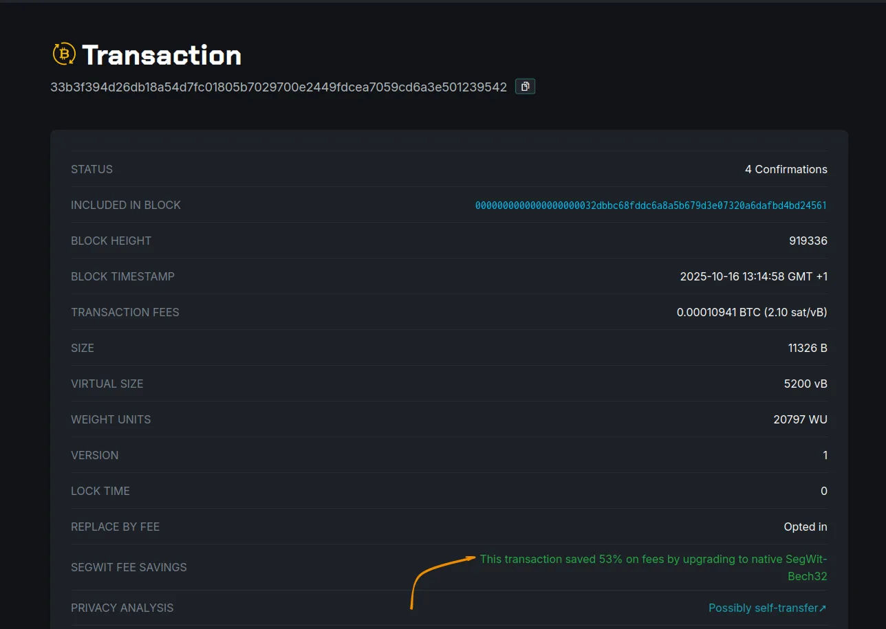

À partir de cette page, vous pouvez connaître le bloc dans lequel la transaction a été incluse. En fonction du type d'adresse utilisé, la transaction peut optimiser ses données (virtual bytes) et donc payer moins de frais de transaction. Cette transaction, par exemple, a pu s’alléger de 53 % des frais en utilisant un format d'adresse SegWit Bech32 natif commençant par `bc1`.

## La couche Liquid

Le Liquid Network est une chaîne parallèle et une solution open source de niveau 2 pour le protocole Bitcoin. Il permet notamment l'interopérabilité avec le Lightning Network pour des transactions Bitcoin plus rapides et plus confidentielles.

Sur l'explorateur Blockstream.info, cliquez sur le bouton **Liquid** pour passer sur le réseau Liquid.

Comme vous l'aurez constaté, la chaîne du Liquid Network est différente de celle du réseau principal on-chain, avec très peu de transactions par bloc et des frais de transaction quasi nuls. En cliquant sur l'une des transactions que nous désirons suivre, nous constatons que les montants des morceaux de bitcoin sont remplacés par **Confidentiel**.
Sur ce réseau, les transactions peuvent être confidentielles, donc nous ne pouvons pas consulter les montants de chaque UTXO, qu'ils soient en entrées comme en sorties de la transaction.

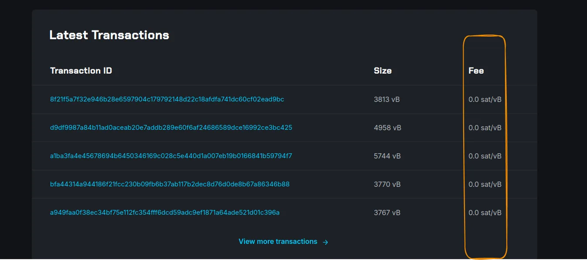

Toutefois, nous remarquons que les principes et les mécanismes présents sur la couche principale du protocole Bitcoin sont les mêmes : scripts de verrouillage des bitcoins et traçabilité des UTXO.

Le Liquid Network permet aussi d'avoir des actifs numériques non-dépositaires qui peuvent être utilisés par des organisations. Dans le menu **Assets**, vous retrouverez la liste des actifs enregistrés, le total de ces actifs et le domaine auquel ils sont reliés.

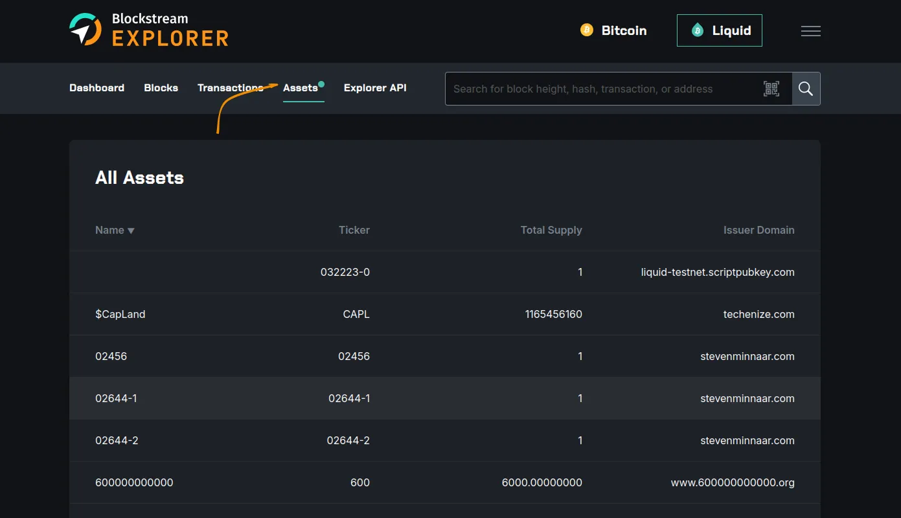

Pour chaque actif, vous pouvez retracer l'historique des transactions d'émission et des transactions de brûlage (suppression du total en circulation).

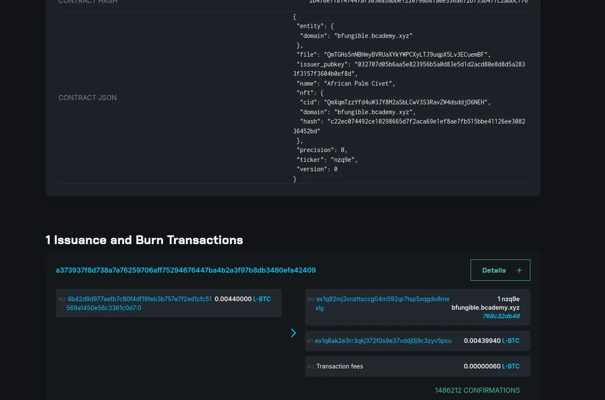

## Plus d'options

L'explorateur Blockstream.info comprend aussi des visualisations et des suivis de transactions sur Testnet, aussi bien sur Bitcoin on-chain que sur Liquid Network.

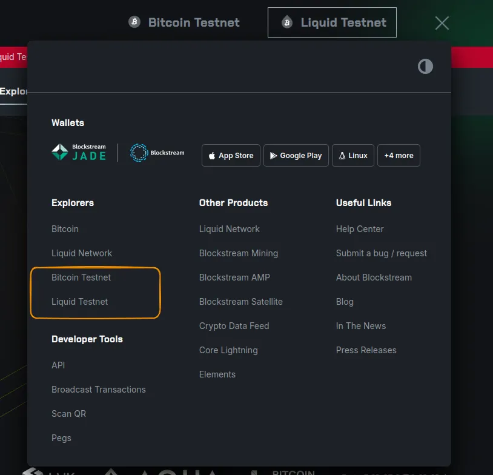

En allant sur le réseau Testnet, vous n'utilisez pas des bitcoins réels, mais vous disposez de toutes les fonctionnalités présentées un peu plus haut.

Ce réseau se caractérise par une longueur de chaîne différente, auquel vous pourrez vous connecter et tester les fonctionnements des mécanismes Bitcoin et Liquid.

- La section API est dédiée à toute personne qui souhaiterait intégrer certaines fonctionnalités de l'explorateur dans sa propre application. Au travers de cette API vous pourrez interroger la chaîne principale des différentes couches (on-chain et Liquid), traquer des transactions et connaître la moyenne des frais pour les transactions d'un bloc par exemple.

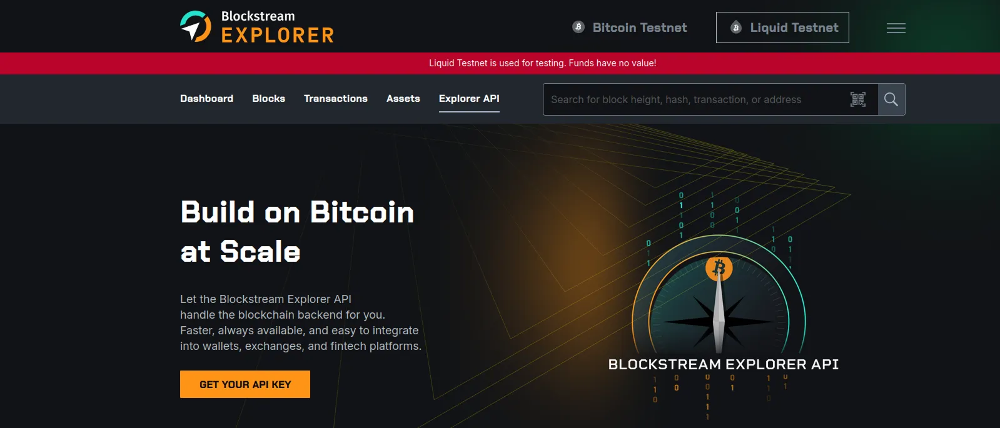

Vous êtes désormais prêts à exploiter tout le potentiel de Blockstream.info pour interroger les chaînes de bloc sur les couches on-chain et Liquid. Nous espérons que ce tutoriel vous a été instructif et nous vous recommandons notre tutoriel sur un autre explorateur Bitcoin qui met beaucoup plus l'accent sur la visualisation des transactions et de l'état du réseau au travers d'une expérience utilisateur intéressante.

https://planb.network/tutorials/privacy/analysis/mempool-space-f3e468a1-92f1-43ce-b2e4-c3298fa0e02f