Le protocole Bitcoin est un réseau pseudonyme et ouvert à la consultation. Les membres (nœuds) du réseau peuvent avoir, sans restrictions, à l'ensemble des données publiés sur Bitcoin. Toutes fois, dans les premières années de Bitcoin, le protocole n'était pas accessible à tous comme nous pouvions le voir de nos jours.
Aux premières heures de Bitcoin, il fallait faire tourner un nœud Bitcoin afin d'accéder aux outils appropriés (bitcoin-cli) pour interroger le réseau à partir des lignes de commandes.

Des projets se sont donc initiés, pour élargir la communauté autour de Bitcoin la rendant plus accessible à toute personne n'ayant pas de nœud Bitcoin et ou n'ayant pas des compétences techniques requises.

Dans ce tutoriel, nous découvrirons le projet **Mempool.space**, ses fonctionnalités et l'impact qu'il a eu dans l'écosystème Bitcoin.

## Qu'est-ce que Mempool.space ?
Mempool Space est un explorateur open source qui fournit des informations utiles sur les transactions, les frais de transactions, les blocs et les mineurs sur les différents réseaux du protocole Bitcoin. Lancé en 2020, il apporte une signifiante amélioration de l'expérience utilisateur au travers de graphiques représentatifs, des animations fluides et des interfaces épurées.

Pour comprendre le projet , un espace Mempool (Memory pool - zone de mémoire), est un espace virtuel dans lequel se trouve toutes les transactions en attente de confirmation sur le réseau Bitcoin. Chaque mineur sur le réseau Bitcoin ayant un Mempool, nous nous retrouvons avec des zones de mémoire différents sur l'ensemble du réseau.

Le principal impact de la plateforme dans l'écosystème Bitcoin est qu'elle vous permet d'accéder aux informations variés des zones de mémoire de la plupart des nœuds présents sur le Bitcoin sans avoir besoin d'en faire tourner un. Mempool.space constitue un référentiel pour la visualisation et la recherche sur les réseaux du protocole Bitcoin.

L'utilisation de plus en plus répandu dans l'écosystème et le fait que Mempool.space soit open source ont permis son intégration dans de plus en plus de système d'hébergement personnel. Vous pouvez donc avoir votre propre instance de Mempool.space directement sur votre nœud personnel. Retrouvez ci-dessous, notre tutoriel sur la configuration de Mempool.space sur votre nœud Umbrel.

https://planb.network/tutorials/node/bitcoin/umbrel-8b0e3b5b-d3cf-4a1e-8bb8-1ad2db4dd848

## Les bases de Mempool.space

Comme écrit plus haut, [Mempool.space](https://mempool.space) est un explorateur du protocole Bitcoin qui vous permet de suivre en temps réel, à partir d'une interface graphique, vos transactions et leur propagation sur le réseau Bitcoin choisit.

Mempool.space supporte de nombreux réseaux du protocole Bitcoin.
Dans la barre de menu, vous retrouverez les réseaux suivants:
- **Mainnet** : Le réseau principale de Bitcoin où s'opère les transactions réelles en bitcoin.
- **Signet** : Un réseau de test qui utilise les signatures digitales pour la validation des blocs sans demander les ressources requis sur le réseau principale.
- **Testnet 3** : Un réseau de tests et de développement sans risques financiers sur le protocole Bitcoin.
- **Testnet 4** : La nouvelle version du Testnet 3 apportant plus de stabilité et de nouvelles règles de consensus pour à l'environnement de test.

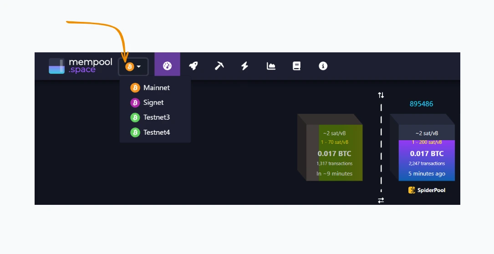

Sur la page d'accueil, vous retrouverez à gauche en vert, les futures blocs (groupe de transactions) à être validés et intégrés (minés) au réseau de Bitcoin. Un bloc est miné  en moyenne toutes les dix minutes.
En violacée, du côté droit, vous retrouvez les récents blocs minés sur Bitcoin.

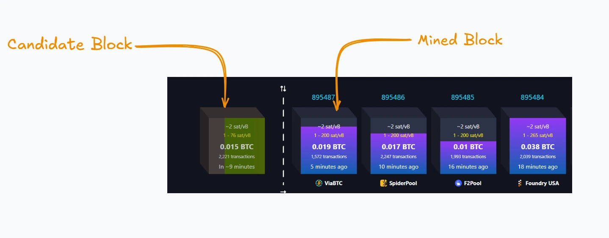

La section **Transaction Fees**, constitue un estimateur de frais de transactions, plus les frais de transactions sont élevés, plus votre transaction est susceptible d'être ajouté rapidement dans le prochain bloc à être miné. 
Les frais de transactions représente le coût que vous prendra un mineur pour insérer votre transaction dans un bloc candidat au minage. Il est définit par un ratio de satoshi/vBytes (satoshi/Virtual Bytes) représentant le nombre de satoshi que vous payer pour l'espace que votre transaction prendra dans le bloc candidat.

⚠️ **IMPORTANT** : Dans des cas de leur Mempool, les mineurs peuvent rejeter des transactions ayant un trop faible frais de transactions. Plus votre transaction nécessite de l'espace, plus vous devriez payer de satoshis.

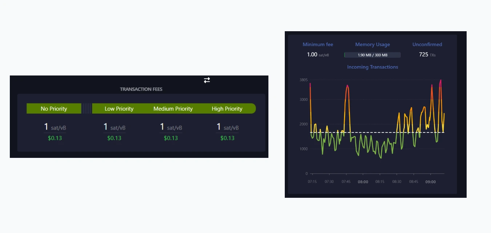

Vous pouvez retrouver une visualisation de l'espace occupée par une transaction grâce à la section **Mempool Goggles**. 

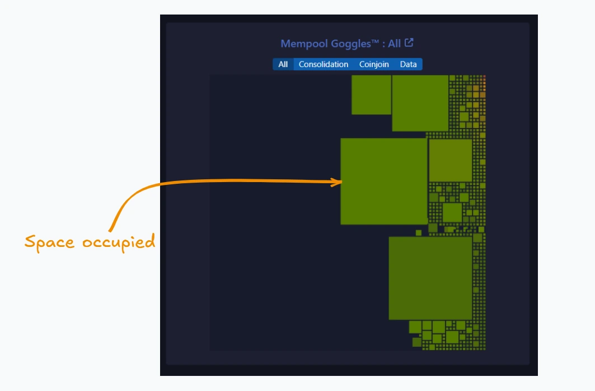

Un bloc est miné environ toutes les dix minutes a cause de la difficulté de la preuve de travail que les mineurs doivent fournir pour ajouter leur bloc candidat à la chaine des blocs minés. Cette difficulté varie toutes les **144 blocs** équivalant à environ **2 semaines**. Vous pouvez donc visualiser l'évolution de cette difficulté. 

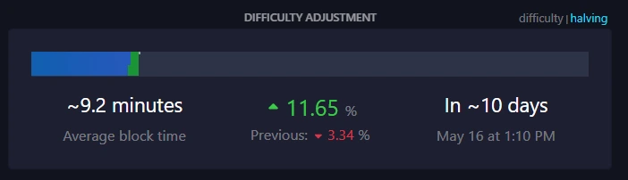

L'ajout d'un nouveau bloc à la chaine principale donne droit au mineur du bloc validé à une récompense variable toutes les **210 000 blocs** équivalant à environ **04 années**.

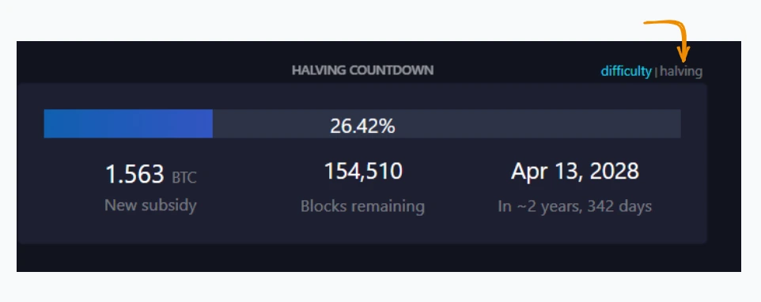

## Accéder aux détails de vos transactions

Dans la barre de recherche de Mempool.space, vous pouvez insérer votre adresse bitcoin ou l'identifiant de votre transaction afin d'avoir plus de détails sur votre historique.

Sur la page de détails des transactions, vous retrouverez les informations générales de votre transaction :
- **Son Statut** : Confirmé lorsqu'il a été ajouté à un bloc, non confirmé lorsqu'il est en attente dans un mempool.
- **Les frais de transactions**.
- **L'heure d'arrivé estimée (ETA)** :  Le temps que prendra votre transaction à être ajouté à un bloc.

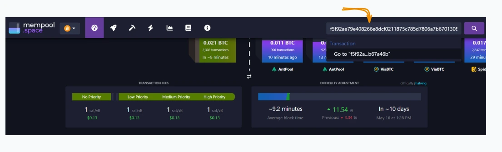

La section **Flow** vous présente un graphique des composantes de votre transactions.

Les entrées (UTXO précédents), utilisées pour votre transaction et les sorties donnant droits, aux destinataires, d'utiliser les bitcoin de chaque sortie en présentant la signature requise pour leur dépense.

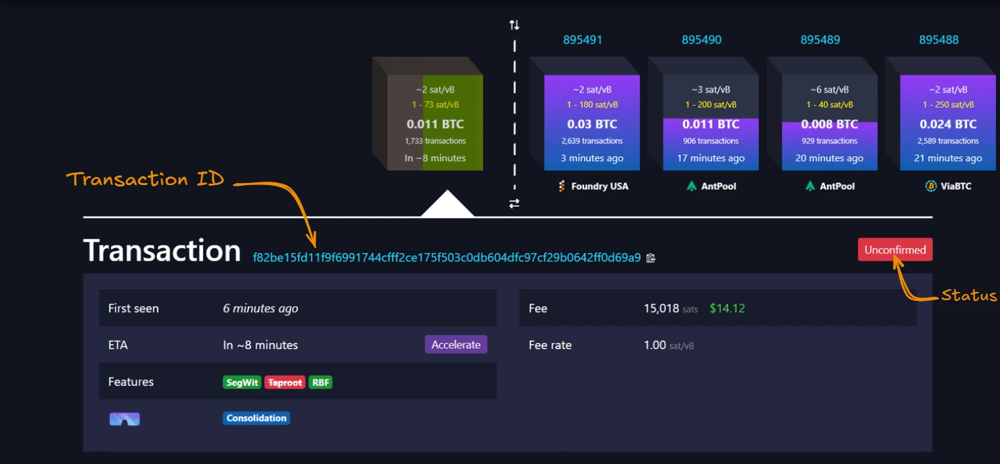

Vous obtenez plus de détails sur les adresses utilisées dans la section **Inputs & Outputs**.

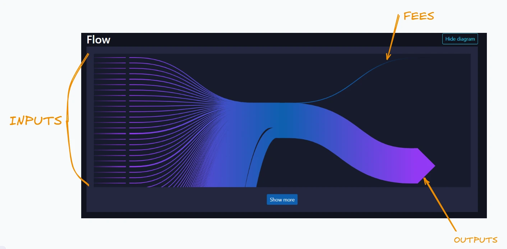

Découvrez les différents schémas de transactions Bitcoin pour accroître votre confidentialité.

https://planb.network/courses/la-confidentialite-sur-bitcoin-65c138b0-4161-4958-bbe3-c12916bc959c

## Accélérer vos transactions

Outre la visualisation de vos transactions, Mempool.space vous fournit un outil graphique pour vous permettre d'accroitre les frais d'une transaction que vous avez fait (RBF - Remplacement de frais) ou une transaction que vous souhaitez recevoir (CPFP- L'enfant paie pour le parent). En augmentant les frais de vos transactions vous accélérez la confirmation de cette transaction.

Lorsque votre transaction est en statut non confirmé, cliquez sur le buton **Accélérer** pour ouvrir la section d'accélération.

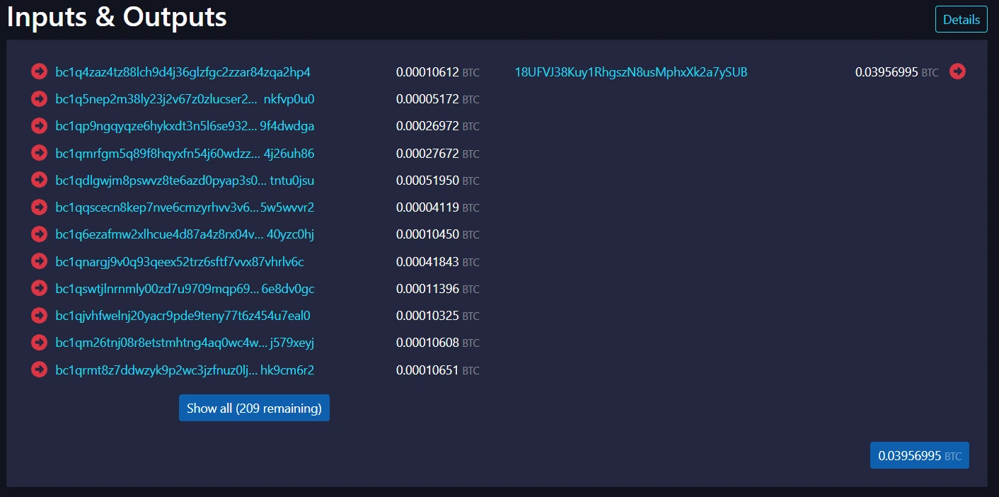

Procédez ensuite au payement de la facture pour augmenter les frais de votre transaction.

## Les mineurs

Les mineurs sont des ordinateurs présents sur le réseau Bitcoin possédant la puissance de calculs cryptographiques (ratio de hachage) nécessaires au minage des blocs. Plus ce ratio est élevé :
- Plus le mineur a de change de résoudre le problème mathématique complexe.
- Plus le mineur est résistant aux attaques.

https://planb.network/courses/introduction-to-bitcoin-mining-ce272232-0d97-4482-884a-0f77a2ebc036

Sur Mempool.space , vous retrouverez les informations sur les différents mineurs dans le menu **Mining**, vous présentant actuellement la répartition des mineurs en fonctions des blocs déjà minés et de la puissance de calcul.

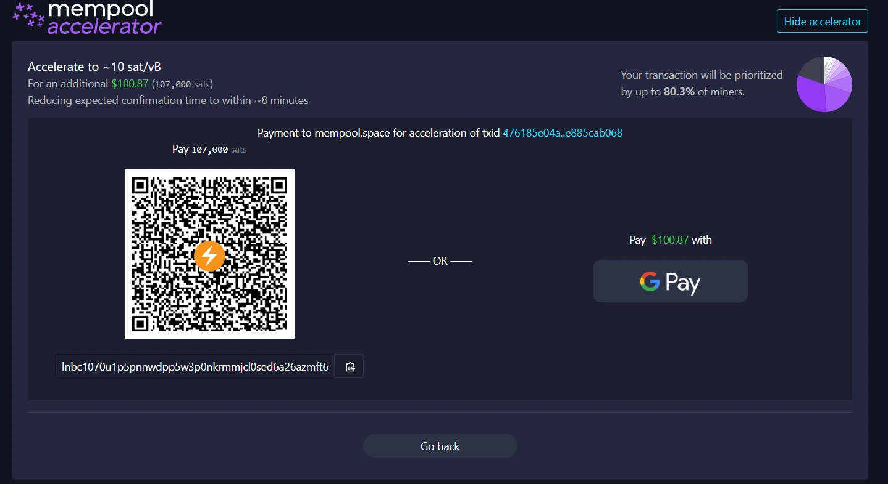

## L'infrastructure du réseau Lightning

Mempool ne se limite pas qu'à vous fournir les infrastructures du réseau principale de Bitcoin. Il intègre également des outils pour vous permettre de visualiser et l'explorer la surcouche Lightning de Bitcoin.

Dans cette section, vous pouvez visualiser l'ensemble des connexions existant entre les nœuds Lightning.

Cette interface vous renseigne sur :

- Les statistiques du réseau Lightning.

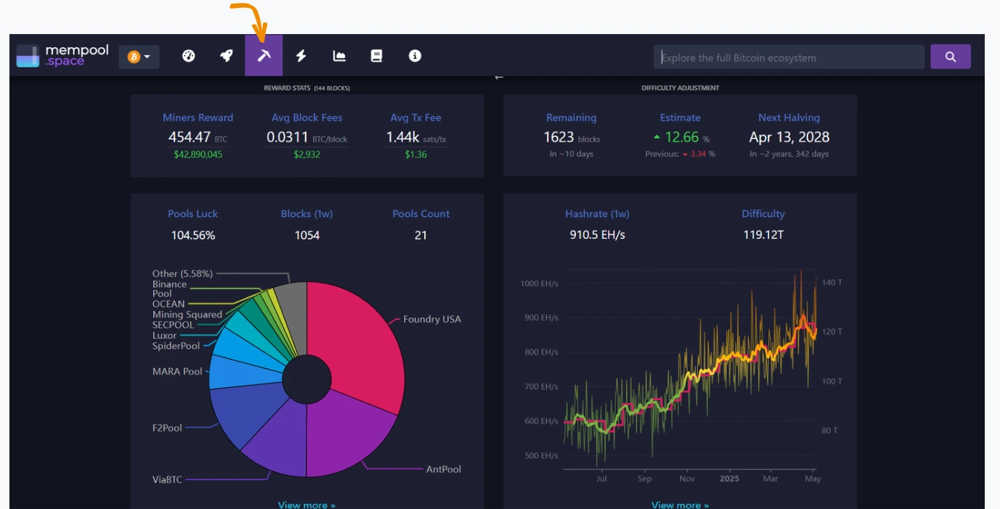
- La répartition des nœuds Lightning en fonction du fournisseur de service Internet (service d'hébergement) et optionnellement en fonction de la capacité des canaux de paiement.

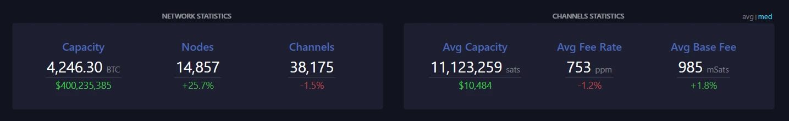

La capacité d'un canal de paiement désigne le montant maximum qu'un nœud peut envoyer à un autre nœud lors d'une transaction Lightning.
## Plus de graphiques. 

Mempool.space est la plateforme idéale pour apprécier l'interaction avec les réseaux du protocole Bitcoin.

Dans cette section graphique, Mempool.space vous permet de visualiser et de filtrer en fonction de vos recherches

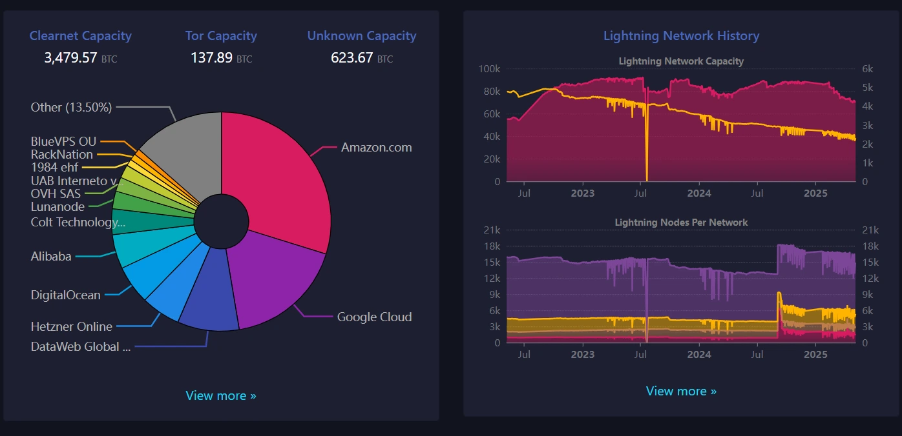

Vous voilà à la fin de votre parcours sur Mempool.space, devenez dès maintenant votre propre explorateur et traquez vos transactions en temps réel. Nous vous proposons de retrouver, ci-dessous, notre article sur l'explorateur Bitcoin Public Pool.

https://planb.network/tutorials/mining/pool/public-pool-42b9e1b5-722d-471d-b1e3-9ca758065be1

