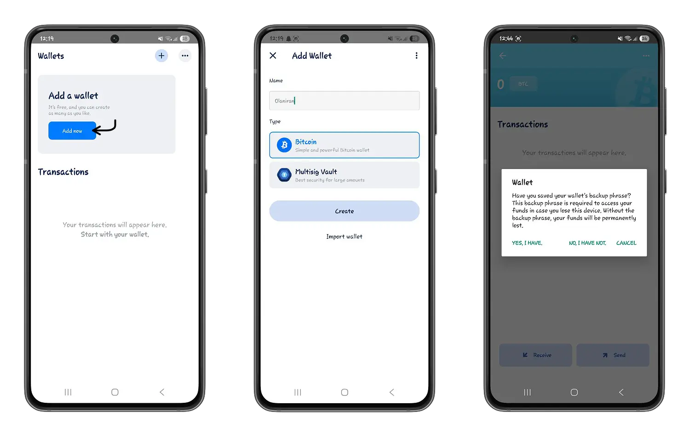
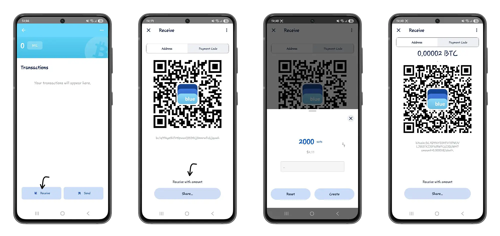
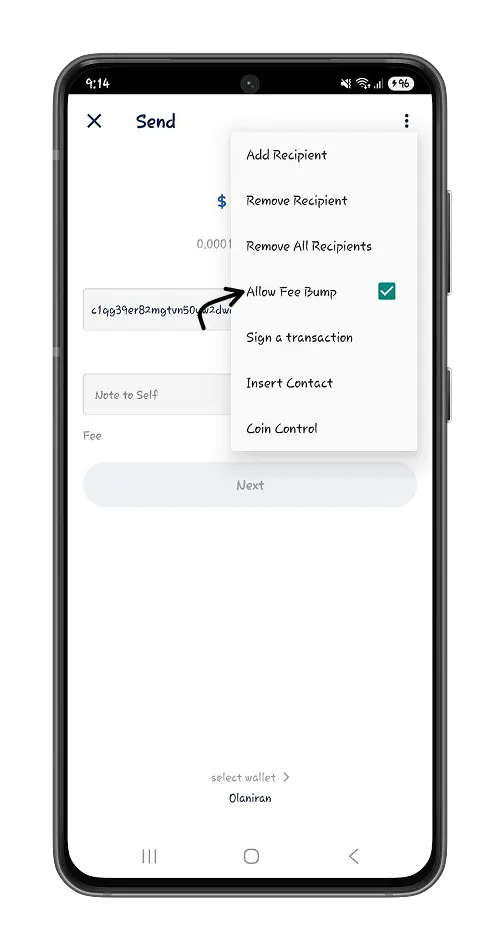
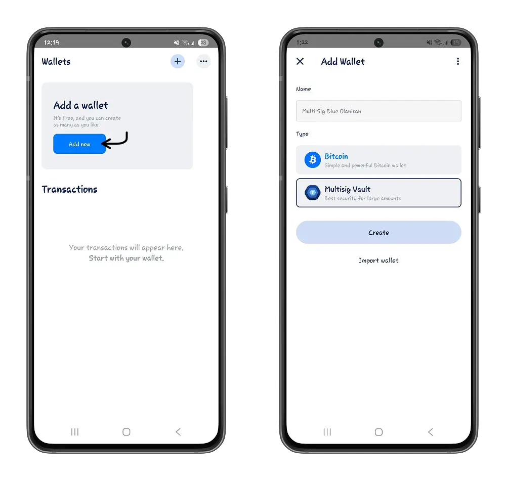

Débuter avec Bitcoin semble être un grand défi pour des personnes septiques sur la simplicité de son utilisation. Trouver les bons outils pour assurer cette simplicité devient donc d'une importance capitale pour une meilleur adoption de bitcoin comme un moyen d'échange et pas seulement comme une réserve de valeur.

Dans ce tutoriel nous allons à la découverte de Blue Wallet, un portefeuille Bitcoin simple mais tellement efficace qui vous permet de gérer vos bitcoins personnellement mais aussi de créer des coopératives de gestion basés sur le [multisig](https://planb.network/resources/glossary/multisig) (pas d'inquiétudes, nous y reviendrons). Découvrez une introduction de Rogzy (Découvre Bitcoin) au portefeuille Blue Wallet.

## Débuter avec Blue Wallet

Blue Wallet est un portefeuille Bitcoin open Source et d'auto détention qui vous permet de prendre le contrôle de vos bitcoins. Il est disponible, en application mobile, sur les plateformes Android et iOS. Dans ce tutoriel nous nous baserons sur la version Android, toutefois, tous les processus qui seront développés sont également valables sur iOS.

⚠️ Veuillez vous assurer de télécharger l'application Blue Wallet Bitcoin Wallet sur une plateforme officielle pour garantir son authenticité afin de préserver vos bitcoins d'éventuelles fuites et piratages.

Une fois l'installation achevée, vous avez la possibilité de créer un nouveau portefeuille puis de sauvegarder les 12 mots de récupération ou d'importer un portefeuille Bitcoin déjà existant. Découvrez les astuces pour faire une sauvegarde efficiente de vos mots clés afin de ne pas perdre accès à vos bitcoins.

https://planb.network/tutorials/wallet/backup/passphrase-a26a0220-806c-44b4-af14-bafdeb1adce7

Avec Blue Wallet vous avez la possibilité de créer des portefeuilles bitcoin dédiés et distincts. Par exemple, vous pouvez avoir un portefeuille pour vos épargnes et un autre pour vos dépenses quotidiennes toujours dans la même application.

## Types de portefeuille

Dans Blue Wallet, vous retrouverez nativement deux types de portefeuille Bitcoin.
### Portefeuille Bitcoin

Si vous êtes habitués à d'autres portefeuilles Bitcoin comme Phoenix ou Aqua, vous ne serez absolument pas déphasés sur l'interface du portefeuille Bitcoin de Blue Wallet

https://planb.network/tutorials/wallet/mobile/phoenix-0f681345-abff-4bdc-819c-4ae800129cdf

https://planb.network/tutorials/wallet/mobile/aqua-8e6d7dd3-8c03-45cc-90dd-fe3899a7d125

Le portefeuille Bitcoin de Blue Wallet représente le portefeuille standard dans l'écosystème Bitcoin. Vous pouvez dépenser des bitcoins du moment où vous êtes en possession des mots de récupération qui pourront fournir une signature valide sur le réseau pour authentifier que vous êtes propriétaires des Bitcoin.

Pour créer un portefeuille Bitcoin, cliquez sur le bouton **Add now**, insérez le nom de votre portefeuille puis choisissez le Type Bitcoin.

Lorsque vous cliquez sur la prévisualisation de votre portefeuille Bitcoin, vous pourrez retrouver l'historique de vos transactions et envoyer et recevoir des bitcoins.

- Recevoir des bitcoins avec le portefeuille Bitcoin Blue Wallet est intuitif. En bas de votre écran, cliquez sur le bouton **Receive**. Partagez le code QR ou votre adresse Bitcoin à votre expéditeur afin qu'il puisse vous envoyer les bitcoins.
Vous avez également la possibilité de configurer un montant prédéfini afin de spécifier le montant de bitcoin que vous souhaitez recevoir.

- Sur le bouton **Send**, envoyez des bitcoins à une adresse bitcoin en définissant le montant souhaité puis en validant la transaction.

La particularité de Blue Wallet vous permet de configurer à votre convenance les paramètres de votre envoi de bitcoin.

Vous pouvez donc sélectionner le ratio de frais de transaction qui vous correspond si vous voulez voir la transaction rapidement validée dans un mempool et incluse dans un bloc par les mineurs. Selon le ratio choisi, les mineurs prioriseront plus ou moins votre transaction. Apprenez en plus dans notre tutoriel sur le mempool Space.

https://planb.network/tutorials/privacy/analysis/mempool-space-f3e468a1-92f1-43ce-b2e4-c3298fa0e02f

- Dans le cadre des paiements groupés, Blue Wallet vous permet, à partir d'un seul envoi, d'ajouter plusieurs receveurs.
Lorsque vous ajouter l'adresse bitcoin de votre premier receveur, dans les options, cliquez sur **Add Recipient**, puis définissez le montant à envoyer à ce receveur ainsi de suite. Blue Wallet se chargera de dispatcher les bitcoins pour effectuer plusieurs envois à partir de votre seule action.

Vous pouvez retirer un ou tout les receveurs en cliquant respectivement sur **Remove Recipient** et **Remove All Recipents**.

- Gonflez les frais : Avez-vous fait une transaction qui prend du temps à être confirmée? En activant le gonflement des frais vous pourrez ajouter des frais de transactions supplémentaire à votre transaction en attente pour accélérer sa confirmation.

### Portefeuille MultiSig

Le portefeuille Multisig (multi signatures), représente un portefeuille créé à partir du regroupement d'un certain nombre (minimum 02) de portefeuilles Bitcoin. Dans ce type de portefeuille, selon la configuration et la méthode choisie, dépenser des bitcoins devient une action collective et coopératrice.

Dans Blue Wallet, vous pouvez créer des portefeuilles multi signatures pour votre association, votre famille, votre entreprise. Tout au long de cette section, nous tâcherons de découvrir et de décortiquer chaque aspect de ce type particulier de portefeuille.

Ajoutez un nouveau portefeuille et selectionnez le type **Multisig Vault** pour créer un portefeuille multi signatures.

Définissez la configuration n-de-m dans votre organisation multi signatures en cliquant sur **Vault Settings**.

⚠️ Dans une configuration n-de-m, **n** représente le nombre de signature minimale requise pour approuver une transaction et **m**, le nombre de portefeuilles de votre organisation.

Veuillez à définir un nombre de signature minimal (n) majoritaire dans votre organisation. Par exemple une configuration 2-de-3 multi signatures nécessite que deux portefeuilles de votre organisation valident la transaction pour qu'elle puisse être effectuée.

❗Définir une configuration n-de-m où n est égale à m constitue un grand risque. Lorsqu'un membre perd l'accès à son portefeuille vous perdez implicitement l'autorisation de dépenser les bitcoins dans le portefeuille.

Quelques exemples de configurations optimales pour assurer la sécurité et votre accessibilité aux bitcoins.

- 2-de-3 multi signatures.
- 5-de-7 multi signatures.

Gardez les meilleurs pratiques en sélectionnant le format P2WSH. 

❗ **P2WSH ou Pay to Witness Script Hash** est une méthode de verrouillage qui bloque les bitcoins sortants de votre transaction (Outputs) au hash d'un script personnalisé que Blue wallet met en place. Le principale avantage avec ce type de verrouillage est qu'il réduit la taille de données des transactions et implicitement vous permet de payer moins de frais de transactions.

https://planb.network/resources/glossary/p2wsh

Créez ou importez chacun des **m** portefeuilles de votre configuration. Dans notre tutoriel, nous utiliserons une configuration 2-de-3 multi signatures. Veuillez à sauvegarder individuellement les mots de récupération de chacun des portefeuilles.

