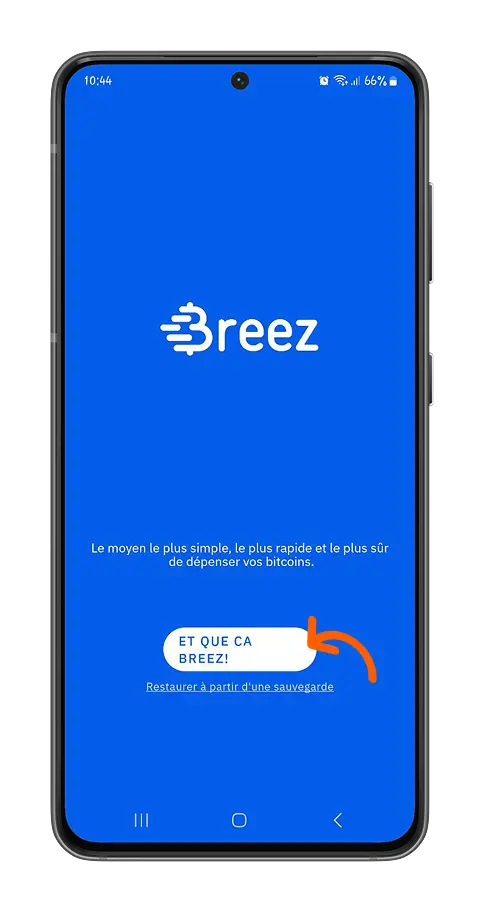
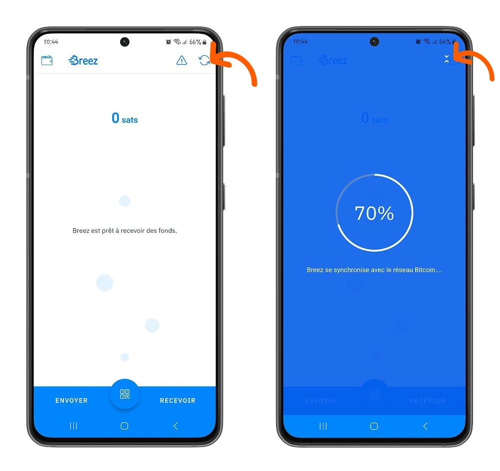
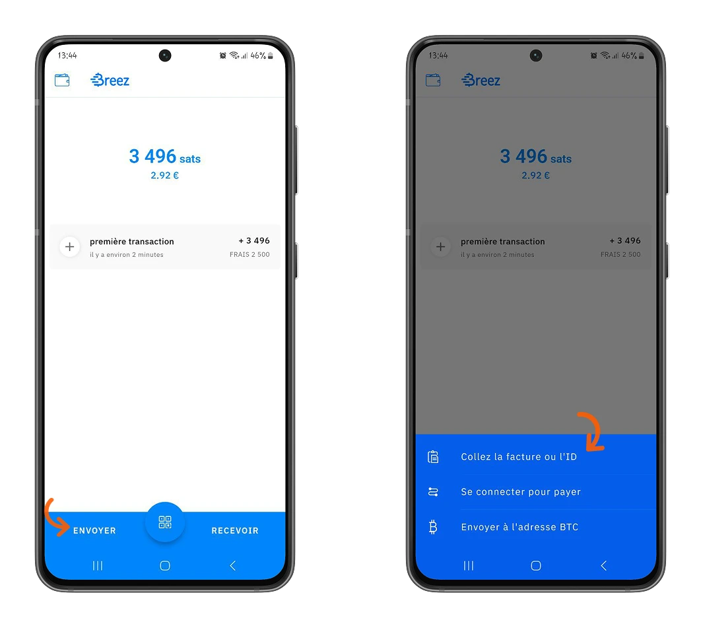
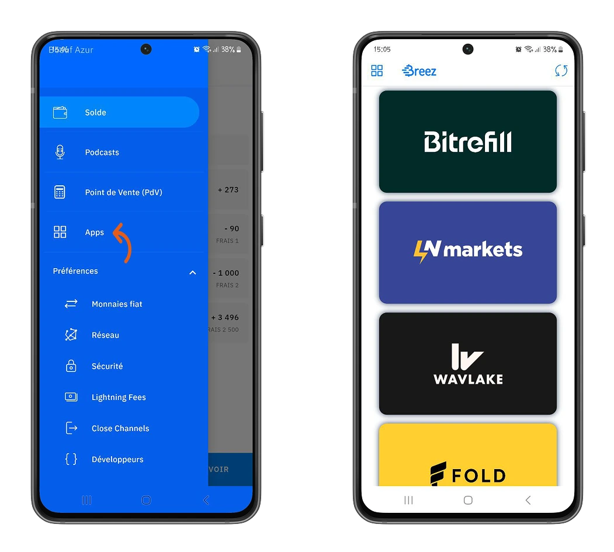
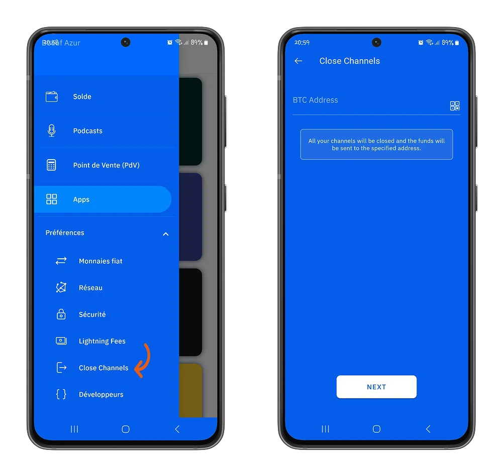

Pochi za kujihifadhi (self-custodial) zinakuwa chaguo salama zaidi la kuhifadhi bitcoins zako huku ukifaidika na nguvu na faida za mtandao wa Lightning wa Bitcoin. Breez, kupitia mbinu yake, inajitokeza kwa kipekee kati ya pochi hizi.

## Breez ni nini?

Breez ni pochi ya kujihifadhi iliyoundwa na kampuni ya Breez inayokupa udhibiti kamili wa bitcoins zako na inakupa vipengele vya ubunifu vyote ndani ya programu moja. Unaweza kupakua pochi ya Breez kwenye Android na iOS kutoka kwa majukwaa rasmi ya upakuaji. Katika mafunzo haya, tutafanya utangulizi wa programu kwenye jukwaa la Android. Mchakato wote ulioelezwa hapa chini pia unatumika kwa iOS.

⚠️ **MUHIMU**: Ni muhimu kupakua programu kutoka kwa jukwaa rasmi kama Google Play Store au Apple Store ili kuhakikisha uhalisi wa programu na usalama wa mali zako zijazo.

Hapa, kwenye Android, ni programu ya **Breez** (usichanganye na Misty Breez, bidhaa nyingine ya kampuni ya Breez).

## Utangulizi wa Pochi

Breez inakupa uwezo wa kuunda pochi mpya au kurejesha pochi ya Lightning ambayo tayari unamiliki. Katika mafunzo haya tutaunda pochi mpya.

Hii ni moja ya faida za Breez, unamiliki funguo zitakazokuwezesha kufikia bitcoins zako kikamilifu. Wewe ndiye mmiliki wa bitcoins zako.

⚠️ Pochi ya Breez kwa sasa iko katika hatua ya maendeleo, tunapendekeza kufanya miamala kwa kiasi kidogo kwa sasa.

> Sio funguo zako, sio bitcoins zako.

Pochi inalinganisha moja kwa moja na itifaki ya Bitcoin na inakupa nodi inayofanya kazi kwa ajili ya kufanya miamala yako.

### Kuhifadhi Funguo Zako

Hatua ya kwanza unapotengeneza pochi ya Bitcoin/Lightning ni kuhifadhi funguo zako. Katika Menyu, panua chaguo **Mapendeleo** kisha **Usalama**. Breez inakuwezesha kuhifadhi maneno yako 12 ya kurejesha kwenye Google Drive au seva ya kibinafsi ya mbali ambayo unaweza kuisanidi. Kisha wezesha chaguo **Funga Hifadhi**: chaguo hili litakuonyesha maneno ya funguo ya pochi yako ambayo unaweza kuhifadhi kwa mikono.

Fuata maagizo ili kuthibitisha hifadhi yako na unganisha akaunti yako ya hifadhi ya mbali na pochi ya Breez.

https://planb.network/tutorials/wallet/backup/backup-mnemonic-22c0ddfa-fb9f-4e3a-96f9-46e2a7954270

⚠️ **MUHIMU**: Ili kuongeza usalama wa pochi yako ya Breez, unaweza kuweka Nambari ya PIN na kuisanidi ili kuthibitisha kuwa upatikanaji wa pochi hii umeidhinishwa.

### Kufanya Miamala Yako ya Kwanza na Breez

Breez inatanguliza urahisi wa matumizi katika programu yake. Kupokea bitcoins zako za kwanza na pochi hii ni rahisi sana. Kwenye ukurasa wa mwanzo, bonyeza **Pokea**, kisha chagua njia unayotaka kupokea bitcoins zako. Breez inakupa chaguzi tatu:

- **Pokea kupitia ankara ya Lightning au ID**: Tengeneza ankara na upokee malipo.
- **Pokea kupitia anwani ya Bitcoin**: Pokea bitcoins kupitia miamala kwenye mtandao mkuu wa Bitcoin.
- **Nunua Bitcoin**: Breez inajumuisha njia ya kununua bitcoin moja kwa moja kutoka kwa sarafu za fiat.

Weka maelezo kwa ajili ya ankara yako, kisha ingiza kiasi unachotaka kupokea.

⚠️ Kwa muamala wa kwanza kwenye Breez, utalazimika kulipa ada ya kufungua na kudumisha njia ya malipo ya kiasi cha **2500 satoshis**. Tofauti na pochi nyingi za Lightning, Breez inakupa miundombinu kamili ya nodi ya Lightning inayokupa uhuru wa kusimamia bitcoins zako. Utalazimika kufungua njia zako za malipo mwenyewe na uhuru wa kuwasiliana moja kwa moja na nodi ya Lightning kutoka ndani ya programu.

*Usijali, utalipa ada hii mara moja tu, wakati wa kuanzisha pochi yako.*

Baada ya ankara yako kutengenezwa, unaweza kuishiriki, au kuiskeni ili kulipa ankara hiyo na kupokea bitcoins zako.

Kutuma bitcoins kwenye Breez ni rahisi kama kupokea. Breez inakupa chaguzi tatu za kutuma bitcoins:

- **Bandika ankara au ID ya mtumiaji**: Lipa ankara ya Lightning.
- **Unganisha ili kulipa**: Tengeneza kikao na mwalike mpokeaji kujiunga na kikao ili kumtumia bitcoins.
- **Tuma kwa anwani ya BTC**: Fanya miamala kwenye mtandao mkuu wa Bitcoin.

Kisha weka maelezo ya Mpokeaji au skeni ili kuanzisha malipo ya ankara kisha thibitisha.

### Sifa Maalum za Pochi Hii

Zaidi ya kuwa pochi rahisi ya kuhifadhi bitcoins zako, Breez ni mfumo wa kiubunifu. Unapata huduma muhimu moja kwa moja ndani ya programu.

- **Kusikiliza podcast**: Breez inajitokeza kama mchezaji wa podcast wa kizazi kipya unaokuwezesha kusaidia waundaji wa maudhui unaowapenda kwa michango ya bitcoins. Katika menyu, chagua chaguo **Podcasts** kisha tafuta, gundua, sikiliza waundaji wa maudhui unaowapendelea.

Saidia kutoka ndani ya programu, kazi ya waundaji wa maudhui unaowapenda kwa kutoa michango.

- **Kituo cha Mauzo (POS)**: Breez inafaa kabisa kwa biashara yako na inakuwezesha kuwa na kituo cha mauzo ndani ya programu. Unaweza kudumisha hesabu ya duka lako, kupokea malipo ya wateja wako na kutengeneza ankara za kuchapisha kwa kila ununuzi uliofanywa. Zaidi ya hayo, unaweza kupata sarafu zako za ndani kati ya sarafu nyingi zinazoungwa mkono na Breez.

Unaweza kubinafsisha sarafu zako katika menyu **Mapendeleo > Sarafu za Fiat**.

Katika menyu **Kituo cha Mauzo (POS)**, unaweza kusanidi bidhaa unazouza katika biashara yako.

Baada ya kufanya hesabu yako, unaweza kwa urahisi kutoza ununuzi wa bidhaa hizi kwa wateja wako, na kukubali Bitcoin katika biashara yako.

- **Kupata huduma za watu wengine**: Breez inajumuisha huduma za watu wengine zinazokuwezesha kufanya zaidi bila kuondoka kwenye pochi. Unaweza kupata, Bitrefill, LN Markets, Wavlake, Fold, Fixed Float, The Bitcoin Company, Azteco, Boltz, Geyser, Lightsats, SMS Sats, LN.PIZZA, LNCAL.

### Nguvu ya Breez

Breez inafanya uhuru wako kuwa nguvu yake. Miundombinu ya Breez, inakupa nodi inayofanya kazi ambayo unaweza kuingiliana nayo kutoka ndani ya programu (chaguo **Watengenezaji**). Pia una uhuru wa kubinafsisha usanidi wa msingi iwe ni juu ya:

- Muunganisho wa nodi ya Bitcoin/Lightning: Menyu **Mapendeleo > Mtandao**.

- Kubinafsisha ada za miamala: Menyu **Mapendeleo > Ada za Lightning**.

- Usimamizi wa njia za malipo: Menyu **Mapendeleo > Funga Njia**.

⚠️ **MUHIMU**: Tunapendekeza kuwa na uzoefu fulani na usanidi wa Lightning kabla ya kufanya mabadiliko yoyote. Miamala yako ya baadaye itaathiriwa moja kwa moja na mabadiliko yako na bitcoins zako zinaweza kupotea.

Kwa wale walio na uzoefu zaidi, unaweza kuingiliana na nodi kutoka kwenye menyu **Mapendeleo > Watengenezaji**. Hapo utapata mistari ya amri ya Lightning ambayo unaweza kutekeleza kwa kuongeza hoja zinazohitajika.

Hongera, sasa una uelewa mzuri wa pochi ya Breez. Ikiwa unahisi kuwa makala haya yamekuwa na msaada kwako, tafadhali tuachie kidole gumba cha kijani. Itatufurahisha sana. Asante!
