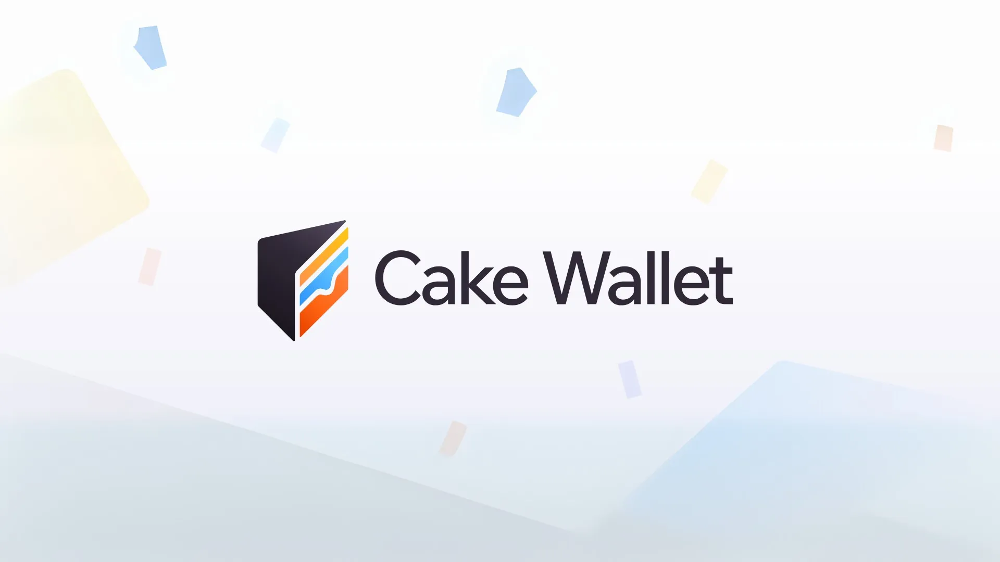
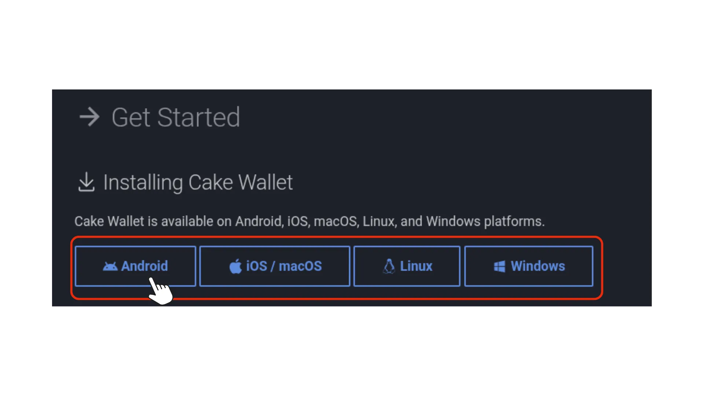
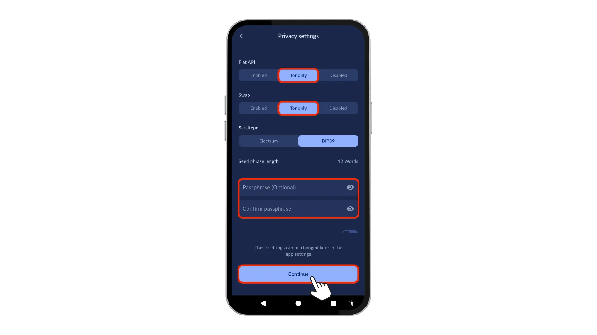
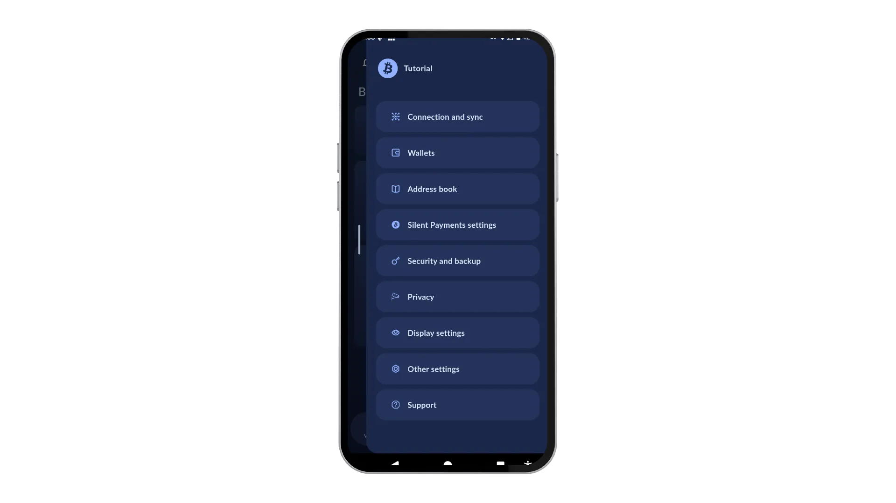
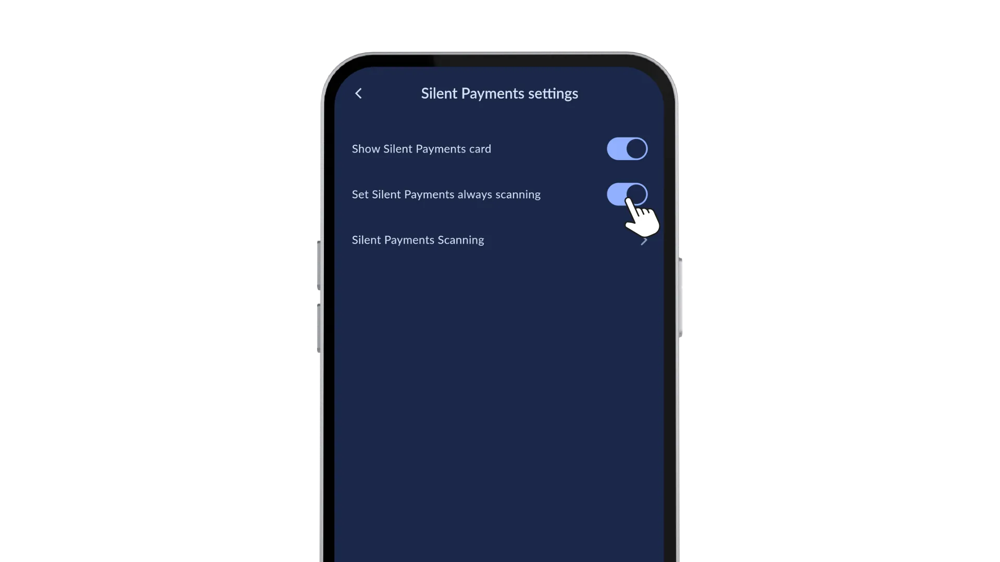
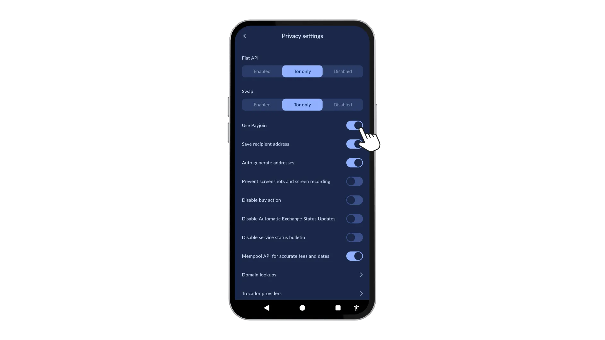
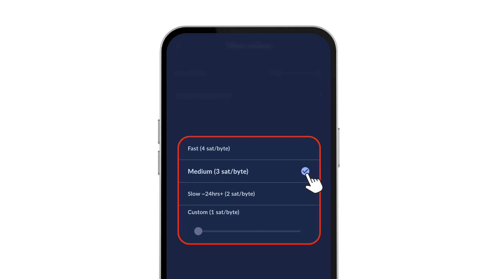
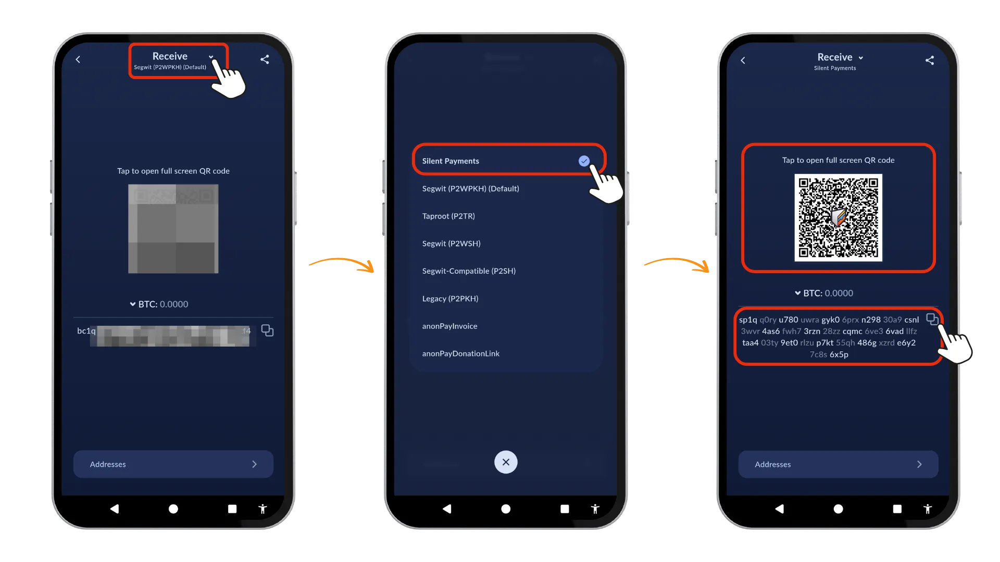
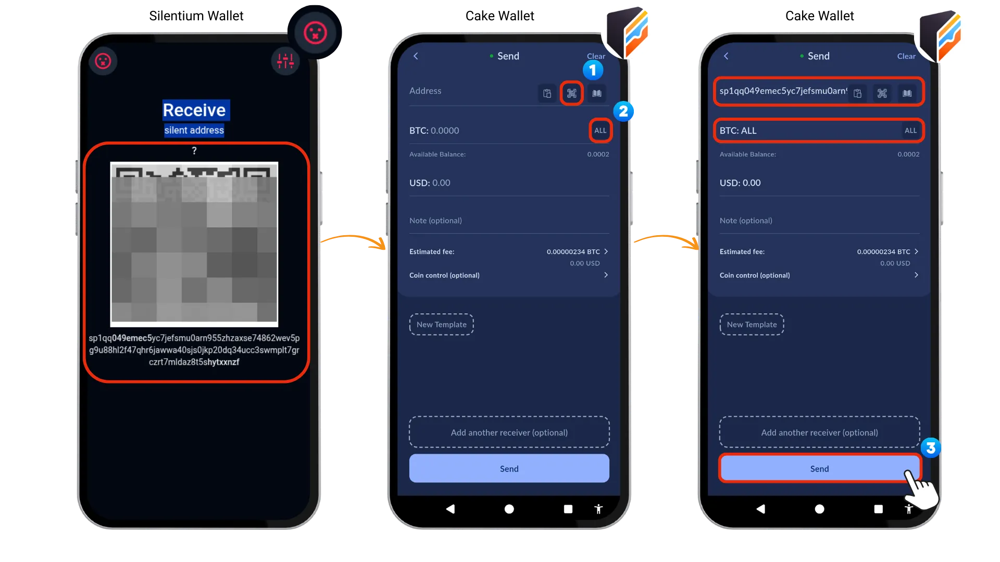
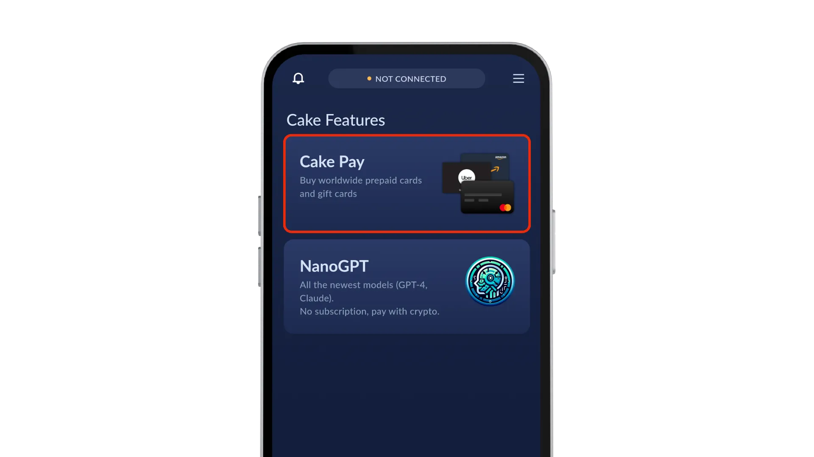

Este guia explora o [**Cake Wallet**] (https://cakewallet.com/): um wallet de código aberto, sem custódia, focado na privacidade e com várias moedas, disponível para Android, iOS, macOS, Linux e Windows. Iremos analisar as funcionalidades de privacidade específicas do Bitcoin, enviar/receber Bitcoin através de **Silent Payments** (um protocolo de privacidade on-chain melhorado) e analisaremos a implementação do PayJoin v2 para transacções assíncronas.


## 🎉 Caraterísticas principais


- [**Pagamentos Silenciosos (BIP-352)**](https://bips.dev/352/) melhorando os anteriores [BIP 47 códigos de pagamento](https://silentpayments.xyz/docs/comparing-proposals/bip47/) também chamados "PayNyms" com endereços furtivos reutilizáveis. Quando um remetente utiliza o seu endereço de pagamento silencioso, o seu wallet obtém um endereço único utilizando chaves diferentes que serão combinadas num endereço único Taproot. Os registos da cadeia de blocos mostram transacções não relacionadas, impedindo a ligação dos pagamentos recebidos. Os pagamentos silenciosos oferecem uma série de benefícios, incluindo:
    - Endereços reutilizáveis: Não é necessário generate um novo endereço para cada transação, proporcionando uma melhor experiência ao utilizador e maior privacidade
    - Aumento de custo zero: Os pagamentos silenciosos não aumentam o volume ou o custo das transacções.
    - Anonimato melhorado: Os observadores externos não podem associar as transacções a um endereço do Silent Payment.
    - Não é necessária qualquer interação entre o remetente e o destinatário: As transacções podem ser efectuadas sem qualquer comunicação entre as partes.
    - Endereços únicos para cada pagamento: Eliminação do risco de reutilização acidental de endereços.
    - Não é necessário um servidor: Os pagamentos silenciosos podem ser efectuados sem a necessidade de um servidor dedicado.
- O PayJoin v2** atenua a análise do gráfico de transacções, juntando as entradas dos emissores e receptores numa única transação. O Cake Wallet implementa dois avanços críticos:
    - Transacções assíncronas**: O remetente e o destinatário já não precisam de estar online simultaneamente para concluir uma transação privada.
    - Comunicação sem servidor**: Nenhuma das partes precisa de ter um servidor Payjoin, removendo uma grande barreira técnica.
- O Controlo Coin** permite a seleção manual do UTXO durante as transacções. Isto evita a ligação acidental de endereços quando se gastam vários UTXOs com origens diferentes.
- Suporte TOR**, permitindo aos utilizadores encaminhar o seu tráfego de rede através da rede Tor
- RBF** (Replace-By.Fee) permite-lhe ajustar a taxa depois de enviar uma transação.


## 1️⃣ Configurar o Wallet


O Cake Wallet oferece uma ampla gama de suporte a plataformas. Pode escolher entre `Android`, `iOS / macOS`, `Linux` e `Windows`.  Para começar, visite https://docs.cakewallet.com/get-started/ e selecione o seu sistema operativo.





Após a instalação, definir um `PIN` (4 ou 6 dígitos). Verá então:


1. `Criar um novo Wallet` (para novos utilizadores)

2. `Restaurar Wallet` (para carteiras existentes)


No ecrã seguinte, pode escolher entre uma vasta gama de moedas criptográficas. Selecione `Bitcoin` e toque em `Next` e forneça um `Nome Wallet` para identificar o wallet. Ao tocar em `Configurações avançadas`, aparece uma série de `Configurações de privacidade`. Efectue estas alterações:


- Fiat API:** selecionar `Tor Only` (encaminha os pedidos de preços através do Tor)
- Swap:** selecionar `Tor Only` (anonimiza o tráfego da bolsa)


O tipo BIP-39 seed é gerado por defeito, com uma opção de alteração para o tipo Electrum seed. Os caminhos de derivação são os seguintes:


- Electrum: `m/0'`
- BIP-39: `m/84'/0'/0`


Se quiser adicionar uma camada de segurança extra, pode configurar um `passphrase`.  O principal objetivo de um passphrase é fornecer proteção adicional contra ataques físicos. Mesmo que um atacante encontre a frase seed, não pode aceder ao seu wallet sem o passphrase correto. Por outras palavras, a frase seed sozinha representa um wallet, enquanto a frase seed mais o passphrase cria um wallet completamente diferente, sem qualquer ligação ao original. Esta caraterística também permite "carteiras secretas" protegidas pelo passphrase, e dá-lhe uma negação plausível. Numa situação de coerção, pode revelar a frase seed enquanto mantém os bens maiores seguros na wallet protegida pela passphrase.


Se você já está rodando seu próprio nó, alterne `Add New Custom Node` e forneça seu `Node Address` para validar transações e blocos dentro de sua própria infraestrutura. Uma vez terminado, toque em `Continue` e `Next` para criar seu wallet.





No ecrã seguinte, é apresentada uma declaração de exoneração de responsabilidade:


```
On the next page you will see a series of words. This is your unique and private seed and it is the ONLY way to recover your wallet in case of lass or malfunction. It is YOUR responsibility to write it down and store it in a safe place outside of the Cake Wallet app.
```


Para conhecer as melhores práticas para guardar a sua frase mnemónica, consulte este tutorial:


https://planb.academy/tutorials/wallet/backup/backup-mnemonic-22c0ddfa-fb9f-4e3a-96f9-46e2a7954270

Toque em `Eu compreendo. Mostre-me o meu seed` e guarde estas palavras num local seguro! Depois toque em `Verificar seed` e após a verificação `Abrir Wallet`.


## 2️⃣ Definições


Antes de nos aprofundarmos, vamos dar uma vista de olhos ao `Home Screen` e às `Settings`.


No ecrã inicial, podemos ver diferentes itens apresentados:


- o `menu Hamburger` leva-nos às `configurações`
- Saldo disponível
- Cartão de pagamento silencioso para começar a procurar transacções enviadas para o seu endereço de pagamento silencioso
- Cartão Payjoin para "ativar" o Payjoin como funcionalidade de preservação da privacidade e de poupança de taxas
- na parte inferior estão os atalhos para `Visão geral do Wallet`, `Receber`, `Trocar` entre Bitcoin e outras moedas, `Enviar` e `Comprar`


Tocar no ícone `Menu de hambúrguer` abre o menu de definições. Vamos rever as opções.





### A - Ligação e sincronização 🔗


Aqui, podemos reconectar o wallet, gerenciar nós e conectar ao nosso próprio nó (recomendado). A opção `Verificação de pagamentos silenciosos` nos permite personalizar a verificação especificando `Verificação a partir da altura do bloco` ou `Verificação a partir da data`.


Como funcionalidade `Alfa`, existe também a opção de `Ativar Tor` para encaminhar o tráfego através da rede Tor.


### B - Definições de pagamentos silenciosos 🔈


Podemos ativar o cartão Silent Payments no ecrã inicial para apresentar esta funcionalidade. A ativação de "Sempre a digitalizar" permite ao wallet monitorizar continuamente a cadeia de blocos para pagamentos silenciosos de entrada. Podemos especificar parâmetros de varredura para personalizar o processo de varredura de acordo com nossas necessidades, conforme descrito acima.





### C - Segurança e cópia de segurança 🗝️


Para proteger o nosso wallet, podemos criar uma cópia de segurança, seguindo as instruções da aplicação. Isto irá garantir que temos uma cópia segura das nossas chaves privadas, permitindo-nos recuperar o nosso wallet em caso de perda ou roubo. Além disso, podemos ver a nossa frase e chaves privadas do seed, alterar o nosso PIN, ativar a autenticação biométrica, Assinar / Verificar e configurar 2FA para uma camada extra de proteção.


**Nota**: A partir de setembro de 2025, a autenticação biométrica de impressões digitais em dispositivos Android tem de funcionar com, pelo menos, uma implementação biométrica de Classe 2. Para mais informações, consulte [aqui] (https://source.android.com/docs/security/features/biometric/measure#biometric-classes). No entanto, este requisito pode ser alterado no futuro.


### D - Definições de privacidade 🔒


Podemos também melhorar a segurança do nosso wallet, utilizando o Tor para encriptar a nossa ligação à Internet e salvaguardar a nossa privacidade quando acedemos a fontes externas. Adicionalmente, podemos evitar screenshots para manter a informação do nosso wallet confidencial, ativar endereços gerados automaticamente para criar novos endereços para cada transação, e desativar acções de compra/venda para evitar transacções não autorizadas. Além disso, podemos "Ativar PayJoin", que é outra funcionalidade de privacidade que analisaremos mais tarde.





### E - Outras definições 🔧


Outras definições permitem-nos gerir a prioridade da taxa e definir o nível de taxa predefinido para as nossas transacções. Isto permite-nos controlar as taxas de transação associadas aos nossos pagamentos silenciosos, tendo em conta a utilização atual da rede.





## 3️⃣ Receber ₿itcoin utilizando Silent Payments


Existem várias opções e tipos de endereços disponíveis para receber o Bitcoin. `Segwit (P2WPKH)` * *(começando com bc1q....)* é a opção padrão.  Vamos selecionar `Silent Payments` neste exemplo.


Para receber um pagamento silencioso, toque primeiro no ícone `Receber` no Cake Wallet. Em seguida, introduza o montante que espera receber. Para especificar o tipo de endereço, toque novamente em `Receber` na parte superior do ecrã e selecione `Pagamentos silenciosos` nas opções.


No ecrã principal, serão apresentados o seu código QR Silent Payment reutilizável e o endereço. Como esperado, o endereço é bastante extenso:


`sp1qq0ryu780uwragyk06prxn29830a9csnl3wvr4as6fwh73rzn28zzcqmc6ve36vadllfztaa403ty9et0rlzup7kt55qh486gxzrde6y27c8s6x5p` .





Agora, use um BIP-352 compatível com o wallet (como o Blue Wallet) para digitalizar este código QR e enviar o pagamento. Verá que o wallet obtém um endereço de destino único a partir do seu endereço silencioso.


## 4️⃣ Envio de ₿itcoin usando Silent Payments


Como o Blue Wallet só pode "enviar" pagamentos silenciosos, usaremos outro BIP 352 compatível com o wallet como parte recetora. Este processo é idêntico ao de uma transação normal do Bitcoin.


- Toque em `Enviar` no ecrã inicial
- colando o nosso endereço reutilizável `sp1qq...` ou digitalizando o código QR diretamente na aplicação.
- Selecione o montante que pretende gastar do seu saldo disponível
- Toque em "Enviar" na parte inferior do ecrã para confirmar a transação


Uma vez introduzido o endereço `sp1qq...`, o wallet deriva automaticamente um endereço correspondente `bc1p...` do Taproot (P2TR) em segundo plano, que será utilizado para o Pagamento Silencioso.


Opcionalmente, podemos escrever uma nota interna para cada transação, ajustar as definições de taxas ou selecionar determinados UTXOs para a transação utilizando a função `Coin Control`.





deslize o dedo para a direita para confirmar a transação.


Depois de enviar a transação, ser-lhe-á perguntado se deseja adicionar este contacto à sua lista de contactos.


## 5️⃣ PayJoin


Vamos rever o que é o PayJoin (https://docs.cakewallet.com/cryptos/bitcoin/#payjoin):


_Payjoin v2 é uma caraterística de preservação da privacidade e de poupança de taxas no Bitcoin que permite ao remetente e ao destinatário de uma transação trabalharem em conjunto para criar uma única transação. Esta transação tem entradas de *ambos* o remetente e o destinatário, quebrando as técnicas de vigilância mais comuns contra o Bitcoin e permitindo um melhor escalonamento e poupança de taxas em algumas circunstâncias também._


Para saber mais sobre o PayJoin, pode também visitar o seguinte tutorial.


https://planb.academy/tutorials/privacy/on-chain/payjoin-848b6a23-deb2-4c5f-a27e-93e2f842140f

Para utilizar o PayJoin, ambas as partes necessitam de um wallet compatível com o PayJoin e o destinatário necessita de ter pelo menos uma moeda ou saída no seu wallet. Para começar, siga estes passos:


1. Toque no `Menu Hambúrguer` e toque no botão `Privacidade

2. Alternar a opção "Usar Payjoin

3.  Toque em `Receive` no ecrã inicial e ser-lhe-á apresentado um código QR PayJoin e um botão de cópia (quando selecionado Segwit)


## 6️⃣ Outras caraterísticas


Existem várias outras funcionalidades como `Swaps` de várias moedas, opções de `Compra e Venda` com ligações a diferentes vendedores e programas específicos do Cake Pay, como o `Cake Pay`, que permite comprar cartões pré-pagos ou cartões de oferta.





## 🎯 Conclusão


Esta é a nossa análise do Cake Wallet, que oferece a privacidade prática do Bitcoin graças a funcionalidades como o Silent Payments (BIP-352) e o Payjoin v2.


Os pagamentos silenciosos substituem os endereços descartáveis por endereços furtivos reutilizáveis para impedir a ligação on-chain das transacções recebidas. Embora os problemas de sincronização das versões anteriores tenham melhorado significativamente, são necessários alguns requisitos computacionais acrescidos para a verificação e deteção de pagamentos silenciosos, o que exige mais recursos e largura de banda.


Payjoin v2 interrompe a análise da cadeia ao fundir as entradas do emissor e do recetor em transacções únicas sem taxas extra ou coordenação central. Isto quebra a heurística comum da propriedade das entradas, o que é uma vantagem significativa pois significa que não se pode assumir que todas as entradas pertencem ao remetente.


Para os utilizadores que dão prioridade ao anonimato financeiro, o Cake Wallet é uma opção viável. Ele incorpora protocolos de privacidade diretamente em sua funcionalidade principal, tornando-os acessíveis sem qualquer complexidade técnica. À medida que a vigilância em blockchains públicas aumenta, ferramentas como essa ajudam a manter a privacidade transacional onde ela é mais importante. Uma implementação mais ampla desses padrões no cenário do wallet seria um desenvolvimento bem-vindo.


## 📚 Recursos


https://cakewallet.com


https://docs.cakewallet.com/


https://github.com/cake-tech/cake_wallet


https://blog.cakewallet.com/


[https://silentpayments.xyz/] (https://silentpayments.xyz/)


[ttps://bips.dev/352/](https://bips.dev/352/)


https://payjoin.org/